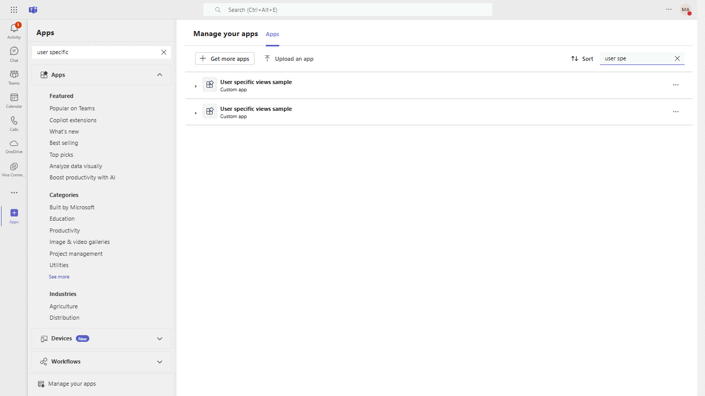

# Teams Adaptive Card Views

This sample illustrates a few different ways developers can consume user-specific views in Adaptive cards.

Specifically, it uses the Universal Action `Action.Execute` with `refresh` property, which enables developers to build different views for users in a common chat thread. 

Developers can consume this action to build different experiences in Teams like:
1. User-specific content in shared contexts like Group chat and Teams Channels.
2. Auto-update information in a card for a user in personal context / all users when they view it in a shared context. Think of updating an order status when a user views the message or an incident status when users view it.
3. Sequential workflows where each workflow is an adaptive card with user-specific view and options to invoke next / prev card.

For more details, refer to our [documentation](https://docs.microsoft.com/en-us/microsoftteams/platform/task-modules-and-cards/cards/universal-actions-for-adaptive-cards/user-specific-views?tabs=mobile%2CC).

## How does it work?

Apps can define `refresh` property with details about the refresh event and optionally add a list of users for whom the card should automatically refresh. (Refer to the image below).


For more details on Adaptive card schema, refer to our [documentation](https://adaptivecards.io/explorer/).
____

The sample implements the following cards:

1. `Me`: The Adaptive card is configured to automatically refresh for the sender only. The sender will notice that the card refreshes for them automatically when the bot posts it. (Refresh count will go from 0 to 1). Other users will not get automatic refreshes, but they will have an option to do a manual refresh.
2. `All Users`: The Adaptive card is configured to automatically refresh for all the users in the context (Chat / Channel). Note that this works when the total number of users is <=60. If the total number of users is greater than 60, users will have to manually refresh the card.

Both the cards have an option to `Update Base card`, this action updates the base card for all the users in the context. We remove the refresh property from the updated card and that stops further refresh invoke actions for all the users. You may decide to keep it to enable auto-refresh for all or list of users.

All the cards display the following information:
1. **Card Type**: `Me` or `All Users`
2. **Card Status**: `Base`, `Updated` and `Final`.
3. **Trigger**: `automatic` trigger or `manual` trigger.
4. **View**: `personal` (user specific view) or `shared view`.


You can extend the `Me` card to automatically refresh for a list of users by adding a list of user MRIs to `userIds` in Adaptive Card.

## User specific view - workflow

The following GIF captures `Automatic refresh`, `Manual refresh`, and `Update Base Card` actions in `Me` card.


The diagram above captures the sequence of events for `Me` card.

Workflow:
1. User A selects `Me` card type, and the Bot sends an Adaptive card which is configured to automatically refresh for User A
2. User A will initially have a Base card with refresh count 0 which will get refreshed automatically to count 1.
3. User B's Base card will not automatically refresh and the refresh count will remain 0. User B will have the option to manually refresh.

In the case of `All Users`, the refresh will automatically be invoked for all users (in this case for user B as well).

## Teams Conversation Bot
Bot Framework v4 Conversation Bot sample for Teams.

This bot has been created using [Bot Framework](https://dev.botframework.com). This sample shows
how to incorporate basic conversational flow into a Teams application. It also illustrates a few of the Teams specific calls you can make from your bot.

## Included Features
* Bots
* Universal Adaptive Cards

## Interaction with bot

#### Me Action


#### AllUser Action


## Try it yourself - experience the App in your Microsoft Teams client
Please find below demo manifest which is deployed on Microsoft Azure and you can try it yourself by uploading the app package (.zip file link below) to your teams and/or as a personal app. (Sideloading must be enabled for your tenant, [see steps here](https://docs.microsoft.com/microsoftteams/platform/concepts/build-and-test/prepare-your-o365-tenant#enable-custom-teams-apps-and-turn-on-custom-app-uploading)).

**Microsoft Teams bot adaptivecards user specific views sample app:** [Manifest](/samples/bot-adaptivecards-user-specific-views/csharp/demo-manifest/bot-adaptivecards-user-specific-views.zip)

## Prerequisites

- Microsoft Teams is installed and you have an account
- [.NET SDK](https://dotnet.microsoft.com/download) version 6.0
- [ngrok](https://ngrok.com/) or equivalent tunnelling solution

## Setup

> Note these instructions are for running the sample on your local machine, the tunnelling solution is required because
the Teams service needs to call into the bot.

1) Run ngrok - point to port 3978

    ```bash
    ngrok http 3978 --host-header="localhost:3978"
    ```

1) Setup for Bot

   In Azure portal, create a [Azure Bot resource](https://docs.microsoft.com/en-us/azure/bot-service/bot-service-quickstart-registration).
    - For bot handle, make up a name.
    - Select "Use existing app registration" (Create the app registration in Azure Active Directory beforehand.)
    - __*If you don't have an Azure account*__ create an [Azure free account here](https://azure.microsoft.com/en-us/free/)
    
   In the new Azure Bot resource in the Portal, 
    - Ensure that you've [enabled the Teams Channel](https://learn.microsoft.com/en-us/azure/bot-service/channel-connect-teams?view=azure-bot-service-4.0)
    - In Settings/Configuration/Messaging endpoint, enter the current `https` URL you were given by running ngrok. Append with the path `/api/messages`

1) Clone the repository

    ```bash
    git clone https://github.com/OfficeDev/Microsoft-Teams-Samples.git
    ```

1) If you are using Visual Studio
   - Launch Visual Studio
   - File -> Open -> Project/Solution
   - Navigate to `samples/user-specific-views/csharp` folder
   - Select `UserSpecificViews.csproj` or `UserSpecificViews.sln`file

1) Update the `appsettings.json` configuration for the bot to use the `MicrosoftAppId`, `MicrosoftAppPassword` generated in previous steps (App Registration creation). (Note the App Password is referred to as the "client secret" in the azure portal and you can always create a new client secret anytime.)

1) Run your bot, either from Visual Studio with `F5` or using `dotnet run` in the appropriate folder.

1) __*This step is specific to Teams.*__
    - **Edit** the `manifest.json` contained in the  `AppPackage` folder to replace your Microsoft App Id (that was created when you registered your bot earlier) *everywhere* you see the place holder string `<<YOUR-MICROSOFT-APP-ID>>` (depending on the scenario the Microsoft App Id may occur multiple times in the `manifest.json`)
    
    - **Zip** up the contents of the `AppPackage` folder to create a `manifest.zip` (Make sure that zip file does not contains any subfolder otherwise you will get error while uploading your .zip package)
    - **Upload** the `manifest.zip` to Teams (In Teams Apps/Manage your apps click "Upload an app". Browse to and Open the .zip file. At the next dialog, click the Add button.)
    - Add the app to personal/team/chat/Meeting scope (Supported scopes)

**Note**: If you are facing any issue in your app, please uncomment [this](https://github.com/OfficeDev/Microsoft-Teams-Samples/blob/main/samples/bot-adaptivecards-user-specific-views/csharp/Microsoft.Teams.Samples.UserSpecificViews/Bot/BotHttpAdapter.cs#L37) line and put your debugger for local debug.

**Basic Tests**
* Tag the bot and send any message. The bot should respond with an adaptive card which should have options to try out the different cards.
* `Me` card should automatically refresh for sender only.
* `All Users` card should automatically refresh for all users in the chat. (as long as total number of users are <= 60)
* `Manual refresh` action should update the user-specific view for the user.
* `Update Base Card` action should update the message for all the users. The user should not have any option to refresh the message after this.

**Implementation:**
* `BotActivityHandler`: Has the logic to handle incoming bot messages (Invokes and user messages).
* `CardFactory`: Has the logic to prepare different types of Adaptive Cards (using Template library).
* `assets\templates\*`: contains all the adaptive cards definitions.

## Running the sample

You can interact with this bot in Teams by sending it a message, or selecting a command from the command list. The bot will respond to the following strings.

1. **Show Welcome**

  - **Result:** The bot will send the welcome card for you to interact with
  - **Valid Scopes:** personal, group chat, team chat

  - **Personal Scope Interactions:**
  
  **Search Application:**
  
  

  **Add Application:**
  
  

  **Me Flow**

 **Show Welcome command interaction:**
 
  
  
 **Show Action command interaction with Me:**
 
 
 
 **Show Response Card :**
 
 
 
  **On Manual Refresh Click:**
  
 
 
 **On Update Base Card Click:**
 
 
 
 **Response Update Base Card Click:**
 
 
 
**Flow with all Users**

 **Show Action command interaction with All Users:**
 
 
 
 **Show Response Card :**
 
 
 
  **On Manual Refresh Click:**
  
 
 
 **On Update Base Card Click:**
 
 
 
 
  - **Team Scope Interactions:**
  
  **About UI**
  
  
 
  **Team Selection**
	
  
  
  **Selected Team**
  
  
  
  **Welcome intraction card**
  
  
  
  
  - **Chat Scope Interactions:**
  
  **About UI**
  
  
  
  **Chat Selection**
	
  
  
  **Selected Chat**
  
  
  
  **Welcome intraction card**
  
  
  
  
  - **Meeting Scope Interactions:**
  
  **About UI**

  
  
  **Meeting Selection**
	
  
  
  **Selected Meeting**
  
  
  
  **Welcome intraction card**
  
  
  
## FAQ

##### How to implement user-specific views in a group of >60 users?
If your scenario requires a user-specific view for all the users in a chat, we recommend you do the following:

1. Add a `manual refresh` action in the base card (like the sample app) so that users know they need to refresh it to see relevant content.
2. Leave the `userids` field empty. If the total number of users is <=60, refresh invoke will be triggered automatically for all the users, else all the users will see the base card and they can refresh it manually.

> Note: you can configure up to 60 users for whom auto-refresh should be triggered. (if your scenario allows you to prioritize certain user role types). Others will see the base card and can refresh it manually.

##### How frequently do Teams clients trigger auto-refresh for users?
Assuming the AC contains refresh logic that should auto-refresh for the user - 
Teams clients will trigger a refresh when a user views the message and the last refresh response is older than a minute.

>Note: Developers can control if they want to continuously refresh the content for a user or not.

If the developers do not want to continuously refresh a card for a user, they should remove the `refresh` property from the updated user-specific card response. (Refer sequence diagram - Response with updated AC for the user)

##### Is the user-specific view response for a user immediately available on all the Teams clients (Web, Desktop, and mobile)?
Teams caches the refresh invoke a response in clients. Every client will trigger a refresh invoke when the user views the message.

Consider following:
1. Bot sends an AC with user-specific views for all users in a chat.
2. User A logins to Teams desktop application and opens the chat.
3. User A will see the base card and the Teams client will trigger auto-refresh and display the updated refresh card received from the bot.
4. When the same user A logins to Teams mobile/web application, and opens the chat, he/she will see the base card, and Teams client will trigger an auto-refresh to get the updated card from the bot.
If User A opens the chat again on either of these clients, it will show the cached card (updated refresh card).

## Further reading
[User Specific Views](https://learn.microsoft.com/en-us/microsoftteams/platform/task-modules-and-cards/cards/universal-actions-for-adaptive-cards/user-specific-views?tabs=mobile%2CC)


