# Teams Azure Open AI Embeddings And Redis Search On Uploaded File Using Bot

This sample app demonstrates user search functionality powered by Azure Open AI embeddings and Redis DB, facilitating queries based on files uploaded by an admin using a Teams bot. It supports features like Adaptive Cards, Azure Blob Storage, and Redis integration within Teams.

This bot has been created using [Bot Builder](https://www.npmjs.com/package/botbuilder) and [Microsoft 365 Agents Toolkit](https://learn.microsoft.com/microsoftteams/platform/toolkit/toolkit-v4/teams-toolkit-fundamentals-v4?view=msteams-client-js-latest&pivots=visual-studio-code). 

## Included Features
* Bots
* Adaptive Cards
* Azure Open AI
* Redis Search
* Blob Storage

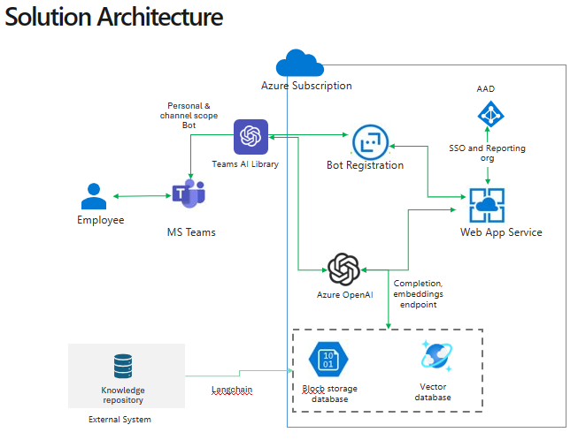

## Interaction with bot - Admin
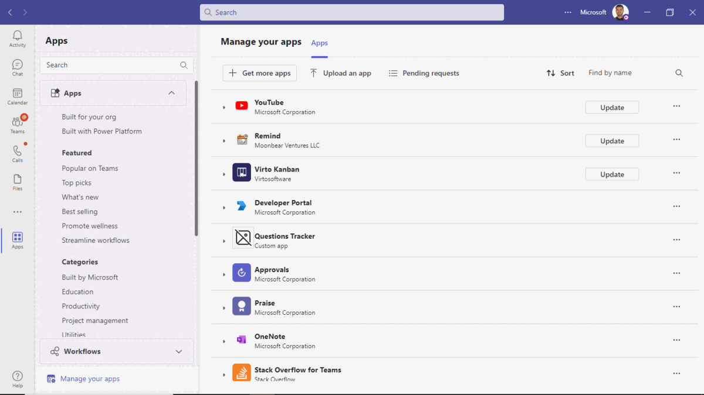

## Interaction with bot - User
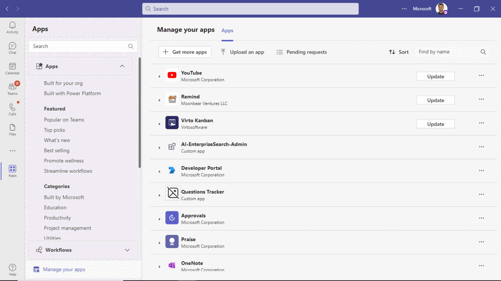

## Prerequisites
- Microsoft Teams is installed and you have an account
- [dev tunnel](https://learn.microsoft.com/en-us/azure/developer/dev-tunnels/get-started?tabs=windows) or [ngrok](https://ngrok.com/) latest version or equivalent tunnelling solution

- [Node.js](https://nodejs.org/), supported versions: 16, 18
- An M365 account. If you do not have M365 account, apply one from [M365 developer program](https://developer.microsoft.com/microsoft-365/dev-program)
- [Microsoft 365 Agents Toolkit Visual Studio Code Extension](https://aka.ms/teams-toolkit) version 5.0.0 and higher or [TeamsFx CLI](https://aka.ms/teamsfx-cli)
- [Visual Studio Code](https://code.visualstudio.com/download)
- [Open AI](https://platform.openai.com/docs/quickstart/build-your-application) or [Azure OpenAI]([https://azure.microsoft.com/free/](https://learn.microsoft.com/en-us/azure/ai-services/openai/quickstart?tabs=command-line&pivots=programming-language-studio))
- [Create a Redis Enterprise cache](https://learn.microsoft.com/azure/azure-cache-for-redis/quickstart-create-redis-enterprise)

## Run the app (Using Microsoft 365 Agents Toolkit for Visual Studio Code)

The simplest way to run this sample in Teams is to use Microsoft 365 Agents Toolkit for Visual Studio Code.

1. Ensure you have downloaded and installed [Visual Studio Code](https://code.visualstudio.com/docs/setup/setup-overview)
1. Install the [Microsoft 365 Agents Toolkit extension](https://marketplace.visualstudio.com/items?itemName=TeamsDevApp.ms-teams-vscode-extension)
1. Select **File > Open Folder** in VS Code and choose this samples directory from the repo
1. Using the extension, sign in with your Microsoft 365 account where you have permissions to upload custom apps
1. In the `env/.env.local` or `env/.env.local.user` file, fill all the required values for below and other values will be generated automatically once you debug/start the app.


`SECRET_AZURE_OPENAPI_KEY=<Azure OpenAI Service Key>`

`REDIS_CONNECTION=redis://default:<REDIS_PASSWORD>=@<REDIS_HOST>:<REDIS_PORT>`

`EMBEDDING_MODEL_URL=https://<Azure OpenAI Service Name>.openai.azure.com/openai/deployments/<Your Deployed Embedding Model Name>/embeddings?api-version=2023-03-15-preview`

`COMPLETION_MODEL_URL=https://<Azure OpenAI Service Name>.openai.azure.com/openai/deployments/<Your Deployed Completion Model Name>`

`AZURE_STORAGE_CONNECTION_STRING='DefaultEndpointsProtocol=https;AccountName=<Storage Account Name>;AccountKey=<Your Account Key>;EndpointSuffix=core.windows.net'`

**Note:** Update the Azure Open API version from 2023-03-15-preview to any specific or public version in all the files wherever applicable.

> Note: If you are deploying the code, make sure that above mentioned values are properly updated at `env/.env.dev` or `env/.env.dev.user` wherever required.

6. Select **Debug > Start Debugging** or **F5** to run the app in a Teams web client.
7. Alternatively use the `Run and Debug Activity Panel` in Visual Studio Code and click the `Run and Debug` green arrow button.
8. In the browser that launches, select the **Add** button to install the app to Teams.

> If you do not have permission to upload custom apps (uploading), Microsoft 365 Agents Toolkit will recommend creating and using a Microsoft 365 Developer Program account - a free program to get your own dev environment sandbox that includes Teams

## Setup

> Note these instructions are for running the sample on your local machine, the tunnelling solution is required because
the Teams service needs to call into the bot.

1) Run ngrok - point to port 3978

   ```bash
   ngrok http 3978 --host-header="localhost:3978"
   ```  

   Alternatively, you can also use the `dev tunnels`. Please follow [Create and host a dev tunnel](https://learn.microsoft.com/en-us/azure/developer/dev-tunnels/get-started?tabs=windows) and host the tunnel with anonymous user access command as shown below:

   ```bash
   devtunnel host -p 3978 --allow-anonymous
   ```

2) Register a new application in the [Microsoft Entra ID – App Registrations](https://go.microsoft.com/fwlink/?linkid=2083908) portal.
  
  A) Select **New Registration** and on the *register an application page*, set following values:
      * Set **name** to your app name.
      * Choose the **supported account types** (any account type will work)
      * Leave **Redirect URI** empty.
      * Choose **Register**.
  B) On the overview page, copy and save the **Application (client) ID, Directory (tenant) ID**. You'll need those later when updating your Teams application manifest and in the appsettings.json.
  C) Navigate to **API Permissions**, and make sure to add the following permissions:
   Select Add a permission
      * Select Add a permission
      * Select Microsoft Graph -\> Delegated permissions.
      * `User.Read` (enabled by default)
      * Click on Add permissions. Please make sure to grant the admin consent for the required permissions.


3) Setup for Bot

   In Azure portal, create a [Azure Bot resource](https://docs.microsoft.com/azure/bot-service/bot-service-quickstart-registration).
    - For bot handle, make up a name.
    - Select "Use existing app registration" (Create the app registration in Microsoft Entra ID beforehand.)
    - Choose "Accounts in any organizational directory (Any Azure AD directory - Multitenant)" in Authentication section in your App Registration to run this sample smoothly.
    - __*If you don't have an Azure account*__ create an [Azure free account here](https://azure.microsoft.com/free/)

   In the new Azure Bot resource in the Portal, 
    - Ensure that you've [enabled the Teams Channel](https://learn.microsoft.com/azure/bot-service/channel-connect-teams?view=azure-bot-service-4.0)
    - In Settings/Configuration/Messaging endpoint, enter the current `https` URL you were given by running the tunneling application. Append with the path `/api/messages`

4) Clone the repository

    ```bash
    git clone https://github.com/OfficeDev/Microsoft-Teams-Samples.git
    ```

5) In a terminal, navigate to `samples/bot-ai-enterprise-search/nodejs`

6) Install modules

    ```bash
    npm install
    ```

7. Update the `env/.env.local` or `env/.env.local.user` file, fill all the required values for below and other values will be generated automatically once you debug/start the app.


`SECRET_AZURE_OPENAPI_KEY=<Azure OpenAI Service Key>`

`REDIS_CONNECTION=redis://default:<REDIS_PASSWORD>=@<REDIS_HOST>:<REDIS_PORT>`

`EMBEDDING_MODEL_URL=https://<Azure OpenAI Service Name>.openai.azure.com/openai/deployments/<Your Deployed Embedding Model Name>/embeddings?api-version=2023-03-15-preview`

`COMPLETION_MODEL_URL=https://<Azure OpenAI Service Name>.openai.azure.com/openai/deployments/<Your Deployed Completion Model Name>`

`AZURE_STORAGE_CONNECTION_STRING='DefaultEndpointsProtocol=https;AccountName=<Storage Account Name>;AccountKey=<Your Account Key>;EndpointSuffix=core.windows.net'`

**Note:** Update the Azure Open API version from 2023-03-15-preview to any specific or public version in all the files whereever applicable.

8) Run your bot at the command line:

    ```bash
    npm start
    ```

9) __*This step is specific to Teams.*__
    - **Edit** the `manifest.json` contained in the `appManifest` folder (`appManifest.admin` and `appManifest.user` folders) to replace your Microsoft App Id (that was created when you registered your bot earlier) *everywhere* you see the place holder string `<BOT_ID>` (depending on the scenario the Microsoft App Id may occur multiple times in the `manifest.json`)
    - Also, update the <TEAMS_APP_ID> with unique Guid for both the `manifest.json` stored in (`appManifest.admin` and `appManifest.user`) as this app has 2 roles: Admin and User.

    - **Edit** the `manifest.json` for `validDomains` with base Url domain. E.g. if you are using ngrok it would be `https://1234.ngrok-free.app` then your domain-name will be `1234.ngrok-free.app` and if you are using dev tunnels then your domain will be like: `12345.devtunnels.ms`.
    - **Zip** up the contents of the `appManifest` folder (appManifest.admin and appManifest.user folders separately) to create a `manifest.zip` (Make sure that zip file does not contains any subfolder otherwise you will get error while uploading your .zip package)
    - **Upload** the `manifest.zip` to Teams (In Teams Apps/Manage your apps click "Upload an app". Browse to and Open the .zip file. At the next dialog, click the Add button.)
    - Add the app to personal scope (Supported app scope)


## Running the sample

### Admin Functionalities

1. Adding the bot:


1. Welcome Card:
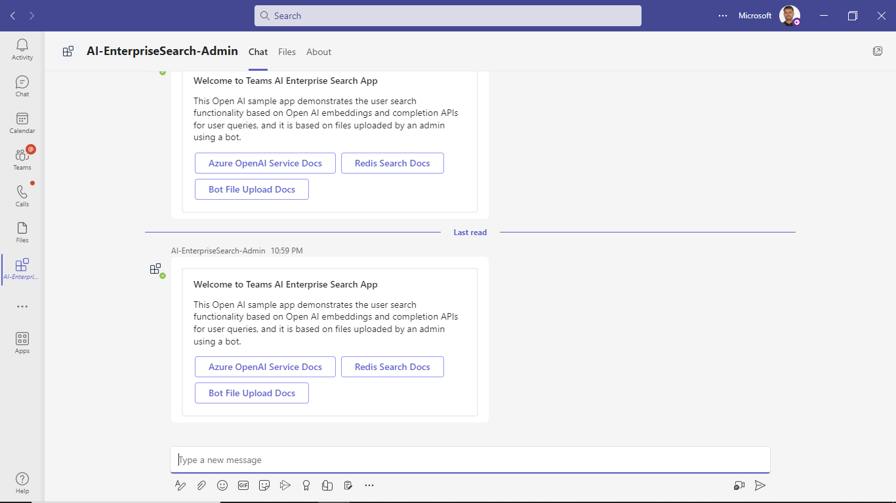

1. Admin can send a file to the bot as an attachment in the message compose section in Teams. This will be delivered to the bot as a Message Activity and the code in this sample fetches and saves the file in Azure blob and creates the embedding for uploaded file and save it in Redis Cache Database.
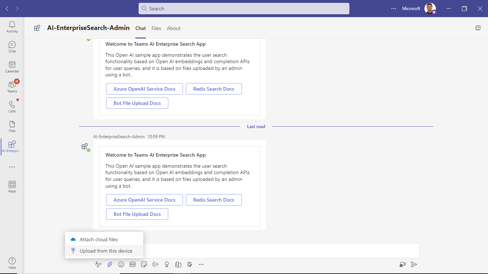

1. File Uploaded Successfully:
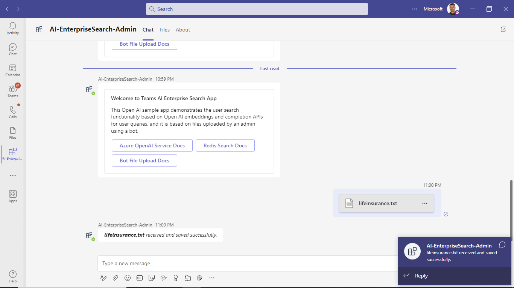

1. Now, admin can ask query based on the uploaded docs and Azure Open AI will generate the embedding for query and search the most relevant vectors for user query in the Redis search database based on the embeddings generated for uploaded file contents.
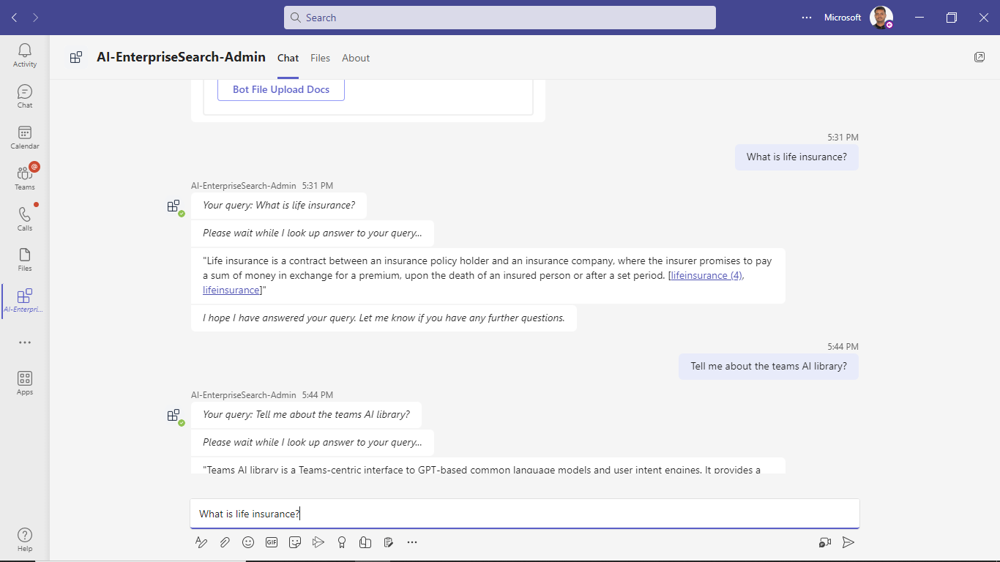

1. Admin will get the final answer based on the uploaded docs using Azure Open AI completion model:
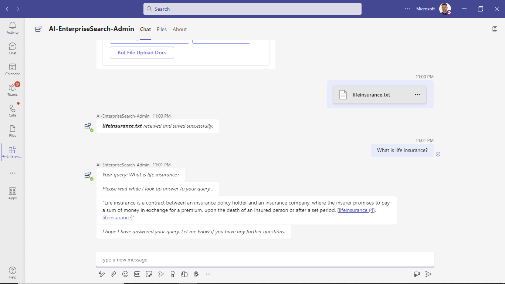

### User Functionalities
1. Adding the bot:
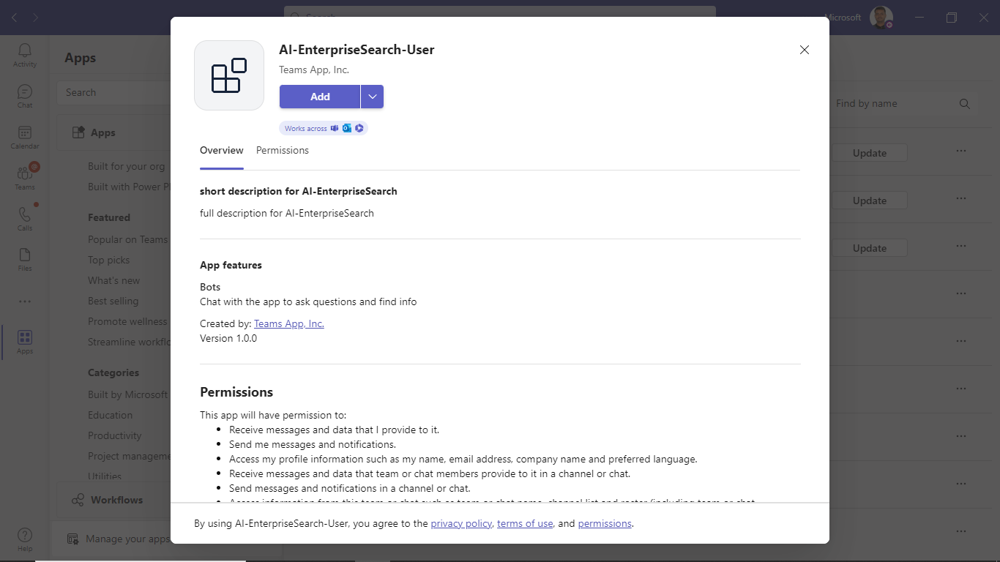

1. Welcome Card:
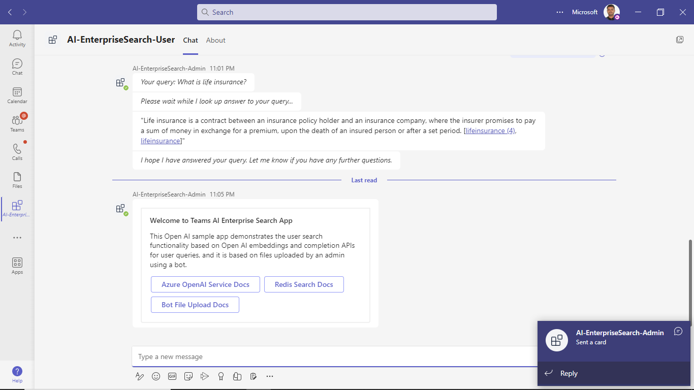

1. User can ask query based on the uploaded docs by admin and Azure Open AI will generate the embedding for query and search the most relevant vectors for user query in the Redis search database based on the embeddings generated for uploaded file contents.
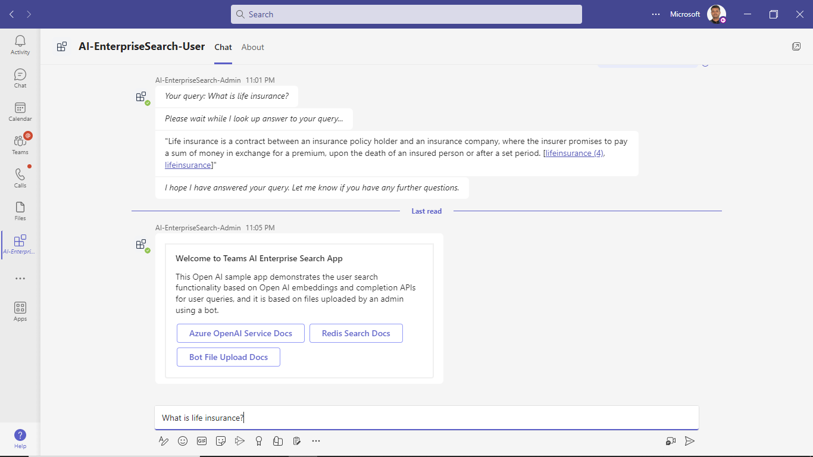

1. User will get the final answer based on the uploaded docs using Azure Open AI completion model:
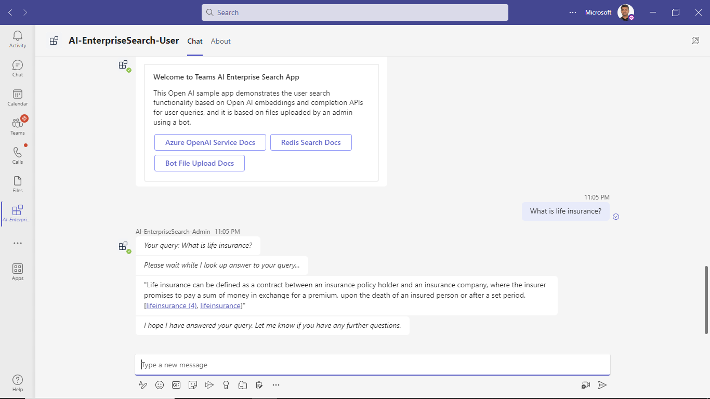

## Deploy to Azure

Deploy your project to Azure by following these steps:

| From Visual Studio Code                                                                                                                                                                                                                                                                                                                                                  | From TeamsFx CLI                                                                                                                                                                                                                    |
| :----------------------------------------------------------------------------------------------------------------------------------------------------------------------------------------------------------------------------------------------------------------------------------------------------------------------------------------------------------------------- | :---------------------------------------------------------------------------------------------------------------------------------------------------------------------------------------------------------------------------------- |
| <ul><li>Open Microsoft 365 Agents Toolkit, and sign into Azure by clicking the `Sign in to Azure` under the `ACCOUNTS` section from sidebar.</li> <li>After you signed in, select a subscription under your account.</li><li>Open the Microsoft 365 Agents Toolkit and click `Provision` from DEPLOYMENT section or open the command palette and select: `Teams: Provision`.</li><li>Open the Microsoft 365 Agents Toolkit and click `Deploy` or open the command palette and select: `Teams: Deploy`.</li></ul> | <ul> <li>Run command `teamsfx account login azure`.</li> <li>Run command `teamsfx provision --env dev`.</li> <li>Run command: `teamsfx deploy --env dev`. </li></ul> |

> Note: Provisioning and deployment may incur charges to your Azure Subscription.

**Note:** Once the provisioning and deployment steps are finished please update the `manifest.json` contained in the `appManifest` folders (`appManifest.admin` and `appManifest.user` folders) for `validDomains` with base Url domain. E.g. if your deployed web app service URL is: `https://botaxxxxx.azurewebsites.net/` then your domain-name will be `botaxxxxx.azurewebsites.net`.


Also, make sure that below key/values are properly added to the configuration section of web app after code deployement.

`"name": "AZURE_STORAGE_CONNECTION_STRING", "value": 'DefaultEndpointsProtocol=https;AccountName=<Storage Account Name>;AccountKey=<Your Account Key>;EndpointSuffix=core.windows.net'`

`"name": "BOT_ID", "value": "<BOT_ID>"`

`"name": "BOT_PASSWORD", "value": "<BOT_PASSWORD>"`

`"name": "COMPLETION_MODEL_URL", "value": "https://<Azure OpenAI Service Name>.openai.azure.com/openai/deployments/<Your Deployed Completion Model Name>"`

`"name": "EMBEDDING_MODEL_URL", "value": "https://<Azure OpenAI Service Name>.openai.azure.com/openai/deployments/<Your Deployed Embedding Model Name>/embeddings?api-version=2023-03-15-preview"`

`"name": "REDIS_CONNECTION", "value": redis://default:<REDIS_PASSWORD>=@<REDIS_HOST>:<REDIS_PORT>`

`"name": "RUNNING_ON_AZURE", "value": "1"`

`"name": "SECRET_AZURE_OPENAPI_KEY", "value": "<Your Azure Open API Key>"`

`"name": "WEBSITE_NODE_DEFAULT_VERSION", "value": "~18"`

`"name": "WEBSITE_RUN_FROM_PACKAGE", "value": "1"`

## Preview

Once the provisioning and deployment steps are finished, you can upload your app.

**Note:** Please refer above `Setup` section for manifest configurations and upload your packages (Admin/User) in Teams.

## Further reading

### Bot

- [Upload Files Using Bots](https://learn.microsoft.com/microsoftteams/platform/bots/how-to/bots-filesv4)
- [Bot Framework Documentation](https://docs.botframework.com)
- [Bot Basics](https://docs.microsoft.com/azure/bot-service/bot-builder-basics?view=azure-bot-service-4.0)
- [Azure Bot Service Introduction](https://docs.microsoft.com/azure/bot-service/bot-service-overview-introduction?view=azure-bot-service-4.0)
- [Azure Bot Service Documentation](https://docs.microsoft.com/azure/bot-service/?view=azure-bot-service-4.0)

### AI, Redis And Blob Storage
- [Azure OpenAI Service](https://learn.microsoft.com/azure/ai-services/openai/overview)
- [Learn how to generate embeddings with Azure OpenAI](https://learn.microsoft.com/azure/ai-services/openai/how-to/embeddings?tabs=console)
- [Quickstart: Azure Blob Storage](https://learn.microsoft.com/azure/storage/blobs/storage-quickstart-blobs-nodejs?tabs=managed-identity%2Croles-azure-portal%2Csign-in-azure-cli)
- [RediSearch](https://learn.microsoft.com/azure/azure-cache-for-redis/cache-redis-modules#redisearch)


