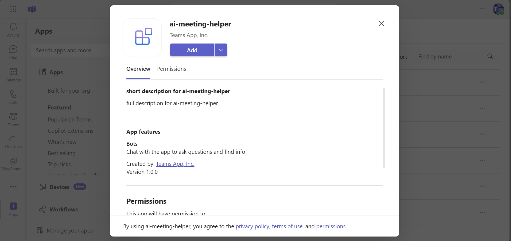

# Meeting Helper with Azure Open AI

## Interaction with app

 

## Try it yourself - experience the App in your Microsoft Teams client
Please find below demo manifest which is deployed on Microsoft Azure and you can try it yourself by uploading the app package (.zip file link below) to your teams and/or as a personal app. (Sideloading must be enabled for your tenant, [see steps here](https://docs.microsoft.com/microsoftteams/platform/concepts/build-and-test/prepare-your-o365-tenant#enable-custom-teams-apps-and-turn-on-custom-app-uploading)).

**Microsoft Teams Meeting Helper sample app:** [Manifest](/samples/bot-ai-meeting-helper/demo-manifest/bot-ai-meeting-helper.zip)

## Prerequisites

- [Node.js 18.x](https://nodejs.org/download/release/v18.18.2/)
- [Visual Studio Code](https://code.visualstudio.com/)
- [Table Storage](https://learn.microsoft.com/en-us/azure/storage/tables/table-storage-quickstart-portal)
- [Teams Toolkit](https://marketplace.visualstudio.com/items?itemName=TeamsDevApp.ms-teams-vscode-extension)
- [Azure OpenAI]([https://azure.microsoft.com/free/](https://learn.microsoft.com/en-us/azure/ai-services/openai/quickstart?tabs=command-line&pivots=programming-language-studio))
- [PowerShell](https://learn.microsoft.com/en-us/powershell/scripting/install/installing-powershell-on-macos) if on macOS (`brew install --cask powershell`)

## Run the app (Using Teams Toolkit for Visual Studio Code)

The simplest way to run this sample in Teams is to use Teams Toolkit for Visual Studio Code.

1. Ensure you have downloaded and installed [Visual Studio Code](https://code.visualstudio.com/docs/setup/setup-overview)
1. Install the [Teams Toolkit extension](https://marketplace.visualstudio.com/items?itemName=TeamsDevApp.ms-teams-vscode-extension)
1. Select **File > Open Folder** in VS Code and choose this sample's directory from the repo
1. Using the extension, sign in with your Microsoft 365 account where you have permissions to upload custom apps
1. Select **Debug > Start Debugging** or **F5** to run the app in a Teams web client.
1. In the browser that launches, select the **Add** button to install the app to Teams.

> If you do not have permission to upload custom apps (sideloading), Teams Toolkit will recommend creating and using a Microsoft 365 Developer Program account - a free program to get your own dev environment sandbox that includes Teams.

## Setup and use the sample
1) Clone the repository

    ```bash
    git clone https://github.com/OfficeDev/Microsoft-Teams-Samples.git
    ```
1) Navigate to the `samples/bot-ai-meeting-helper` folder and open with Visual Studio Code.
  
1) Create a policy for a demo tenant user for creating the online meeting on behalf of that user using the following PowerShell script
1) Create a policy for a demo tenant user for creating the online meeting on behalf of that user using the following (Images for reference only)
 
     
     
      PowerShell script

    ```powershell
    # Import-Module MicrosoftTeams
    # Call Connect-MicrosoftTeams using no parameters to open a window allowing for MFA accounts to authenticate
    Connect-MicrosoftTeams
    New-CsApplicationAccessPolicy -Identity “<<policy-identity/policy-name>>” -AppIds "<<microsoft-app-id>>" -Description "<<policy-description>>"
    Grant-CsApplicationAccessPolicy -PolicyName “<<policy-identity/policy-name>>” -Identity "<<object-id-of-the-user-to-whom-the-policy-needs-to-be-granted>>"
    ```

    e.g.:

    ```powershell
      # Import-Module MicrosoftTeams
      Connect-MicrosoftTeams

      New-CsApplicationAccessPolicy -Identity Meeting-policy-dev -AppIds "d0bdaa0f-8be2-4e85-9e0d-2e446676b88c" -Description "Online meeting policy - contoso town"
      Grant-CsApplicationAccessPolicy -PolicyName Meeting-policy-dev -Identity "782f076f-f6f9-4bff-9673-ea1997283e9c"
    ```
1) In Azure App Registration Under left menu, navigate to **API Permissions**, and make sure to add the following permissions of Microsoft Graph API > Application permissions:

    - `Calendars.Read`
    - `Calendars.ReadBasic.All`
    - `Calendars.ReadWrite`
    - `EventListener.Read.All`
    - `EventListener.ReadWrite.All`
    - `OnlineMeetingArtifact.Read.All`
    - `OnlineMeetingRecording.Read.All`
    - `OnlineMeetings.Read.All`
    - `OnlineMeetings.ReadWrite.All`
    - `OnlineMeetingTranscript.Read.All`
    - `User.Read.All`
    - `User.ReadBasic.All`
    - `User.ReadWrite.All`

        

1) Navigate to the `samples/bot-ai-meeting-helper/.localConfigs` directory and update the values below.

   ```txt
        BOT_ID="BOT_ID"
        BOT_PASSWORD="SECRET_BOT_PASSWORD"
        AZURE_OPENAI_API_KEY="SECRET_AZURE_OPENAI_API_KEY"
        AZURE_OPENAI_ENDPOINT="AZURE_OPENAI_ENDPOINT"
        AZURE_OPENAI_DEPLOYMENT_NAME="AZURE_OPENAI_DEPLOYMENT_NAME"
        Token="Token"
        BOT_ENDPOINT="BOT_ENDPOINT"
        Base64EncodedCertificate="Base_64_Encoded_Certificate"
        EncryptionCertificateId="Encryption_Certificate_Id"
        PRIVATE_KEY_PATH="Pem_File_Path"
        Account_Name="Azure_Storage_Account"
        Account_Key="Azure_Storage_Account_Key"
        Table_Name="Azure_Storage_Table"
        partitionKey="Azure_Storage_Table_PartitionKey"
        AI_Model="Azure_Open_AI_Model"
        SubscriptionURL="https://graph.microsoft.com/v1.0/subscriptions"
        SystemPrompt="Generate a filtered list of action items from meeting transcriptions by user in bullet point user wise categorized with proper format like:  <b> Attendee:</b> 
        Action Items in bullet points"
    ``` 

## Running the sample

1) **Select Upload an app**


1) **Select Add**


1) **Find all upcoming meetings.**


1) **Click on the particular meeting to subscribe.**


1) **Join the meeting that you have subscribed to.**


1) **Start transcription**


1) **End the meeting**


1) **Meeting helper results**


## Further reading

### AI, Message Extensions And Table Storage

- [Azure OpenAI Service](https://learn.microsoft.com/azure/ai-services/openai/overview)
- [Table Storage](https://learn.microsoft.com/en-us/azure/storage/tables/table-storage-quickstart-portal)

