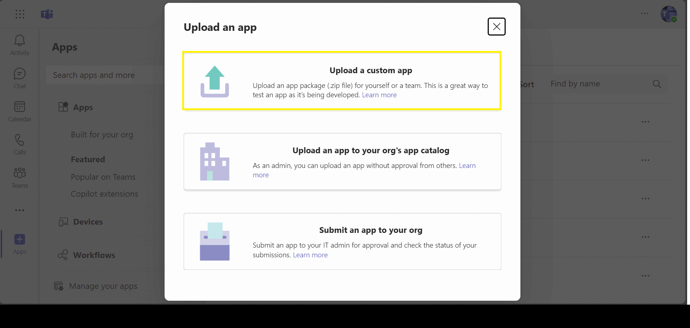
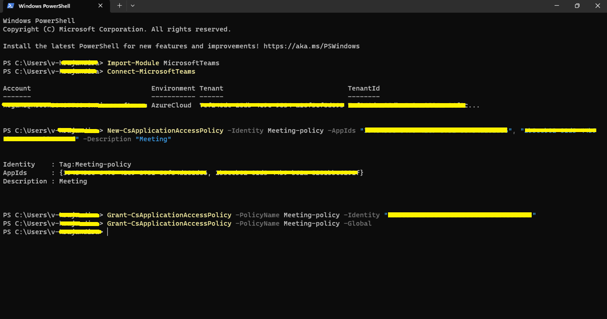
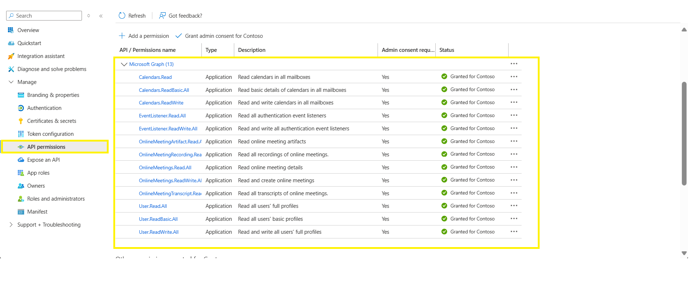
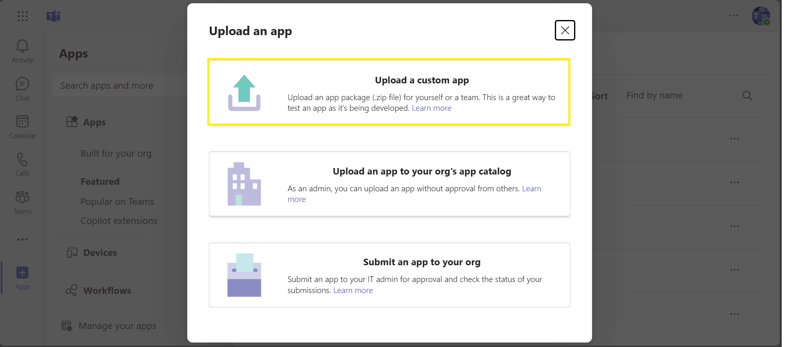
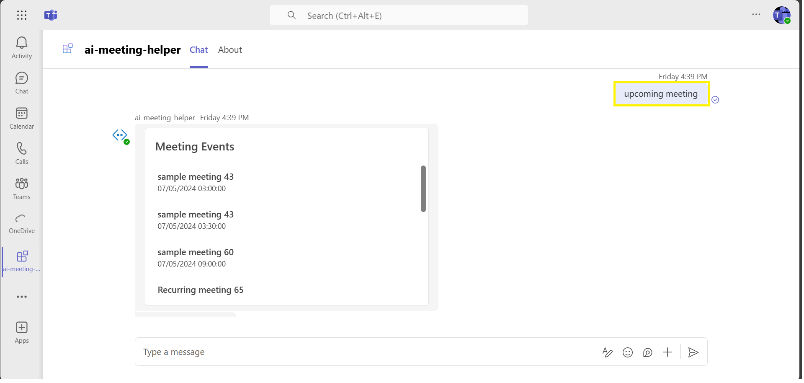
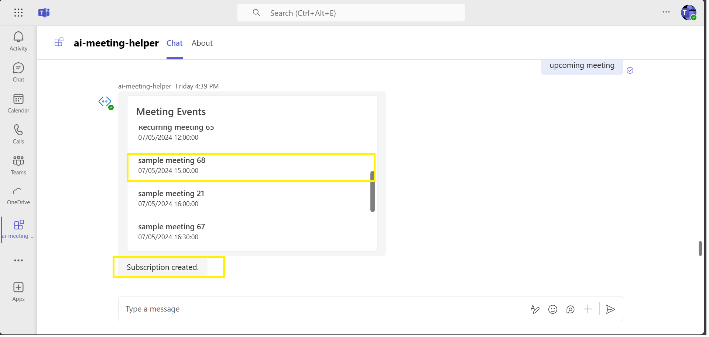
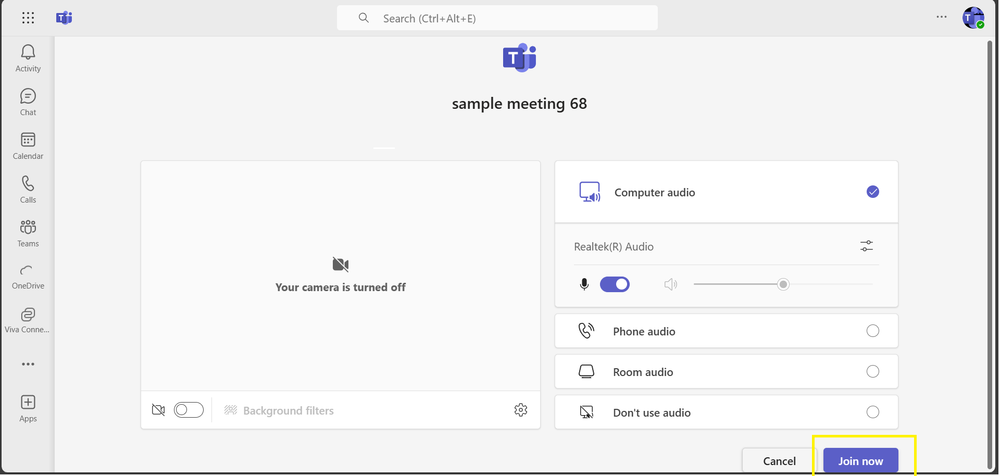
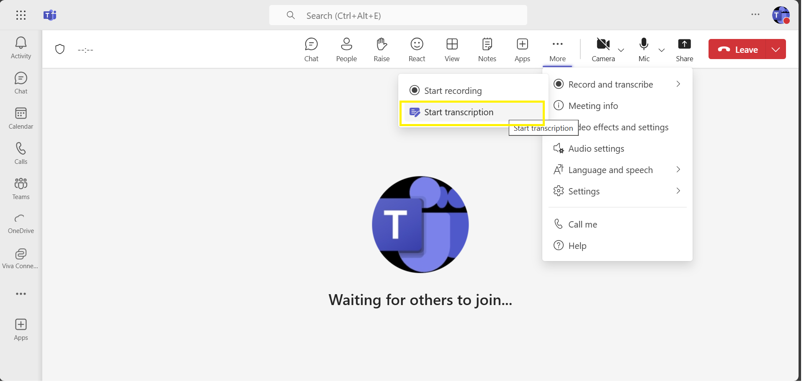
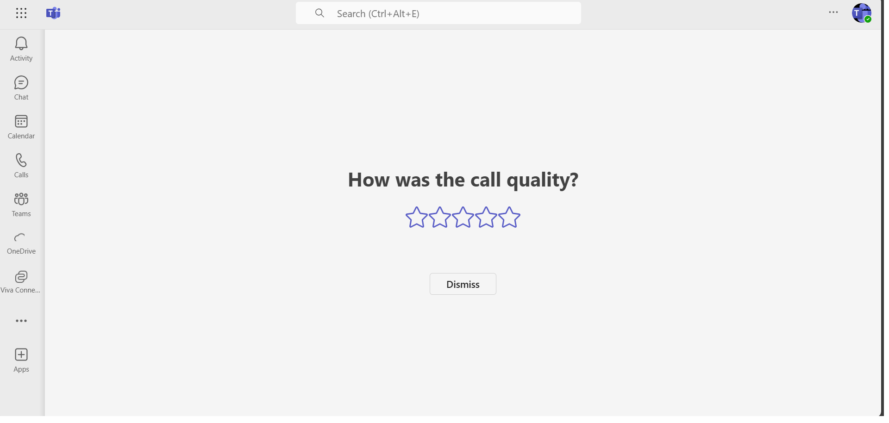
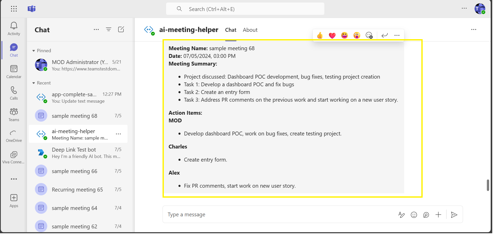

# Meeting Helper with Azure Open AI

This sample leverages Azure OpenAI to automatically extract action items and generate summaries from meeting transcriptions, delivering them to subscribed users in Microsoft Teams. It utilizes Graph API, Azure Table Storage, and self-signed certificates for a seamless and secure experience.

- To achieve this process, the user will schedule a meeting, which can be either a one-time or recurring event. Attendees interested in receiving the meeting summary and action items must individually subscribe to the meeting. For recurring meetings, multiple instances will be displayed, allowing users to subscribe to each instance separately.
 
- After the meeting concludes, a webhook endpoint will be triggered in the background to extract the meeting transcription.

- Using Azure OpenAI, the extracted meeting transcription will be processed to extract action items and a meeting summary. Finally, this information will be sent to all meeting attendees who have subscribed to the meeting.

## Included Features
* **Graph API:** Utilize graph APIs to retrieve meeting transcriptions and other meeting or user-related details.
* **Azure Open AI:** Leverages Azure OpenAI for extracting action items and meeting summaries.
* **Azure Table Storage:** Utilizes Azure Table Storage to store subscribed user information, including conversation IDs for sending meeting details.
* **Self-Signed Certificate:** Uses Azure self-signed certificates for encryption and decryption to establish the meeting subscription.

## Interaction with app

 

## Try it yourself - experience the App in your Microsoft Teams client
Please find below demo manifest which is deployed on Microsoft Azure and you can try it yourself by uploading the app package (.zip file link below) to your teams and/or as a personal app. (Uploading must be enabled for your tenant, [see steps here](https://docs.microsoft.com/microsoftteams/platform/concepts/build-and-test/prepare-your-o365-tenant#enable-custom-teams-apps-and-turn-on-custom-app-uploading)).

**Microsoft Teams Meeting Helper sample app:** [Manifest](/samples/bot-ai-meeting-helper/demo-manifest/bot-ai-meeting-helper.zip)

- To run the demo, you must set up and grant the necessary policy. Please follow the second step mentioned below for instructions (in "Setup and use the sample locally" section) on how to do this. 

## Prerequisites

- [Node.js 18.x](https://nodejs.org/download/release/v18.18.2/)
- [Visual Studio Code](https://code.visualstudio.com/)
- [Table Storage](https://learn.microsoft.com/en-us/azure/storage/tables/table-storage-quickstart-portal)
- [Teams Toolkit](https://marketplace.visualstudio.com/items?itemName=TeamsDevApp.ms-teams-vscode-extension)
- [Azure OpenAI](https://learn.microsoft.com/en-us/azure/ai-services/openai/quickstart?tabs=command-line&pivots=programming-language-studio)
- [PowerShell](https://learn.microsoft.com/en-us/powershell/scripting/install/installing-powershell-on-macos) if on macOS (`brew install --cask powershell`)
- [Self-Signed Certificate](https://learn.microsoft.com/en-us/azure/key-vault/certificates/quick-create-portal)

### Create an Azure Open AI service
- In Azure portal, create a [Azure Open AI service](https://learn.microsoft.com/en-us/azure/ai-services/openai/how-to/create-resource?pivots=web-portal).
- **Deploy Azure Open AI model:** Deploy the `gpt-35-turbo` model in your created Azure Open AI service for the application to perform translation.
- Create and collect `AZURE_OPENAI_ENDPOINT`, `AZURE_OPENAI_API_KEY`, `AZURE_OPENAI_DEPLOYMENT_NAME`, and save those value  to update in `.localConfigs` file later.

### Create an Azure Table Storage
- In Azure portal, create a [Azure Table Storage](https://learn.microsoft.com/en-us/azure/storage/tables/table-storage-quickstart-portal).
- Create and collect `Account_Name`, `Account_Key`, `Table_Name`, and save those value  to update in `.localConfigs` file later.

## Create an Azure Self-Signed Certificate
- In Azure portal, create a [Self-Signed Certificate](https://learn.microsoft.com/en-us/azure/key-vault/certificates/quick-create-portal).
- Create and collect `EncryptionCertificateId`, `Base64EncodedCertificate`, `PRIVATE_KEY_PATH`, and save those value  to update in `.localConfigs` file later.

## Setup the Application Insights
In Azure portal, create an [Application Insights](https://learn.microsoft.com/en-us/azure/azure-monitor/app/nodejs#resource) and save `Instrumentation Key` and `Connection String` values and which will be required later while updating `.localConfigs` file configuration in sample code.

**Note>** While creating or setting up Application Insights, choose `NodeJS` as the application type.

## Setup and use the sample locally 
1) Navigate to the `samples/bot-ai-meeting-helper/.localConfigs` and update the values below.

   ```txt
        BOT_ID - It will be automatically generated while running the sample using Toolkit.
        BOT_PASSWORD - It will be automatically generated while running the sample using Toolkit.
        AZURE_OPENAI_API_KEY - Generated while creating Azure Open AI service (`AZURE_OPENAI_API_KEY` value).
        AZURE_OPENAI_ENDPOINT - Generated while creating Azure Open AI service (`AZURE_OPENAI_ENDPOINT` value).
        AZURE_OPENAI_DEPLOYMENT_NAME  - Generated while creating Azure Open AI service (`AZURE_OPENAI_DEPLOYMENT_NAME` value).
        BOT_ENDPOINT - It will be automatically generated while running the sample using Toolkit. Example: `https://xxxxx2kx-3978.inc1.devtunnels.ms` and if your app is deployed to Azure Web app, you should provide your deployed application base URL.
        Base64EncodedCertificate - Generated while creating Azure Self-Signed Certificate service (`Base64EncodedCertificate` value)
        EncryptionCertificateId - Generated while creating Azure Self-Signed Certificate service (`EncryptionCertificateId` value).
        PRIVATE_KEY_PATH  - Generated while creating Azure Self-Signed Certificate service download the PEM file and move to "src/helper" (`"./private.pem"`)
        Account_Name - Generated while creating Azure Table Storage service (`Account_Name` value).
        Account_Key  - Generated while creating Azure Table Storage service (`Account_Key` value).
        Table_Name   - Generated while creating Azure Table Storage service (`Table_Name` value).
        partitionKey - "Azure_Storage_Table_PartitionKey"
        AI_Model  - Generated while creating Azure Open AI service 
        SubscriptionURL - "https://graph.microsoft.com/v1.0/subscriptions"
        SystemPrompt="Generate a filtered list of action items from meeting transcriptions by user in bullet point user wise categorized with proper format like:  <b> Attendee:</b> 
        Action Items in bullet points"
        LocalTimeZone=Asia/Kolkata
        APPINSIGHTS_INSTRUMENTATIONKEY- Provide the application insights `Instrumentation Key` created in previous steps (Required to log the telemetry data).
        APPINSIGHTS_CONNECTIONSTRING  - Provide the application insights `Connection String` created in previous steps in single quote (Required to log the telemetry data).
    ``` 
1) Use the PowerShell script below to create a policy for the users who will need to subscribe to meetings and use the bot (Note: Images for reference only)
 
      PowerShell script

    ```powershell
    # Import-Module MicrosoftTeams
    # Call Connect-MicrosoftTeams using no parameters to open a window allowing for MFA accounts to authenticate
    Connect-MicrosoftTeams
    New-CsApplicationAccessPolicy -Identity “<<policy-identity/policy-name>>” -AppIds "<<microsoft-app-id>>" -Description "<<policy-description>>"
    Grant-CsApplicationAccessPolicy -PolicyName “<<policy-identity/policy-name>>” -Identity "<<object-id-of-the-user-to-whom-the-policy-needs-to-be-granted>>"
     ```
    OR
     ```# For global access
    # Grant-CsApplicationAccessPolicy -PolicyName Meeting-policy-dev -Global
    ```
    Example:

    ```powershell
      # Import-Module MicrosoftTeams
      Connect-MicrosoftTeams

      New-CsApplicationAccessPolicy -Identity Meeting-policy-dev -AppIds "xxxxxx0f-xxe2-4exx-9exx-2exxxx76bxxc" -Description "Online meeting policy - contoso town"
      
      Grant-CsApplicationAccessPolicy -PolicyName Meeting-policy-dev -Identity "7xxxx076x-xxxx-4xfx-x6x3-xa1xxx28xxxc"
      OR
      # For global access
      # Grant-CsApplicationAccessPolicy -PolicyName Meeting-policy-dev -Global
    ```
    
     
     
1) In Azure [App Registration](https://ms.portal.azure.com/) Under left menu, navigate to **API Permissions**, and make sure to add the following permissions of Microsoft Graph API > Application permissions:

    - `Calendars.Read`
    - `Calendars.ReadBasic.All`
    - `Calendars.ReadWrite`
    - `EventListener.Read.All`
    - `EventListener.ReadWrite.All`
    - `OnlineMeetingArtifact.Read.All`
    - `OnlineMeetingRecording.Read.All`
    - `OnlineMeetings.Read.All`
    - `OnlineMeetings.ReadWrite.All`
    - `OnlineMeetingTranscript.Read.All`
    - `User.Read.All`
    - `User.ReadBasic.All`
    - `User.ReadWrite.All`

        
    
Note: provide admin consent for the permissions once added by clicking on the "Grant admin consent for `<<tenant-name>>"` button.
    
## Run the app (Using Teams Toolkit for Visual Studio Code)

The simplest way to run this sample in Teams is to use Teams Toolkit for Visual Studio Code.

1. Ensure you have downloaded and installed [Visual Studio Code](https://code.visualstudio.com/docs/setup/setup-overview)
1. Install the [Teams Toolkit extension](https://marketplace.visualstudio.com/items?itemName=TeamsDevApp.ms-teams-vscode-extension)
1. Clone the repository

    ```bash
    git clone https://github.com/OfficeDev/Microsoft-Teams-Samples.git
    ```
1. Navigate to the `samples/bot-ai-meeting-helper` folder and open with Visual Studio Code.
1. Using the extension, sign in with your Microsoft 365 account where you have permissions to upload custom apps
1. Select **Debug > Start Debugging** or **F5** to run the app in a Teams web client.
1. In the browser that launches, select the **Add** button to install the app to Teams.

> If you do not have permission to upload custom apps (uploading), Teams Toolkit will recommend creating and using a Microsoft 365 Developer Program account - a free program to get your own dev environment sandbox that includes Teams.

> When the application is running for the first time, the Teams toolkit will generate an app registration along with a password and other necessary credentials which is specified in "teamsapp.local.yml".

## Running the sample

1) **Select Upload an app and choose the app package. If you are running demo-manifest then choose the downloaded demo-manifest zip file. If the sample is running locally then go to the root folder `appPackage >> build >> appPackage.local.zip`**


1) **In the bots chat interface, fetch all upcoming meetings by typing "What are my upcoming meetings" and the bot will display all future scheduled one-time meetings and recurring meetings (shown as individual instances).**


1) **On clicking on a specific meeting, the bot will call a Graph API to create a subscription for that particular instance and store the subscription details in the Azure Table database, and then send an acknowledgment**


1) **Once the meeting has started, the user needs to join the meeting.**


1) **IMPORTANT: Don't forget to turn on transcription after joining the meeting. To do this, navigate to the "More options" menu at the top and select "Record and transcribe," then choose "Start transcription" to begin the transcription.**


1) **Once the meeting has ended, the transcription will be generated in the background. The application will call the Graph API to obtain the transcription and process it. Using Azure OpenAI, all meeting action items are extracted and a summary is generated. 
Note that you will have to resubscribe for every occurrence of a meeting to get the meeting summary and action items.**


1) **All subscribed users will automatically receive the meeting summary and action items.**


## Deploy/Host your app on Azure
If you want to deploy the app to Azure, you can follow the below steps:
- [Provision cloud resources](https://learn.microsoft.com/en-us/microsoftteams/platform/toolkit/provision)
- [Deploy Microsoft Teams app to the cloud using Microsoft Visual Studio Code](https://learn.microsoft.com/en-us/microsoftteams/platform/toolkit/deploy)

## Further reading

- [Azure OpenAI Service](https://learn.microsoft.com/azure/ai-services/openai/overview)
- [Table Storage](https://learn.microsoft.com/en-us/azure/storage/tables/table-storage-quickstart-portal) 
- [Self-Signed Certificate](https://learn.microsoft.com/en-us/azure/key-vault/certificates/about-certificates)

