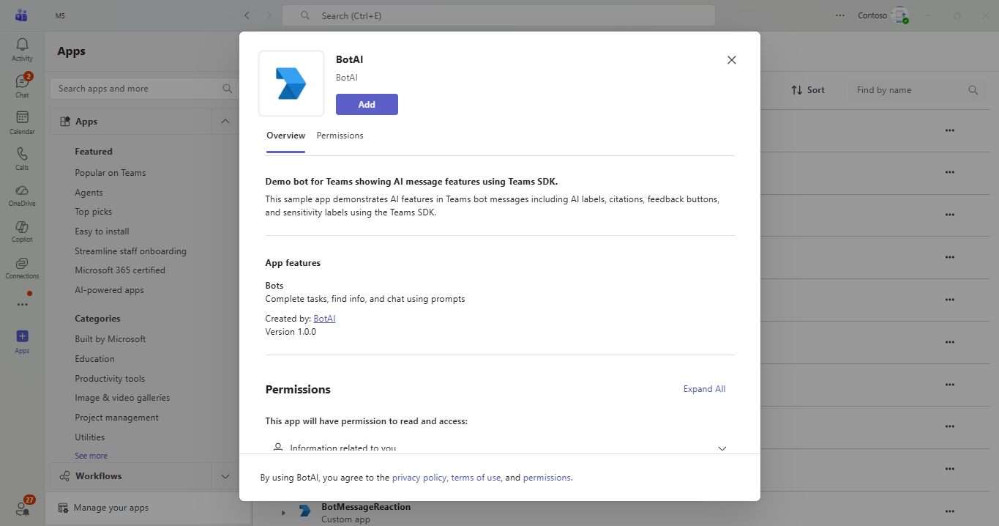

# Bot AI

This sample demonstrates a Teams bot that showcases AI message formatting features using the Teams SDK, including:

- **AI Labels** - AI label added to bot messages specifies that the message is generated by AI
- **Citations** - Used to cite the sources of the bot message
- **Feedback Buttons** - Feedback buttons that help to provide feedback for a bot message
- **Sensitivity Labels** - Sensitivity label added to bot messages specifies the confidentiality of a message
- **Combined AI Message** - Sends a combined AI message with all features: AI label, citations, feedback buttons, and sensitivity label

## Table of Contents

- [Interaction with Bot](#interaction-with-bot)
- [Sample Implementations](#sample-implementations)
- [Prerequisites](#prerequisites)
- [Setup Instructions](#setup-instructions)
- [Running the Sample](#running-the-sample)
- [Troubleshooting](#troubleshooting)
- [Further Reading](#further-reading)

## Interaction with Bot



## Sample Implementations

| Language | Framework | Directory |
|----------|-----------|-----------|
| C# | .NET / ASP.NET Core | [dotnet](dotnet/README.md) |
| TypeScript | Node.js | [nodejs](nodejs/README.md) |
| Python | Python 3.12+ | [python](python/README.md) |

## Prerequisites

- Microsoft Teams is installed and you have an account (not a guest account)
- [M365 developer account](https://docs.microsoft.com/en-us/microsoftteams/platform/concepts/build-and-test/prepare-your-o365-tenant) or access to a Teams account with the appropriate permissions to install an app
- [dev tunnel](https://learn.microsoft.com/en-us/azure/developer/dev-tunnels/get-started?tabs=windows) or [ngrok](https://ngrok.com/download) latest version or equivalent tunneling solution
- Language-specific prerequisites:
  - **Node.js**: [NodeJS](https://nodejs.org/en/download/) version 16.14.2 or higher
  - **.NET**: [.NET 10 SDK](https://dotnet.microsoft.com/download/dotnet/10.0)
  - **Python**: Python 3.12 or higher

## Setup Instructions

> Note: These instructions are for running the sample on your local machine. The tunnelling solution is required because the Teams service needs to call into the bot.

### 1. Setup Local Tunnel

**Using dev tunnels:**

Please follow [Create and host a dev tunnel](https://learn.microsoft.com/en-us/azure/developer/dev-tunnels/get-started?tabs=windows) and host the tunnel with anonymous user access:

```bash
devtunnel host -p 3978 --allow-anonymous
```

**Using ngrok:**

```bash
ngrok http 3978 --host-header="localhost:3978"
```

### 2. Register Azure AD Application

Register a new application in the [Microsoft Entra ID – App Registrations](https://go.microsoft.com/fwlink/?linkid=2083908) portal.

**A) Create New Registration:**
- Select **New Registration** and on the *register an application page*, set following values:
  - Set **name** to your app name
  - Choose the **supported account types** (any account type will work)
  - Leave **Redirect URI** empty
  - Choose **Register**

**B) Save Application Details:**
- On the overview page, copy and save the **Application (client) ID** and **Directory (tenant) ID**
- You'll need these later when updating your Teams application manifest and configuration files

**C) Create Client Secret:**
- Under **Manage**, navigate to **Certificates & secrets**
- In the **Client secrets** section, click on **+ New client secret**
- Add a description (e.g., "Teams Bot Secret") and select an expiration period
- Click **Add**
- **Important**: Copy the client secret **Value** immediately and save it securely. You won't be able to see it again!

### 3. Create Bot Registration

Navigate to the Teams Developer Portal http://dev.teams.microsoft.com

**Create a new Bot resource:**

1. Navigate to `Tools->Bot management`, and add a `New bot`
2. In Configure, paste the Endpoint address from devtunnels and append `/api/messages`
3. In Client secrets, create a new secret and save it for later

> Note. If you have access to an Azure Subscription in the same Tenant, you can also create the Azure Bot resource ([learn more](https://learn.microsoft.com/en-us/azure/bot-service/abs-quickstart?view=azure-bot-service-4.0&tabs=singletenant)).

### 4. Setup Code

**Navigate to your chosen language sample directory:**

```bash
# For Node.js:
cd samples/bot-ai/nodejs

# For .NET:
cd samples/bot-ai/dotnet

# For Python:
cd samples/bot-ai/python
```

**Install dependencies:**

For Node.js:
```bash
npm install
```

For .NET:
```bash
dotnet restore
```

For Python:
```bash
pip install -e .
```

**Configure environment variables:**

Update the configuration file for your selected language (for Node.js/Python, the `.env` file; for .NET, `appsettings.json` or `launchSettings.json`) with the values from step 2 (Azure AD app registration):

For NodeJS and Python you will need a `.env` file with the following fields:

```
TENANT_ID=<Your Directory (tenant) ID>
CLIENT_ID=<Your Application (client) ID>
CLIENT_SECRET=<Your client secret value>
```

For .NET you need to add these values to `appsettings.json` or `launchSettings.json` using the next syntax:

appSettings.json:

```json
"urls" : "http://localhost:3978",
"Teams": {
    "ClientID": "<Your Application (client) ID>",
    "ClientSecret": "<Your client secret value>",
    "TenantId": "<Your Directory (tenant) ID>"
  },
```

Or to use Env Vars from the profile defined in `launchSettings.json` (using the Environment Configuration Provider):

```json
 "teamsbot": {
      "commandName": "Project",
      "dotnetRunMessages": true,
      "launchBrowser": false,
      "applicationUrl": "http://localhost:3978",
      "environmentVariables": {
        "ASPNETCORE_ENVIRONMENT": "Development",
        "Teams__TenantId": "YOUR_TenantId",
        "Teams__ClientID": "YOUR_ClientId",
        "Teams__ClientSecret": "YOUR_ClientSecret"
      }
    }
```

> **Pro Tip**: To obtain the TenantId, ClientId and SecretId you can use the Azure CLI with: `az ad app credential reset --id $appId`
>
> Note. If you don't have access to an Azure Subscription you can still use the Azure CLI, make sure you login with `az login --allow-no-subscription`

**Start the bot:**

For Node.js:
```bash
npm start
```

For .NET:
```bash
dotnet run
```

For Python:
```bash
python app.py
```

### 5. Setup Teams App Manifest

**Edit the manifest:**

- Navigate to the `appManifest/` or `appPackage/` folder
- Edit `manifest.json` and replace:
  - `{MicrosoftAppId}` or `<<MICROSOFT-APP-ID>>` - Replace with your Application (client) ID from step 2 (appears in multiple places)
  - `<<DOMAIN-NAME>>` - Replace with your tunnel domain:
    - For ngrok: `1234.ngrok-free.app` (from `https://1234.ngrok-free.app`)
    - For dev tunnels: `12345.devtunnels.ms`

**Create app package:**

- Zip up the contents of the `appManifest/` or `appPackage/` folder to create a `manifest.zip`

**Upload to Teams:**

- In Microsoft Teams, go to **Apps** (left sidebar)
- Click **Manage your apps** → **Upload an app** → **Upload a custom app**
- Select the `manifest.zip` file

## Running the Sample

Once the bot is running and added to Teams, you can interact with it through the chat:

- **AI Label** - Send "label" to see a message marked as AI-generated
- **Citations** - Send "citation" to see a message with source citations
- **Feedback Buttons** - Send "feedback" to see a message with thumbs up/down feedback buttons
- **Sensitivity Label** - Send "sensitivity" to see a message with a confidentiality label
- **Send AI Message** - Send "aitext" to see a combined AI message with all features: AI label, citations, feedback buttons, and sensitivity label

## Troubleshooting

- If Teams cannot communicate with your bot, verify your DevTunnels URL is reachable
- Ensure your `.env` file or `appsettings.json` is configured correctly with valid `TENANT_ID`/`TenantId`, `CLIENT_ID`/`ClientId`, and `CLIENT_SECRET`/`ClientSecret`
- Use the Channels UI in Azure Bot Service in the Azure Portal to see detailed endpoint errors (not available in Teams Developer Portal)

## Further Reading

### Teams Development
- [Microsoft Teams SDK Documentation](https://learn.microsoft.com/microsoftteams/platform/) - Official Microsoft Teams platform documentation
- [Microsoft Teams Developer Platform](https://docs.microsoft.com/en-us/microsoftteams/platform/) - Comprehensive guide for Teams app development

### AI Features in Bot Messages
- [AI label for bot messages](https://learn.microsoft.com/en-us/microsoftteams/platform/bots/how-to/format-ai-bot-messages?tabs=desktop#ai-label) - Add AI-generated labels to bot messages
- [Citations in bot messages](https://learn.microsoft.com/en-us/microsoftteams/platform/bots/how-to/format-ai-bot-messages?tabs=desktop#citations) - Add citations to bot messages
- [Feedback buttons](https://learn.microsoft.com/en-us/microsoftteams/platform/bots/how-to/format-ai-bot-messages?tabs=desktop#feedback-buttons) - Add feedback buttons to bot messages
- [Sensitivity labels](https://learn.microsoft.com/en-us/microsoftteams/platform/bots/how-to/format-ai-bot-messages?tabs=desktop#sensitivity-label) - Add sensitivity labels to bot messages

### Tools & Resources
- [Microsoft 365 Agents Toolkit](https://marketplace.visualstudio.com/items?itemName=TeamsDevApp.ms-teams-vscode-extension) - VS Code extension for Teams development
- [Azure Bot Service](https://azure.microsoft.com/services/bot-services/) - Cloud-based bot development service
