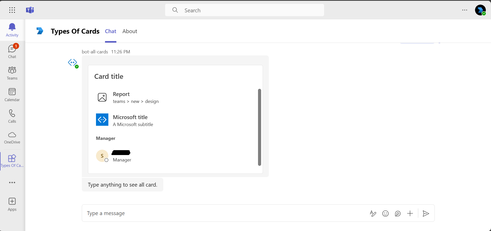

# Types of Cards

This Microsoft Teams bot sample demonstrates sending various card types, such as Adaptive, Hero, List, and Thumbnail cards. It includes detailed steps for setup, app deployment, and using Microsoft 365 Agents Toolkit for Visual Studio to run the app. Experience this versatile bot directly within your Teams client, complete with a manifest for easy uploading.

## Included Features
* Bots
* Adaptive Cards
* Hero Cards
* List Cards
* O365 Connector Cards
* List Cards
* Thumbnail Cards
* Collections Cards

## Interaction with app


## Try it yourself - experience the App in your Microsoft Teams client
Please find below demo manifest which is deployed on Microsoft Azure and you can try it yourself by uploading the app package (.zip file link below) to your teams and/or as a personal app. (Uploading must be enabled for your tenant, [see steps here](https://docs.microsoft.com/microsoftteams/platform/concepts/build-and-test/prepare-your-o365-tenant#enable-custom-teams-apps-and-turn-on-custom-app-uploading)).

**Different types of cards:** [Manifest](/samples/bot-all-cards/csharp/demo-manifest/bot-all-cards.zip)

## Prerequisites

- Microsoft Teams is installed and you have an account (not a guest account).

- [.NET Core SDK](https://dotnet.microsoft.com/download) version 6.0

  ```bash
  # determine dotnet version
  dotnet --version
  ```
- Publicly addressable https url or tunnel such as [dev tunnel](https://learn.microsoft.com/en-us/azure/developer/dev-tunnels/get-started?tabs=windows) or [ngrok](https://ngrok.com/) latest version or [Tunnel Relay](https://github.com/OfficeDev/microsoft-teams-tunnelrelay)
- [Microsoft 365 Agents Toolkit for Visual Studio](https://learn.microsoft.com/en-us/microsoftteams/platform/toolkit/toolkit-v4/install-teams-toolkit-vs?pivots=visual-studio-v17-7)

## Run the app (Using Microsoft 365 Agents Toolkit for Visual Studio)

The simplest way to run this sample in Teams is to use Microsoft 365 Agents Toolkit for Visual Studio.
1. Install Visual Studio 2022 **Version 17.14 or higher** [Visual Studio](https://visualstudio.microsoft.com/downloads/)
1. Install Microsoft 365 Agents Toolkit for Visual Studio [Microsoft 365 Agents Toolkit extension](https://learn.microsoft.com/en-us/microsoftteams/platform/toolkit/toolkit-v4/install-teams-toolkit-vs?pivots=visual-studio-v17-7)
1. In the debug dropdown menu of Visual Studio, select Dev Tunnels > Create A Tunnel (set authentication type to Public) or select an existing public dev tunnel.
1. Right-click the 'M365Agent' project in Solution Explorer and select **Microsoft 365 Agents Toolkit > Select Microsoft 365 Account**
1. Sign in to Microsoft 365 Agents Toolkit with a **Microsoft 365 work or school account**
1. Set `Startup Item` as `Microsoft Teams (browser)`.
1. Press F5, or select Debug > Start Debugging menu in Visual Studio to start your app
</br>
1. In the opened web browser, select Add button to install the app in Teams
> If you do not have permission to upload custom apps (uploading), Microsoft 365 Agents Toolkit will recommend creating and using a Microsoft 365 Developer Program account - a free program to get your own dev environment sandbox that includes Teams.

## Setup

 - Register a new application in the [Microsoft Entra ID – App Registrations](https://go.microsoft.com/fwlink/?linkid=2083908) portal.

    1) Select **New Registration** and on the *register an application page*, set following values:
        * Set **name** to your app name.
        * Choose the **supported account types** (any account type will work)
        * Leave **Redirect URI** empty.
        * Choose **Register**.
    2) On the overview page, copy and save the **Application (client) ID, Directory (tenant) ID**. You’ll need those later when updating your Teams application manifest and in the appsettings.json.
    3) Navigate to **Authentication**
        If an app hasn't been granted IT admin consent, users will have to provide consent the first time they use an app.
        
        - Set another redirect URI:
        * Select **Add a platform**.
        * Select **web**.
        * Enter the **redirect URI** for the app in the following format: 
          1) https://token.botframework.com/.auth/web/redirect

    
        
    4) Navigate to the **Certificates & secrets**. In the Client secrets section, click on "+ New client secret". Add a description      (Name of the secret) for the secret and select “Never” for Expires. Click "Add". Once the client secret is created, copy its value, it need to be placed in the appsettings.json.
    5) Navigate to **API Permissions**, and make sure to add the following permissions:
      Select Add a permission
         * Select Add a permission
         * Select Microsoft Graph -\> Delegated permissions.
         * `User.Read` (enabled by default)
         * Click on Add permissions. Please make sure to grant the admin consent for the required permissions.


2. Setup for Bot
- In Azure portal, create a [Azure Bot resource](https://docs.microsoft.com/en-us/azure/bot-service/bot-builder-authentication?view=azure-bot-service-4.0&tabs=csharp%2Caadv2).
- Ensure that you've [enabled the Teams Channel](https://docs.microsoft.com/en-us/azure/bot-service/channel-connect-teams?view=azure-bot-service-4.0)
- While registering the bot, use `https://<your_tunnel_domain>/api/messages` as the messaging endpoint.

3. Setup NGROK 
1) Run ngrok - point to port 3978

   ```bash
   ngrok http 3978 --host-header="localhost:3978"
   ```  

   Alternatively, you can also use the `dev tunnels`. Please follow [Create and host a dev tunnel](https://learn.microsoft.com/en-us/azure/developer/dev-tunnels/get-started?tabs=windows) and host the tunnel with anonymous user access command as shown below:

   ```bash
   devtunnel host -p 3978 --allow-anonymous
   ```

4. Setup for code 
- Clone the repository

    ```bash
    git clone https://github.com/OfficeDev/Microsoft-Teams-Samples.git
    ```
  Run the bot from a terminal or from Visual Studio:

  A) From a terminal, navigate to `samples/bot-all-cards/csharp/BotAllCards`

  ```bash
  # run the bot
  dotnet run
  ```

  B) Or from Visual Studio

  - Launch Visual Studio
  - File -> Open -> Project/Solution
  - Navigate to `samples/bot-all-cards/csharp/BotAllCards` folder
  - Select `BotAllCards.csproj` file
  - Press `F5` to run the project   

- **This step is specific to Teams.**

1) Modify the `manifest.json` in the `/appPackage` folder and replace the following details:
  - `{{Microsoft-App-Id}}` with Application id generated from Step 1
  - `{{domain-name}}` with base Url domain. E.g. if you are using ngrok it would be `1234.ngrok-free.app` and if you are using dev tunnels then your domain will be `12345.devtunnels.ms`.

2) Zip the contents of `appPackage` folder into a `manifest.zip`.

3) Modify the `/appsettings.json` and fill in the following details:
  - `{{Microsoft-App-Id}}` - Generated from Step 1 is the application app id
  - `{{ Microsoft-App-Password}}` - Generated from Step 1, also referred to as Client secret
  - `{{ Microsoft-App-TenantId }}` - Generated from Step 1 is the tenantId id
  - `{{ ConnectionName }}` - ConnectionName (OAuth Connection Name) 

  **Bot OAuth Connection:**

  

**Note:**
-   If you are facing any issue in your app,  [please uncomment this line](https://github.com/OfficeDev/Microsoft-Teams-Samples/blob/7336b195da6ea77299d220612817943551065adb/samples/bot-all-cards/csharp/BotAllCards/AdapterWithErrorHandler.cs#L27) and put your debugger for local debug.

5) Upload the manifest.zip to Teams (in the Apps view click "Upload a custom app")
   - Go to Microsoft Teams. From the lower left corner, select Apps
   - From the lower left corner, choose Upload a custom App
   - Go to your project directory, the ./appPackage folder, select the zip folder, and choose Open.
   - Select Add in the pop-up dialog box. Your app is uploaded to Teams.

## Running the sample

**Install App:**


**Welcome Cards:**


**All Cards:**


**Adaptive Card:**


Add media url from sharepoint or onedrive to the text input to get media loaded to the adaptive card. For more information refer [media elements in card.](https://review.learn.microsoft.com/en-us/microsoftteams/platform/task-modules-and-cards/cards/media-elements-in-adaptive-cards?branch=pr-en-us-8333&tabs=desktop) 


**Hero Card:**


**OAuth Card:**


**Signin Card:**


**Thumbnail Card:**


**List Card:**



**Collections Card:**


**Connector Card:**


## Deploy the bot to Azure

To learn more about deploying a bot to Azure, see [Deploy your bot to Azure](https://aka.ms/azuredeployment) for a complete list of deployment instructions.

## Further reading

- [Types of cards](https://learn.microsoft.com/microsoftteams/platform/task-modules-and-cards/cards/cards-reference#receipt-card)
- [Create bot connection](https://learn.microsoft.com/azure/bot-service/bot-builder-authentication?view=azure-bot-service-4.0&tabs=userassigned%2Caadv2%2Ccsharp)

