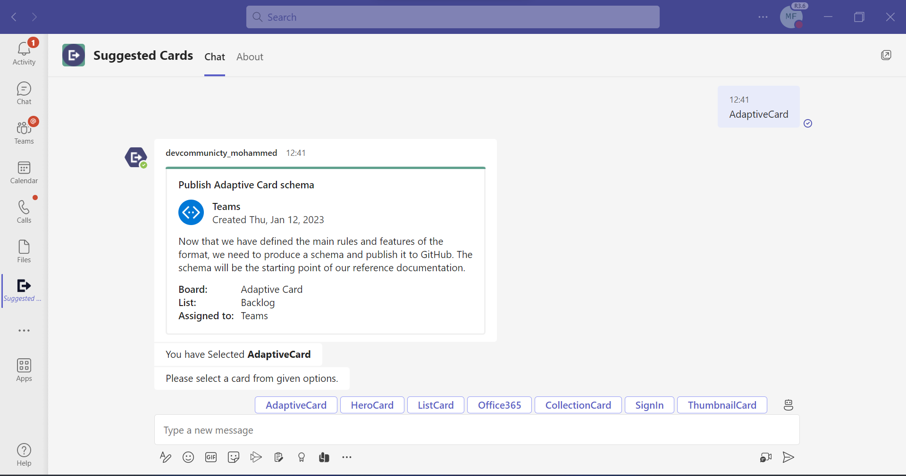

# Types of Cards

This sample shows the feature where user can send different types of cards using bot.

## Included Features
* Bots
* Adaptive Cards
* Hero Cards
* List Cards
* O365 Connector Cards
* List Cards
* Thumbnail Cards
* Collections Cards

## Interaction with app


## Try it yourself - experience the App in your Microsoft Teams client
Please find below demo manifest which is deployed on Microsoft Azure and you can try it yourself by uploading the app package (.zip file link below) to your teams and/or as a personal app. (Sideloading must be enabled for your tenant, [see steps here](https://docs.microsoft.com/microsoftteams/platform/concepts/build-and-test/prepare-your-o365-tenant#enable-custom-teams-apps-and-turn-on-custom-app-uploading)).

**Different types of cards:** [Manifest](/samples/bot-all-cards/csharp/demo-manifest/bot-all-cards.zip)

## Prerequisites

-  Microsoft Teams is installed and you have an account (not a guest account).
-  To test locally, [NodeJS](https://nodejs.org/en/download/) must be installed on your development machine (version 16.14.2  or higher).
-  [ngrok](https://ngrok.com/) or equivalent tunneling solution.

## Setup

> Note these instructions are for running the sample on your local machine, the tunnelling solution is required because
> the Teams service needs to call into the bot.

## App Registrations

1) Register a new application in the [Azure Active Directory – App Registrations](https://go.microsoft.com/fwlink/?linkid=2083908) portal.
2) Select **New Registration** and on the *register an application page*, set following values:
    * Set **name** to your app name.
    * Choose the **supported account types** (any account type will work)
    * Leave **Redirect URI** empty.
    * Choose **Register**.
3) On the overview page, copy and save the **Application (client) ID, Directory (tenant) ID**. You’ll need those later when updating your Teams application manifest and in the appsettings.json.
4) Navigate to **Authentication**
    If an app hasn't been granted IT admin consent, users will have to provide consent the first time they use an app.
    
    - Set another redirect URI:
    * Select **Add a platform**.
    * Select **web**.
    * Enter the **redirect URI** for the app in the following format: 
      1) https://token.botframework.com/.auth/web/redirect


    
5) Navigate to the **Certificates & secrets**. In the Client secrets section, click on "+ New client secret". Add a description (Name of the secret) for the secret and select “Never” for Expires. Click "Add". Once the client secret is created, copy its value, it need to be placed in the appsettings.json.

**Bot OAuth Connection:**


**NOTE:** When you create your bot you will create an App ID and App password - make sure you keep these for later.

2. Setup for Bot
- In Azure portal, create a [Azure Bot resource](https://docs.microsoft.com/azure/bot-service/bot-builder-authentication?view=azure-bot-service-4.0&tabs=csharp%2Caadv2).
- Ensure that you've [enabled the Teams Channel](https://docs.microsoft.com/azure/bot-service/channel-connect-teams?view=azure-bot-service-4.0)
- While registering the bot, use `https://<your_ngrok_url>/api/messages` as the messaging endpoint.

3. Setup NGROK  
Run ngrok - point to port 3978

    ```bash
    ngrok http 3978 --host-header="localhost:3978"
    ```

4. Setup for code
  - Clone the repository

    ```bash
    git clone https://github.com/OfficeDev/Microsoft-Teams-Samples.git
    ```

  - In a terminal, navigate to `samples/bot-all-cards/nodejs`

  - Update the `.env` configuration file for the bot to use the `{{Microsoft-App-Id}}`, `{{Microsoft-App-Password}}` and `{{ConnectionName}}`.  (Note the MicrosoftAppId is the AppId created in step 1 (Setup AAD app registration in your Azure portal), the MicrosoftAppPassword is referred to as the "client secret" in step 1 (Setup for Bot) and you can always create a new client secret anytime.)

  - Install modules

    ```bash
    npm install
    ```

  - Run your app

    ```bash
    npm start
    ```

5. Setup Manifest for Teams
- __*This step is specific to Teams.*__
    - **Edit** the `manifest.json` contained in the ./appPackage folder to replace your MicrosoftAppId (that was created when you registered your app registration earlier) *everywhere* you see the place holder string `{{Microsoft-App-Id}}` (depending on the scenario the Microsoft App Id may occur multiple times in the `manifest.json`)
    - **Edit** the `manifest.json` for `validDomains` and replace `{{domain-name}}` with base Url of your domain. E.g. if you are using ngrok it would be `https://1234.ngrok-free.app` then your domain-name will be `1234.ngrok-free.app`.
    - **Zip** up the contents of the `appPackage` folder to create a `manifest.zip` (Make sure that zip file does not contains any subfolder otherwise you will get error while uploading your .zip package)

- Upload the manifest.zip to Teams (in the Apps view click "Upload a custom app")
   - Go to Microsoft Teams. From the lower left corner, select Apps
   - From the lower left corner, choose Upload a custom App
   - Go to your project directory, the ./AppPackage folder, select the zip folder, and choose Open.
   - Select Add in the pop-up dialog box. Your app is uploaded to Teams.
   
**Note**: If you are facing any issue in your app, please uncomment [this](https://github.com/OfficeDev/Microsoft-Teams-Samples/blob/main/samples/bot-all-cards/nodejs/index.js#L32) line and put your debugger for local debug.

## Running the sample

**Install App:**


**Welcome Message:**


**Adaptive Card:**



**Hero Card:**


**List Card:**


**Office365 Card:**


**SignIn Card:**


**Thumbnail Card:**


**Collection Card:**


**Oauth Card:**


## Deploy the bot to Azure

To learn more about deploying a bot to Azure, see [Deploy your bot to Azure](https://aka.ms/azuredeployment) for a complete list of deployment instructions.

## Further reading
- [Types Of Cards](https://learn.microsoft.com/en-us/microsoftteams/platform/task-modules-and-cards/cards/cards-reference#thumbnail-card)
- [Send a hero card](https://learn.microsoft.com/en-us/azure/bot-service/bot-builder-howto-add-media-attachments?view=azure-bot-service-4.0&tabs=javascript#send-a-hero-card&preserve-view=true)

