# Types of Cards

This Microsoft Teams bot sample demonstrates sending various card types, such as Adaptive, Hero, List, and Thumbnail cards. It includes detailed steps for setup, app deployment, and using Microsoft 365 Agents Toolkit for Visual Studio to run the app. Experience this versatile bot directly within your Teams client, complete with a manifest for easy uploading.

## Included Features
* Bots
* Adaptive Cards
* Hero Cards
* List Cards
* O365 Connector Cards
* List Cards
* Thumbnail Cards
* Collections Cards

## Interaction with app

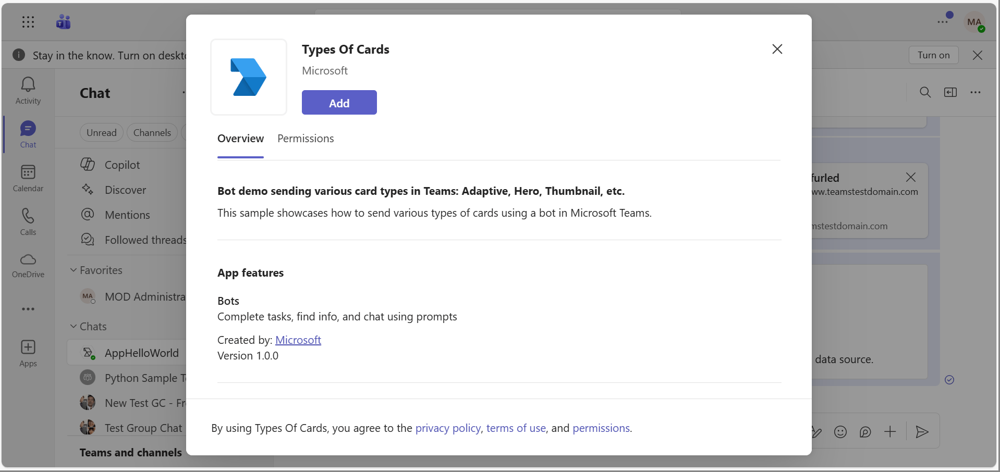

## Try it yourself - experience the App in your Microsoft Teams client
Please find below demo manifest which is deployed on Microsoft Azure and you can try it yourself by uploading the app package (.zip file link below) to your teams and/or as a personal app. (Uploading must be enabled for your tenant, [see steps here](https://docs.microsoft.com/microsoftteams/platform/concepts/build-and-test/prepare-your-o365-tenant#enable-custom-teams-apps-and-turn-on-custom-app-uploading)).

**Different types of cards:** [Manifest](/samples/bot-all-cards/csharp/demo-manifest/bot-all-cards.zip)
## Prerequisites

- Microsoft Teams is installed and you have an account
- [Python SDK](https://www.python.org/downloads/) min version 3.8
- [dev tunnel](https://learn.microsoft.com/en-us/azure/developer/dev-tunnels/get-started?tabs=windows) or [ngrok](https://ngrok.com/) latest version or equivalent tunnelling solution
- [Microsoft 365 Agents Toolkit for VS Code](https://marketplace.visualstudio.com/items?itemName=TeamsDevApp.ms-teams-vscode-extension) or [TeamsFx CLI](https://learn.microsoft.com/microsoftteams/platform/toolkit/teamsfx-cli?pivots=version-one)

## Run the app (Using Microsoft 365 Agents Toolkit for Visual Studio Code)

The simplest way to run this sample in Teams is to use Microsoft 365 Agents Toolkit for Visual Studio Code.

1. Ensure you have downloaded and installed [Visual Studio Code](https://code.visualstudio.com/docs/setup/setup-overview)
1. Install the [Microsoft 365 Agents Toolkit extension](https://marketplace.visualstudio.com/items?itemName=TeamsDevApp.ms-teams-vscode-extension) and [Python Extension](https://marketplace.visualstudio.com/items?itemName=ms-python.python)
1. Select **File > Open Folder** in VS Code and choose this samples directory from the repo
1. Press **CTRL+Shift+P** to open the command box and enter **Python: Create Environment** to create and activate your desired virtual environment. Remember to select `requirements.txt` as dependencies to install when creating the virtual environment.
1. Using the extension, sign in with your Microsoft 365 account where you have permissions to upload custom apps
1. Select **Debug > Start Debugging** or **F5** to run the app in a Teams web client.
1. In the browser that launches, select the **Add** button to install the app to Teams.

> If you do not have permission to upload custom apps (uploading), Microsoft 365 Agents Toolkit will recommend creating and using a Microsoft 365 Developer Program account - a free program to get your own dev environment sandbox that includes Teams.

## Setup for bot

In Azure portal, create a [Azure Bot resource](https://docs.microsoft.com/azure/bot-service/bot-service-quickstart-registration).
    - For bot handle, make up a name.
    - Select "Use existing app registration" (Create the app registration in Microsoft Entra ID beforehand.)
    - __*If you don't have an Azure account*__ create an [Azure free account here](https://azure.microsoft.com/free/)
    
   In the new Azure Bot resource in the Portal, 
    - Ensure that you've [enabled the Teams Channel](https://learn.microsoft.com/azure/bot-service/channel-connect-teams?view=azure-bot-service-4.0)
    - In Settings/Configuration/Messaging endpoint, enter the current `https` URL you were given by running the tunneling application. Append it with the path `/api/messages`

## Run the app (Manually Uploading to Teams)
## Setup for code
> Note these instructions are for running the sample on your local machine, the tunnelling solution is required because
the Teams service needs to call into the bot.

1) Clone the repository

    ```bash
    git clone https://github.com/OfficeDev/Microsoft-Teams-Samples.git
    ```

2) Run ngrok - point to port 3978

   ```bash
   ngrok http 3978 --host-header="localhost:3978"
   ```  

   Alternatively, you can also use the `dev tunnels`. Please follow [Create and host a dev tunnel](https://learn.microsoft.com/en-us/azure/developer/dev-tunnels/get-started?tabs=windows) and host the tunnel with anonymous user access command as shown below:

   ```bash
   devtunnel host -p 3978 --allow-anonymous
   ```

3) In a terminal, navigate to `samples/bot-all-cards/python`

4) Activate your desired virtual environment

5) Install dependencies by running ```pip install -r requirements.txt``` in the project folder.

6) Update the `config.py` configuration for the bot to use the Microsoft App Id and App Password from the Bot Framework registration. (Note the App Password is referred to as the "client secret" in the azure portal and you can always create a new client secret anytime.)

7) __*This step is specific to Teams.*__
    - **Edit** the `manifest.json` contained in the `appManifest` folder to replace your Microsoft App Id (that was created when you registered your bot earlier) *everywhere* you see the place holder string `${{AAD_APP_CLIENT_ID}}` and `${{TEAMS_APP_ID}}` (depending on the scenario the Microsoft App Id may occur multiple times in the `manifest.json`)
    - **Zip** up the contents of the `appManifest` folder to create a `manifest.zip`
    - **Upload** the `manifest.zip` to Teams (in the Apps view click "Upload a custom app")

8) Run your bot with `python app.py`

   - If you are using the Microsoft 365 Agents Toolkit for Visual Studio Code, this step is done for you when you select **Debug > Start Debugging** or **F5**.
   
## Running the sample

**Install App:**

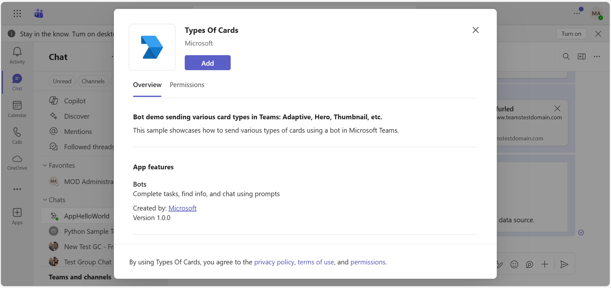

**Welcome Message:**

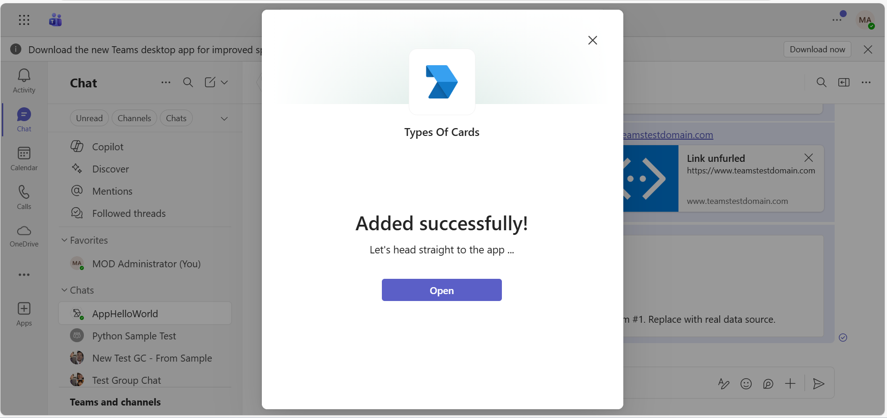

**Card Selection Menu:**

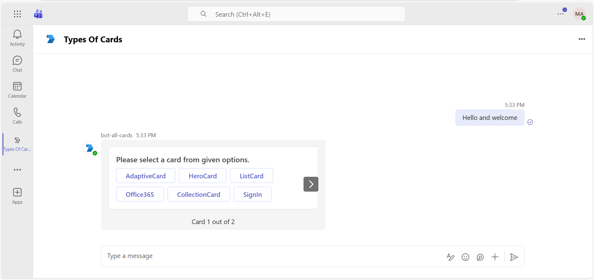

**Adaptive Card:**

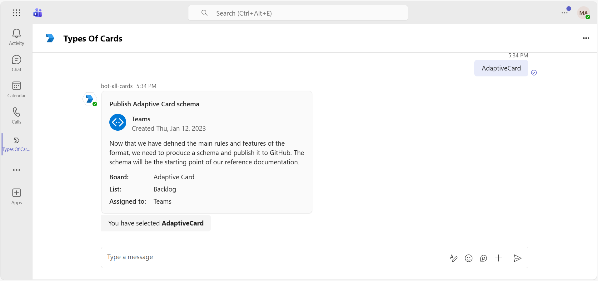

**Hero Card:**

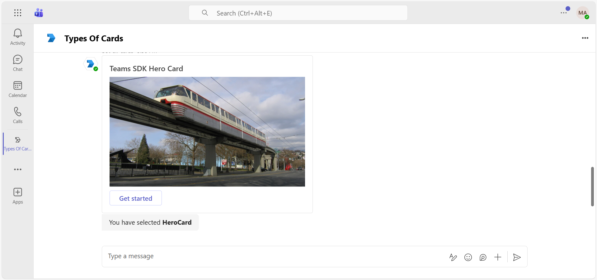

**List Card:**

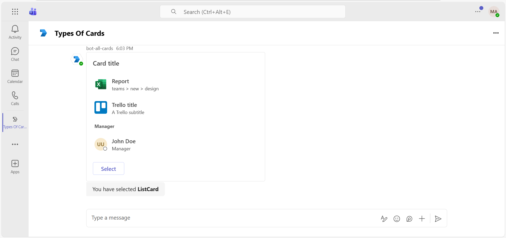

**Office 365 Connector Card:**

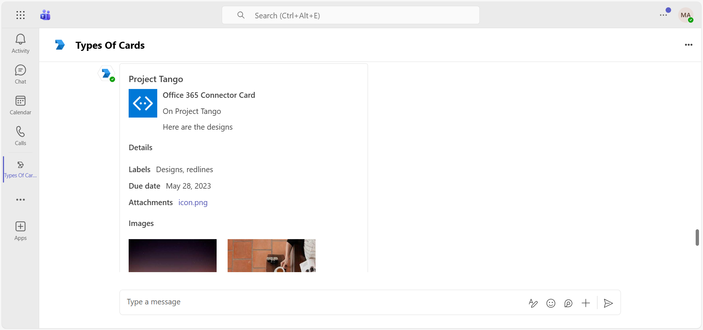

**Collection Card:**

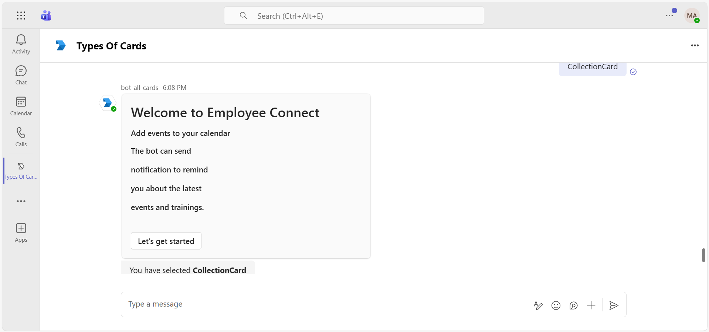

**SignIn Card:**

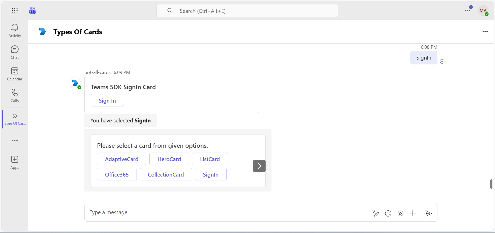

**Thumbnail Card:**

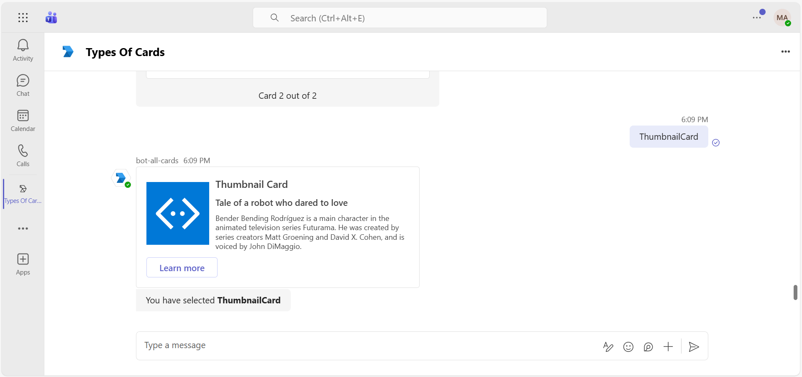

**OAuth Card:**

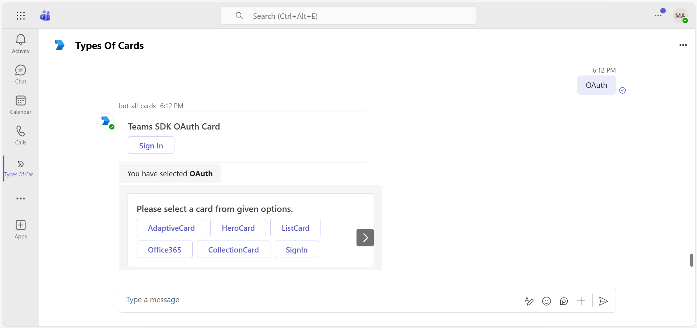

## Deploy the bot to Azure

To learn more about deploying a bot to Azure, see [Deploy your bot to Azure](https://aka.ms/azuredeployment) for a complete list of deployment instructions.

## Further reading
- [Types Of Cards](https://learn.microsoft.com/en-us/microsoftteams/platform/task-modules-and-cards/cards/cards-reference#thumbnail-card)
- [Teams AI Library](https://learn.microsoft.com/en-us/microsoftteams/platform/bots/how-to/teams%20conversational%20ai/teams-conversation-ai-overview)
- [Send a hero card](https://learn.microsoft.com/en-us/azure/bot-service/bot-builder-howto-add-media-attachments?view=azure-bot-service-4.0&tabs=javascript#send-a-hero-card&preserve-view=true)

