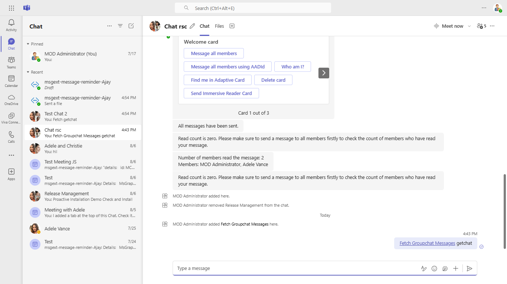
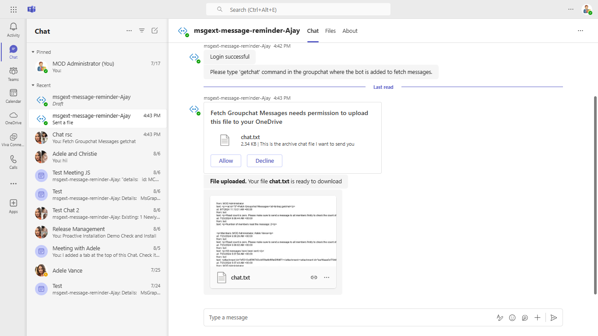

# Archive groupchat messages

Using this C# sample, a bot can archive chat messages of groupchat and send it to user.

This feature shown in this sample is currently available in Public Developer Preview only.

## Key features

- Sending archive chat messages text file of a groupchat to user





## Prerequisites

- [.NET Core SDK](https://dotnet.microsoft.com/download) version 3.1

  ```bash
  # determine dotnet version
  dotnet --version
  ```
- Publicly addressable https url or tunnel such as [ngrok](https://ngrok.com/) or [Tunnel Relay](https://github.com/OfficeDev/microsoft-teams-tunnelrelay) 

## Setup

1 Clone the repository

    ```bash
    git clone https://github.com/OfficeDev/Microsoft-Teams-Samples.git
    ```

2 In a terminal, navigate to `samples/bot-archive-groupchat-messages/csharp`

3 Run ngrok - point to port 3978

```bash
# ngrok http -host-header=rewrite 3978
```

4. Create a Bot Registration
   In Azure portal, create a [Bot Framework registration resource](https://docs.microsoft.com/en-us/azure/bot-service/bot-builder-authentication?view=azure-bot-service-4.0&tabs=csharp%2Caadv2).

   - Ensure that you've [enabled the Teams Channel](https://docs.microsoft.com/en-us/azure/bot-service/channel-connect-teams?view=azure-bot-service-4.0)

## Instruction on setting connection string for bot authentication on the behalf of user

1. In the Azure portal, select your resource group from the dashboard.
2. Select your bot channel registration link.
3. Open the resource page and select Configuration under Settings.
4. Select Add OAuth Connection Settings.
5. Complete the form as follows:

    a. **Name:** Enter a name for the connection. You'll use this name in your bot in the appsettings.json file. For example BotTeamsAuthADv1.

    b. **Service Provider:** Select Azure Active Directory v2. Once you select this, the Azure AD-specific fields will be displayed.

    c. **Client id:** Enter the Application (client) ID .

    d. **Client secret:** Enter the Application (client) secret.

    e. Provide **Scopes** like "User.Read Chat.ReadWrite ChatMessage.Read"

6. Go to the Azure portal where app registration is created.
 
    a. Add this permission to app registration
    - Chat.ReadWrite
    - ChatMessage.Read
    

    b.  Under left menu, select  **Authentication**  under  **Manage**  section.
    - Select 'Accounts in any organizational directory (Any Azure AD directory - Multitenant)' under Supported account types and click "+Add a platform".
    -  On the flyout menu, Select "Web"    
    -  Add  `https://token.botframework.com/.auth/web/redirect`  under Redirect URLs and click Configure button.
    -  Once the flyout menu close, scroll bottom to section 'Implicit Grant' and select check boxes "Access tokens" and "ID tokens" and click "Save" at the top bar.

7. Modify the `manifest.json` in the `/AppManifest` folder and replace the `<<MICROSOFT-APP-ID>>` with the id from step 4 `(Azure AAD Id)`.

8. Zip the contents of `AppManifest` folder into a `manifest.zip`, and use the `manifest.zip` to deploy in app store or add to Teams.

9. Modify the `/appsettings.json` and fill in the `{{ MICROSOFT-APP-ID }}`,`{{ MICROSOFT-APP-PASSWORD }}` and `{{ Connection Name }}` with the id from step 4.

10. In the valid domains section of the manifest update your ngrok url `{<<ngrokid>>.ngrok.io}`. 

11. Upload the manifest.zip to Teams (in the Apps view click "Upload a custom app")
   - Go to Microsoft Teams. From the lower left corner, select Apps
   - From the lower left corner, choose Upload a custom App
   - Go to your project directory, the ./appPackage folder, select the zip folder, and choose Open.
   - Select Add in the pop-up dialog box. Your tab is uploaded to Teams

## To try this sample

- In a terminal, navigate to `FetchGroupChatMessages`

    ```bash
    # change into project folder
    cd # FetchGroupChatMessages
    ```

- Run the bot from a terminal or from Visual Studio, choose option A or B.

  A) From a terminal

  ```bash
  # run the bot
  dotnet run
  ```

  B) Or from Visual Studio

  - Launch Visual Studio
  - File -> Open -> Project/Solution
  - Navigate to `samples/bot-archive-groupchat-messages/csharp` folder
  - Select `FetchGroupChatMessages.csproj` file
  - Press `F5` to run the project

## Interacting with the bot in GroupChat

Select a groupchat and add the bot to chat.

Send `getchat` message to the bot, you will recieve a consent card by the bot in your personal scope.


## Deploy the bot to Azure

To learn more about deploying a bot to Azure, see [Deploy your bot to Azure](https://aka.ms/azuredeployment) for a complete list of deployment instructions.

