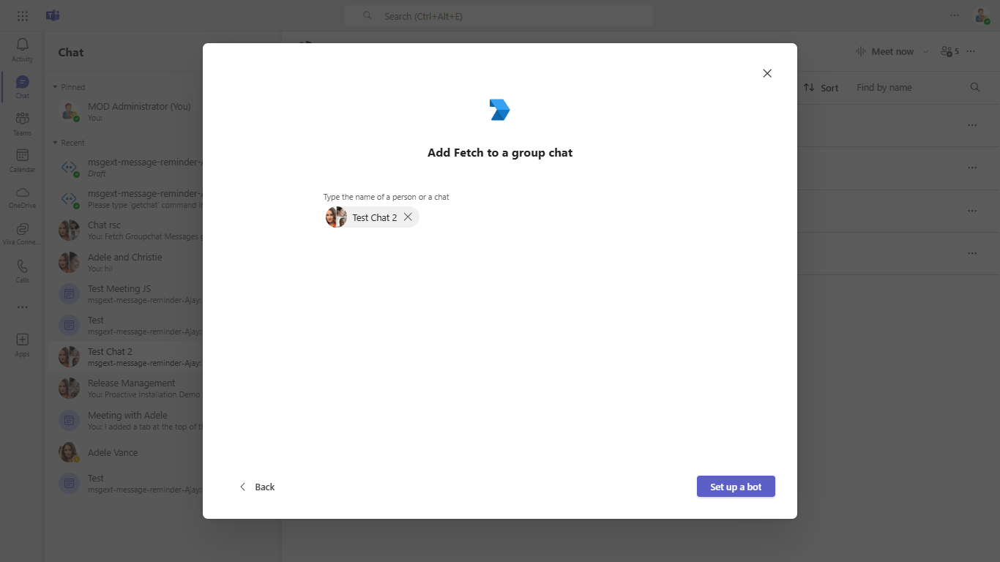
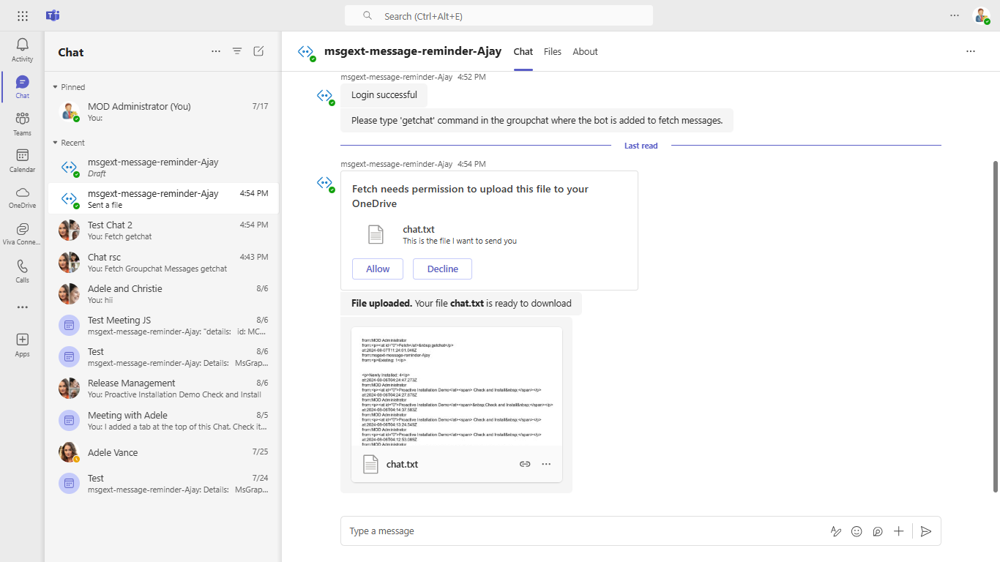

 
# Archive groupchat messages

Using this nodejs sample, a bot can archive chat messages of groupchat and send it to user.

This feature shown in this sample is currently available in Public Developer Preview only.

## Included Features
* Teams SSO (bots)
* Adaptive Cards
* Graph API

## Interaction with app


## Prerequisites

-  Microsoft Teams is installed and you have an account (not a guest account)
-  To test locally, [NodeJS](https://nodejs.org/en/download/) must be installed on your development machine (version 16.14.2  or higher)
-  [ngrok](https://ngrok.com/) or equivalent tunneling solution
-  [M365 developer account](https://docs.microsoft.com/en-us/microsoftteams/platform/concepts/build-and-test/prepare-your-o365-tenant) or access to a Teams account with the appropriate permissions to install an app.

## Setup

> Note these instructions are for running the sample on your local machine, the tunnelling solution is required because
> the Teams service needs to call into the bot.

1) Setup for Bot
- Register a bot with Azure Bot Service, following the instructions [here](https://docs.microsoft.com/en-us/azure/bot-service/bot-service-quickstart-registration?view=azure-bot-service-3.0).

- Ensure that you've [enabled the Teams Channel](https://docs.microsoft.com/en-us/azure/bot-service/channel-connect-teams?view=azure-bot-service-4.0)
- While registering the bot, use `https://<your_ngrok_url>/api/messages` as the messaging endpoint.
    
    > NOTE: When you create your app registration in Azure portal, you will create an App ID and App password - make sure you keep these for later.

**Instruction on setting connection string for bot authentication on the behalf of user**

1. In the Azure portal, select your resource group from the dashboard.
2. Select your Azure bot registration link.
3. Open the resource page and select Configuration under Settings.
4. Select Add OAuth Connection Settings.
5. Complete the form as follows:

    a. **Name:** Enter a name for the connection. You'll use this name in your bot in the appsettings.json file. For example BotTeamsAuthADv1.

    b. **Service Provider:** Select Azure Active Directory v2. Once you select this, the Azure AD-specific fields will be displayed.

    c. **Client id:** Enter the Application (client) ID .

    d. **Client secret:** Enter the Application (client) secret.

    e. Provide **Scopes** like "User.Read Chat.ReadWrite ChatMessage.Read"

6. Go to the Azure portal where app registration is created.
 
    a. Add this permission to app registration
    - Chat.ReadWrite
    - ChatMessage.Read


    b.  Under left menu, select  **Authentication**  under  **Manage**  section.
    - Select 'Accounts in any organizational directory (Any Azure AD directory - Multitenant)' under Supported account types and click "+Add a platform".
    -  On the flyout menu, Select "Web"    
    -  Add  `https://token.botframework.com/.auth/web/redirect`  under Redirect URLs and click Configure button.
    -  Once the flyout menu close, scroll bottom to section 'Implicit Grant' and select check boxes "Access tokens" and "ID tokens" and click "Save" at the top bar.

2) Setup NGROK  
- Run ngrok - point to port 3978

    ```bash
    ngrok http 3978 --host-header="localhost:3978"
    ```

3) Setup for code  
- Clone the repository

    ```bash
    git clone https://github.com/OfficeDev/Microsoft-Teams-Samples.git
    ```

- In a terminal, navigate to `samples/bot-archive-groupchat-messages/nodejs`

- Install modules

    ```bash
    npm install
    ```

- Update the `.env` configuration for the bot to use the `MicrosoftAppId` and `MicrosoftAppPassword` and `ConnectionName` from the AAD app registration or from the Bot Framework registration. (Note that the MicrosoftAppId is the AppId created in step 1 (Setup for Bot SSO), the MicrosoftAppPassword is referred to as the "client secret" in step 1 (Setup for Bot SSO) and you can always create a new client secret anytime.)
    Also, update `connectionName` as the name of your Azure Bot connection created in previous steps.

- Run your bot at the command line:

    ```bash
    npm start
    ```

4) Setup Manifest for Teams

- **This step is specific to Teams.**
    - Edit the `manifest.json` contained in the  `/appPackage` folder to and fill in MicrosoftAppId (that was created in step 1 and it is the same value of MicrosoftAppId as in `.env` file) *everywhere* you see the place holder string `<<MICROSOFT-APP-ID>>` (depending on the scenario it may occur multiple times in the `manifest.json`)
        Update valid domains for `<<DOMAIN-NAME>>` with base Url domain. E.g. if you are using ngrok it would be `https://1234.ngrok-free.app` then your domain-name will be `1234.ngrok-free.app`.
    - Zip up the contents of the `/appPackage` folder to create a `manifest.zip`
    - Upload the `manifest.zip` to Teams (in the left-bottom *Apps* view, click "Upload a custom app")

    > IMPORTANT: The manifest file in this app adds "token.botframework.com" to the list of `validDomains`. This must be included in any bot that uses the Bot Framework OAuth flow.

**Note**: If you are facing any issue in your app, please uncomment [this](https://github.com/OfficeDev/Microsoft-Teams-Samples/blob/main/samples/bot-archive-groupchat-messages/nodejs/index.js#L45) line and put your debugger for local debug.


## Running the sample

**Login command interaction:**


**Login successful:**


**Set up a bot:**



**Getchat command interaction:**


**Bot is added to fetch messages:**


**Ready to download:**



**Interacting with the bot in GroupChat**

Select a groupchat and add the bot to chat.

Send `getchat` message to the bot, you will recieve a consent card by the bot in your personal scope.

## Further reading

- [Bot Framework Documentation](https://docs.botframework.com)
- [Bot Basics](https://docs.microsoft.com/azure/bot-service/bot-builder-basics?view=azure-bot-service-4.0)
- [Azure Portal](https://portal.azure.com)
- [Add Authentication to Your Bot Via Azure Bot Service](https://docs.microsoft.com/en-us/azure/bot-service/bot-builder-authentication?view=azure-bot-service-4.0&tabs=csharp)
- [Activity processing](https://docs.microsoft.com/en-us/azure/bot-service/bot-builder-concept-activity-processing?view=azure-bot-service-4.0)
- [Azure Bot Service Introduction](https://docs.microsoft.com/azure/bot-service/bot-service-overview-introduction?view=azure-bot-service-4.0)
- [Azure Bot Service Documentation](https://docs.microsoft.com/azure/bot-service/?view=azure-bot-service-4.0)
- [.NET Core CLI tools](https://docs.microsoft.com/en-us/dotnet/core/tools/?tabs=netcore2x)
- [Azure CLI](https://docs.microsoft.com/cli/azure/?view=azure-cli-latest)
- [Azure Portal](https://portal.azure.com)
- [Language Understanding using LUIS](https://docs.microsoft.com/en-us/azure/cognitive-services/luis/)
- [Channels and Bot Connector Service](https://docs.microsoft.com/en-us/azure/bot-service/bot-concepts?view=azure-bot-service-4.0)
- [Microsoft Teams Developer Platform](https://docs.microsoft.com/en-us/microsoftteams/platform/)

