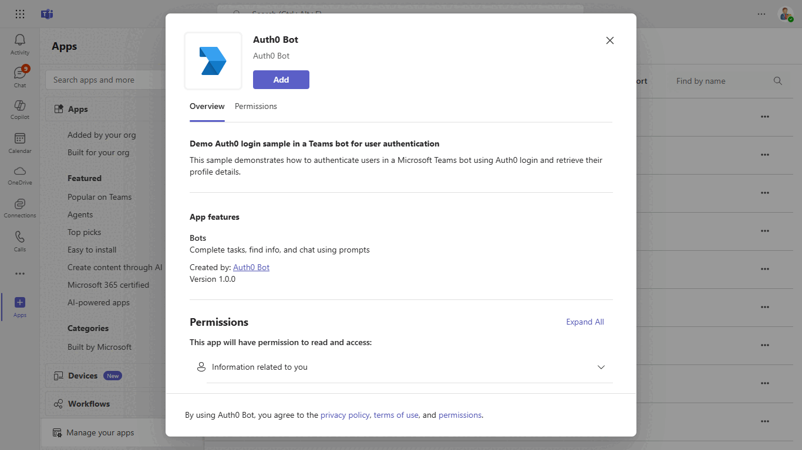
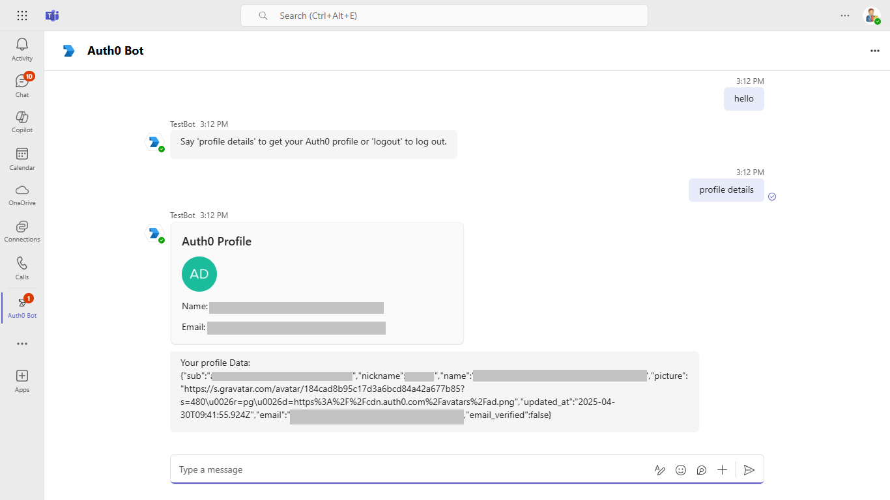
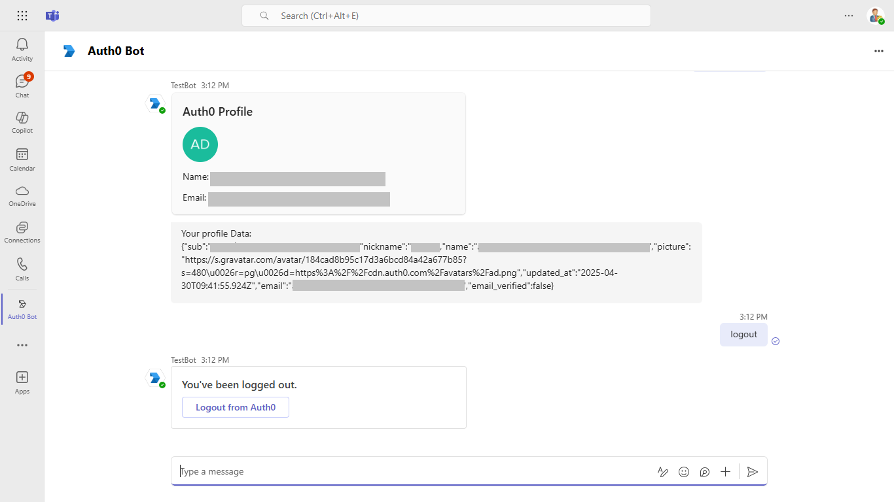

# Auth0 Bot

This sample demonstrates how to authenticate users in a Microsoft Teams bot using Auth0 login and retrieve their profile details. After authentication, the bot displays the user's name, email, and profile picture in an Adaptive Card

## Included Features
* Bots
* Adaptive Cards
* Auth0 authentication

## Interaction with bot


## Try it yourself - experience the App in your Microsoft Teams client
Please find below demo manifest which is deployed on Microsoft Azure and you can try it yourself by uploading the app package (.zip file link below) to your teams and/or as a personal app. (Sideloading must be enabled for your tenant, [see steps here](https://docs.microsoft.com/microsoftteams/platform/concepts/build-and-test/prepare-your-o365-tenant#enable-custom-teams-apps-and-turn-on-custom-app-uploading)).

**Auth0 Bot:** [Manifest](/samples/bot-auth0-adaptivecard/csharp/demo-manifest/bot-auth0-adaptivecard.zip)

## Prerequisites

- Microsoft Teams is installed and you have an account
- [.NET SDK](https://dotnet.microsoft.com/download) version 6.0
- [Auth0](https://auth0.com)
- [dev tunnel](https://learn.microsoft.com/en-us/azure/developer/dev-tunnels/get-started?tabs=windows) or [ngrok](https://ngrok.com/) latest version or equivalent tunnelling solution
- [Microsoft 365 Agents Toolkit for Visual Studio](https://learn.microsoft.com/en-us/microsoftteams/platform/toolkit/toolkit-v4/install-teams-toolkit-vs?pivots=visual-studio-v17-7)

## Run the app (Using Microsoft 365 Agents Toolkit for Visual Studio)

The simplest way to run this sample in Teams is to use Microsoft 365 Agents Toolkit for Visual Studio.
1. Install Visual Studio 2022 **Version 17.14 or higher** [Visual Studio](https://visualstudio.microsoft.com/downloads/)
1. Install Microsoft 365 Agents Toolkit for Visual Studio [Microsoft 365 Agents Toolkit extension](https://learn.microsoft.com/en-us/microsoftteams/platform/toolkit/toolkit-v4/install-teams-toolkit-vs?pivots=visual-studio-v17-7)
1. In the debug dropdown menu of Visual Studio, select Dev Tunnels > Create A Tunnel (set authentication type to Public) or select an existing public dev tunnel.
1. Right-click the 'M365Agent' project in Solution Explorer and select **Microsoft 365 Agents Toolkit > Select Microsoft 365 Account**
1. Sign in to Microsoft 365 Agents Toolkit with a **Microsoft 365 work or school account**
1. Set `Startup Item` as `Microsoft Teams (browser)`.
1. Press F5, or select Debug > Start Debugging menu in Visual Studio to start your app
</br>
1. In the opened web browser, select Add button to install the app in Teams
> If you do not have permission to upload custom apps (uploading), Microsoft 365 Agents Toolkit will recommend creating and using a Microsoft 365 Developer Program account - a free program to get your own dev environment sandbox that includes Teams.

## Setup

> Note these instructions are for running the sample on your local machine, the tunnelling solution is required because
the Teams service needs to call into the bot.

1) Run ngrok - point to port 3978

   ```bash
   ngrok http 3978 --host-header="localhost:3978"
   ```  

   Alternatively, you can also use the `dev tunnels`. Please follow [Create and host a dev tunnel](https://learn.microsoft.com/en-us/azure/developer/dev-tunnels/get-started?tabs=windows) and host the tunnel with anonymous user access command as shown below:

   ```bash
   devtunnel host -p 3978 --allow-anonymous
   ```

1) Register a new application in the [Microsoft Entra ID – App Registrations](https://go.microsoft.com/fwlink/?linkid=2083908) portal.
  
  A) Select **New Registration** and on the *register an application page*, set following values:
      * Set **name** to your app name.
      * Choose the **supported account types** (any account type will work)
      * Leave **Redirect URI** empty.
      * Choose **Register**.
  B) On the overview page, copy and save the **Application (client) ID, Directory (tenant) ID**. You'll need those later when updating your Teams application manifest and in the appsettings.json.
  C) Navigate to **API Permissions**, and make sure to add the following permissions:
   Select Add a permission
      * Select Add a permission
      * Select Microsoft Graph -\> Delegated permissions.
      * `User.Read` (enabled by default)
      * Click on Add permissions. Please make sure to grant the admin consent for the required permissions.


1) Setup for Bot

   In Azure portal, create a [Azure Bot resource](https://docs.microsoft.com/azure/bot-service/bot-service-quickstart-registration).
    - For bot handle, make up a name.
    - Select "Use existing app registration" (Create the app registration in Microsoft Entra ID beforehand.)
    - __*If you don't have an Azure account*__ create an [Azure free account here](https://azure.microsoft.com/free/)
    
   In the new Azure Bot resource in the Portal, 
    - Ensure that you've [enabled the Teams Channel](https://learn.microsoft.com/azure/bot-service/channel-connect-teams?view=azure-bot-service-4.0)
    - In Settings/Configuration/Messaging endpoint, enter the current `https` URL you were given by running the tunneling application. Append with the path `/api/messages`

1) Setup Auth0 Application
    __*Create an Auth0 Application:*__
    - Go to [Auth0 Dashboard](https://manage.auth0.com/).
    - Navigate to `Applications > Applications`, then click `Create Application`.
    - Choose Regular Web Applications and give it a name (e.g., Teams Bot App)

    __*Configure Application Settings:*__
    - Under `Settings`, set the following:
    
    **Allowed Callback URLs:**

    ```bash
    Allowed Callback URLs:https://<your-domain>/api/auth/callback
    ```
    Replace <your-domain> with your bot's public URL (e.g., dev tunnel or Azure URL).
    
    **Get Your Auth0 Credentials:**
    - Copy the Domain, Client ID, and Client Secret from the application settings.
    - Add them to your project configuration (appsettings.json or IConfiguration).

1) Clone the repository

    ```bash
    git clone https://github.com/OfficeDev/Microsoft-Teams-Samples.git
    ```

1) If you are using Visual Studio
   - Launch Visual Studio
   - File -> Open -> Project/Solution
   - Navigate to `samples/bot-auth0-adaptivecard/csharp` folder
   - Select `TeamsConversationBot.csproj` or `TeamsConversationBot.sln`file

1) Update the `appsettings.json` configuration for the bot to use the MicrosoftAppId, MicrosoftAppPassword, MicrosoftAppTenantId generated in Step 2 (App Registration creation). (Note the App Password is referred to as the "client secret" in the azure portal and you can always create a new client secret anytime.)
    - Also, set MicrosoftAppType in the `appsettings.json`. (**Allowed values are: MultiTenant(default), SingleTenant, UserAssignedMSI**)
    - In addition, add your Auth0 configuration details:
      ClientId: Found in your Auth0 application settings.
      ClientSecret: Found in your Auth0 application settings.
      Domain: Your Auth0 domain (e.g., your-tenant.auth0.com)

1) Run your bot, either from Visual Studio with `F5` or using `dotnet run` in the appropriate folder.

1) __*This step is specific to Teams.*__
    - **Edit** the `manifest.json` contained in the  `appPackage` folder to replace your Microsoft App Id (that was created when you registered your bot earlier) *everywhere* you see the place holder string `<<YOUR-MICROSOFT-APP-ID>>` (depending on the scenario the Microsoft App Id may occur multiple times in the `manifest.json`)
    - **Edit** the `manifest.json` for `validDomains`, replace `<<domain-name>>` with base Url domain. E.g. if you are using ngrok it would be `https://1234.ngrok-free.app` then your domain-name will be `1234.ngrok-free.app` and if you are using dev tunnels then your domain will be like: `12345.devtunnels.ms`.
    - **Zip** up the contents of the `appPackage` folder to create a `appPackage.zip` (Make sure that zip file does not contain any subfolder otherwise you will get error while uploading your .zip package)
    - **Upload** the `appPackage.zip` to Teams (In Teams Apps/Manage your apps click "Upload an app". Browse to and Open the .zip file. At the next dialog, click the Add button.)
    - Add the app to personal/team/groupChat scope (Supported scopes)

**Note**: If you are facing any issue in your app, please uncomment [this](https://github.com/OfficeDev/Microsoft-Teams-Samples/blob/main/samples/bot-auth0-adaptivecard/csharp/AdapterWithErrorHandler.cs#L25) line and put your debugger for local debug.

## Running the sample

You can interact with this bot in Teams by sending it a message. The bot will respond to the following strings.

   **Show Login card:**
  

   **Show Profile card:**
  

  **Show Logout card:**
  

## Deploy the bot to Azure

To learn more about deploying a bot to Azure, see [Deploy your bot to Azure](https://aka.ms/azuredeployment) for a complete list of deployment instructions.

## Further reading

- [Bot Framework Documentation](https://docs.botframework.com)
- [Bot Basics](https://docs.microsoft.com/azure/bot-service/bot-builder-basics?view=azure-bot-service-4.0)
- [Azure Bot Service Introduction](https://docs.microsoft.com/azure/bot-service/bot-service-overview-introduction?view=azure-bot-service-4.0)
- [Azure Bot Service Documentation](https://docs.microsoft.com/azure/bot-service/?view=azure-bot-service-4.0)
- [Messages in bot conversations](https://learn.microsoft.com/microsoftteams/platform/bots/how-to/conversations/conversation-messages?tabs=dotnet)
- [Auth0 Documentation](https://auth0.com/docs)


