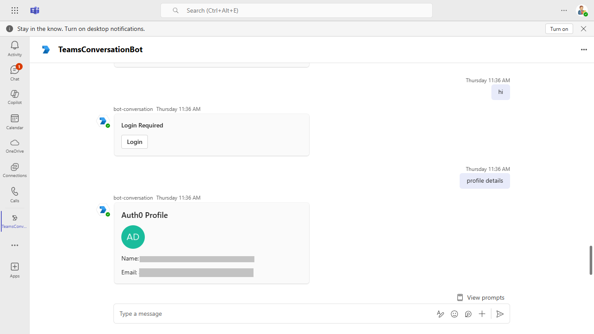

# Auth0 Bot

This sample demonstrates how to authenticate users in a Microsoft Teams bot using Auth0 login and retrieve their profile details. After authentication, the bot displays the user's name, email, and profile picture in an Adaptive Card

## Included Features
* Bots
* Adaptive Cards
* Auth0 authentication
* Teams SDK

## Interaction with bot


## Try it yourself - experience the App in your Microsoft Teams client
Please find below demo manifest which is deployed on Microsoft Azure and you can try it yourself by uploading the app package (.zip file link below) to your teams and/or as a personal app. (Sideloading must be enabled for your tenant, [see steps here](https://docs.microsoft.com/microsoftteams/platform/concepts/build-and-test/prepare-your-o365-tenant#enable-custom-teams-apps-and-turn-on-custom-app-uploading)).

**Auth0 Bot:** [Manifest](/samples/bot-auth0-adaptivecard/csharp/demo-manifest/bot-auth0-adaptivecard.zip)

## Prerequisites

- Microsoft Teams is installed and you have an account
- [NodeJS](https://nodejs.org/en/)
- [Auth0](https://auth0.com)
- [dev tunnel](https://learn.microsoft.com/en-us/azure/developer/dev-tunnels/get-started?tabs=windows) or [ngrok](https://ngrok.com/) latest version or equivalent tunnelling solution
- [Microsoft 365 Agents Toolkit for VS Code](https://marketplace.visualstudio.com/items?itemName=TeamsDevApp.ms-teams-vscode-extension) or [TeamsFx CLI](https://learn.microsoft.com/microsoftteams/platform/toolkit/teamsfx-cli?pivots=version-one)

## Run the app (Using Microsoft 365 Agents Toolkit for Visual Studio Code)

The simplest way to run this sample in Teams is to use Microsoft 365 Agents Toolkit for Visual Studio Code.

1. Ensure you have downloaded and installed [Visual Studio Code](https://code.visualstudio.com/docs/setup/setup-overview)
2. Install the [Microsoft 365 Agents Toolkit extension](https://marketplace.visualstudio.com/items?itemName=TeamsDevApp.ms-teams-vscode-extension)
3. Select **File > Open Folder** in VS Code and choose this samples directory from the repo
4. Using the extension, sign in with your Microsoft 365 account where you have permissions to upload custom apps
5. Select **Debug > Start Debugging** or **F5** to run the app in a Teams web client.
6. In the browser that launches, select the **Add** button to install the app to Teams.

> If you do not have permission to upload custom apps (uploading), Microsoft 365 Agents Toolkit will recommend creating and using a Microsoft 365 Developer Program account - a free program to get your own dev environment sandbox that includes Teams.

## Run the app (Manually Uploading to Teams)

> Note these instructions are for running the sample on your local machine, the tunnelling solution is required because
the Teams service needs to call into the bot.

1) Run ngrok - point to port 3978

   ```bash
   ngrok http 3978 --host-header="localhost:3978"
   ```  

   Alternatively, you can also use the `dev tunnels`. Please follow [Create and host a dev tunnel](https://learn.microsoft.com/en-us/azure/developer/dev-tunnels/get-started?tabs=windows) and host the tunnel with anonymous user access command as shown below:

   ```bash
   devtunnel host -p 3978 --allow-anonymous
   ```

2) Register a new application in the [Microsoft Entra ID – App Registrations](https://go.microsoft.com/fwlink/?linkid=2083908) portal.
   
   A) Select **New Registration** and on the *register an application page*, set following values:
      * Set **name** to your app name.
      * Choose the **supported account types** (any account type will work)
      * Leave **Redirect URI** empty.
      * Choose **Register**.
   
   B) On the overview page, copy and save the **Application (client) ID, Directory (tenant) ID**. You'll need those later when updating your Teams application manifest.


## Setup for bot
In Azure portal, create a [Azure Bot resource](https://docs.microsoft.com/azure/bot-service/bot-service-quickstart-registration).
    - For bot handle, make up a name.
    - Select "Use existing app registration" (Create the app registration in Microsoft Entra ID beforehand.)
    - __*If you don't have an Azure account*__ create an [Azure free account here](https://azure.microsoft.com/free/)
    
   In the new Azure Bot resource in the Portal, 
    - Ensure that you've [enabled the Teams Channel](https://learn.microsoft.com/azure/bot-service/channel-connect-teams?view=azure-bot-service-4.0)
    - In Settings/Configuration/Messaging endpoint, enter the current `https` URL you were given by running the tunneling application. Append with the path `/api/messages`

## Setup Auth0 Application

**Create an Auth0 Application:**
- Go to [Auth0 Dashboard](https://manage.auth0.com/).
- Navigate to `Applications > Applications`, then click `Create Application`.
- Choose Regular Web Applications and give it a name (e.g., Teams Bot App)

**Configure Application Settings:**
- Under `Settings`, set the following:
  
  **Allowed Callback URLs:**
  ```
  https://<your-domain>/api/auth/callback
  ```
  Replace `<your-domain>` with your bot's public URL (e.g., dev tunnel or Azure URL).

**Get Your Auth0 Credentials:**
- Copy the Domain, Client ID, and Client Secret from the application settings.
- You'll add these to your environment configuration files in the next section.


## Setup for code
1) Clone the repository

    ```bash
    git clone https://github.com/OfficeDev/Microsoft-Teams-Samples.git
    ```

2) In a terminal, navigate to `samples/bot-auth0-adaptivecard/nodejs`

3) Install modules

    ```bash
    npm install
    ```

4) Update the `.localConfigs` configuration with the following values:
   - `CLIENT_ID`: Your Microsoft App ID (Application/Client ID from Entra ID registration)
   - `CLIENT_SECRET`: Your Microsoft App secret (from Entra ID registration)
   - `AUTH0_DOMAIN`: Your Auth0 domain (e.g., your-tenant.auth0.com)
   - `AUTH0_CLIENT_ID`: Found in your Auth0 application settings
   - `AUTH0_CLIENT_SECRET`: Found in your Auth0 application settings
   - `APP_URL`: Your bot's public URL (e.g., https://your-domain)
   

5) Run your bot at the command line:

    ```bash
    npm start
    ```

6) __*This step is specific to Teams.*__
    - The `appPackage/manifest.json` uses environment variables that are automatically replaced during provisioning. If manually deploying, update the following placeholders:
      - `${{TEAMS_APP_ID}}`: Your Teams App ID
      - `${{BOT_ID}}`: Your Bot's Microsoft App ID (Application/Client ID)
      - `${{BOT_DOMAIN}}`: Your bot's domain (e.g., your-tunnel-url.devtunnels.ms or your-ngrok-url.ngrok-free.app)
    - **Zip** up the contents of the `appPackage` folder to create a `manifest.zip` (Make sure that zip file does not contain any subfolder otherwise you will get error while uploading your .zip package)
    - **Upload** the `manifest.zip` to Teams (In Teams Apps/Manage your apps click "Upload an app". Browse to and Open the .zip file. At the next dialog, click the Add button.)
    - Add the app to personal/team/groupChat scope (Supported scopes)

## Running the sample

You can interact with this bot in Teams by sending it a message. The bot will respond to the following strings.

   **Show Login card:**
  

   **Show Profile card:**
  

  **Show Logout card:**
  

## Deploy the bot to Azure

To learn more about deploying a bot to Azure, see [Deploy your bot to Azure](https://aka.ms/azuredeployment) for a complete list of deployment instructions.

## Further reading

- [Teams SDK](https://aka.ms/teams-ai-library-v2)
- [Azure Bot Service Documentation](https://docs.microsoft.com/azure/bot-service/?view=azure-bot-service-4.0)
- [Auth0 Documentation](https://auth0.com/docs)


