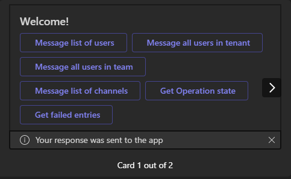
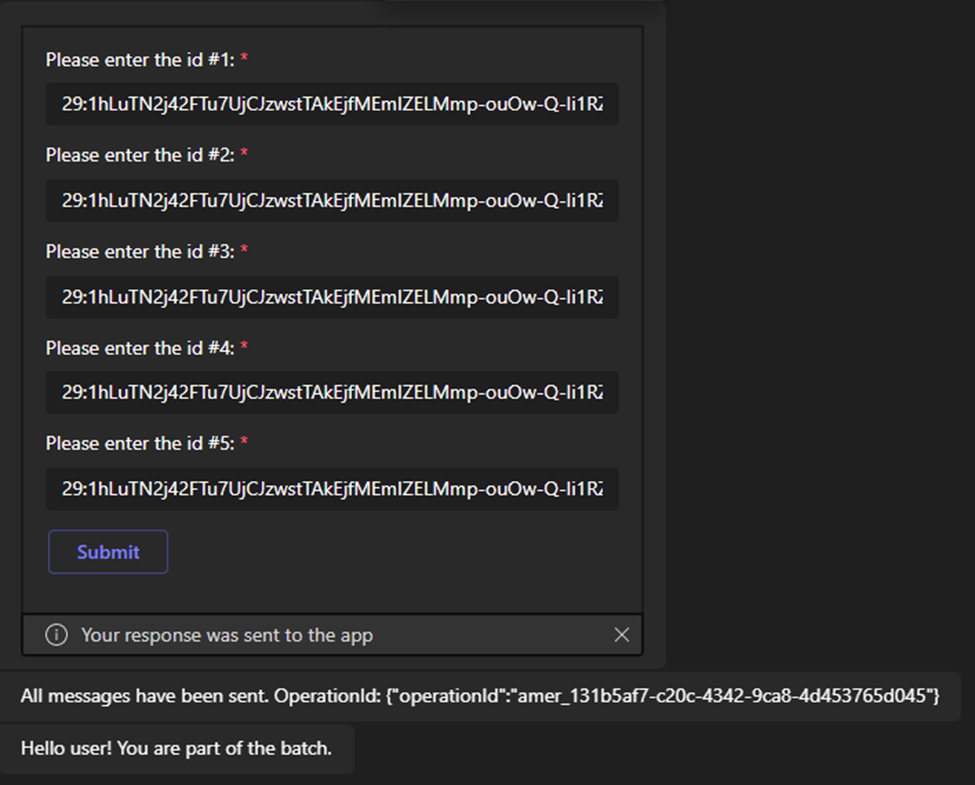
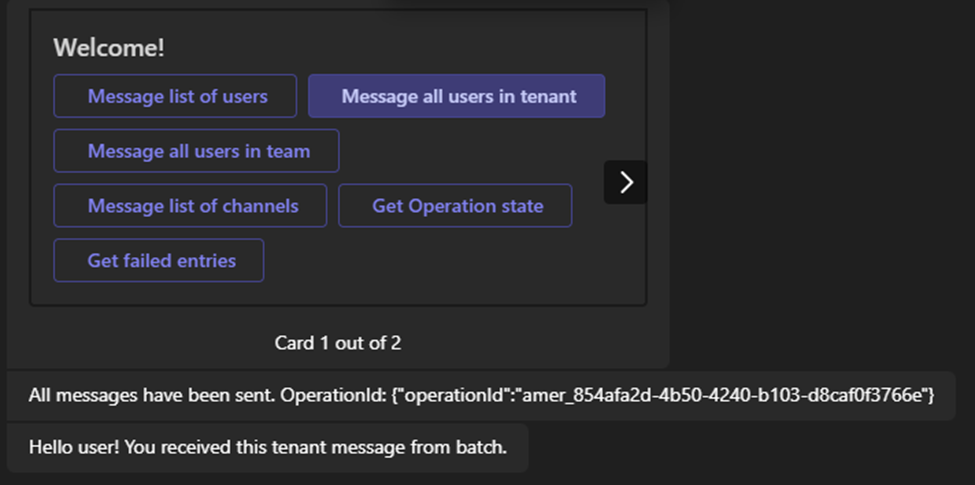
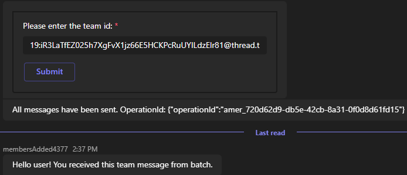
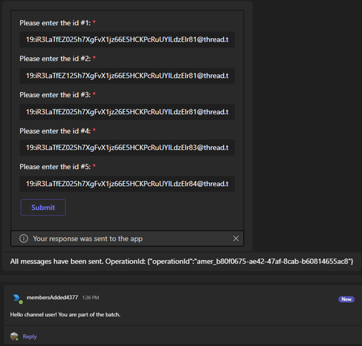
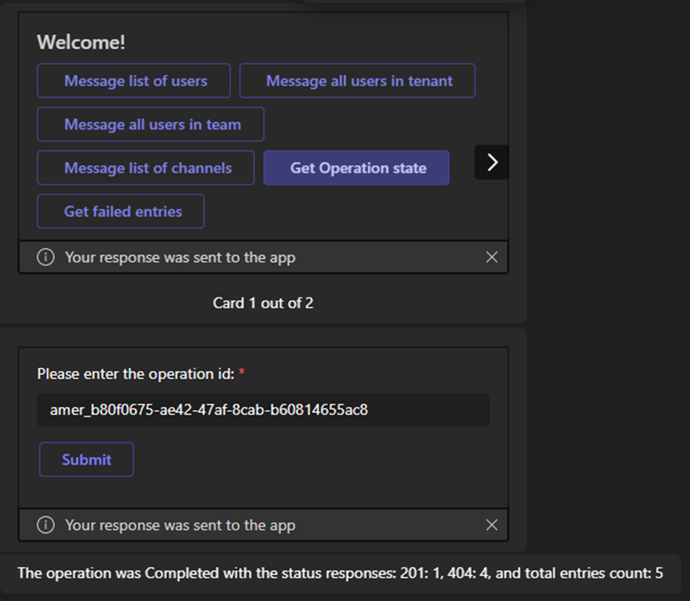
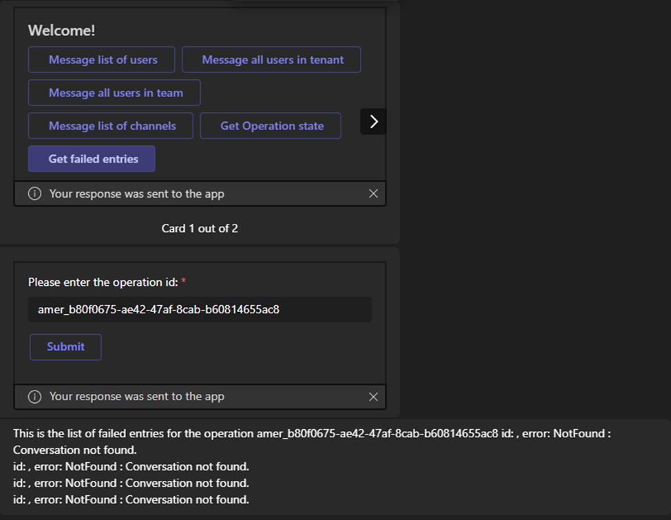
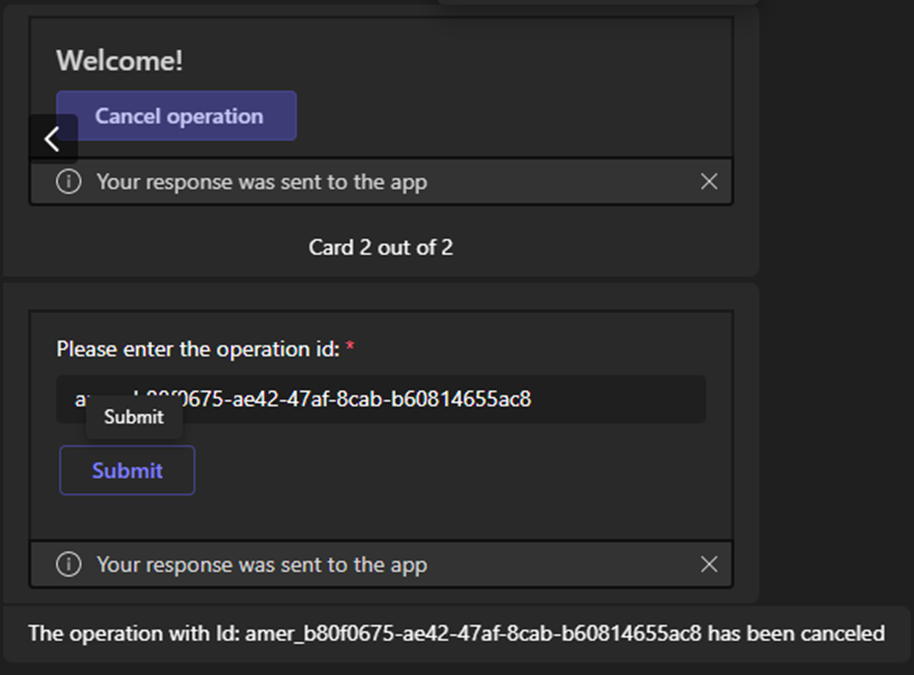

# Teams Batch Operations Bot

Bot Framework v4 Batch Operations Bot sample for Teams.

This bot has been created using [Bot Framework](https://dev.botframework.com). This sample demonstrates the different batch operations you can make from your bot.

## Included Features
* Bots
* Adaptive Cards
* Batch API calls

## Prerequisites

- Microsoft Teams is installed and you have an account
- [.NET SDK](https://dotnet.microsoft.com/download) version 6.0
- [ngrok](https://ngrok.com/) or equivalent tunnelling solution

## Setup

> Note these instructions are for running the sample on your local machine, the tunnelling solution is required because
the Teams service needs to call into the bot.

1) Run ngrok - point to port 3978

    ```bash
    ngrok http 3978 --host-header="localhost:3978"
    ```

1) Setup for Bot

   In Azure portal, create a [Azure Bot resource](https://docs.microsoft.com/azure/bot-service/bot-service-quickstart-registration).
    - For bot handle, create a name.
    - Select "Use existing app registration" (Create the app registration in Azure Active Directory beforehand.)
    - __*If you don't have an Azure account*__ create an [Azure free account here](https://azure.microsoft.com/free/)
    
   In the new Azure Bot resource in the Portal, 
    - Ensure that you've [enabled the Teams Channel](https://learn.microsoft.com/azure/bot-service/channel-connect-teams?view=azure-bot-service-4.0)
    - In Settings/Configuration/Messaging endpoint, enter the current `https` URL you were given by running ngrok. Append with the path `/api/messages`

1) Clone the repository

    ```bash
    git clone https://github.com/OfficeDev/Microsoft-Teams-Samples.git
    ```

1) If you are using Visual Studio
   - Launch Visual Studio
   - File -> Open -> Project/Solution
   - Navigate to `samples/bot-batch-operations/csharp` folder
   - Select `TeamsBatchOperationsBot.csproj` or `TeamsBatchOperationsBot.sln`file

1) Update the `appsettings.json` configuration for the bot to use the MicrosoftAppId, MicrosoftAppPassword, MicrosoftAppTenantId generated in Step 2 (App Registration creation). (Note the App Password is referred to as the "client secret" in the azure portal and you can always create a new client secret anytime.)
    - Also, set MicrosoftAppType in the `appsettings.json`. (**Allowed values are: MultiTenant(default), SingleTenant, UserAssignedMSI**)

1) Run your bot, either from Visual Studio with `F5` or using `dotnet run` in the appropriate folder.

1) __*This step is specific to Teams.*__
    - **Edit** the `manifest.json` contained in the  `TeamsAppManifest` folder to replace your Microsoft App Id (that was created when you registered your bot earlier) *everywhere* you see the place holder string `<<YOUR-MICROSOFT-APP-ID>>` (depending on the scenario the Microsoft App Id may occur multiple times in the `manifest.json`)
    - **Edit** the `manifest.json` for `validDomains` with base Url domain. E.g. if you are using ngrok it would be `https://1234.ngrok-free.app` then your domain-name will be `1234.ngrok-free.app`.
    - **Zip** up the contents of the `TeamsAppManifest` folder to create a `manifest.zip` (Make sure that zip file does not contains any subfolder otherwise you will get error while uploading your .zip package)
    - **Upload** the `manifest.zip` to Teams (In Teams Apps/Manage your apps click "Upload an app". Browse to and Open the .zip file. At the next dialog, click the Add button.)
    - Add the app to personal/team/groupChat scope (Supported scopes)

**Note**: If you are facing any issue in your app, please uncomment [this](https://github.com/OfficeDev/Microsoft-Teams-Samples/blob/main/samples/bot-batch-operations/csharp/AdapterWithErrorHandler.cs#L25) line and put your debugger for local debug.

## Running the sample

You can interact with this bot in Teams by sending it a message, or selecting a command from the command list. The bot will respond to the following strings.

1. **Show Welcome**
  - **Result:** The bot will send the welcome card for you to interact with
  - **Valid Scopes:** personal, group chat, team chat
    


2. **Message a List of Users**
- **Result:** The bot will send a message to each corresponding user from the list of user IDs provided in the dialog and return the operation ID.
- **Valid Scopes:** personal, group chat, team chat



3. **Send message to all users in a tenant**
- **Result:** The bot will send a 1-on-1 message to each user in the current tenant and return the operation ID
- **Valid Scopes:** personal, group chat, team chat



4. **Message All Users in a Team:**
- **Result:** The bot will send a 1-on-1 message to each user in the team corresponding to the ID provided in the dialog and return the operation ID
- **Valid Scopes:** personal, group chat, team chat



5. **Message A List of Channels**
- **Result:** The bot will send a message to each channel from the list of channel IDs provided in the dialog (by default the current channel) and return the operation ID.
- **Valid Scopes:** personal, group chat, team chat



6. **Get Operation State**
- **Result:** The bot will open a dialog and ask for the operation ID and return if the corresponding operation is Ongoing, Completed, or Failed
- **Valid Scopes:** personal, group chat, team chat



7. **Get Failed Entries Paginated**
- **Result:** The bot will show a list of the failed entries, and provide the continuation token in case of multiple pages of results
- **Valid Scopes:** personal, group chat, team chat



8. **Cancel Operation**
- **Result:** The bot will open a dialog and ask for the operation ID and cancel the corresponding operation.
- **Valid Scopes:** personal, group chat, team chat



You can select an option from the command list by typing ```@TeamsBatchOperationsBot``` into the compose message area and ```What can I do?``` text above the compose area.

## Deploy the bot to Azure

To learn more about deploying a bot to Azure, see [Deploy your bot to Azure](https://aka.ms/azuredeployment) for a complete list of deployment instructions.

## Further reading

- [Bot Framework Documentation](https://docs.botframework.com)
- [Bot Basics](https://docs.microsoft.com/azure/bot-service/bot-builder-basics?view=azure-bot-service-4.0)
- [Azure Bot Service Introduction](https://docs.microsoft.com/azure/bot-service/bot-service-overview-introduction?view=azure-bot-service-4.0)
- [Azure Bot Service Documentation](https://docs.microsoft.com/azure/bot-service/?view=azure-bot-service-4.0)
- [Messages in bot conversations](https://learn.microsoft.com/microsoftteams/platform/bots/how-to/conversations/conversation-messages?tabs=dotnet)
