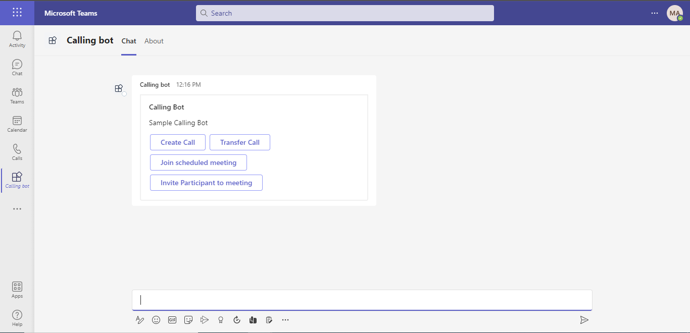
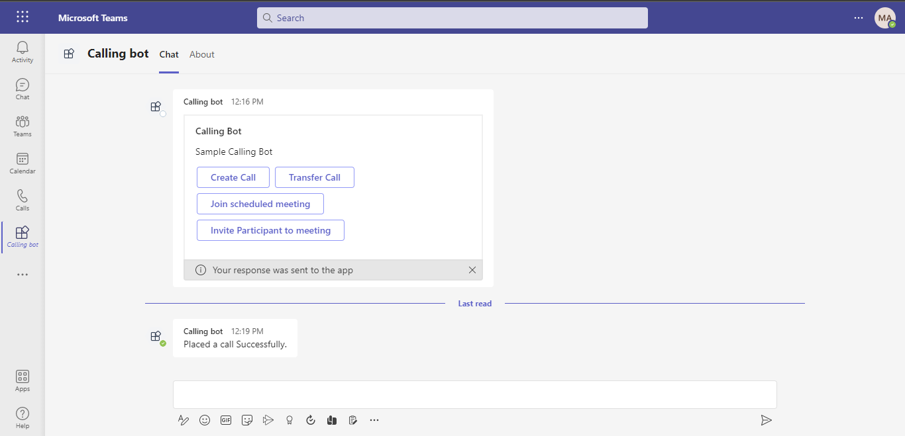
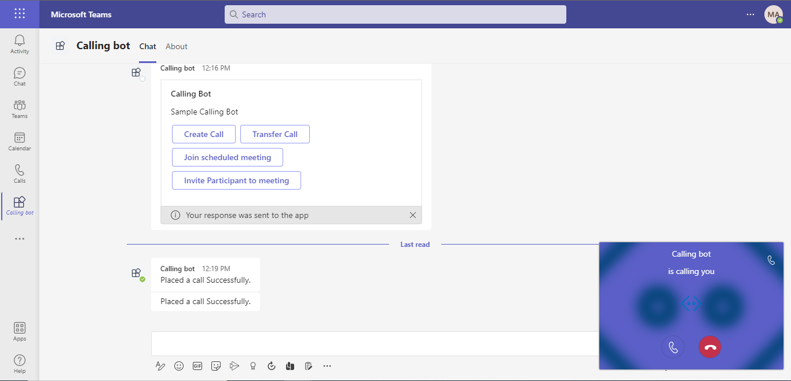
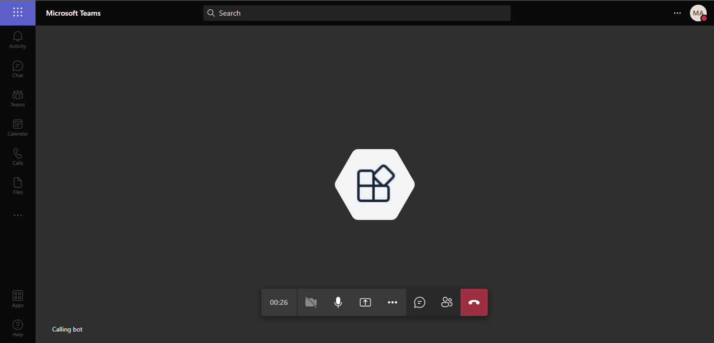
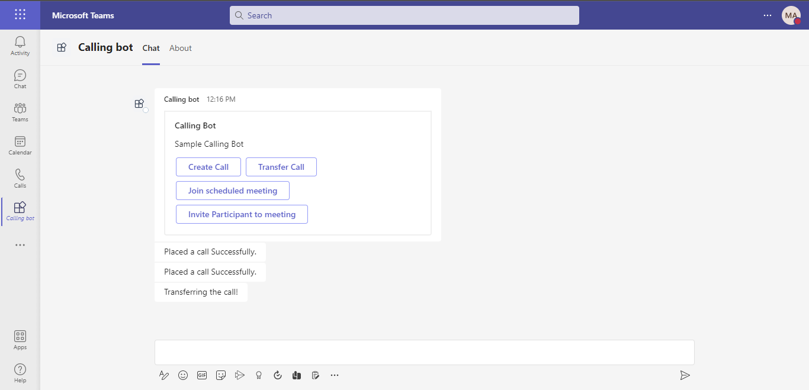

# Calling and Meeting Bot Sample V4
This sample showcases Calling and Meeting Bot functionality. The app uses Bot Framework and Microsoft Graph APIs to add the bot to meetings as a participant.

Functionality includes creating 1:1 calls, group calls and meetings. Transferring existing calls, inviting participants to a call, and joining scheduled calls.


## Frameworks


## Prerequisites

- [Office 365 tenant](https://developer.microsoft.com/en-us/microsoft-365/dev-program)
- An active [Azure subscription](https://azure.microsoft.com/en-us/free/).
- Microsoft Teams is installed and you have an account
- Install [Visual Studio](https://docs.microsoft.com/en-us/visualstudio/install/install-visual-studio?view=vs-2022) or [Visual Studio Code](https://code.visualstudio.com/download) to run and debug the sample code.
    - [.NET SDK](https://dotnet.microsoft.com/download) Version 6
- [ngrok](https://ngrok.com/) for local testing or equivalent tunnelling solution

## Setup

### Setup dependencies

> Note these instructions are for running the sample on your local machine, the tunnelling solution is required because the Bot service needs to call the bot.

1. Clone the repository

   ```bash
   git clone https://github.com/OfficeDev/Microsoft-Teams-Samples.git
   ```

1. If you are using Visual Studio

   - Launch Visual Studio
   - File -> Open -> Project/Solution
   - Navigate to `samples/bot-calling-meeting/csharp` folder
   - Select `CallingBotSample.csproj` file

1. Run ngrok and point it to the port the Web App is listening on. Note the port will change depending on how you are deploying.
    ```bash
    ngrok http https://localhost:44326 -host-header=localhost:44326 # For Visual Studio
    ```
    * Make sure to copy and save the `https` url (it should look like `https://<randomsubdomain>.ngrok.io`).

### Register and set-up Azure AD application

1. Register a Azure AD application in your tenant's directory for the bot authentication.
    1. Log in to the Azure portal from your subscription, and go to the "App registrations" blade [here](https://portal.azure.com/#blade/Microsoft_AAD_IAM/ActiveDirectoryMenuBlade/RegisteredApps). Ensure that you use a tenant where admin consent for API permissions can be provided.
    1. Click on "New registration", and create an Azure AD application.
    1. **Name:** The name of your Teams app - if you are following the template for a default deployment, we recommend "App catalog lifecycle".
    1. **Supported account types:** Select "Accounts in any organizational directory"
    1. Leave the "Redirect URL" field blank.
    1. Click on the "Register" button.
1. When the app is registered, you'll be taken to the app's "Overview" page. Copy the **Application (client) ID**; we will need it later. Verify that the "Supported account types" is set to **Multiple organizations**.
1. On the side rail in the Manage section, navigate to the "Certificates & secrets" section. In the Client secrets section, click on "+ New client secret". Add a description for the secret and select Expires as "Never". Click "Add".

    - Once the client secret is created, copy its **Value**, please take a note of the secret as it will be required later.

    >At this point you have 3 unique values:
    >- Application (client) ID which will be later used during Azure bot creation
    >- Client secret for the bot which will be later used during Azure bot creation
    >- Directory (tenant) ID
    >We recommend that you copy these values into a text file, using an application like Notepad. We will need these values later.
1. Under the left menu, navigate to **API Permissions**, and add the following permissions of Microsoft Graph API > Application permissions:
    - `Calls.AccessMedia.All`
    - `Calls.Initiate.All`
    - `Calls.InitiateGroupCall.All`
    - `Calls.JoinGroupCall.All`
    - `Calls.JoinGroupCallAsGuest.All`
    - `OnlineMeetings.ReadWrite.All`
1. If you are logged in as the Global Administrator, click on the "Grant admin consent for <%tenant-name%>" button to grant admin consent else, inform your admin to do the same through the portal or follow the steps provided here to create a link and send it to your admin for consent.
    - Global Administrator can grant consent using following link: `https://login.microsoftonline.com/common/adminconsent?client_id=<<microsoft-app-id>>`
1. Create a policy for a demo tenant user for creating the online meeting on behalf of that user using the following PowerShell script
    - Update `PolicyName`, `microsoft-app-id`, `policy-description`, `object-id-of-the-user-to-whom-policy-need-to-be-granted` in the powershell script below
    ```powershell
    Import-Module MicrosoftTeams
    # Calling Connect-MicrosoftTeams using no parameters will open a window allowing for MFA accounts to authenticate
    Connect-MicrosoftTeams

    New-CsApplicationAccessPolicy -Identity “<<policy-identity/policy-name>>” -AppIds "<<microsoft-app-id>>" -Description "<<policy-description>>"
    Grant-CsApplicationAccessPolicy -PolicyName “<<policy-identity/policy-name>>” -Identity "<<object-id-of-the-user-to-whom-policy-need-to-be-granted>>"
    ```
    e.g.:
    ```powershell
    Import-Module MicrosoftTeams
    Connect-MicrosoftTeams

    New-CsApplicationAccessPolicy -Identity Meeting-policy-dev -AppIds "d0bdaa0f-8be2-4e85-9e0d-2e446676b88c" -Description "Online meeting policy - contoso town"
    Grant-CsApplicationAccessPolicy -PolicyName Meeting-policy-dev -Identity "782f076f-f6f9-4bff-9673-ea1997283e9c"
    ```

    

1. Run `Windows Powershell PSI` as an administrator and execute above script.
1. Run following command to verify policy is create successfully or not
    `Get-CsApplicationAccessPolicy -PolicyName Meeting-policy-dev -Identity "<<microsoft-app-id>>"`

### Setup Bot Service

1. In Azure portal, create a [Azure Bot resource](https://docs.microsoft.com/en-us/azure/bot-service/bot-service-quickstart-registration)
1. Select Type of App as "Multi Tenant"
1. Select Creation type as "Use existing app registration"
1. Use the copied App Id and Client secret from above step and fill in App Id and App secret respectively.
1. Click on 'Create' on the Azure bot.
1. Go to the created resource, ensure that you've [enabled the Teams Channel](https://learn.microsoft.com/en-us/azure/bot-service/channel-connect-teams?view=azure-bot-service-4.0)
1. In Settings/Configuration/Messaging endpoint, enter the current `https` URL you have given by running ngrok. Append with the path `/api/messages`
    - e.g. `https://samplebot.ngrok.io/api/messages`
1. Select the Calling tab on the Teams channel page. Select Enable calling, and then update Webhook (for calling) with your HTTPS URL (`https://yourNgrok/api/calling`) where you receive incoming notifications.
    - For example `https://contoso.com/api/calling` 
1. Save your changes.

### Setup Azure Cognitive Services
*The following is optional if you want to enable Speech to Text of the recorded prompts.*
1. [Create a Cognitive Speech Service](https://ms.portal.azure.com/#create/Microsoft.CognitiveServicesSpeechServices).
    1. Use the same resource group you used for your Bot.
    1. Select a region, name and pricing tier
1. In your created resource, navigate to "Keys and endpoints" in the left rail.
    1. Copy the value of 'Key 1' and 'Region' for updating in the appSettings later.
1. 

## Configuring the sample:

1. In `appSettings.json` and `manifest.json` replace:
    - `<<microsoft-app-id>>` with your AAD Application (Client) Id.
    - `<<microsoft-app-client-secret>>` with the client secret you created above.
    - `<<deployment-url>>` with your ngrok url.
    - `object-id-of-the-user-to-whom-online-meeting-policy-has-been-granted` with the ID of the user who has had the policy assigned to them above
    - If you are enabling Azure Cognitive Services:
        - Set `CognitiveServices.Enabled` to `true`
        - Replace `<<cognitive-speech-key>>` with the Key from above
        - Replace `<<cognitive-speech-region>>` with the region the service exists in 
        - Replace `<<cognitive-speech-language>>` with the language your users will speak, for English (US) use `en-US`

1. Sideloading the App
    * Create a zip containing `manifest.json`, `colorIcon.png` and `outlineIcon.png` from `Source\CallingMediaBot.Web\Manifest`.
    * [You can upload you app by following these instructions](https://docs.microsoft.com/en-us/microsoftteams/platform/concepts/deploy-and-publish/apps-upload)

## Running the sample

- Install 'Calling Bot' in Teams.
  

- Bot will send adaptive card as mentioned below.
  

- User can ask Bot to create a call and can join that call.
  
  
  

- User can ask Bot to transfer the call.
  

- User can ask Bot to schedule a meeting and invite the participants

  
  

## Deploy the bot to Azure

To learn more about deploying a bot to Azure, see [Deploy your bot to Azure](https://aka.ms/azuredeployment) for a complete list of deployment instructions.

## Disclaimer

**THIS CODE IS PROVIDED _AS IS_ WITHOUT WARRANTY OF ANY KIND, EITHER EXPRESS OR IMPLIED, INCLUDING ANY IMPLIED WARRANTIES OF FITNESS FOR A PARTICULAR PURPOSE, MERCHANTABILITY, OR NON-INFRINGEMENT.**

## Further reading

- [Register a calling Bot](https://docs.microsoft.com/en-us/microsoftteams/platform/bots/calls-and-meetings/registering-calling-bot#create-new-bot-or-add-calling-capabilities)
- [Cloud Communications API](https://docs.microsoft.com/en-us/graph/api/resources/call?view=graph-rest-1.0)
