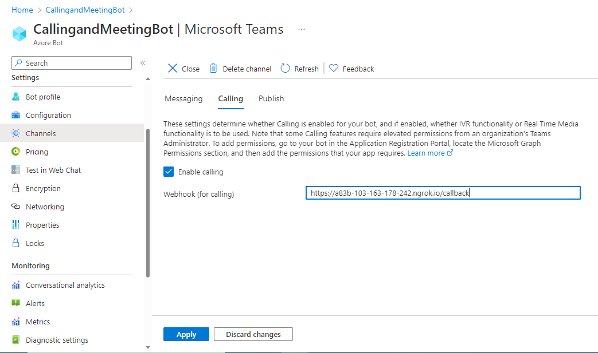
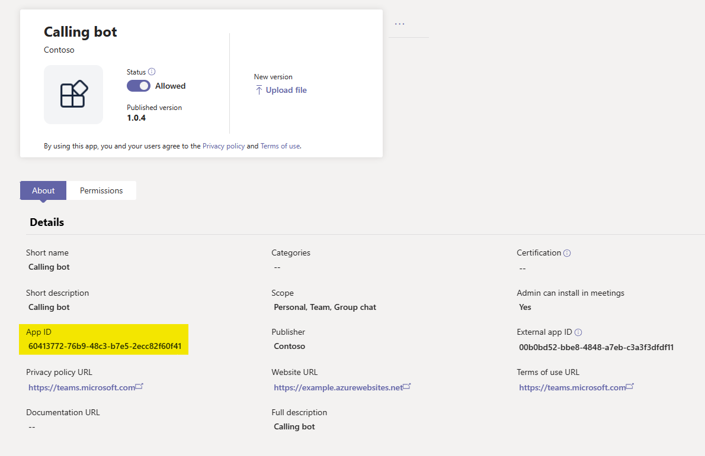
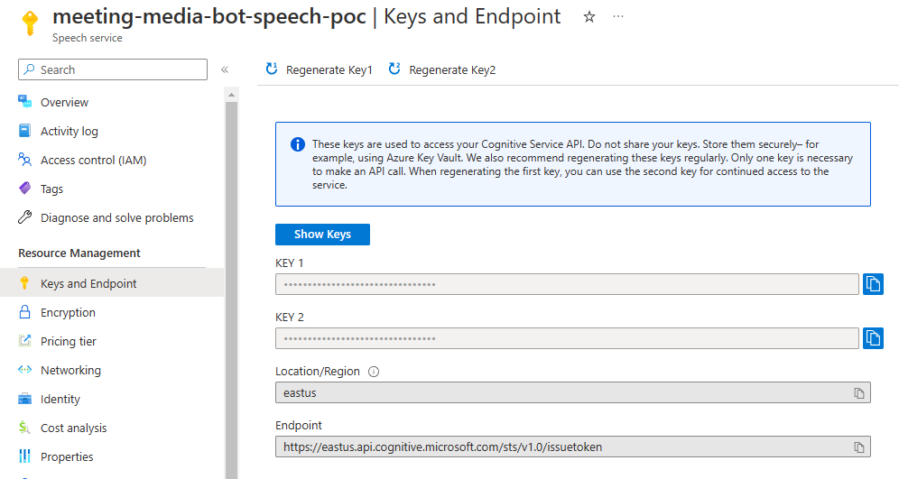

# Calling and Meeting Bot Sample V4

## Summary

Calling and Meeting bot integrates [Microsoft Graph Cloud Communications APIs](https://learn.microsoft.com/en-us/graph/api/resources/communications-api-overview?view=graph-rest-1.0) with the Teams' Platform. It supports different scenarios for service hosted media bots.

Some features of this sample includes:
- Creating a call
- Answering a call
- Transferring calls
- Inviting people to an ongoing call
- Playing audio in a call
- Recording audio from a call
- Join a scheduled meeting as a bot
- Creating online meetings
- Speech to text using Cognitive Services
- Text to speech
- Sending messages in a meeting that you created

[We've expanded on how this sample works in a Design Document](docs/design-doc.md)

## Interaction with bot


## Frameworks


## Prerequisites

- [Microsoft 365 Developer tenant](https://developer.microsoft.com/en-us/microsoft-365/dev-program)
- Installed Microsoft Teams client
- [.NET Core SDK](https://dotnet.microsoft.com/download) version 6.0
  ```bash
  # determine dotnet version
  dotnet --version
  ```
- Publicly addressable https url or tunnel such as [ngrok](https://ngrok.com/) or [Tunnel Relay](https://github.com/OfficeDev/microsoft-teams-tunnelrelay) 

## Setup

> Note these instructions are for running the sample on your local machine, the tunnelling solution is required because the Teams service needs to call into the bot.

1. Clone the repository

    ```bash
    git clone https://github.com/OfficeDev/Microsoft-Teams-Samples.git
    ```
1. If you are using Visual Studio
    - Launch Visual Studio
    - File -> Open -> Project/Solution
    - Navigate to `samples/bot-calling-meeting/csharp/Source` folder
    - Select the `CallingBotSample.sln` file

1. Run ngrok - point to port 3978
    // TODO Verify the port number below.

    ```bash
    ngrok http --host-header=rewrite 3978
    ```

    - Keep track of your `https` ngrok deployment URL. You will need it when configuring your bot below. It should look like `https://<<randomsubdomain>>.ngrok.io`. 
    > NOTE: The free ngrok plan will generate a new URL every time you run it, which requires you to update your Azure Bot, and the project configuration. A paid account with a permanent ngrok URL is recommended.

## Create an Azure Bot and register AAD application
Follow the first two steps of [Create Teams conversation bot tutorial](https://learn.microsoft.com/en-gb/microsoftteams/platform/sbs-teams-conversation-bot). In particular complete the *Create and register your bot* section.

There are few adjustments to this tutorial to make this sample work.

1. Be sure to keep track of the
    - "*Microsoft App ID*" of your newly created AAD App
    - "*Directory (tenant) ID*" shown in the AAD App overview page
    - "*Client secret*" you created

1. When asked "*To add API permissions for downstream calls*", include the following Microsoft Graph Application permissions
    - `Calls.AccessMedia.All`
    - `Calls.Initiate.All`
    - `Calls.InitiateGroupCall.All`
    - `Calls.JoinGroupCall.All`
    - `Calls.JoinGroupCallAsGuest.All`
    - `OnlineMeetings.ReadWrite.All`

1.  After you add the API permissions, some need to be granted Admin consent.
    1. If you are logged in as the Global Administrator, you can click on the `Grant admin consent for <<tenant-name>>`.
    1. If you are not an admin, ask your admin to grant the permissions through the portal or you can share a link with them that is in the following format `https://login.microsoftonline.com/common/adminconsent?client_id=<<appId>>`. This link will allow them to grant the permissions in one click.

1. To create an online meeting (used in the creating of incidents), we need to give a user that right. This is done by creating a policy. The policy allows your app to create an online meeting on behalf of that user. You can create the policy using the following PowerShell script

    - Run the following script in an administrator Powershell window, replacing: 
        - `<<policy-name>>` with a name to describe the policy
        - `<<microsoft-app-id>>` with the ID of the AAD App created above
        - `<<policy-description>>` with a description of the policy
        - `<<object-id-of-the-user-to-whom-policy-need-to-be-granted>>` with the user id of the user who should have the policy granted to them.
        - *If you do not have the MicrosoftTeams PowerShell Module installed, please [install it before continuing](https://learn.microsoft.com/en-us/microsoftteams/teams-powershell-install)*
        ```powershell
        Import-Module MicrosoftTeams
        # Calling Connect-MicrosoftTeams using no parameters will open a window allowing for MFA accounts to authenticate
        Connect-MicrosoftTeams
      
        New-CsApplicationAccessPolicy -Identity "<<policy-name>>" -AppIds "<<microsoft-app-id>>" -Description "<<policy-description>>"
        Grant-CsApplicationAccessPolicy -PolicyName "<<policy-name>>" -Identity "<<object-id-of-the-user-to-whom-policy-need-to-be-granted>>"
        ```
        - For example:
        ```powershell
        Import-Module MicrosoftTeams
        Connect-MicrosoftTeams
      
        New-CsApplicationAccessPolicy -Identity Meeting-policy-dev -AppIds "d0bdaa0f-8be2-4e85-9e0d-2e446676b88c" -Description "Online meeting policy - contoso town"
        Grant-CsApplicationAccessPolicy -PolicyName Meeting-policy-dev -Identity "782f076f-f6f9-4bff-9673-ea1997283e9c"
        ```
        

    - You can verify the policy was created successfully by running the following  command.
        ```powershell
        Get-CsApplicationAccessPolicy -PolicyName "<<policy-name>>" -Identity "<<microsoft-app-id>>"
        ```

1. Finally we need to enable support for Calling on your Bot.
    - When asked "*To add the Microsoft Teams channel*", after you have agreed to the Terms of Service and selected apply under the messaging tab, you have enabled the bot for messaging.
    - Select the `Calling` tab.
    - Check `Enable calling`
    - Set the "Webhook (for calling)" to `https://<<deployment-url>>/callback`
        - 
    - Select "Apply"

### Configuring the sample

#### Create Teams Application
1. Update `manifest.json` in `Source\CallingBotSample\Manifest`. Replace:
    - `<<app-id>>` with a random guid
    - `<<microsoft-app-id>>` with the AAD Application Client ID for the app you created above

1. Zip the contents of `Source\CallingBotSample\Manifest` to create a `manifest.zip` that can be installed in Teams. The zipped folder should contain `manifest.json`, `color.png` and `outline.png` and no subdirectories.

1. For initial testing, you can upload the `manifest.zip` to Teams.
    1. In Teams Apps/Manage your apps click "Upload an app". Browse to and Open the .zip file. At the next dialog, click the Add button.

1. To support the "Create incident" flow you need to upload the app to an app store. This because we use the [install app to chat API](https://learn.microsoft.com/en-us/graph/api/chat-post-installedapps?view=graph-rest-1.0&tabs=http) which requires the app to be in a store.
    1. For testing we recommend using your Org's app store. [You can find the instructions on adding an app to your org app store here](https://learn.microsoft.com/en-gb/microsoftteams/upload-custom-apps#upload).
    1. Under the [manage apps section in the Teams admin center](https://admin.teams.microsoft.com/policies/manage-apps) find your newly uploaded app, and keep track of the App's ID, this is the value you should use for the `<<teams-catalog-app-id>>` in `appsettings.json`. 

#### Update App Settings
1. Update `appsettings.json` replacing the below values:
    - `<<microsoft-app-id>>` the AAD Application Client ID for the app you created above
    - `<<microsoft-app-client-secret>>` the secret created after creating the Azure bot
    - `<<tenant-id>>` the tenant id of your application
    
    - `<<deployment-url>>` the deployment url of your application, if you are using ngrok use this url. It will be in the format of https://randomsubdomain.ngrok.io
    
    - `<<object-id-of-the-user-to-whom-online-meeting-policy-has-been-granted>>` the object id of the user who was granted the online meeting policy above
    
    - `<<teams-catalog-app-id>>` This is the external application id of the app once it has been added to either your organisation app store or the public Team's app store.
    
1. If you wish to support Speech to Text and Text to Speech scenarios you need to [create an Azure Cognitive Speech Services recourse (documentation)](https://learn.microsoft.com/en-gb/azure/cognitive-services/cognitive-services-apis-create-account?tabs=speech%2Canomaly-detector%2Clanguage-service%2Ccomputer-vision%2Cwindows#create-a-new-azure-cognitive-services-resource), and you need to replace the below:
    - Change `CognitiveServices.Enabled` to `true`
    - `<<cognitive-speech-key>>` the key of the speech service. This can be found under "Keys and Endpoint" under the speech service resource. 
    - `<<cognitive-speech-region>>` the region you choose for your cognitive service instance during creation
    - `<<cognitive-speech-language>>` the language of the speech being passed into the service
    
## Using the app
1. 
1. 
1. 

## Deploy the bot to Azure

To learn more about deploying a bot to Azure, see [Deploy your bot to Azure](https://aka.ms/azuredeployment) for a complete list of deployment instructions.

## Code Tours
This repository uses VSCode [Code Tours](https://marketplace.visualstudio.com/items?itemName=vsls-contrib.codetour#:~:text=A%20%22code%20tour%22%20is%20simply%20a%20series%20of,CONTRIBUTING.md%20file%20and%2For%20rely%20on%20help%20from%20others.) to explain _how_ the code works. 

The tour files can be found in the `.tours` directory.

## Disclaimer

**THIS CODE IS PROVIDED *AS IS* WITHOUT WARRANTY OF ANY KIND, EITHER EXPRESS OR IMPLIED, INCLUDING ANY IMPLIED WARRANTIES OF FITNESS FOR A PARTICULAR PURPOSE, MERCHANTABILITY, OR NON-INFRINGEMENT.**

## Further reading
- [Register a calling Bot](https://docs.microsoft.com/en-us/microsoftteams/platform/bots/calls-and-meetings/registering-calling-bot#create-new-bot-or-add-calling-capabilities)
- [Cloud Communications API](https://docs.microsoft.com/en-us/graph/api/resources/call?view=graph-rest-1.0)
