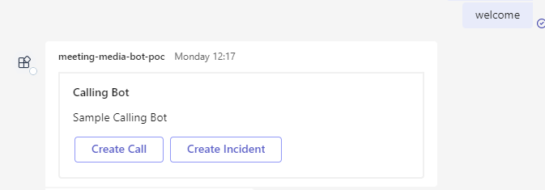
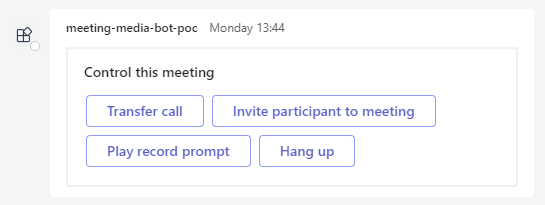

# Teams Calling Bot Design Doc

Teams supports the usage of media bots inside a meeting. These media bots user the cloud communications API in Microsoft Graph and are not something that the Teams Platform provides direct support for. 

The sample app is split into two areas: the message bot; and the calling bot.
* The message bot is how the calling bot can be initiated, certain actions like “Create call”, “Play prompt” or “Transfer call”.
* The calling bot handles actions like the answering of calls, notifications on call state changes (e.g. new participant joins), handling Interactive Voice Response (IVR) on the call, and hanging up.

## Default Message Activity

Response returned when the bot is called in a scenario that is not a scheduled meeting.

Response returned when the bot is called in a scheduled meeting. We determine if the context is a scheduled meeting based using `turnContext.Activity.ChannelData["meeting"] != null`.

### Message Actions
* Create Call
    * Opens a task module with an adaptive card, which has a people picker to determine who to add to a call
    * Uses [Create Call API](https://learn.microsoft.com/en-us/graph/api/application-post-calls?view=graph-rest-1.0&tabs=http)
    * When a user joins the call a prompt is played encouraging the user to record a message.
    * The recorded message is then played back to the user
* Join scheduled meeting
    * *Only available when the app is in a scheduled meeting*
    * Identical to the *Create Call* steps, except instead of using people picker to select who to add, the bot queries the chat's members.
    * Also, after the recording is echoed to the callers, we call the Cognitive Speech service to transcribe the recording. We then send the text to the meeting chat
        * This is not possible when you create a call with the bot directly as by default the 1:1 chat with the bot is used. 
* Create Incident
    * Opens a task module with an adaptive card, which has a people picker to determine who to add to a call
    * [Creates an online meeting (API)](https://learn.microsoft.com/en-us/graph/api/application-post-onlinemeetings?view=graph-rest-1.0&tabs=http)
    * [Create the call](https://learn.microsoft.com/en-us/graph/api/application-post-calls?view=graph-rest-1.0&tabs=http) for the online meeting
    * [Installs this app (API)](https://learn.microsoft.com/en-us/graph/api/chat-post-installedapps?view=graph-rest-1.0&tabs=http) to the meeting chat
    * Saves information about the incident to a cache
    * Sends and Adaptive Card with the incident details to the meeting chat
    * When a user joins the call, check if it's an incident by seeing if the cache contains information, and if so play an incident specific prompt.
* `@Calling Bot showmeetingactions`
    * This command sends a card with actions the user can take inside a call
    * 

## Graph APIs
Interacting with the Microsoft Graph Cloud Communications is available as REST APIs from the MS Graph SDK ([Working with the cloud communications API in Microsoft Graph](https://learn.microsoft.com/en-us/graph/api/resources/communications-api-overview?view=graph-rest-1.0)), and a [Graph Core and Communications SDK](https://microsoftgraph.github.io/microsoft-graph-comms-samples/docs/articles/index.html) that calls those APIs and handles state.

In our sample we are only using the Graph SDK for interacting with the Cloud Communications services. 

There is more documentation for [Cloud Communications under the Microsoft Graph documentation](https://learn.microsoft.com/en-us/graph/cloud-communications-callrecords)

### Using Cognitive Speech APIs for TTS and STT
For transcribing audio, and for converting text to speech we use the [Microsoft Azure Cognitive Services Speech SDK](https://learn.microsoft.com/en-us/azure/cognitive-services/speech-service/speech-sdk). We are using the free tier of this API.

## SDKs

## Integrating with Teams Platform

## Installing a Teams app in a call created by calling bot
