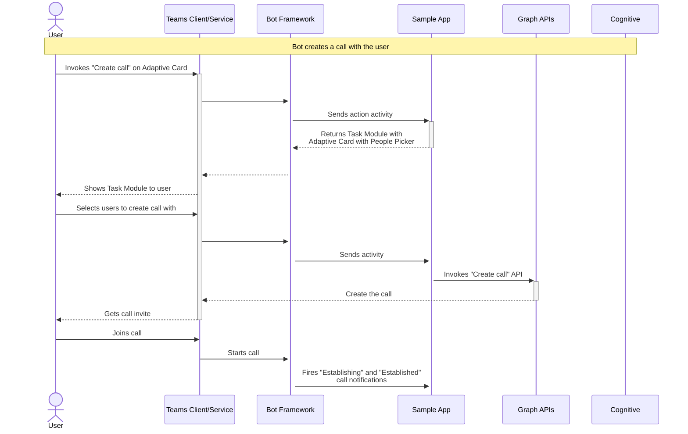
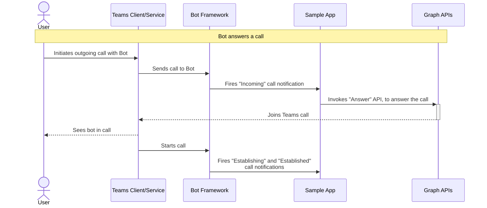
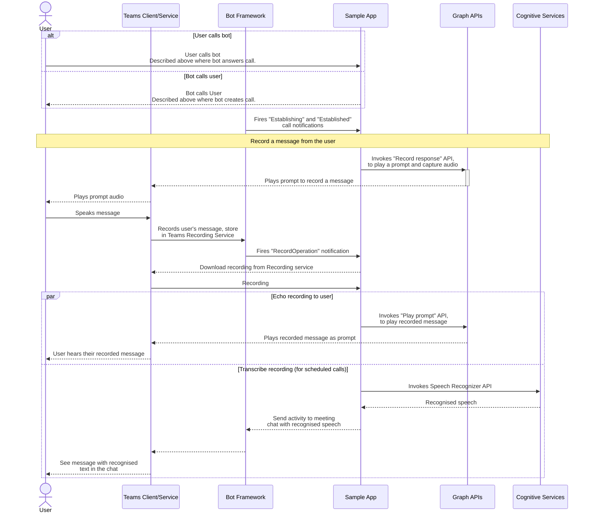

# Teams Calling Bot Design Doc

Teams supports the usage of media bots inside a meeting. Media bots uses the [Cloud Communications API in Microsoft Graph](https://learn.microsoft.com/en-us/graph/api/resources/communications-api-overview?view=graph-rest-1.0) and are supported by the Microsoft Graph Team.

This app is to showcase how these APIs work together with the Teams client and Platform.

There are a number of scenarios supported by this app:

1. Creating calls either by calling the bot or the bot calling you.
1. Adding a bot to a scheduled meeting
1. Using the bot to create an online meeting, and inviting people to it.

# Creating a simple service hosted media bot, with an echo
The first part of this sample bot is to allow users to create a call using the Graph Communications APIs. Once that was working, we added the support for recording a response from a user, and then echoing the recording back to the user.

The *Create call* action opens an [Adaptive Card with a People Picker](https://learn.microsoft.com/en-us/microsoftteams/platform/task-modules-and-cards/cards/people-picker), which allows you to choose who the bot should create a call with. The bot will then [create a call](https://learn.microsoft.com/en-us/graph/api/application-post-calls?view=graph-rest-1.0&tabs=http) with the desired targets receiving a call notification.

The calling bot/media bot is essentially a notification event handler. The bot will receive notifications for different call events and the bot can decide to act on those events or not.

The is a wide range of notifications that can possibly be fired. Including, call state changes (e.g. incoming, established), information about a recording, details about a prompt that has been played, and updates to the call's participants. Other notifications can be fired but it depends on what is happen in the call.

## Getting the call ID from a notification
For most of the Cloud Communications API, you will need to know the call's ID to complete an action. It is possible to get this from incoming notifications but the ID might appear in a number of places. In our sample, we first check the `ClientContext` of the CommsOperation, however if that is not provided we can also check the `resourceUrl`. 

Resource URLs are in the format below, with the call id in the 3rd position when split on `/` (position 0 will be empty) `#microsoft.graph.call: /communications/calls/<<call-id-as-guid>>` or
`#microsoft.graph.recordOperation: /communications/calls/<<call-id-as-guid>>/operations/<<operation-id-as-guid>>`.

## Answering an incoming call
If you set `supportsCalling` in your App Manifest, the Teams client will show users a Call button in their 1:1 chats with your bot. If a user calls your bot using this button, your calling bot will receive [an `incoming` call notification](https://learn.microsoft.com/en-us/graph/api/call-answer?view=graph-rest-1.0&tabs=http#notification---incoming). You can then [use the answer API](https://learn.microsoft.com/en-us/graph/api/call-answer?view=graph-rest-1.0) to join the call.

## Recording a snippet
One type of notification is when the call is established. When we receive that notification the sample app plays a [prompt asking the user to record a response using the Interactive Voice Response (IVR) capabilities](https://learn.microsoft.com/en-us/graph/api/call-record?view=graph-rest-1.0). 

When the recording is completed, we get a different notification. This notification includes the recordings location and an access token to be able to download it. We download this file for it then to be used in future stages. 

## Playing a prompt
With this recording, the first thing we do is to echo the recording back to the users in the call. This is similar to the record response API, but instead we use the [play prompt API](https://learn.microsoft.com/en-us/graph/api/call-playprompt?view=graph-rest-1.0&tabs=http).

The prompt tells the Teams client to download the WAV file from a publicly accessible location and to play it to the users on the call. We download this to our service, but if you are releasing publicly you may want to use blob storage or similar which would provide policies on accessing the data or deleting old files.

After the prompt is played, we receive a notification telling us of it's success. When we receive this we delete the recording file. You should be sure to comply with laws and regulations when it comes to handling recordings. 

# Adding a media bot to a scheduled meeting
When a scheduled meeting exists a media bot can join it by passing in the chat info and meeting organiser. We get these details from the turn context when this user clicks on "Join scheduled meeting". 

When creating the default welcome card we check if the turnContext contains a value for `turnContext.Activity.ChannelData["meeting"]`. If this is not null we show the button to join the meeting.

Using a scheduled meeting, ensures that all users in the meeting has access to the same chat. Which currently can not be guaranteed for the simple calls above.

When joining a scheduled meeting using `chatInfo` and `meetingInfo`, there are a few quirks:
- You need to include a `messageId` even if it's just `"0"` otherwise the call will be created but it will not be the meeting's call which the attendees can then join.
- If you set someone other than the organiser as the `organizer.user` the call will not be created correctly. The easiest way to get the meeting organiser is to use [get meeting details API](https://learn.microsoft.com/en-gb/microsoftteams/platform/apps-in-teams-meetings/meeting-apps-apis?tabs=dotnet#get-real-time-teams-meeting-events-api). This API requires an resource-specific consent permissions (RSC), so if you (like this sample) plan to install the app using a Graph API it is not supported (more on this below) that API won't work. We, instead, used a combination of [GetPagedMembersAsync](https://learn.microsoft.com/en-us/microsoftteams/platform/bots/how-to/get-teams-context?tabs=dotnet#fetch-the-roster-or-user-profile) and [GetMeetingParticipantAsync](https://learn.microsoft.com/en-gb/microsoftteams/platform/apps-in-teams-meetings/meeting-apps-apis?tabs=dotnet#get-participant-api) to get the meeting organiser.

## Converting the Speech to Text
In the simple call we just echo the recording back to the call. In scheduled calls, after the recording is download to our service we pass it to the [Cognitive Services Speech to Text API](https://learn.microsoft.com/en-us/azure/cognitive-services/speech-service/index-speech-to-text). If the service is able to transcribe the text we then send the value in a message to the chat using Bot Framework.

This is only possible on scheduled calls as we get the call `threadId` from the Call service, but that is not defined for adhoc calls with the bot.

# Creating an online meeting, inviting people to it, and sending messages to the chat.
[*We have created a Code Tour running through this scenario, it's available at .tours/creating-a-incident-management-app.tour*](/samples/bot-calling-meeting/csharp/.tours/creating-a-incident-management-app.tour)

In our sample, we created an incident call management app. The app, when prompted, will create a meeting, invite people to it, and then send details about the incident to the meeting chat. It also uses text to speech to describe the incident details.

> **Note:** We are using [onlineMeeting](https://learn.microsoft.com/en-us/graph/api/resources/onlinemeeting?view=graph-rest-1.0) to create this meeting. [OnlineMeetings are different to calendar events](https://learn.microsoft.com/en-us/graph/choose-online-meeting-api), if you want the meeting to appear in a user's calendar you may wish to use the Calendar API instead.

The online meetings created with the above API are standalone, and are not associated with any event in a user's calendar. The user id used in this call must be granted [application access policy](https://learn.microsoft.com/en-us/graph/cloud-communication-online-meeting-application-access-policy) to be able to complete the request.

After we create the meeting, we [install the teams app to the chat](https://learn.microsoft.com/en-us/graph/api/chat-post-installedapps?view=graph-rest-1.0), this allows us to send bot messages to the chat. We use this to share an adaptive card with the incident details.

> **Note:** Due to using this API we are unable to support meeting details and meeting start and end events. These events are granted using resource-specific consent permissions (RSC) and you are unable to install apps with RSCs using the API.

## Converting text to speech
As part of this more advanced implementation of a media bot, we use a text to speech (TTS) service to convert a string including the incident name to speech. This audio is then played in the call. We use the [Cognitive Services Text to Speech apis](https://learn.microsoft.com/en-us/azure/cognitive-services/speech-service/index-text-to-speech) to convert the text to audio. We then save the audio locally, and get Teams to play the audio using the [play prompt API](https://learn.microsoft.com/en-us/graph/api/call-playprompt?view=graph-rest-1.0&tabs=http).

## In-Call Actions

### Transfer call
Media bots are sometimes used as a switchboard, where the caller provides information, and the bot then transfers the user to the correct person to help them. In our sample we people can use a People Picker and the [transfer API](https://learn.microsoft.com/en-us/graph/api/call-transfer?view=graph-rest-1.0&tabs=http) to transfer the ongoing call to a new user. 

> **Note:** The bot is transferring the call, so the bot will not be in the transferred call. i.e. The caller talks to the bot, if the call is transferred to an agent, the caller will be left in a call with just the agent.

### Invite participant
Inviting a user is done using the [participant APIs](https://learn.microsoft.com/en-us/graph/api/resources/participant?view=graph-rest-1.0). There is a big caveat when inviting a user to a adhoc call created by the bot. The invitee will see a different chat than original members of the call.
- If the call is only user A, the bot, and the invitee, user A will see the chat between them and the bot, while the invitee will see their 1:1 chat with user A.
- If it's a group call, user A and B will see their 1:1 chat with the bot, while the invitee will see a group chat with themselves, user A and B. If there is no group chat one will be created.

To work around these caveats it might be better to create an online meeting and have users added to that instead.

### Play Record Prompt
This simply replays the prompt for the use to record a message. It will kick off the same flow for echoing the recording and sending message with the recording contents where applicable.

### Hang up
[Get's the bot to hang up the call](https://learn.microsoft.com/en-us/graph/api/call-delete?view=graph-rest-1.0&tabs=http).

When we get a notification saying the number of participants in a call has changed, we check to see if the bot is the last participant remaining. If so, and if a real user has joined at least once (we don't want to create a call and immediately leave), the bot will hang up the call.

# Non Teams APIs that we are using

## Graph APIs

Interacting with the Microsoft Graph Cloud Communications is available as REST APIs from the MS Graph SDK ([Working with the cloud communications API in Microsoft Graph](https://learn.microsoft.com/en-us/graph/api/resources/communications-api-overview?view=graph-rest-1.0)), and a [Graph Core and Communications SDK](https://microsoftgraph.github.io/microsoft-graph-comms-samples/docs/articles/index.html) that calls those APIs and handles state.

In our sample we are only using the Graph SDK for interacting with the Cloud Communications services.

There is more documentation for [Cloud Communications under the Microsoft Graph documentation](https://learn.microsoft.com/en-us/graph/cloud-communications-callrecords)

### Cognitive Speech APIs

For transcribing audio, and for converting text to speech we use the [Microsoft Azure Cognitive Services Speech SDK](https://learn.microsoft.com/en-us/azure/cognitive-services/speech-service/speech-sdk). We are using the free tier of this API.

