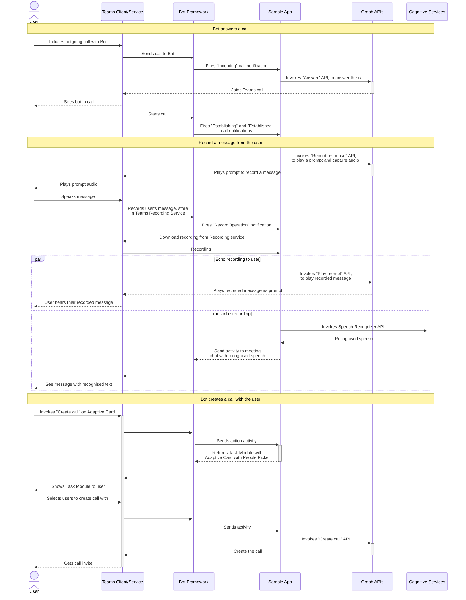

# Teams Calling Bot Design Doc

Teams supports the usage of media bots inside a meeting. These media bots user the cloud communications API in Microsoft Graph and are not something that the Teams Platform provides direct support for.

This app is to showcase how these APIs work together with the Teams client and Platform.

There are a number of scenarios supported by this app:

1. Simple, creating calls either by calling the bot or the bot calling you
1. Adding a bot to a scheduled meeting
1. Using the bot to create an online meeting, and inviting people to it.

This sample media app uses two types of bot endpoints:

- Messaging
  - This is the default Bot Framework/Azure Bot endpoint
  - We use it for interacting with the bot including to complete actions like “Create call”, “Play prompt” or “Transfer call”.
- Calling
  - This is specific to certain channels in Bot Framework, and for this app needs to be enabled under the Microsoft Teams Channel.
  - We use it for actions like answering of calls, notifications on call state changes (e.g. new participant joins), handling Interactive Voice Response (IVR) on the call, and hanging up.



# Calling Bot

The calling bot is essentially a notification event handler. The bot will receive notifications for different call events and the bot can decide to act on those events or not.

The is a wide range of notifications that can possibly be fired. Including, call state changes (incoming, established), information about a recording, details about a prompt that has been played, and updates to participants. Other notifications could be fired but it depends on what can happen in your call.

## Getting the call ID from a notification

The call's ID might appear in multiple places in a communication notification. First we check the ClientContext of the CommsOperation, however if that is not provided we check the resourceUrl.

Resource URLs are in the format below, with the call id in the 3rd position when split on `/` (position 0 will be empty) `#microsoft.graph.call: /communications/calls/<<call-id-as-guid>>` or
`#microsoft.graph.recordOperation: /communications/calls/<<call-id-as-guid>>/operations/<<operation-id-as-guid>>`.

## Answering a call

When a bot is called an incoming notification similar to the below is fired. [Complete notification example](https://learn.microsoft.com/en-us/graph/api/call-answer?view=graph-rest-1.0&tabs=http#notification---incoming). When the state is Incoming, we extract the callId from the notification and then use that to call the [answer call API](https://learn.microsoft.com/en-us/graph/api/call-answer?view=graph-rest-1.0&tabs=http).

```json
{
  "@odata.type": "#microsoft.graph.commsNotifications",
  "value": [
    {
      "@odata.type": "#microsoft.graph.commsNotification",
      "changeType": "created",
      "resourceUrl": "/communications/calls/57DAB8B1894C409AB240BD8BEAE78896",
      "resourceData": {
        "@odata.type": "#microsoft.graph.call",
        "@odata.id": "/communications/calls/57DAB8B1894C409AB240BD8BEAE78896",
        "@odata.etag": "W/\"5445\"",
        "state": "incoming",
        "direction": "incoming",
        ...
        "requestedModalities": [ "audio" ]
      }
    }
  ]
}
```

## When a call is established

[A notification (complete example)](https://learn.microsoft.com/en-us/graph/api/call-answer?view=graph-rest-1.0&tabs=http#notification---established-1) like the below is fired when a call is established correctly. Sometimes this event can be fired multiple times depending on the scenario.

In our sample we listen for established events, and then

```json
{
  "@odata.type": "#microsoft.graph.commsNotifications",
  "value": [
    {
      "@odata.type": "#microsoft.graph.commsNotification",
      "changeType": "updated",
      "resourceUrl": "/communications/calls/57DAB8B1894C409AB240BD8BEAE78896",
      "resourceData": {
        "@odata.type": "#microsoft.graph.call",
        "@odata.id": "/communications/calls/57DAB8B1894C409AB240BD8BEAE78896",
        "@odata.etag": "W/\"5445\"",
        "state": "established"
      }
    }
  ]
}
```

## Requesting a recording

// Include issues with how we are storing the files

## Handling a play prompt operation

// Include deleting of files after playing prompt

## Handling changes in participants

## Default Message Activity


Response returned when the bot is called in a scenario that is not a scheduled meeting.


Response returned when the bot is called in a scheduled meeting. We determine if the context is a scheduled meeting based using `turnContext.Activity.ChannelData["meeting"] != null`.

### Message Actions

- Create Call
  - Opens a task module with an adaptive card, which has a people picker to determine who to add to a call
  - Uses [Create Call API](https://learn.microsoft.com/en-us/graph/api/application-post-calls?view=graph-rest-1.0&tabs=http)
  - When a user joins the call a prompt is played encouraging the user to record a message.
  - The recorded message is then played back to the user
- Join scheduled meeting
  - _Only available when the app is in a scheduled meeting_
  - Identical to the _Create Call_ steps, except instead of using people picker to select who to add, the bot queries the chat's members.
  - Also, after the recording is echoed to the callers, we call the Cognitive Speech service to transcribe the recording. We then send the text to the meeting chat
    - This is not possible when you create a call with the bot directly as by default the 1:1 chat with the bot is used.
- Create Incident
  - Opens a task module with an adaptive card, which has a people picker to determine who to add to a call
  - [Creates an online meeting (API)](https://learn.microsoft.com/en-us/graph/api/application-post-onlinemeetings?view=graph-rest-1.0&tabs=http)
  - [Create the call](https://learn.microsoft.com/en-us/graph/api/application-post-calls?view=graph-rest-1.0&tabs=http) for the online meeting
  - [Installs this app (API)](https://learn.microsoft.com/en-us/graph/api/chat-post-installedapps?view=graph-rest-1.0&tabs=http) to the meeting chat
  - Saves information about the incident to a cache
  - Sends and Adaptive Card with the incident details to the meeting chat
  - When a user joins the call, check if it's an incident by seeing if the cache contains information, and if so play an incident specific prompt.
- `@Calling Bot showmeetingactions`
  - This command sends a card with actions the user can take inside a call
  - 
- Transfer Call
  - Opens a people picker task module (like Create call), where you can select the user to transfer the call to.
  - Uses [transfer call API](https://learn.microsoft.com/en-us/graph/api/call-transfer?view=graph-rest-1.0&tabs=http) to transfer the call to that selected user
- Invite participant to meeting
  - Opens a people picker task module (like Create call), where you can select the user to invite to the call to.
  - Uses [invite participant API](https://learn.microsoft.com/en-us/graph/api/participant-invite?view=graph-rest-1.0&tabs=http) to invite the selected user to the call
- Hang up
  - Uses the [delete/hang up call API](https://learn.microsoft.com/en-us/graph/api/call-delete?view=graph-rest-1.0&tabs=http), to hang the bot up from the call.
- Play record prompt
  - Uses the [recordResponse API](https://learn.microsoft.com/en-us/graph/api/call-record?view=graph-rest-1.0&tabs=http), to replay a prompt asking the user to record a message.
  - The recorded message is then replayed in the call. More details on this can be found below.

# Answering a Call

## Graph APIs

Interacting with the Microsoft Graph Cloud Communications is available as REST APIs from the MS Graph SDK ([Working with the cloud communications API in Microsoft Graph](https://learn.microsoft.com/en-us/graph/api/resources/communications-api-overview?view=graph-rest-1.0)), and a [Graph Core and Communications SDK](https://microsoftgraph.github.io/microsoft-graph-comms-samples/docs/articles/index.html) that calls those APIs and handles state.

In our sample we are only using the Graph SDK for interacting with the Cloud Communications services.

There is more documentation for [Cloud Communications under the Microsoft Graph documentation](https://learn.microsoft.com/en-us/graph/cloud-communications-callrecords)

### Call Service

### Using Cognitive Speech APIs for TTS and STT

For transcribing audio, and for converting text to speech we use the [Microsoft Azure Cognitive Services Speech SDK](https://learn.microsoft.com/en-us/azure/cognitive-services/speech-service/speech-sdk). We are using the free tier of this API.

## SDKs

## Integrating with Teams Platform

## Installing a Teams app in a call created by calling bot
