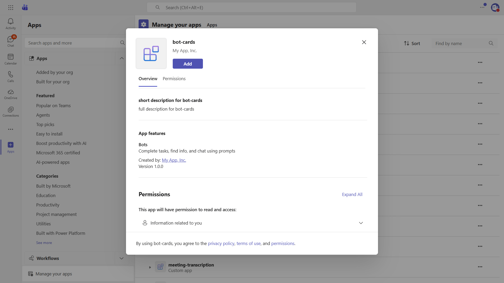

# Bot Cards

This sample demonstrates how to handle various card types and interactive card behaviors in Microsoft Teams.

## Table of Contents

- [Interaction with Bot](#interaction-with-bot)
- [Sample Implementations](#sample-implementations)
- [How to run these samples](#how-to-run-these-samples)
  - [Run in the Teams Client](#run-in-the-teams-client)
- [Configure the new project to use the new Teams Bot Application](#configure-the-new-project-to-use-the-new-teams-bot-application)
- [Pro Tip: Read the configuration settings using the Azure CLI](#pro-tip-read-the-configuration-settings-using-the-azure-cli)
- [Troubleshooting](#troubleshooting)
- [Further Reading](#further-reading)

## Interaction with Bot



The bot responds to the following commands:

* **card actions** - Interactive cards with submit actions and button interactions
* **toggle visibility** - Shows/hides content dynamically within cards

## Sample Implementations

| Language | Framework | Directory |
|----------|-----------|-----------|
| C# | .NET 10 / ASP.NET Core | [dotnet/bot-cards](dotnet/bot-cards/README.md) |
| TypeScript | Node.js | [nodejs/bot-cards](nodejs/bot-cards/README.md) |
| Python | Python | [python/bot-cards](python/bot-cards/README.md) |

# How to run these samples

You can run these samples locally using:

1. In the Teams Client after you have provisioned the Teams Application and configured the application with your local DevTunnels URL.

## Run in the Teams Client

To run these samples in the Teams Client, you need to provision your app in a M365 Tenant, and configure the app to your DevTunnels URL.

1. Install the tool DevTunnels https://learn.microsoft.com/en-us/azure/developer/dev-tunnels/get-started
2. Get Access to a M365 Developer Tenant https://learn.microsoft.com/en-us/office/developer-program/microsoft-365-developer-program-get-started
3. Create a Teams App with the Bot Feature in the Teams Developer Portal (in your tenant) https://dev.teams.microsoft.com

### Configure DevTunnels

Create a persistent tunnel for the port 3978 with anonymous access

```
devtunnel create -a my-tunnel  
devtunnel port create -p 3978  my-tunnel 
devtunnel host  my-tunnel
```

Take note of the URL shown after *Connect via browser:*

### Provisioning the Teams Application

Navigate to the Teams Developer Portal http://dev.teams.microsoft.com

#### Create a new Bot resource

1. Navigate to `Tools->Bot management`, and add a `New bot`
1. In Configure, paste the Endpoint address from devtunnels and append `/api/messages`
1. In Client secrets, create a new secret and save it for later

> Note. If you have access to an Azure Subscription in the same Tenant, you can also create the Azure Bot resource ([learn more](https://learn.microsoft.com/en-us/azure/bot-service/abs-quickstart?view=azure-bot-service-4.0&tabs=singletenant)).

#### Create a new Teams App

1. Navigate to `Apps` and create a `New App`
1. Fill the required values in Basic information (short and long name, short and long description and App URLs)
1. In `App features->Bot` select the bot you created previously
1. Select `Preview in Teams`

> Note. When using an Azure Bot resource, provide the ClientID instead of selecting an existing bot.

## Configure the new project to use the new Teams Bot Application

For NodeJS and Python you will need a `.env` file with the next fields

```
TENANT_ID=
CLIENT_ID=
CLIENT_SECRET=
```

For dotnet you need to add these values to `appsettings.json` or `launchSettings.json` using the next syntax.

appsettings.json


```json
"urls" : "http://localhost:3978",
"Teams": {
    "ClientId": "",
    "ClientSecret": "",
    "TenantId": ""
  },
```

Or to use Env Vars from the profile defined in `launchSettings.json` (using the Environment Configuration Provider)

```json
 "teamsbot": {
      "commandName": "Project",
      "dotnetRunMessages": true,
      "launchBrowser": false,
      "applicationUrl": "http://localhost:3978",
      "environmentVariables": {
        "ASPNETCORE_ENVIRONMENT": "Development",
        "Teams__TenantId": "YOUR_TenantId",
        "Teams__ClientId": "YOUR_ClientId",
        "Teams__ClientSecret": "YOUR_ClientSecret"
      }
    }
```

## Pro Tip: Read the configuration settings using the Azure CLI

To obtain the TenantId, ClientId and ClientSecret you can use the Azure CLI with:

> Note. If you don't have access to an Azure Subscription you can still use the Azure CLI, make sure you login with `az login --allow-no-subscription`

```
az ad app credential reset --id $appId
```

## Troubleshooting

- If Teams cannot communicate with your bot, verify your DevTunnels URL is reachable.
- Ensure your .env or appsettings file is setup correctly.
- Use the Channels UI in Azure Bot Service in the Azure Portal to see detailed endpoint errors (not available in Teams Developer Portal).


## Further Reading

- [Microsoft Teams SDK Documentation](https://learn.microsoft.com/microsoftteams/platform/)
