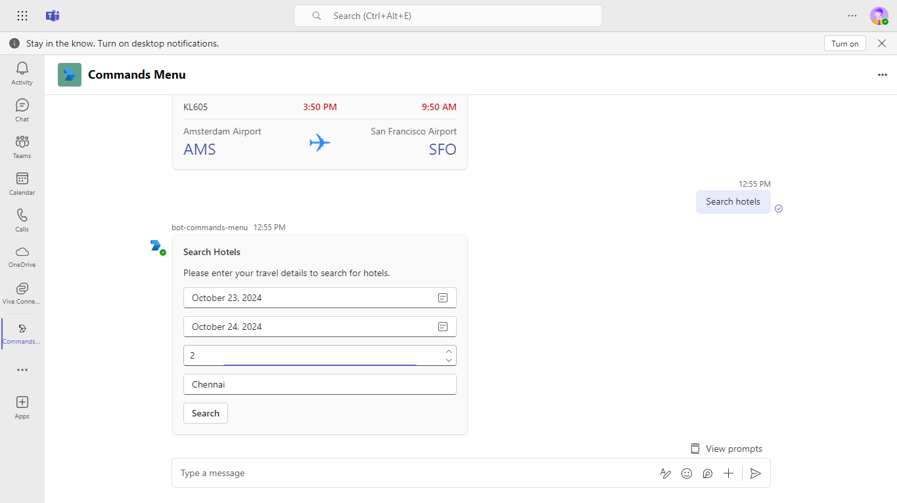

# Create a commands menu
This sample add a command menu with a dropdown list of commands for your bot.Users can select a command from the list, which will insert the command string into the message box. Then, they can select Send to execute the command.

## Included Features
* Bots

## Interaction with app


## Prerequisites

Verify you have the right account for building Teams apps and install some recommended development tools.

- You need a Teams account that allows [custom app sideloading](https://docs.microsoft.com/microsoftteams/platform/build-your-first-app/build-first-app-overview#set-up-your-development-account).
- [.NET Core SDK](https://dotnet.microsoft.com/download) version 6.0
- [dev tunnel](https://learn.microsoft.com/en-us/azure/developer/dev-tunnels/get-started?tabs=windows) or [ngrok](https://ngrok.com/) latest version or equivalent tunnelling solution

## Setup
1. Register a new application in the [Microsoft Entra ID – App Registrations](https://go.microsoft.com/fwlink/?linkid=2083908) portal.
    > NOTE: When you create your app registration, you will create an App ID and App password (Secret) - make sure you keep these for later.

2. Setup for Bot
	
	- Also, register a bot with Azure Bot Service, following the instructions [here](https://docs.microsoft.com/azure/bot-service/bot-service-quickstart-registration?view=azure-bot-service-3.0)
	- Ensure that you've [enabled the Teams Channel](https://docs.microsoft.com/azure/bot-service/channel-connect-teams?view=azure-bot-service-4.0)
	- While registering the bot, use `https://<your_tunnel_domain>/api/messages` as the messaging endpoint.

3. Setup NGROK
 - Run ngrok - point to port 3978

    ```bash
    ngrok http 3978 --host-header="localhost:3978"
    ```

   Alternatively, you can also use the `dev tunnels`. Please follow [Create and host a dev tunnel](https://learn.microsoft.com/en-us/azure/developer/dev-tunnels/get-started?tabs=windows) and host the tunnel with anonymous user access command as shown below:

   ```bash
   devtunnel host -p 3978 --allow-anonymous
   ```

4. Setup for code

  - Clone the repository

    ```bash
    git clone https://github.com/OfficeDev/Microsoft-Teams-Samples.git
    ```
  - Modify the `/appsettings.json` and fill in the following details:
  - `{{MicrosoftAppId}}` - Generated from Step 1 while doing Microsoft Entra ID app registration in Azure portal.
  - `{{MicrosoftAppPassword}}` - Generated from Step 1, also referred to as Client secret

- Run the bot from a terminal or from Visual Studio:

5. If you are using Visual Studio
  - Launch Visual Studio
  - File -> Open -> Project/Solution
  - Navigate to `bot-commands-menu\csharp` folder
  - Select `CommandsMenu.csproj` file

6. This step is related to Microsoft Teams app manifest
    - **Edit** the `manifest.json` contained in the `appPackage`  folder to replace your Microsoft App Id (that was created when you registered your bot earlier) *everywhere* you see the place holder string `{{MicrosoftAppId}}` and <<Azure Bot ID>> and for the contentUrl "<<Tunnel Url>>?culture={locale}" (depending on the scenario the Microsoft App Id may occur multiple times in the `manifest.json`)
   - **Provide turnnelling Url** in `manifest.json` for contentUrl in case of tabs and for messaging endpoint in case of bots if enabled
   - replace `{{domain-name}}` with base Url of your domain. E.g. if you are using ngrok it would be `https://1234.ngrok-free.app` then your domain-name will be `1234.ngrok-free.app` and if you are using dev tunnels then your domain will be like: `12345.devtunnels.ms`.
    - **Zip** up the contents of the `Manifest` or `Manifest_hub` folder to create a `manifest.zip`
    - **Upload** the `manifest.zip` to Teams (in the Apps view click "Upload a custom app")

# Running the sample





## Further reading

- [Create a commands menu](https://review.learn.microsoft.com/en-us/microsoftteams/platform/bots/how-to/create-a-bot-commands-menu?branch=pr-en-us-10866&tabs=desktop%2Cdotnetlocalization)
- [Create prompt suggestions](https://review.learn.microsoft.com/en-us/microsoftteams/platform/bots/how-to/conversations/prompt-suggestions?branch=pr-en-us-10866&tabs=manually-in-the-app-manifest%2Cjavascript)

