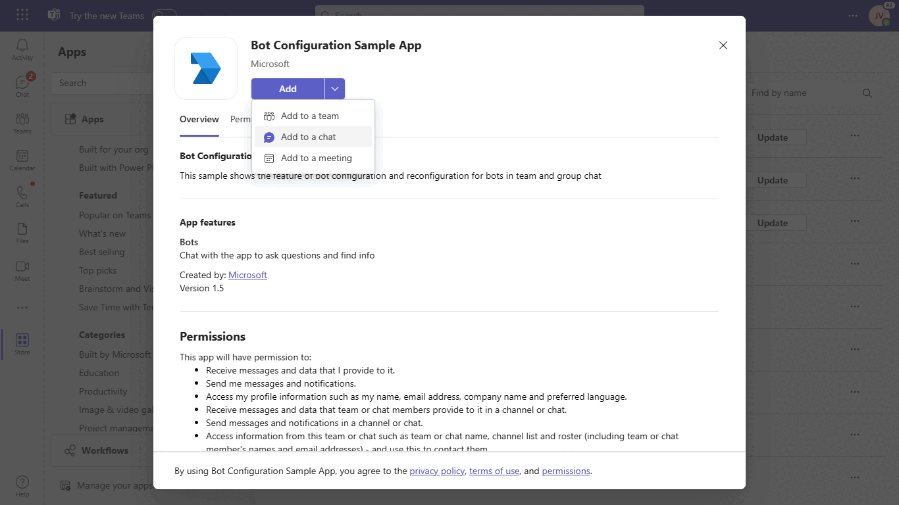
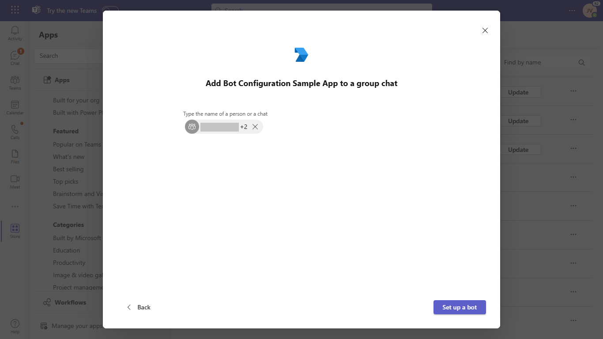
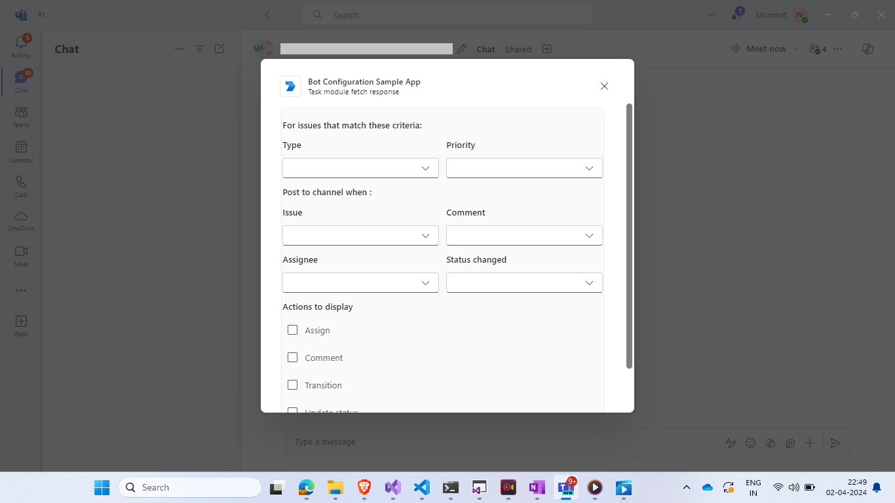
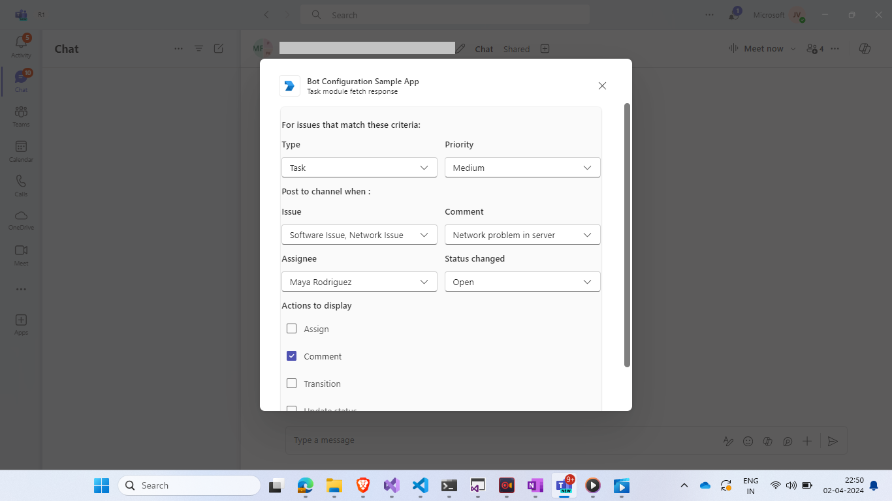

# Teams App Localization
This sample demonstrates a bot for configuring and reconfiguring adaptive cards in team and group chats. It supports static and dynamic type-ahead search, allowing for enhanced interactivity and control customization.

## Included Features
* Bots
* Adaptive Cards
* bot reconfiguration
* Type ahead search

## Interaction with app



## Try it yourself - experience the App in your Microsoft Teams client
Please find below demo manifest which is deployed on Microsoft Azure and you can try it yourself by uploading the app package (.zip file link below) to your teams and/or as a personal app. (Uploading must be enabled for your tenant, [see steps here](https://docs.microsoft.com/microsoftteams/platform/concepts/build-and-test/prepare-your-o365-tenant#enable-custom-teams-apps-and-turn-on-custom-app-uploading)).

**Bot Configuration:** [Manifest](/samples/bot-configuration-app/csharp/demo-manifest/bot-configuration-app.zip)

## Prerequisites

Verify you have the right account for building Teams apps and install some recommended development tools.

- You need a Teams account that allows [custom app uploading](https://docs.microsoft.com/microsoftteams/platform/build-your-first-app/build-first-app-overview#set-up-your-development-account).
- [.NET Core SDK](https://dotnet.microsoft.com/download) version 6.0
- [dev tunnel](https://learn.microsoft.com/en-us/azure/developer/dev-tunnels/get-started?tabs=windows) or [ngrok](https://ngrok.com/) latest version or equivalent tunnelling solution
- [Microsoft 365 Agents Toolkit for Visual Studio](https://learn.microsoft.com/en-us/microsoftteams/platform/toolkit/toolkit-v4/install-teams-toolkit-vs?pivots=visual-studio-v17-7)

## Run the app (Using Microsoft 365 Agents Toolkit for Visual Studio)

The simplest way to run this sample in Teams is to use Microsoft 365 Agents Toolkit for Visual Studio.
1. Install Visual Studio 2022 **Version 17.14 or higher** [Visual Studio](https://visualstudio.microsoft.com/downloads/)
1. Install Microsoft 365 Agents Toolkit for Visual Studio [Microsoft 365 Agents Toolkit extension](https://learn.microsoft.com/en-us/microsoftteams/platform/toolkit/toolkit-v4/install-teams-toolkit-vs?pivots=visual-studio-v17-7)
1. In the debug dropdown menu of Visual Studio, select Dev Tunnels > Create A Tunnel (set authentication type to Public) or select an existing public dev tunnel.
1. Right-click the 'M365Agent' project in Solution Explorer and select **Microsoft 365 Agents Toolkit > Select Microsoft 365 Account**
1. Sign in to Microsoft 365 Agents Toolkit with a **Microsoft 365 work or school account**
1. Set `Startup Item` as `Microsoft Teams (browser)`.
1. Press F5, or select Debug > Start Debugging menu in Visual Studio to start your app
</br>
1. In the opened web browser, select Add button to install the app in Teams
> If you do not have permission to upload custom apps (uploading), Microsoft 365 Agents Toolkit will recommend creating and using a Microsoft 365 Developer Program account - a free program to get your own dev environment sandbox that includes Teams.

## Setup
1. Register a new application in the [Azure Active Directory – App Registrations](https://go.microsoft.com/fwlink/?linkid=2083908) portal.
    A) Select **New Registration** and on the *register an application page*, set following values:
      * Set **name** to your app name.
      * Choose the **supported account types** (any account type will work)
      * Leave **Redirect URI** empty.
      * Choose **Register**.
  B) On the overview page, copy and save the **Application (client) ID, Directory (tenant) ID**. You'll need those later when updating your Teams application manifest and in the appsettings.json.
  C) Navigate to **API Permissions**, and make sure to add the following permissions:
   Select Add a permission
      * Select Add a permission
      * Select Microsoft Graph -\> Delegated permissions.
      * `User.Read` (enabled by default)
      * Click on Add permissions. Please make sure to grant the admin consent for the required permissions.
      
    > NOTE: When you create your app registration, you will create an App ID and App password (Secret) - make sure you keep these for later.

2. Setup for Bot
	
	- Also, register a bot with Azure Bot Service, following the instructions [here](https://docs.microsoft.com/azure/bot-service/bot-service-quickstart-registration?view=azure-bot-service-3.0)
	- Ensure that you've [enabled the Teams Channel](https://docs.microsoft.com/azure/bot-service/channel-connect-teams?view=azure-bot-service-4.0)
	- While registering the bot, use `https://<your_tunnel_domain>/api/messages` as the messaging endpoint.

3. Setup NGROK
 - Run ngrok - point to port 3978

    ```bash
    ngrok http 3978 --host-header="localhost:3978"
    ```

   Alternatively, you can also use the `dev tunnels`. Please follow [Create and host a dev tunnel](https://learn.microsoft.com/en-us/azure/developer/dev-tunnels/get-started?tabs=windows) and host the tunnel with anonymous user access command as shown below:

   ```bash
   devtunnel host -p 3978 --allow-anonymous
   ```

4. Setup for code

  - Clone the repository

    ```bash
    git clone https://github.com/OfficeDev/Microsoft-Teams-Samples.git
    ```
  - Modify the `/appsettings.json` and fill in the following details:
  - `{{MicrosoftAppId}}` - Generated from Step 1 while doing AAd app registration in Azure portal.
  - `{{ClientSecret}}` - Generated from Step 1, also referred to as Client secret

- Run the bot from a terminal or from Visual Studio:

5. If you are using Visual Studio
  - Launch Visual Studio
  - File -> Open -> Project/Solution
  - Navigate to `Bot configuration\csharp` folder
  - Select `Bot Configuration.csproj` file

6. This step is related to Microsoft Teams app manifest
    - **Edit** the `manifest.json` contained in the `appPackage` or `AppManifest_Hub` folder to replace your Microsoft App Id (that was created when you registered your bot earlier) *everywhere* you see the place holder string `{{Microsoft-App-Id}}` 
   - replace `{{domain-name}}` with base Url of your domain. E.g. if you are using ngrok it would be `https://1234.ngrok-free.app` then your domain-name will be `1234.ngrok-free.app` and if you are using dev tunnels then your domain will be like: `12345.devtunnels.ms`.
    - **Zip** up the contents of the `Manifest` or `Manifest_hub` folder to create a `manifest.zip`
    - **Upload** the `manifest.zip` to Teams (in the Apps view click "Upload a custom app")
    - Add the app to team/groupChat scope (Supported scopes)

**Note:** If you want to test your app across multi hub like: Outlook/Office.com, please update the `manifest.json` in the `/AppManifest_Hub` folder with the required values.

## Running the sample

You can interact with this bot in Teams by sending it a message, or selecting a command from the command list. The bot will respond to the following strings.

 **Configurable Card**
    A configurable card is used to modify data even after the bot has been installed. When the bot is added to a Teams or group chat scope, it utilizes 'config/fetch' and 'config/submit' invoke requests.

  - **Result:** The bot will send the configurable adaptive card 
  - **Valid Scopes:** group chat, team chat

  - **Bot Interactions:**

    **Adding bot UI:**
  

   **Added bot UI:**
  

   - **Show configurable card interaction:**

  

  

  
    
  


## Deploy to Azure

Deploy your project to Azure by following these steps:

| From Visual Studio Code                                                                                                                                                                                                                                                                                                                                                  | From TeamsFx CLI                                                                                                                                                                                                                    |
| :----------------------------------------------------------------------------------------------------------------------------------------------------------------------------------------------------------------------------------------------------------------------------------------------------------------------------------------------------------------------- | :---------------------------------------------------------------------------------------------------------------------------------------------------------------------------------------------------------------------------------- |
| <ul><li>Open Microsoft 365 Agents Toolkit, and sign into Azure by clicking the `Sign in to Azure` under the `ACCOUNTS` section from sidebar.</li> <li>After you signed in, select a subscription under your account.</li><li>Open the Microsoft 365 Agents Toolkit and click `Provision` from DEPLOYMENT section or open the command palette and select: `Teams: Provision`.</li><li>Open the Microsoft 365 Agents Toolkit and click `Deploy` or open the command palette and select: `Teams: Deploy`.</li></ul> | <ul> <li>Run command `teamsfx account login azure`.</li> <li>Run command `teamsfx provision --env dev`.</li> <li>Run command: `teamsfx deploy --env dev`. </li></ul> |

> Note: Provisioning and deployment may incur charges to your Azure Subscription.  

## Further reading

- [Bot configuration](https://learn.microsoft.com/microsoftteams/platform/bots/how-to/bot-configuration-experience)
- [Bot Framework Documentation](https://docs.botframework.com)
- [Bot Basics](https://docs.microsoft.com/azure/bot-service/bot-builder-basics?view=azure-bot-service-4.0)
- [Send Notification to User in Chat](https://docs.microsoft.com/graph/api/chat-sendactivitynotification?view=graph-rest-beta)
- [Send Notification to User in Team](https://docs.microsoft.com/graph/api/team-sendactivitynotification?view=graph-rest-beta&tabs=http)
- [Send Notification to User](https://docs.microsoft.com/graph/api/userteamwork-sendactivitynotification?view=graph-rest-beta&tabs=http)


