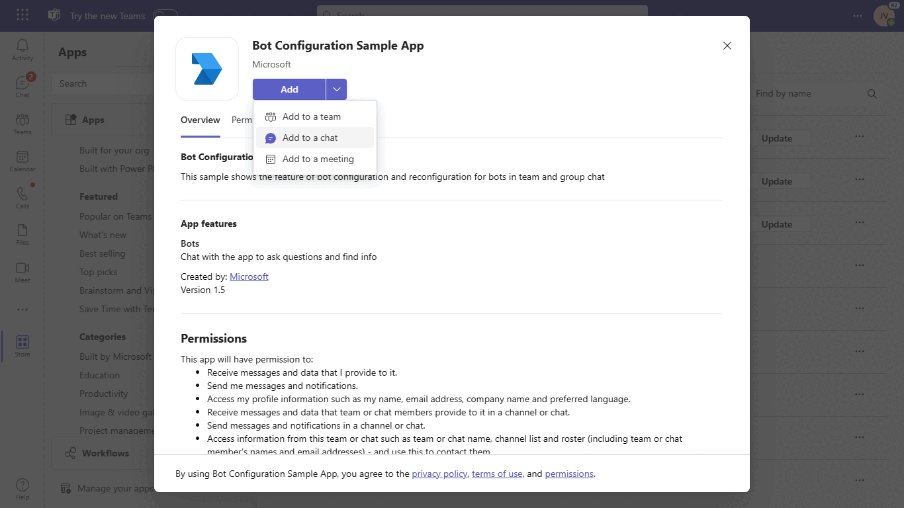
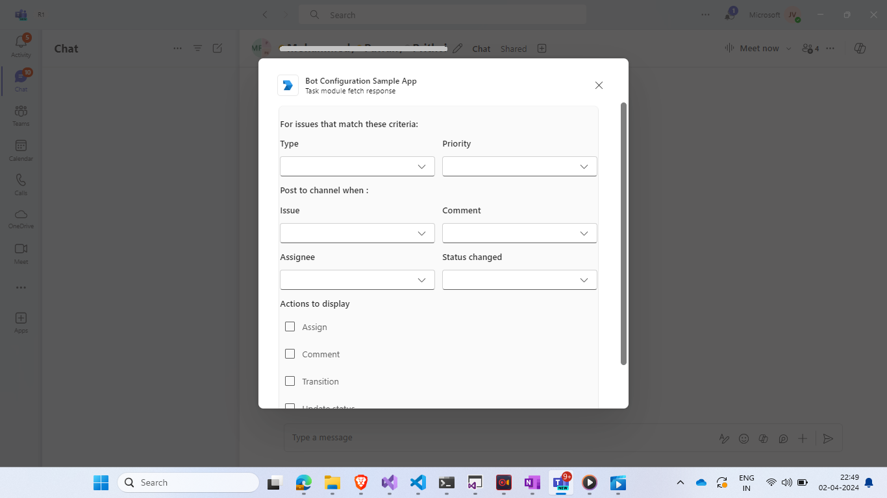
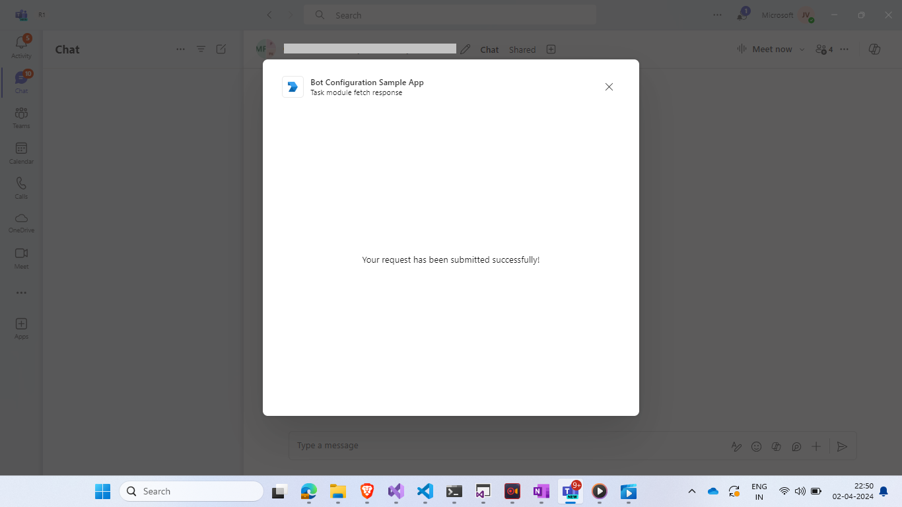

# Bot Configuration 

This sample demonstrates a bot for configuring and reconfiguring adaptive cards in team and group chats. It supports static and dynamic type-ahead search, allowing for enhanced interactivity and control customization.

## Included Features
* Bots
* Adaptive Cards
* bot reconfiguration
* Type ahead search 

## Interaction with bot



## Try it yourself - experience the App in your Microsoft Teams client
Please find below demo manifest which is deployed on Microsoft Azure and you can try it yourself by uploading the app package (.zip file link below) to your teams and/or as a personal app. (Uploading must be enabled for your tenant, [see steps here](https://docs.microsoft.com/microsoftteams/platform/concepts/build-and-test/prepare-your-o365-tenant#enable-custom-teams-apps-and-turn-on-custom-app-uploading)).

**Bot Configuration:** [Manifest](/samples/bot-configuration-app/csharp/demo-manifest/bot-configuration-app.zip)

## Prerequisites

- Microsoft Teams is installed and you have an account
- [NodeJS](https://nodejs.org/en/)
- [devtunnel](https://aka.ms/TunnelsCliDownload/win-x64) or [ngrok](https://ngrok.com/) latest version or equivalent tunnelling solution
- [Microsoft 365 Agents Toolkit for VS Code](https://marketplace.visualstudio.com/items?itemName=TeamsDevApp.ms-teams-vscode-extension) or [TeamsFx CLI](https://learn.microsoft.com/microsoftteams/platform/toolkit/teamsfx-cli?pivots=version-one)

## Run the app (Using Microsoft 365 Agents Toolkit for Visual Studio Code)

The simplest way to run this sample in Teams is to use Microsoft 365 Agents Toolkit for Visual Studio Code.

1. Ensure you have downloaded and installed [Visual Studio Code](https://code.visualstudio.com/docs/setup/setup-overview)
1. Install the [Microsoft 365 Agents Toolkit extension](https://marketplace.visualstudio.com/items?itemName=TeamsDevApp.ms-teams-vscode-extension)
1. Select **File > Open Folder** in VS Code and choose this samples directory from the repo
1. Using the extension, sign in with your Microsoft 365 account where you have permissions to upload custom apps
1. Select **Debug > Start Debugging** or **F5** to run the app in a Teams web client.
1. In the browser that launches, select the **Add** button to install the app to Teams.

> If you do not have permission to upload custom apps (uploading), Microsoft 365 Agents Toolkit will recommend creating and using a Microsoft 365 Developer Program account - a free program to get your own dev environment sandbox that includes Teams.

## Setup

   Run ngrok - point to port 3978

   ```bash
   ngrok http 3978 --host-header="localhost:3978"
   ```  

   Alternatively, you can also use the `dev tunnels`. Please follow [Create and host a dev tunnel](https://learn.microsoft.com/azure/developer/dev-tunnels/get-started?tabs=windows) and host the tunnels with anonymous user access command as shown below:

   ```bash
   devtunnel host -p 3978 --allow-anonymous
   ```

## Setup for bot
In Azure portal, create a [Azure Bot resource](https://docs.microsoft.com/azure/bot-service/bot-service-quickstart-registration).
    - For bot handle, make up a name.
    - Select "Use existing app registration" (Create the app registration in Microsoft Entra ID beforehand.)
    - __*If you don't have an Azure account*__ create an [Azure free account here](https://azure.microsoft.com/free/)
    
   In the new Azure Bot resource in the Portal, 
    - Ensure that you've [enabled the Teams Channel](https://learn.microsoft.com/azure/bot-service/channel-connect-teams?view=azure-bot-service-4.0)
    - In Settings/Configuration/Messaging endpoint, enter the current `https` URL you were given by running the tunnelling application. Append with the path `/api/messages`

### Register your app with Azure AD.

  1. Register a new application in the [Microsoft Entra ID – App Registrations](https://go.microsoft.com/fwlink/?linkid=2083908) portal.
  2. Select **New Registration** and on the *register an application page*, set following values:
      * Set **name** to your app name.
      * Choose the **supported account types** (any account type will work)
      * Leave **Redirect URI** empty.
      * Choose **Register**.
  3. On the overview page, copy and save the **Application (client) ID, Directory (tenant) ID**. You'll need those later when updating your Teams application manifest and in the appsettings.json.
  4. Navigate to **API Permissions**, and make sure to add the follow permissions:
   Select Add a permission
      * Select Add a permission
      * Select Microsoft Graph -\> Delegated permissions.
      * `User.Read` (enabled by default)
      * Click on Add permissions. Please make sure to grant the admin consent for the required permissions.


## Setup for code
1) Clone the repository

    ```bash
    git clone https://github.com/OfficeDev/Microsoft-Teams-Samples.git
    ```

1) In a terminal, navigate to `samples/bot-configuration-app/nodejs`

1) Install modules

    ```bash
    npm install
    ```

1) Update the `.env` configuration for the bot to use the Microsoft App Id and App Password from the Bot Framework registration. (Note the App Password is referred to as the "client secret" in the azure portal and you can always create a new client secret anytime.) 

1) Run your bot at the command line:

    ```bash
    npm start
    ```

1) __*This step is specific to Teams.*__
    - **Edit** the `manifest.json` contained in the  `appManifest` folder to replace your Microsoft App Id (that was created when you registered your bot earlier) *everywhere* you see the place holder string `<<YOUR-MICROSOFT-APP-ID>>` (depending on the scenario the Microsoft App Id may occur multiple times in the `manifest.json`)
    - **Edit** the `manifest.json` for `validDomains` and replace `<<domain-name>>` with base Url domain. E.g. if you are using ngrok it would be `https://1234.ngrok-free.app` then your domain-name will be `1234.ngrok-free.app` and if you are using dev tunnels then your domain will be `12345.devtunnels.ms`.
    - **Zip** up the contents of the `appManifest` folder to create a `manifest.zip` (Make sure that zip file does not contains any subfolder otherwise you will get error while uploading your .zip package)
    - **Upload** the `manifest.zip` to Teams (In Teams Apps/Manage your apps click "Upload an app". Browse to and Open the .zip file. At the next dialog, click the Add button.)
    - Add the app to team/groupChat scope (Supported scopes)

## Running the sample

You can interact with this bot in Teams by sending it a message, or selecting a command from the command list. The bot will respond to the following strings.

 **Configurable Card**
    A configurable card is used to modify data even after the bot has been installed. When the bot is added to a Teams or group chat scope, it utilizes 'config/fetch' and 'config/submit' invoke requests.

  - **Result:** The bot will send the configurable adaptive card 
  - **Valid Scopes:** group chat, team chat

  - **Bot Interactions:**

    **Adding bot UI:**
  

   **Added bot UI:**
  

   - **Show configurable card interaction:**

  

  

  
    
  


## Deploy to Azure

Deploy your project to Azure by following these steps:

| From Visual Studio Code                                                                                                                                                                                                                                                                                                                                                  | From TeamsFx CLI                                                                                                                                                                                                                    |
| :----------------------------------------------------------------------------------------------------------------------------------------------------------------------------------------------------------------------------------------------------------------------------------------------------------------------------------------------------------------------- | :---------------------------------------------------------------------------------------------------------------------------------------------------------------------------------------------------------------------------------- |
| <ul><li>Open Microsoft 365 Agents Toolkit, and sign into Azure by clicking the `Sign in to Azure` under the `ACCOUNTS` section from sidebar.</li> <li>After you signed in, select a subscription under your account.</li><li>Open the Microsoft 365 Agents Toolkit and click `Provision` from DEPLOYMENT section or open the command palette and select: `Teams: Provision`.</li><li>Open the Microsoft 365 Agents Toolkit and click `Deploy` or open the command palette and select: `Teams: Deploy`.</li></ul> | <ul> <li>Run command `teamsfx account login azure`.</li> <li>Run command `teamsfx provision --env dev`.</li> <li>Run command: `teamsfx deploy --env dev`. </li></ul> |

> Note: Provisioning and deployment may incur charges to your Azure Subscription.  

## Further reading

- [Bot configuration](https://learn.microsoft.com/microsoftteams/platform/bots/how-to/bot-configuration-experience)
- [Bot Framework Documentation](https://docs.botframework.com)
- [Bot Basics](https://docs.microsoft.com/azure/bot-service/bot-builder-basics?view=azure-bot-service-4.0)
- [Send Notification to User in Chat](https://docs.microsoft.com/graph/api/chat-sendactivitynotification?view=graph-rest-beta)
- [Send Notification to User in Team](https://docs.microsoft.com/graph/api/team-sendactivitynotification?view=graph-rest-beta&tabs=http)
- [Send Notification to User](https://docs.microsoft.com/graph/api/userteamwork-sendactivitynotification?view=graph-rest-beta&tabs=http)


