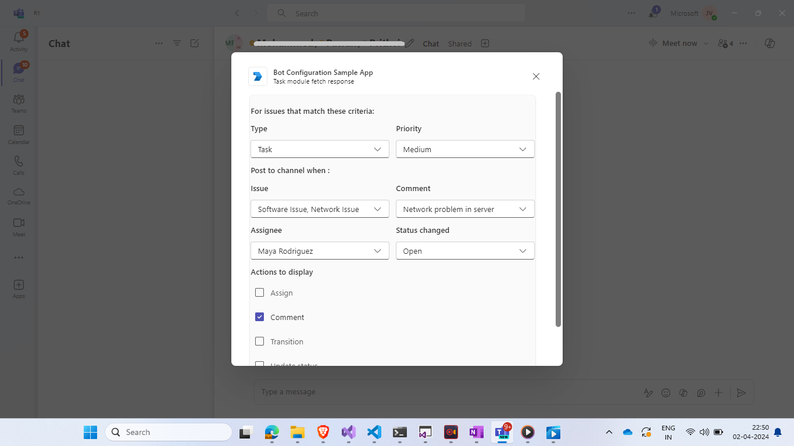
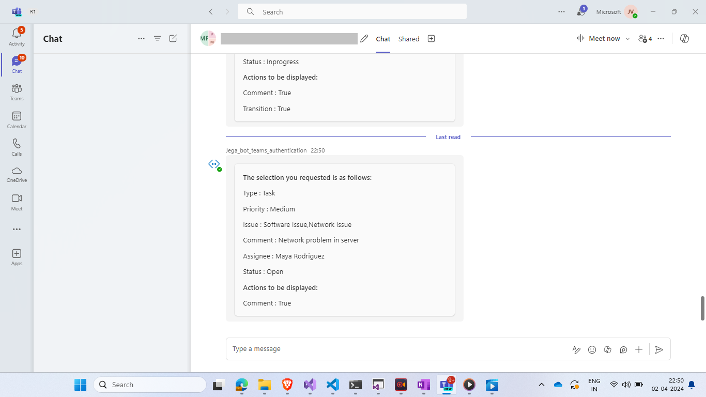
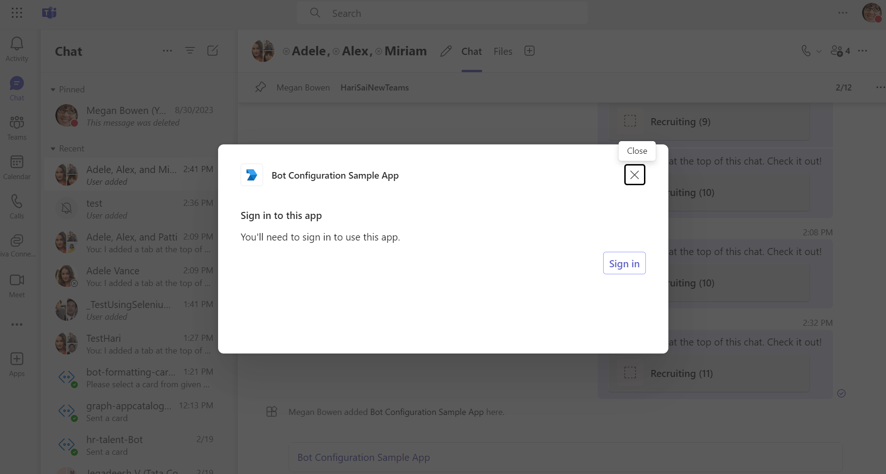

# Bot Configuration 

This sample shows the feature of configurable card with type ahead search (static and dynamic) control on Adaptive Cards.

 To get a configurable card with a static typeahead search control, add the bot to a Teams or group chat scope. Upon submission, the card will be updated to include a dynamic typeahead search control.

## Included Features
* Bots
* Adaptive Cards
* configurable adaptive cards

## Interaction with bot


`Configurable Card:`
A configurable card is used to modify data even after the bot has been installed. When the bot is added to a Teams or group chat scope, it utilizes 'config/fetch' and 'config/submit' invoke requests.

`Static search:`
 Static typeahead search allows users to search from values specified within `input.choiceset` in the Adaptive Card payload.


`Dynamic search:`
 Dynamic typeahead search is useful to search and select data from large data sets. The data sets are loaded dynamically from the dataset specified in the card payload.


`Dynamic search results:`


 On `Submit` button click, the bot will return the choice that we have selected.

## Prerequisites

- Microsoft Teams is installed and you have an account
- [NodeJS](https://nodejs.org/en/)
- [ngrok](https://ngrok.com/) or equivalent tunnelling solution

## Setup

1) Run ngrok - point to port 3978

    ```bash
    ngrok http 3978 --host-header="localhost:3978"
    ```

## Setup for bot
In Azure portal, create a [Azure Bot resource](https://docs.microsoft.com/azure/bot-service/bot-service-quickstart-registration).
    - For bot handle, make up a name.
    - Select "Use existing app registration" (Create the app registration in Azure Active Directory beforehand.)
    - __*If you don't have an Azure account*__ create an [Azure free account here](https://azure.microsoft.com/free/)
    
   In the new Azure Bot resource in the Portal, 
    - Ensure that you've [enabled the Teams Channel](https://learn.microsoft.com/azure/bot-service/channel-connect-teams?view=azure-bot-service-4.0)
    - In Settings/Configuration/Messaging endpoint, enter the current `https` URL you were given by running ngrok. Append with the path `/api/messages`

## Setup for code
1) Clone the repository

    ```bash
    git clone https://github.com/OfficeDev/Microsoft-Teams-Samples.git
    ```

1) In a terminal, navigate to `samples/bot-conversation/nodejs`

1) Install modules

    ```bash
    npm install
    ```

1) Update the `.env` configuration for the bot to use the Microsoft App Id and App Password from the Bot Framework registration. (Note the App Password is referred to as the "client secret" in the azure portal and you can always create a new client secret anytime.) `MicrosoftAppTenantId` will be the id for the tenant where application is registered.
 - Also, set MicrosoftAppType in the `.env`. (**Allowed values are: MultiTenant(default), SingleTenant, UserAssignedMSI**)

1) Run your bot at the command line:

    ```bash
    npm start
    ```

1) __*This step is specific to Teams.*__
    - **Edit** the `manifest.json` contained in the  `appPackage` folder to replace your Microsoft App Id (that was created when you registered your bot earlier) *everywhere* you see the place holder string `<<YOUR-MICROSOFT-APP-ID>>` (depending on the scenario the Microsoft App Id may occur multiple times in the `manifest.json`)
    - **Edit** the `manifest.json` for `validDomains` with base Url domain. E.g. if you are using ngrok it would be `https://1234.ngrok-free.app` then your domain-name will be `1234.ngrok-free.app`.
    - **Zip** up the contents of the `appPackage` folder to create a `manifest.zip` (Make sure that zip file does not contains any subfolder otherwise you will get error while uploading your .zip package)
    - **Upload** the `manifest.zip` to Teams (In Teams Apps/Manage your apps click "Upload an app". Browse to and Open the .zip file. At the next dialog, click the Add button.)
    - Add the app to personal/team/groupChat scope (Supported scopes)

## Running the sample

You can interact with this bot in Teams by sending it a message, or selecting a command from the command list. The bot will respond to the following strings.

1. **Configurable Card**
  - **Result:** The bot will send the configurable adaptive card 
  - **Valid Scopes:** personal, group chat, team chat

  - **Bot Interactions:**

    **Adding bot UI:**
  

   **Added bot UI:**
  

   **Show configurable card interaction:**
  

  

  
    
  

   - **Bot description card Interactions:**

   **Bot Descrption Card:**
  

   **Click the settings button in the card to invoke configurable card:**
  

  

  

  

## Further reading

- [Bot Framework Documentation](https://docs.botframework.com)
- [Bot Basics](https://docs.microsoft.com/azure/bot-service/bot-builder-basics?view=azure-bot-service-4.0)
- [Send Notification to User in Chat](https://docs.microsoft.com/en-us/graph/api/chat-sendactivitynotification?view=graph-rest-beta)
- [Send Notification to User in Team](https://docs.microsoft.com/en-us/graph/api/team-sendactivitynotification?view=graph-rest-beta&tabs=http)
- [Send Notification to User](https://docs.microsoft.com/en-us/graph/api/userteamwork-sendactivitynotification?view=graph-rest-beta&tabs=http)
