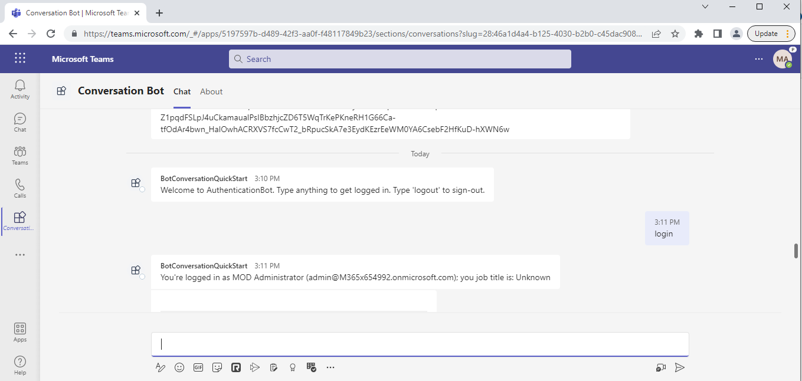
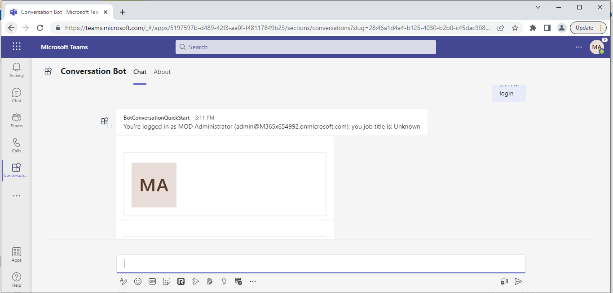
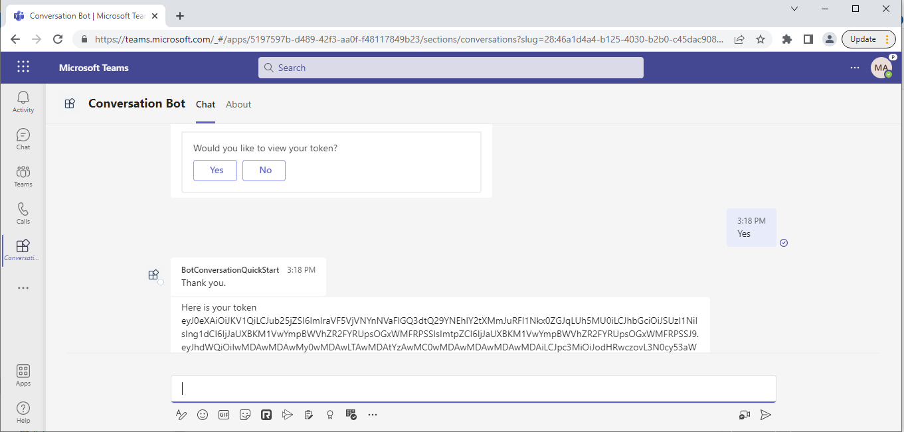

# Teams Conversation Bot SSO quick-start

Teams Bot with SSO using Bot Framework v4.

This bot has been created using [Bot Framework](https://dev.botframework.com), it shows how to get started with SSO in a bot for Microsoft Teams.

The focus of this sample is how to use the Bot Framework support for OAuth SSO in your bot. Teams behaves slightly differently than other channels in this regard. Specifically an Invoke Activity is sent to the bot rather than the Event Activity used by other channels. _This Invoke Activity must be forwarded to the dialog if the OAuthPrompt is being used._ This is done by subclassing the ActivityHandler and this sample includes a reusable TeamsActivityHandler. This class is a candidate for future inclusion in the Bot Framework SDK.

The sample uses the bot authentication capabilities in [Azure Bot Service](https://docs.botframework.com), providing features to make it easier to develop a bot that authenticates users to various identity providers such as Microsoft Entra ID, GitHub, Uber, etc. The OAuth token is then used to make basic Microsoft Graph queries.

> IMPORTANT: The manifest file in this app adds "token.botframework.com" to the list of `validDomains`. This must be included in any bot that uses the Bot Framework OAuth flow.

## Included Features
* Teams SSO (bots)
* Adaptive Card
* Graph API

## Interaction with app


## Prerequisites

-  Microsoft Teams is installed and you have an account (not a guest account)
-  [.Net](https://dotnet.microsoft.com/en-us/download/dotnet/6.0) version 6.0
-  [dev tunnel](https://learn.microsoft.com/en-us/azure/developer/dev-tunnels/get-started?tabs=windows) or [ngrok](https://ngrok.com/download) latest version or equivalent tunneling solution
-  [M365 developer account](https://docs.microsoft.com/en-us/microsoftteams/platform/concepts/build-and-test/prepare-your-o365-tenant) or access to a Teams account with the appropriate permissions to install an app.
-  [Teams Toolkit for Visual Studio](https://learn.microsoft.com/en-us/microsoftteams/platform/toolkit/toolkit-v4/install-teams-toolkit-vs?pivots=visual-studio-v17-7)

## Run the app (Using Teams Toolkit for Visual Studio)

The simplest way to run this sample in Teams is to use Teams Toolkit for Visual Studio.
1. Install Visual Studio 2022 **Version 17.9 or higher** [Visual Studio](https://visualstudio.microsoft.com/downloads/)
1. Install Teams Toolkit for Visual Studio [Teams Toolkit extension](https://learn.microsoft.com/en-us/microsoftteams/platform/toolkit/toolkit-v4/install-teams-toolkit-vs?pivots=visual-studio-v17-7)
1. In the debug dropdown menu of Visual Studio, select Dev Tunnels > Create A Tunnel (set authentication type to Public) or select an existing public dev tunnel.
1. In Visual Studio, right-click your project and **Select Teams Toolkit > Prepare Teams App Dependencies**
1. Using the extension, sign in with your Microsoft 365 account where you have permissions to upload custom apps.
1. Select **Debug > Start Debugging** or **F5** to run the menu in Visual Studio.
1. In the browser that launches, select the **Add** button to install the app to Teams.
> If you do not have permission to upload custom apps (sideloading), Teams Toolkit will recommend creating and using a Microsoft 365 Developer Program account - a free program to get your own dev environment sandbox that includes Teams.

## Run the app (Using Teams Toolkit for Visual Studio)

The simplest way to run this sample in Teams is to use Teams Toolkit for Visual Studio.
1. Install Visual Studio 2022 **Version 17.10 Preview 4 or higher** [Visual Studio](https://visualstudio.microsoft.com/downloads/)
1. Install Teams Toolkit for Visual Studio [Teams Toolkit extension](https://learn.microsoft.com/en-us/microsoftteams/platform/toolkit/toolkit-v4/install-teams-toolkit-vs?pivots=visual-studio-v17-7)
1. In the debug dropdown menu of Visual Studio, select Dev Tunnels > Create A Tunnel (set authentication type to Public) or select an existing public dev tunnel.
1. In the debug dropdown menu of Visual Studio, select default startup project > **Microsoft Teams (browser)**
1. In Visual Studio, right-click your **TeamsApp** project and **Select Teams Toolkit > Prepare Teams App Dependencies**
1. Using the extension, sign in with your Microsoft 365 account where you have permissions to upload custom apps.
1. Select **Debug > Start Debugging** or **F5** to run the menu in Visual Studio.
1. In the browser that launches, select the **Add** button to install the app to Teams.
> If you do not have permission to upload custom apps (sideloading), Teams Toolkit will recommend creating and using a Microsoft 365 Developer Program account - a free program to get your own dev environment sandbox that includes Teams.

## Setup

> Note these instructions are for running the sample on your local machine, the tunnelling solution is required because
> the Teams service needs to call into the bot.

1. Setup for Bot SSO

Refer to [Bot SSO Setup document](https://github.com/OfficeDev/Microsoft-Teams-Samples/blob/main/samples/bot-conversation-sso-quickstart/BotSSOSetup.md).

2. Run ngrok - point to port 3978

   ```bash
   ngrok http 3978 --host-header="localhost:3978"
   ```  

   Alternatively, you can also use the `dev tunnels`. Please follow [Create and host a dev tunnel](https://learn.microsoft.com/en-us/azure/developer/dev-tunnels/get-started?tabs=windows) and host the tunnel with anonymous user access command as shown below:

   ```bash
   devtunnel host -p 3978 --allow-anonymous
   ```

3. Setup for code

  - Clone the repository

    ```bash
    git clone https://github.com/OfficeDev/Microsoft-Teams-Samples.git
    ```
   - Modify the `/appsettings.json` and fill in the following details:
     - `{{TODO: MicrosoftAppId}}` - Generated from Step 1 while doing Microsoft Entra ID app registration in Azure portal.
     - `{{ TODO: ClientSecret}}` - Generated from Step 1, also referred to as Client secret
     - `{{ TODO: ConnectionName}}` - Generated from Step 1, Connection Setting.
     - `MicrosoftAppType` - Set this as MultiTenant to if your bot is supported on multiple tenants; SingleTenant otherwise.
     - `MicrosoftAppTenantId` - Set your tenantId here if you are using single tenant app registration.
     
  
  - If you are using Visual Studio
    - Launch Visual Studio
    - File -> Open -> Project/Solution
    - Navigate to `samples/bot-conversation-sso-quickstart/csharp_dotnetcore` folder
    - Select `BotConversationSsoQuickstart.sln` file and open it in Visual Studio
    - Press `F5` to run this project
    
4.  Manually update the manifest.json
    - Edit the `manifest.json` contained in the  `appPackage/` folder to replace with your MicrosoftAppId (that was created in step1.1 and is the same value of MicrosoftAppId in `appsettings.json` file) *everywhere* you see the place holder string `{TODO: MicrosoftAppId}` (depending on the scenario the Microsoft App Id may occur multiple times in the `manifest.json`). The `ConnectionName` is the name of OAuth Connection you configured in step3.
    - Zip up the contents of the `appPackage/` folder to create a `manifest.zip`
    - Upload the `manifest.zip` to Teams (in the left-bottom *Apps* view, click "Upload a custom app")

**Note**: If you are facing any issue in your app, [please uncomment this line](https://github.com/OfficeDev/Microsoft-Teams-Samples/blob/main/samples/bot-conversation-sso-quickstart/csharp_dotnetcore/BotConversationSsoQuickstart/AdapterWithErrorHandler.cs#L37) and put your debugger for local debug.


## Running the sample







## Further reading

- [Bot Framework Documentation](https://docs.botframework.com)
- [Bot Basics](https://docs.microsoft.com/azure/bot-service/bot-builder-basics?view=azure-bot-service-4.0)
- [Azure Portal](https://portal.azure.com)
- [Microsoft Teams Developer Platform](https://docs.microsoft.com/en-us/microsoftteams/platform/)


