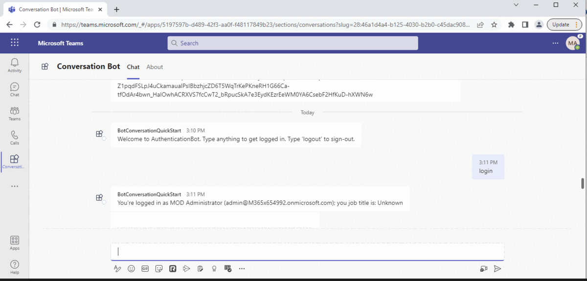
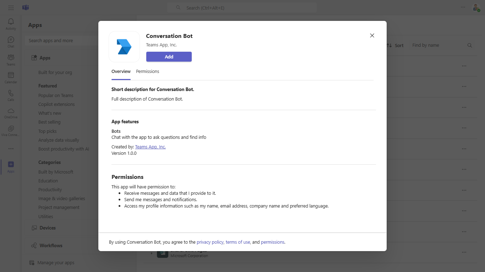
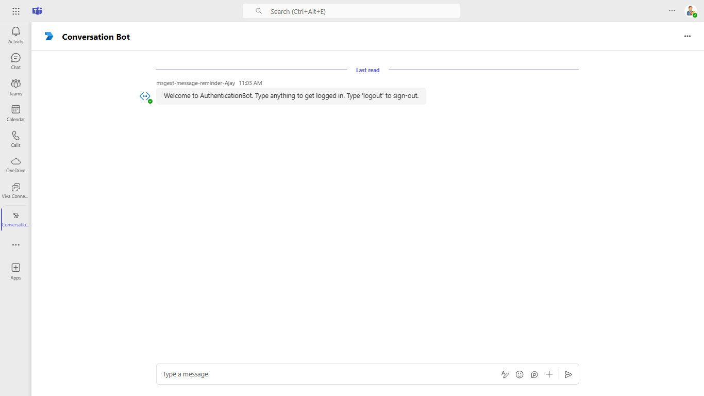
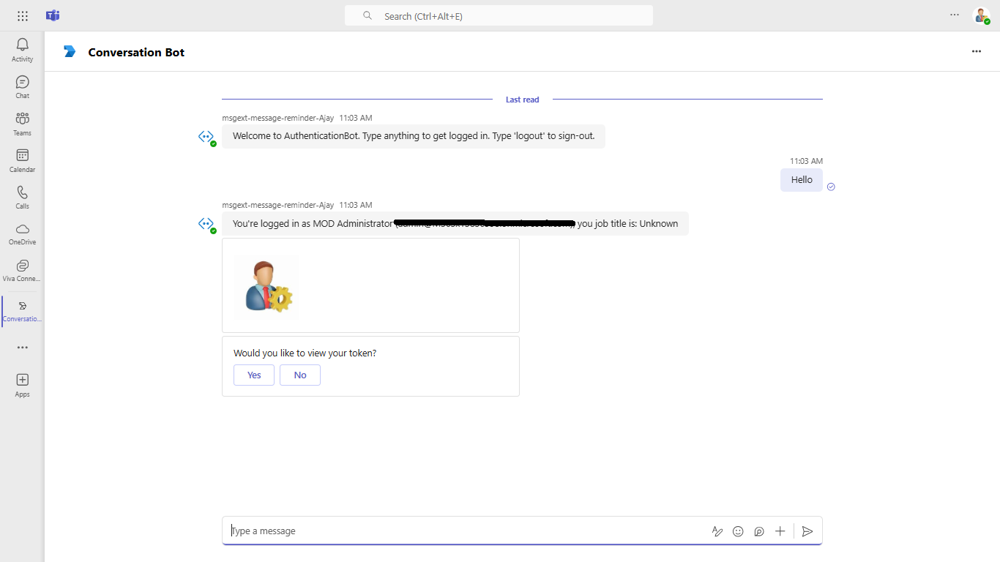
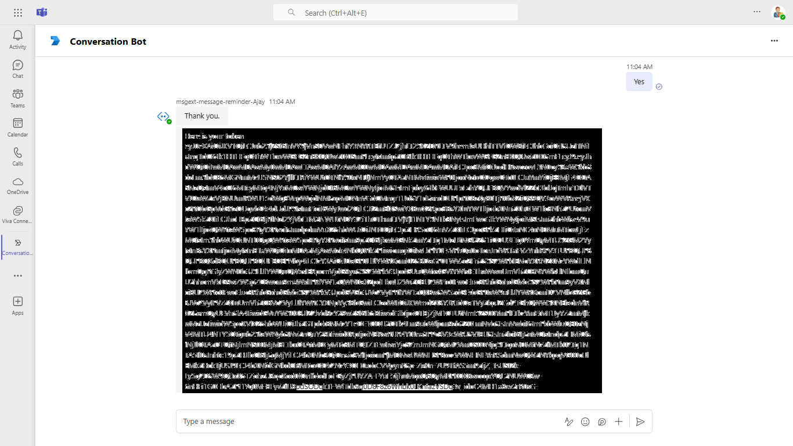

# Teams Conversation Bot SSO quick-start

This sample demonstrates how to implement Single Sign-On (SSO) for Teams bots using Azure Active Directory and the Bot Framework. It includes comprehensive setup instructions for authentication, tunneling, and deploying to Azure, offering a streamlined way to authenticate users and access Microsoft Graph data directly within Teams.

This bot has been created using [Bot Framework](https://dev.botframework.com), it shows how to get started with SSO in a bot for Microsoft Teams.

The focus of this sample is how to use the Bot Framework support for OAuth SSO in your bot. Teams behaves slightly differently than other channels in this regard. Specifically an Invoke Activity is sent to the bot rather than the Event Activity used by other channels. _This Invoke Activity must be forwarded to the dialog if the OAuthPrompt is being used._ This is done by subclassing the ActivityHandler and this sample includes a reusable TeamsActivityHandler. This class is a candidate for future inclusion in the Bot Framework SDK.

The sample uses the bot authentication capabilities in [Azure Bot Service](https://docs.botframework.com), providing features to make it easier to develop a bot that authenticates users to various identity providers such as Microsoft Entra ID, GitHub, Uber, etc. The OAuth token is then used to make basic Microsoft Graph queries.

> IMPORTANT: The manifest file in this app adds "token.botframework.com" to the list of `validDomains`. This must be included in any bot that uses the Bot Framework OAuth flow.

## Included Features
* Teams SSO (bots)
* Adaptive Card
* Graph API

## Interaction with app



## Try it yourself - experience the App in your Microsoft Teams client
Please find below demo manifest which is deployed on Microsoft Azure and you can try it yourself by uploading the app package (.zip file link below) to your teams and/or as a personal app. (Uploading must be enabled for your tenant, [see steps here](https://docs.microsoft.com/microsoftteams/platform/concepts/build-and-test/prepare-your-o365-tenant#enable-custom-teams-apps-and-turn-on-custom-app-uploading)).

**Conversation Bot SSO quick-start:** [Manifest](/samples/bot-conversation-sso-quickstart/csharp_dotnetcore/demo-manifest/bot-conversation-sso-quickstart.zip)

## Prerequisites

-  Microsoft Teams is installed and you have an account (not a guest account)
-  [.Net](https://dotnet.microsoft.com/en-us/download/dotnet/6.0) version 6.0
-  [dev tunnel](https://learn.microsoft.com/en-us/azure/developer/dev-tunnels/get-started?tabs=windows) or [ngrok](https://ngrok.com/download) latest version or equivalent tunneling solution
-  [M365 developer account](https://docs.microsoft.com/en-us/microsoftteams/platform/concepts/build-and-test/prepare-your-o365-tenant) or access to a Teams account with the appropriate permissions to install an app.
-  [Microsoft 365 Agents Toolkit for Visual Studio](https://learn.microsoft.com/en-us/microsoftteams/platform/toolkit/toolkit-v4/install-teams-toolkit-vs?pivots=visual-studio-v17-7)

## Run the app (Using Microsoft 365 Agents Toolkit for Visual Studio)

The simplest way to run this sample in Teams is to use Microsoft 365 Agents Toolkit for Visual Studio.
1. Install Visual Studio 2022 **Version 17.14 or higher** [Visual Studio](https://visualstudio.microsoft.com/downloads/)
1. Install Microsoft 365 Agents Toolkit for Visual Studio [Microsoft 365 Agents Toolkit extension](https://learn.microsoft.com/en-us/microsoftteams/platform/toolkit/toolkit-v4/install-teams-toolkit-vs?pivots=visual-studio-v17-7)
1. In the debug dropdown menu of Visual Studio, select Dev Tunnels > Create A Tunnel (set authentication type to Public) or select an existing public dev tunnel.
1. Right-click the 'M365Agent' project in Solution Explorer and select **Microsoft 365 Agents Toolkit > Select Microsoft 365 Account**
1. Sign in to Microsoft 365 Agents Toolkit with a **Microsoft 365 work or school account**
1. Set `Startup Item` as `Microsoft Teams (browser)`.
1. Press F5, or select Debug > Start Debugging menu in Visual Studio to start your app
</br>
1. In the opened web browser, select Add button to install the app in Teams
> If you do not have permission to upload custom apps (uploading), Microsoft 365 Agents Toolkit will recommend creating and using a Microsoft 365 Developer Program account - a free program to get your own dev environment sandbox that includes Teams.

## Setup

> Note these instructions are for running the sample on your local machine, the tunnelling solution is required because
> the Teams service needs to call into the bot.

1. Setup for Bot SSO

Refer to [Bot SSO Setup document](https://github.com/OfficeDev/Microsoft-Teams-Samples/blob/main/samples/bot-conversation-sso-quickstart/BotSSOSetup.md).

2. Run ngrok - point to port 3978

   ```bash
   ngrok http 3978 --host-header="localhost:3978"
   ```  

   Alternatively, you can also use the `dev tunnels`. Please follow [Create and host a dev tunnel](https://learn.microsoft.com/en-us/azure/developer/dev-tunnels/get-started?tabs=windows) and host the tunnel with anonymous user access command as shown below:

   ```bash
   devtunnel host -p 3978 --allow-anonymous
   ```

3. Register a new application in the [Microsoft Entra ID – App Registrations](https://go.microsoft.com/fwlink/?linkid=2083908) portal.
  
  A) Select **New Registration** and on the *register an application page*, set following values:
      * Set **name** to your app name.
      * Choose the **supported account types** (any account type will work)
      * Leave **Redirect URI** empty.
      * Choose **Register**.
  B) On the overview page, copy and save the **Application (client) ID, Directory (tenant) ID**. You'll need those later when updating your Teams application manifest and in the appsettings.json.
  C) Navigate to **API Permissions**, and make sure to add the following permissions:
   Select Add a permission
      * Select Add a permission
      * Select Microsoft Graph -\> Delegated permissions.
      * `User.Read` (enabled by default)
      * Click on Add permissions. Please make sure to grant the admin consent for the required permissions.


4. Setup for code

  - Clone the repository

    ```bash
    git clone https://github.com/OfficeDev/Microsoft-Teams-Samples.git
    ```
   - Modify the `/appsettings.json` and fill in the following details:
     - `{{TODO: MicrosoftAppId}}` - Generated from Step 1 while doing Microsoft Entra ID app registration in Azure portal.
     - `{{ TODO: ClientSecret}}` - Generated from Step 1, also referred to as Client secret
     - `{{ TODO: ConnectionName}}` - Generated from Step 1, Connection Setting.
     - `MicrosoftAppType` - Set this as MultiTenant to if your bot is supported on multiple tenants; SingleTenant otherwise.
     - `MicrosoftAppTenantId` - Set your tenantId here if you are using single tenant app registration.
     
  
  - If you are using Visual Studio
    - Launch Visual Studio
    - File -> Open -> Project/Solution
    - Navigate to `samples/bot-conversation-sso-quickstart/csharp_dotnetcore` folder
    - Select `BotConversationSsoQuickstart.sln` file and open it in Visual Studio
    - Press `F5` to run this project
    
5.  Manually update the manifest.json
    - Edit the `manifest.json` contained in the  `appPackage/` folder to replace with your MicrosoftAppId (that was created in step1.1 and is the same value of MicrosoftAppId in `appsettings.json` file) *everywhere* you see the place holder string `{TODO: MicrosoftAppId}` (depending on the scenario the Microsoft App Id may occur multiple times in the `manifest.json`). The `ConnectionName` is the name of OAuth Connection you configured in step3.
    - Zip up the contents of the `appPackage/` folder to create a `manifest.zip`
    - Upload the `manifest.zip` to Teams (in the left-bottom *Apps* view, click "Upload a custom app")

**Note**: If you are facing any issue in your app, [please uncomment this line](https://github.com/OfficeDev/Microsoft-Teams-Samples/blob/main/samples/bot-conversation-sso-quickstart/csharp_dotnetcore/BotConversationSsoQuickstart/AdapterWithErrorHandler.cs#L37) and put your debugger for local debug.


## Running the sample









## Further reading

- [Bot Framework Documentation](https://docs.botframework.com)
- [Bot Basics](https://docs.microsoft.com/azure/bot-service/bot-builder-basics?view=azure-bot-service-4.0)
- [Azure Portal](https://portal.azure.com)
- [Microsoft Teams Developer Platform](https://docs.microsoft.com/en-us/microsoftteams/platform/)


