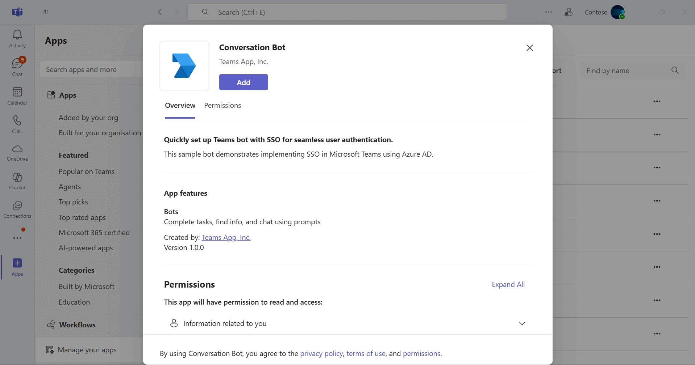
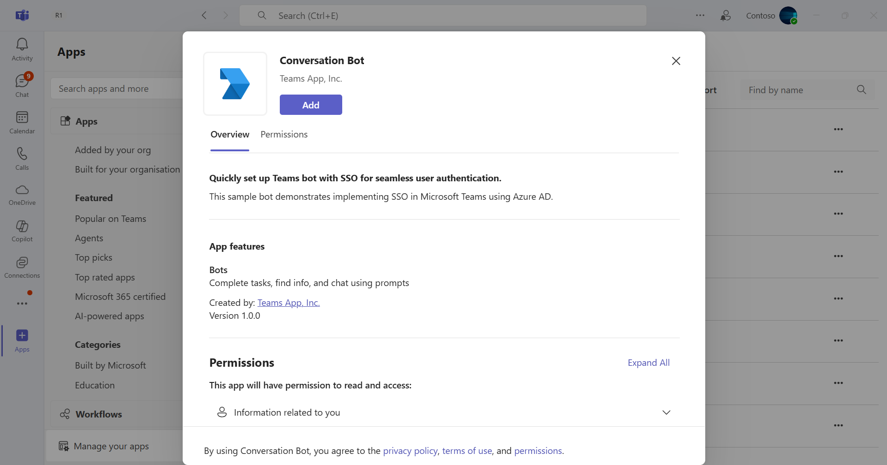
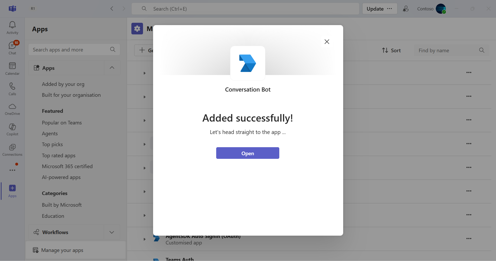
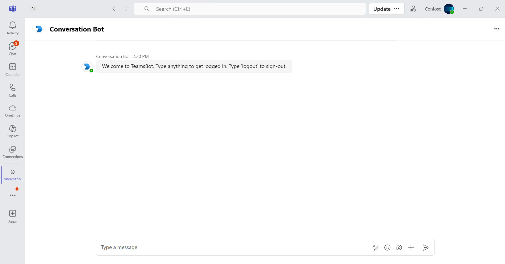
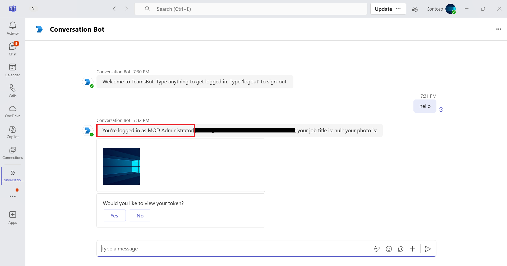
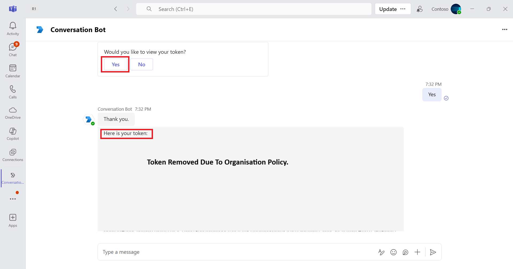
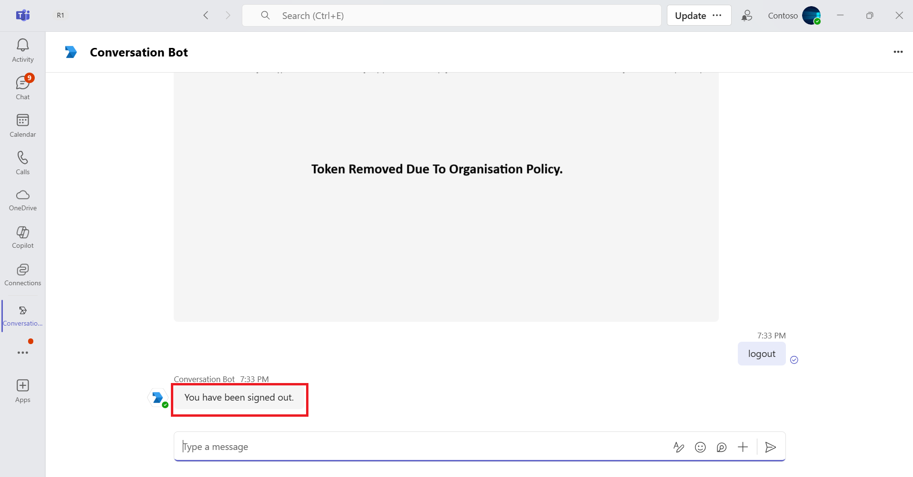

# Teams Conversation Bot SSO quick-start

This sample demonstrates how to implement Single Sign-On (SSO) for Teams bots using Azure Active Directory and the Bot Framework. It includes comprehensive setup instructions for authentication, tunneling, and deploying to Azure, offering a streamlined way to authenticate users and access Microsoft Graph data directly within Teams.

This bot has been created using [Bot Framework](https://dev.botframework.com), it shows how to get started with SSO in a bot for Microsoft Teams.

The focus of this sample is how to use the Bot Framework support for OAuth SSO in your bot. Teams behaves slightly differently than other channels in this regard. Specifically an Invoke Activity is sent to the bot rather than the Event Activity used by other channels. _This Invoke Activity must be forwarded to the dialog if the OAuthPrompt is being used._ This is done by subclassing the ActivityHandler and this sample includes a reusable TeamsActivityHandler. This class is a candidate for future inclusion in the Bot Framework SDK.

The sample uses the bot authentication capabilities in [Azure Bot Service](https://docs.botframework.com), providing features to make it easier to develop a bot that authenticates users to various identity providers such as Microsoft Entra ID, GitHub, Uber, etc. The OAuth token is then used to make basic Microsoft Graph queries.

> IMPORTANT: The manifest file in this app adds "token.botframework.com" to the list of `validDomains`. This must be included in any bot that uses the Bot Framework OAuth flow.

## Included Features
* Teams SSO (bots)
* Adaptive Card
* Graph API

## Interaction with app



## Try it yourself - experience the App in your Microsoft Teams client
Please find below demo manifest which is deployed on Microsoft Azure and you can try it yourself by uploading the app package (.zip file link below) to your teams and/or as a personal app. (Uploading must be enabled for your tenant, [see steps here](https://docs.microsoft.com/microsoftteams/platform/concepts/build-and-test/prepare-your-o365-tenant#enable-custom-teams-apps-and-turn-on-custom-app-uploading)).

**Conversation Bot SSO quick-start:** [Manifest](/samples/bot-conversation-sso-quickstart/csharp_dotnetcore/demo-manifest/bot-conversation-sso-quickstart.zip)

## Prerequisites

-  Microsoft Teams is installed and you have an account (not a guest account)
-  To test locally, [NodeJS](https://nodejs.org/en/download/) must be installed on your development machine (version 16.14.2  or higher)
-  [dev tunnel](https://learn.microsoft.com/en-us/azure/developer/dev-tunnels/get-started?tabs=windows) or [ngrok](https://ngrok.com/download) latest version or equivalent tunneling solution
-  [M365 developer account](https://docs.microsoft.com/en-us/microsoftteams/platform/concepts/build-and-test/prepare-your-o365-tenant) or access to a Teams account with the appropriate permissions to install an app.
- [Microsoft 365 Agents Toolkit for VS Code](https://marketplace.visualstudio.com/items?itemName=TeamsDevApp.ms-teams-vscode-extension) or [TeamsFx CLI](https://learn.microsoft.com/microsoftteams/platform/toolkit/teamsfx-cli?pivots=version-one)
- If you are using Ngrok to test locally, you'll need [Ngrok](https://ngrok.com/) installed on your development machine.
    Make sure you've downloaded and installed Ngrok on your local machine. ngrok will tunnel requests from the Internet to your local computer and terminate the SSL connection from Teams.

## Run the app (Using Microsoft 365 Agents Toolkit for Visual Studio Code)

The simplest way to run this sample in Teams is to use Microsoft 365 Agents Toolkit for Visual Studio Code.

1. Ensure you have downloaded and installed [Visual Studio Code](https://code.visualstudio.com/docs/setup/setup-overview)
1. Install the [Microsoft 365 Agents Toolkit extension](https://marketplace.visualstudio.com/items?itemName=TeamsDevApp.ms-teams-vscode-extension)
1. Select **File > Open Folder** in VS Code and choose this samples directory from the repo
1. Using the extension, sign in with your Microsoft 365 account where you have permissions to upload custom apps
1. Select **Debug > Start Debugging** or **F5** to run the app in a Teams web client.
1. In the browser that launches, select the **Add** button to install the app to Teams.

> If you do not have permission to upload custom apps (uploading), Microsoft 365 Agents Toolkit will recommend creating and using a Microsoft 365 Developer Program account - a free program to get your own dev environment sandbox that includes Teams.

## Run the app (Manually Uploading to Teams)

> Note these instructions are for running the sample on your local machine, the tunnelling solution is required because
> the Teams service needs to call into the bot.

1) Setup for Bot SSO
- Refer to [Bot SSO Setup document](../BotSSOSetup.md)

- Ensure that you've [enabled the Teams Channel](https://docs.microsoft.com/en-us/azure/bot-service/channel-connect-teams?view=azure-bot-service-4.0)

- While registering the Azure bot, use `https://<your_tunnel_domain>/api/messages` as the messaging endpoint.
    
    > NOTE: When you create your app registration in Azure portal, you will create an App ID and App password - make sure you keep these for later.

2) Run ngrok - point to port 3978

   ```bash
   ngrok http 3978 --host-header="localhost:3978"
   ```  

   Alternatively, you can also use the `dev tunnels`. Please follow [Create and host a dev tunnel](https://learn.microsoft.com/en-us/azure/developer/dev-tunnels/get-started?tabs=windows) and host the tunnel with anonymous user access command as shown below:

   ```bash
   devtunnel host -p 3978 --allow-anonymous
   ```

3) Register a new application in the [Microsoft Entra ID – App Registrations](https://go.microsoft.com/fwlink/?linkid=2083908) portal.
  
  A) Select **New Registration** and on the *register an application page*, set following values:
      * Set **name** to your app name.
      * Choose the **supported account types** (any account type will work)
      * Leave **Redirect URI** empty.
      * Choose **Register**.
  B) On the overview page, copy and save the **Application (client) ID, Directory (tenant) ID**. You'll need those later when updating your Teams application manifest and in the appsettings.json.
  C) Navigate to **API Permissions**, and make sure to add the following permissions:
   Select Add a permission
      * Select Add a permission
      * Select Microsoft Graph -\> Delegated permissions.
      * `User.Read` (enabled by default)
      * Click on Add permissions. Please make sure to grant the admin consent for the required permissions.


4) Setup for code
- Clone the repository

    ```bash
    git clone https://github.com/OfficeDev/Microsoft-Teams-Samples.git
    ```

- In a terminal, navigate to `samples/bot-conversation-sso-quickstart/js`

- Install modules

    ```bash
    npm install
    ```

- Update the `.env` configuration for the bot to use the Microsoft App Id and App Password from the step 1 (Microsoft Entra ID app registration in Azure portal or from Bot Framework registration. (Note the MicrosoftAppId is the AppId created in step 1, the MicrosoftAppPassword is referred to as the "client secret" in step1 and you can always create a new client secret anytime.)
    Also, update `connectionName` as the name of your Azure Bot connection created in step 1.
     - `MicrosoftAppType` - Set this as MultiTenant to if your bot is supported on multiple tenants, otherwise SingleTenant.
     - `MicrosoftAppTenantId` - Set your tenantId here if you are using single tenant app registration.

- Run your bot at the command line:

    ```bash
    npm start
    ```
5) Setup Manifest for Teams

- **This step is specific to Teams.**
    - Edit the `manifest.json` contained in the `appManifest/` folder to replace with your MicrosoftAppId (that was created in step1.1 and is the same value of MicrosoftAppId in `.env` file) *everywhere* you see the place holder string `{MicrosoftAppId}` (depending on the scenario the Microsoft App Id may occur multiple times in the `manifest.json`)
        `<<DOMAIN-NAME>>` with base Url domain. E.g. if you are using ngrok it would be `https://1234.ngrok-free.app` then your domain-name will be `1234.ngrok-free.app` and if you are using dev tunnels then your domain will be like: `12345.devtunnels.ms`.
    - Zip up the contents of the `appManifest/` folder to create a `manifest.zip`
    - Upload the `manifest.zip` to Teams (in the left-bottom *Apps* view, click "Upload a custom app")

**Note**: If you are facing any issue in your app, [please uncomment this line](https://github.com/OfficeDev/Microsoft-Teams-Samples/blob/main/samples/bot-conversation-sso-quickstart/js/index.js#L60) and put your debugger for local debug.

## Running the sample

**Adding bot UI:**





**Welcome to teamsBot:**



**Login command interaction:**



**View your token:**



**Logout Dialog:**



**Group Chat auth card**


**Post auth card**


You can interact with this bot by sending it a message. The bot will respond by asking for your consent, by this consent the Bot will exchange an SSO token, then making a call to the Graph API on your behalf and returning the results. It will keep you loggined unless you send a message "logout". 

## Further reading

- [Bot Framework Documentation](https://docs.botframework.com)
- [Bot Basics](https://docs.microsoft.com/azure/bot-service/bot-builder-basics?view=azure-bot-service-4.0)
- [Azure Portal](https://portal.azure.com)
- [Add Authentication to Your Bot Via Azure Bot Service](https://docs.microsoft.com/en-us/azure/bot-service/bot-builder-authentication?view=azure-bot-service-4.0&tabs=csharp)
- [Activity processing](https://docs.microsoft.com/en-us/azure/bot-service/bot-builder-concept-activity-processing?view=azure-bot-service-4.0)
- [Azure Bot Service Introduction](https://docs.microsoft.com/azure/bot-service/bot-service-overview-introduction?view=azure-bot-service-4.0)
- [Azure Bot Service Documentation](https://docs.microsoft.com/azure/bot-service/?view=azure-bot-service-4.0)
- [.NET Core CLI tools](https://docs.microsoft.com/en-us/dotnet/core/tools/?tabs=netcore2x)
- [Azure CLI](https://docs.microsoft.com/cli/azure/?view=azure-cli-latest)
- [Azure Portal](https://portal.azure.com)
- [Language Understanding using LUIS](https://docs.microsoft.com/en-us/azure/cognitive-services/luis/)
- [Channels and Bot Connector Service](https://docs.microsoft.com/en-us/azure/bot-service/bot-concepts?view=azure-bot-service-4.0)
- [Microsoft Teams Developer Platform](https://docs.microsoft.com/en-us/microsoftteams/platform/)


