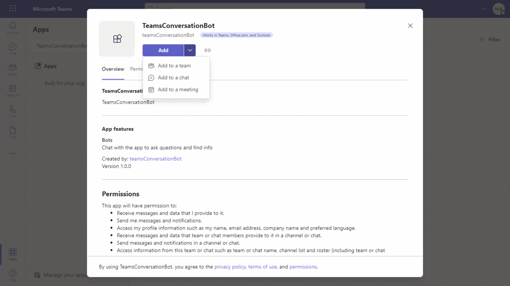
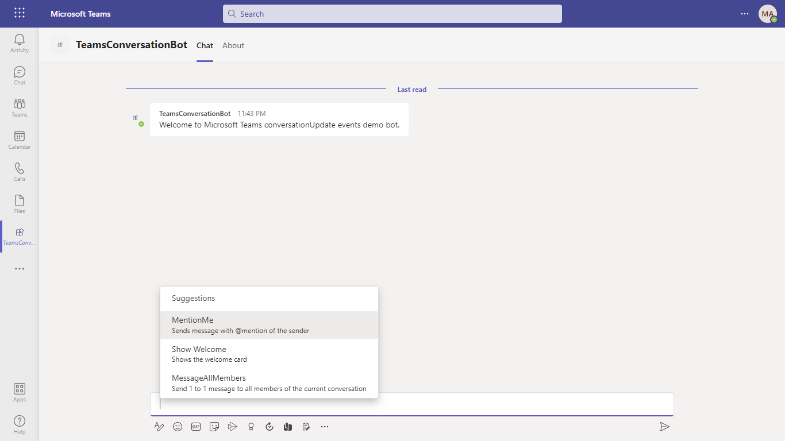
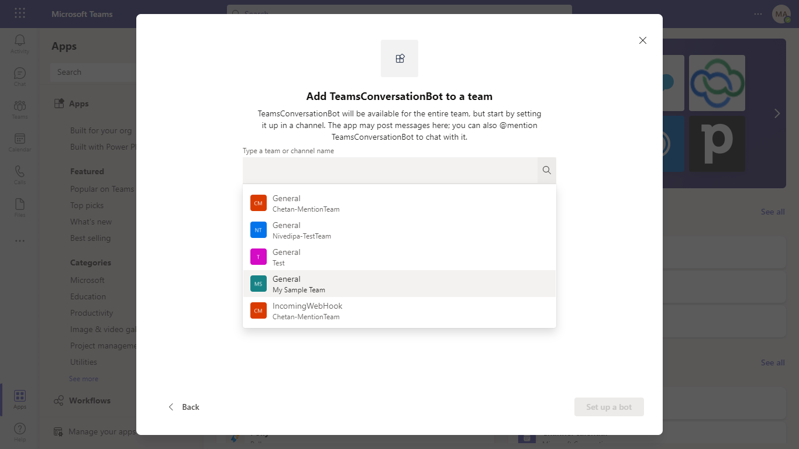
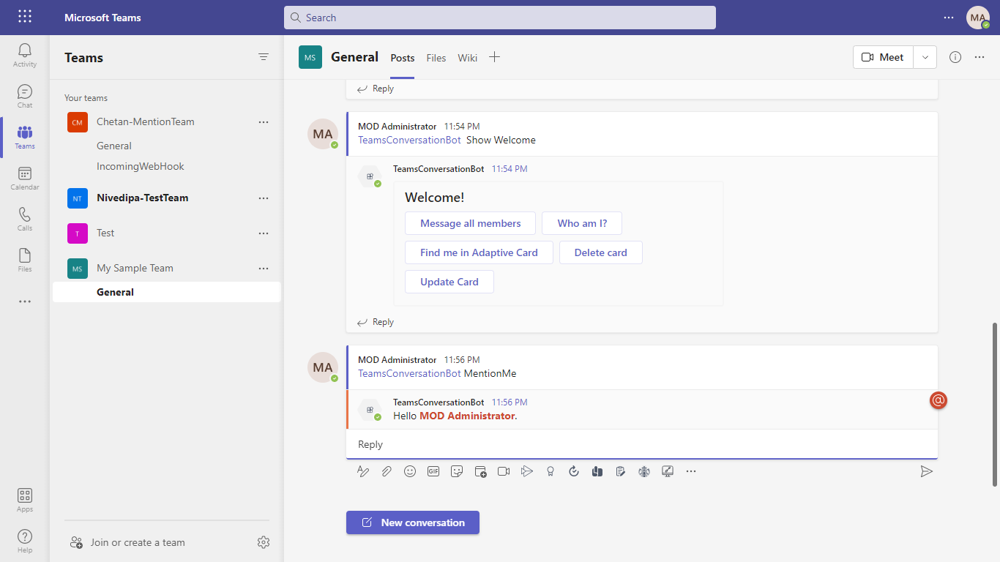
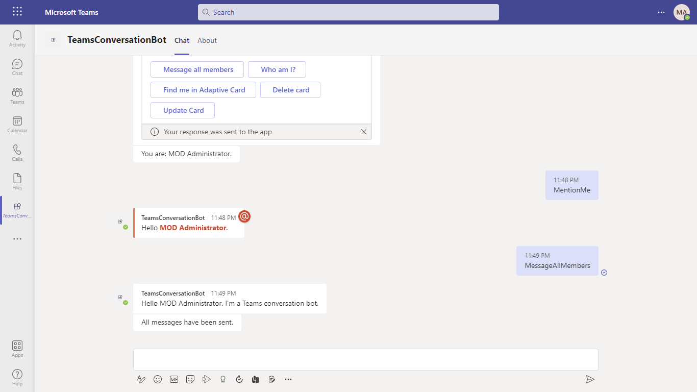
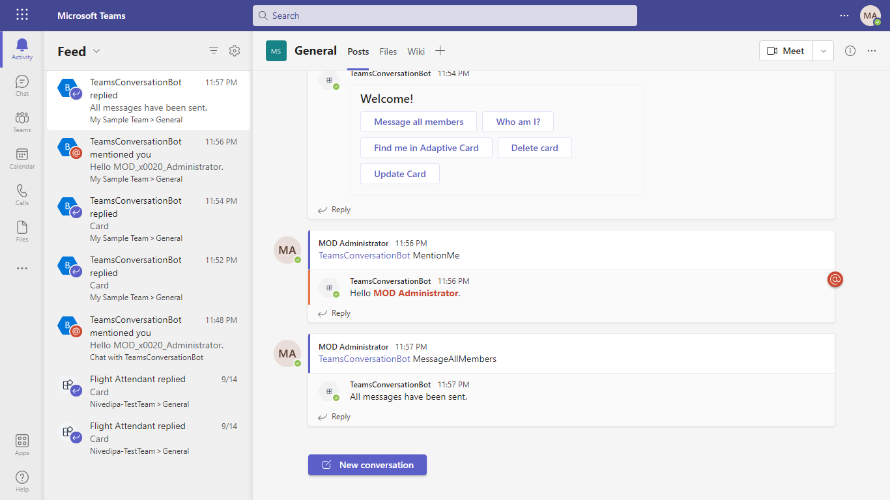
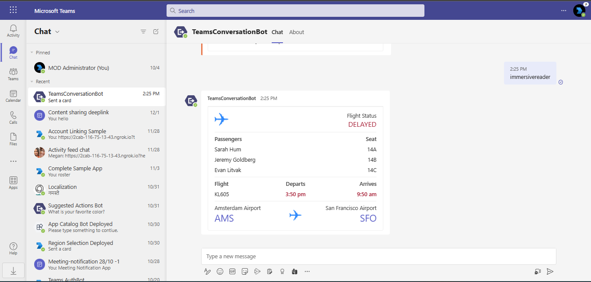
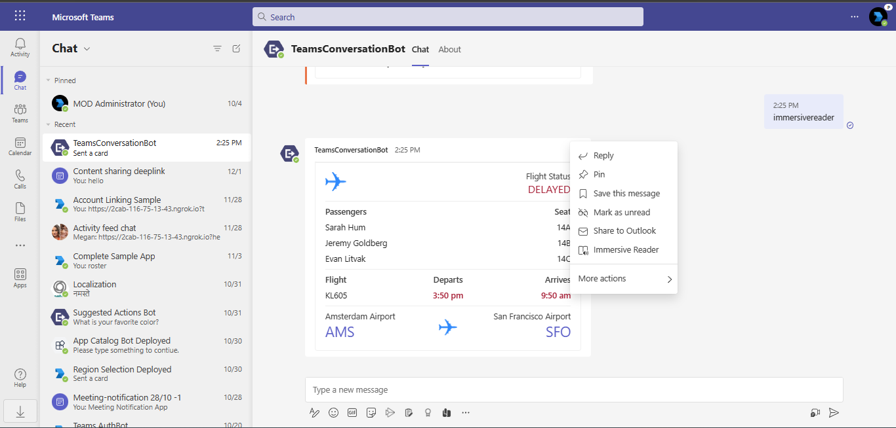
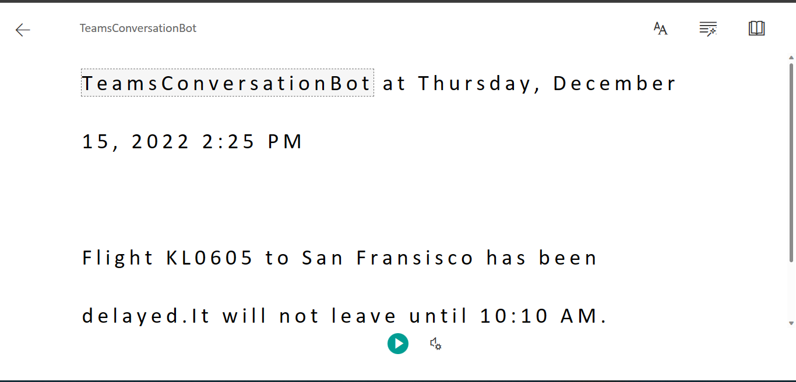
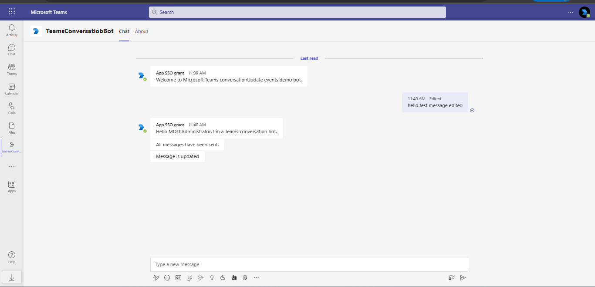

# Teams Conversation Bot

Bot Framework v4 Conversation Bot sample for Teams ([Messages in bot conversations](https://learn.microsoft.com/microsoftteams/platform/bots/how-to/conversations/conversation-messages?tabs=dotnet)).

This bot has been created using [Bot Framework](https://dev.botframework.com). This sample shows
how to incorporate basic conversational flow into a Teams application. It also illustrates a few of the Teams specific calls you can make from your bot.

- **Interaction with bot**


## Try it yourself - experience the App in your Microsoft Teams client
Please find below demo manifest which is deployed on Microsoft Azure and you can try it yourself by uploading the app package (.zip file link below) to your teams and/or as a personal app. (Sideloading must be enabled for your tenant, [see steps here](https://docs.microsoft.com/microsoftteams/platform/concepts/build-and-test/prepare-your-o365-tenant#enable-custom-teams-apps-and-turn-on-custom-app-uploading)).

**Teams Conversation Bot:** [Manifest](/samples/bot-conversation/csharp/demo-manifest/bot-conversation.zip)

## Prerequisites

- Microsoft Teams is installed and you have an account
- [.NET SDK](https://dotnet.microsoft.com/download) version 6.0
- [ngrok](https://ngrok.com/) or equivalent tunnelling solution

## Setup

> Note these instructions are for running the sample on your local machine, the tunnelling solution is required because
the Teams service needs to call into the bot.

1) Run ngrok - point to port 3978

    ```bash
    ngrok http --host-header=rewrite 3978
    ```

1) Setup for Bot

   In Azure portal, create a [Azure Bot resource](https://docs.microsoft.com/azure/bot-service/bot-service-quickstart-registration).
    - For bot handle, make up a name.
    - Select "Use existing app registration" (Create the app registration in Azure Active Directory beforehand.)
    - __*If you don't have an Azure account*__ create an [Azure free account here](https://azure.microsoft.com/free/)
    
   In the new Azure Bot resource in the Portal, 
    - Ensure that you've [enabled the Teams Channel](https://learn.microsoft.com/azure/bot-service/channel-connect-teams?view=azure-bot-service-4.0)
    - In Settings/Configuration/Messaging endpoint, enter the current `https` URL you were given by running ngrok. Append with the path `/api/messages`

1) Clone the repository

    ```bash
    git clone https://github.com/OfficeDev/Microsoft-Teams-Samples.git
    ```

1) If you are using Visual Studio
   - Launch Visual Studio
   - File -> Open -> Project/Solution
   - Navigate to `samples/bot-conversation/csharp` folder
   - Select `TeamsConversationBot.csproj` or `TeamsConversationBot.sln`file

1) Update the `appsettings.json` configuration for the bot to use the MicrosoftAppId, MicrosoftAppPassword, MicrosoftAppTenantId generated in Step 2 (App Registration creation). (Note the App Password is referred to as the "client secret" in the azure portal and you can always create a new client secret anytime.)
    - Also, set MicrosoftAppType in the `appsettings.json`. (**Allowed values are: MultiTenant(default), SingleTenant, UserAssignedMSI**)

1) Run your bot, either from Visual Studio with `F5` or using `dotnet run` in the appropriate folder.

1) __*This step is specific to Teams.*__
    - **Edit** the `manifest.json` contained in the  `TeamsAppManifest` folder to replace your Microsoft App Id (that was created when you registered your bot earlier) *everywhere* you see the place holder string `<<YOUR-MICROSOFT-APP-ID>>` (depending on the scenario the Microsoft App Id may occur multiple times in the `manifest.json`)
    - **Edit** the `manifest.json` for `validDomains` with base Url domain. E.g. if you are using ngrok it would be `https://1234.ngrok.io` then your domain-name will be `1234.ngrok.io`.
    - **Zip** up the contents of the `TeamsAppManifest` folder to create a `manifest.zip` (Make sure that zip file does not contains any subfolder otherwise you will get error while uploading your .zip package)
    - **Upload** the `manifest.zip` to Teams (In Teams Apps/Manage your apps click "Upload an app". Browse to and Open the .zip file. At the next dialog, click the Add button.)
    - Add the app to personal/team/groupChat scope (Supported scopes)

**Note**: If you are facing any issue in your app, please uncomment [this](https://github.com/OfficeDev/Microsoft-Teams-Samples/blob/main/samples/bot-conversation/csharp/AdapterWithErrorHandler.cs#L25) line and put your debugger for local debug.


## Running the sample

You can interact with this bot in Teams by sending it a message, or selecting a command from the command list. The bot will respond to the following strings.

1. **Show Welcome**
  - **Result:** The bot will send the welcome card for you to interact with
  - **Valid Scopes:** personal, group chat, team chat

  - **Personal Scope Interactions:**

   **Adding bot UI:**
  

   **Added bot UI:**
  

   **Show Welcome command interaction:**
  

   - **Group Chat Scope Interactions:**

   **Adding bot UI:**
  

   **Added bot UI:**
  

   **Show Welcome command interaction:**
  

  - **Team Scope Interactions:**

   **Adding bot UI:**
  

   **Added bot UI:**
  

   **Show Welcome command interaction:**
  

2. **MentionMe**
  - **Result:** The bot will respond to the message and mention the user
  - **Valid Scopes:** personal, group chat, team chat

  - **Personal Scope Interactions:**

   **MentionMe command interaction:**
  

   - **Group Chat Scope Interactions:**

   **MentionMe command interaction:**
  

  - **Team Scope Interactions:**

   **MentionMe command interaction:**
  

3. **MessageAllMembers**
  - **Result:** The bot will send a 1-on-1 message to each member in the current conversation (aka on the conversation's roster).
  - **Valid Scopes:** personal, group chat, team chat

  - **Personal Scope Interactions:**

   **MessageAllMembers command interaction:**
  

   - **Group Chat Scope Interactions:**

   **MessageAllMembers command interaction:**
  

  - **Team Scope Interactions:**

   **MessageAllMembers command interaction:**
  

4. **ImmersiveReader**
- You can use the immersive reader property of adaptive cards by using the speak property.
`immersivereader` command will send an adpative card in teams chat.


- Select the immersive reader option for running the speak property.


- A new screen will be open and the text will be read by default which is mentioned inside the speak property of adaptive card.


 5. **Message update events for user messages**
- You will recieve event updates for message edit/delete features.

- Message is edited


- Message is soft-deleted


- Message is restored


You can select an option from the command list by typing ```@TeamsConversationBot``` into the compose message area and ```What can I do?``` text above the compose area.

## Deploy the bot to Azure

To learn more about deploying a bot to Azure, see [Deploy your bot to Azure](https://aka.ms/azuredeployment) for a complete list of deployment instructions.

## Further reading

- [Bot Framework Documentation](https://docs.botframework.com)
- [Bot Basics](https://docs.microsoft.com/azure/bot-service/bot-builder-basics?view=azure-bot-service-4.0)
- [Azure Bot Service Introduction](https://docs.microsoft.com/azure/bot-service/bot-service-overview-introduction?view=azure-bot-service-4.0)
- [Azure Bot Service Documentation](https://docs.microsoft.com/azure/bot-service/?view=azure-bot-service-4.0)
- [Messages in bot conversations](https://learn.microsoft.com/microsoftteams/platform/bots/how-to/conversations/conversation-messages?tabs=dotnet)