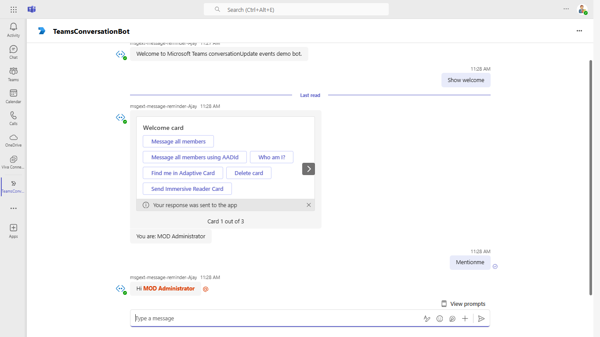
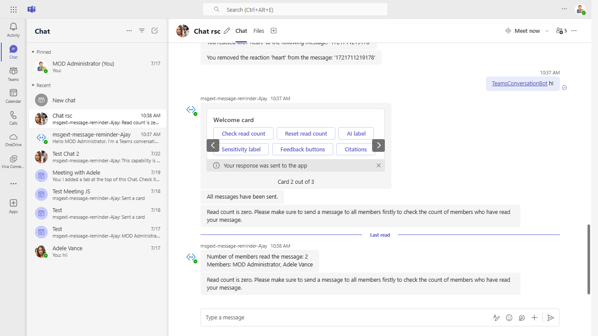

# Teams Conversation Bot

This sample app demonstrates how to handle various bot conversation events in Microsoft Teams, including read receipts and adaptive card interactions. It showcases capabilities such as immersive reader support and message update tracking, making it ideal for personal, group, and team chat scopes.

Bot Framework v4 Conversation Bot sample for Teams ([Messages in bot conversations](https://learn.microsoft.com/microsoftteams/platform/bots/how-to/conversations/conversation-messages?tabs=dotnet)).

This bot has been created using [Bot Framework](https://dev.botframework.com). This sample shows
how to incorporate basic conversational flow into a Teams application. It also illustrates a few of the Teams specific calls you can make from your bot.

## Included Features
* Bots
* Adaptive Cards
* Teams Conversation Events
* Immersive Reading Support for Cards

## Interaction with bot


## Try it yourself - experience the App in your Microsoft Teams client
Please find below demo manifest which is deployed on Microsoft Azure and you can try it yourself by uploading the app package (.zip file link below) to your teams and/or as a personal app. (Uploading must be enabled for your tenant, [see steps here](https://docs.microsoft.com/microsoftteams/platform/concepts/build-and-test/prepare-your-o365-tenant#enable-custom-teams-apps-and-turn-on-custom-app-uploading)).

**Teams Conversation Bot:** [Manifest](/samples/bot-conversation/csharp/demo-manifest/bot-conversation.zip)

## Prerequisites

- Microsoft Teams is installed and you have an account
- [.NET SDK](https://dotnet.microsoft.com/download) version 6.0
- [dev tunnel](https://learn.microsoft.com/en-us/azure/developer/dev-tunnels/get-started?tabs=windows) or [ngrok](https://ngrok.com/) latest version or equivalent tunnelling solution
- [Microsoft 365 Agents Toolkit for Visual Studio](https://learn.microsoft.com/en-us/microsoftteams/platform/toolkit/toolkit-v4/install-teams-toolkit-vs?pivots=visual-studio-v17-7)

## Run the app (Using Microsoft 365 Agents Toolkit for Visual Studio)

The simplest way to run this sample in Teams is to use Microsoft 365 Agents Toolkit for Visual Studio.
1. Install Visual Studio 2022 **Version 17.14 or higher** [Visual Studio](https://visualstudio.microsoft.com/downloads/)
1. Install Microsoft 365 Agents Toolkit for Visual Studio [Microsoft 365 Agents Toolkit extension](https://learn.microsoft.com/en-us/microsoftteams/platform/toolkit/toolkit-v4/install-teams-toolkit-vs?pivots=visual-studio-v17-7)
1. In the debug dropdown menu of Visual Studio, select Dev Tunnels > Create A Tunnel (set authentication type to Public) or select an existing public dev tunnel.
1. Right-click the 'M365Agent' project in Solution Explorer and select **Microsoft 365 Agents Toolkit > Select Microsoft 365 Account**
1. Sign in to Microsoft 365 Agents Toolkit with a **Microsoft 365 work or school account**
1. Set `Startup Item` as `Microsoft Teams (browser)`.
1. Press F5, or select Debug > Start Debugging menu in Visual Studio to start your app
</br>
1. In the opened web browser, select Add button to install the app in Teams
> If you do not have permission to upload custom apps (uploading), Microsoft 365 Agents Toolkit will recommend creating and using a Microsoft 365 Developer Program account - a free program to get your own dev environment sandbox that includes Teams.

## Setup

> Note these instructions are for running the sample on your local machine, the tunnelling solution is required because
the Teams service needs to call into the bot.

1) Run ngrok - point to port 3978

   ```bash
   ngrok http 3978 --host-header="localhost:3978"
   ```  

   Alternatively, you can also use the `dev tunnels`. Please follow [Create and host a dev tunnel](https://learn.microsoft.com/en-us/azure/developer/dev-tunnels/get-started?tabs=windows) and host the tunnel with anonymous user access command as shown below:

   ```bash
   devtunnel host -p 3978 --allow-anonymous
   ```

1) Register a new application in the [Microsoft Entra ID – App Registrations](https://go.microsoft.com/fwlink/?linkid=2083908) portal.
  
  A) Select **New Registration** and on the *register an application page*, set following values:
      * Set **name** to your app name.
      * Choose the **supported account types** (any account type will work)
      * Leave **Redirect URI** empty.
      * Choose **Register**.
  B) On the overview page, copy and save the **Application (client) ID, Directory (tenant) ID**. You'll need those later when updating your Teams application manifest and in the appsettings.json.
  C) Navigate to **API Permissions**, and make sure to add the following permissions:
   Select Add a permission
      * Select Add a permission
      * Select Microsoft Graph -\> Delegated permissions.
      * `User.Read` (enabled by default)
      * Click on Add permissions. Please make sure to grant the admin consent for the required permissions.


1) Setup for Bot

   In Azure portal, create a [Azure Bot resource](https://docs.microsoft.com/azure/bot-service/bot-service-quickstart-registration).
    - For bot handle, make up a name.
    - Select "Use existing app registration" (Create the app registration in Microsoft Entra ID beforehand.)
    - __*If you don't have an Azure account*__ create an [Azure free account here](https://azure.microsoft.com/free/)
    
   In the new Azure Bot resource in the Portal, 
    - Ensure that you've [enabled the Teams Channel](https://learn.microsoft.com/azure/bot-service/channel-connect-teams?view=azure-bot-service-4.0)
    - In Settings/Configuration/Messaging endpoint, enter the current `https` URL you were given by running the tunneling application. Append with the path `/api/messages`

1) Clone the repository

    ```bash
    git clone https://github.com/OfficeDev/Microsoft-Teams-Samples.git
    ```

1) If you are using Visual Studio
   - Launch Visual Studio
   - File -> Open -> Project/Solution
   - Navigate to `samples/bot-conversation/csharp` folder
   - Select `TeamsConversationBot.csproj` or `TeamsConversationBot.sln`file

1) Update the `appsettings.json` configuration for the bot to use the MicrosoftAppId, MicrosoftAppPassword, MicrosoftAppTenantId generated in Step 2 (App Registration creation). (Note the App Password is referred to as the "client secret" in the azure portal and you can always create a new client secret anytime.)
    - Also, set MicrosoftAppType in the `appsettings.json`. (**Allowed values are: SingleTenant, UserAssignedMSI**)

1) Run your bot, either from Visual Studio with `F5` or using `dotnet run` in the appropriate folder.

1) __*This step is specific to Teams.*__
    - **Edit** the `manifest.json` contained in the  `appPackage` folder to replace your Microsoft App Id (that was created when you registered your bot earlier) *everywhere* you see the place holder string `<<YOUR-MICROSOFT-APP-ID>>` (depending on the scenario the Microsoft App Id may occur multiple times in the `manifest.json`)
    - **Edit** the `manifest.json` for `validDomains`, replace `<<domain-name>>` with base Url domain. E.g. if you are using ngrok it would be `https://1234.ngrok-free.app` then your domain-name will be `1234.ngrok-free.app` and if you are using dev tunnels then your domain will be like: `12345.devtunnels.ms`.
    - **Zip** up the contents of the `appPackage` folder to create a `appPackage.zip` (Make sure that zip file does not contains any subfolder otherwise you will get error while uploading your .zip package)
    - **Upload** the `appPackage.zip` to Teams (In Teams Apps/Manage your apps click "Upload an app". Browse to and Open the .zip file. At the next dialog, click the Add button.)
    - Add the app to personal/team/groupChat scope (Supported scopes)

**Note**: If you are facing any issue in your app, please uncomment [this](https://github.com/OfficeDev/Microsoft-Teams-Samples/blob/main/samples/bot-conversation/csharp/AdapterWithErrorHandler.cs#L25) line and put your debugger for local debug.


## Running the sample

You can interact with this bot in Teams by sending it a message, or selecting a command from the command list. The bot will respond to the following strings.

1. **Show Welcome**
  - **Result:** The bot will send the welcome card for you to interact with
  - **Valid Scopes:** personal, group chat, team chat

  - **Personal Scope Interactions:**

   **Adding bot UI:**
  

   **Added bot UI:**
  

   **Show Welcome command interaction:**
  

   - **Group Chat Scope Interactions:**

   **Adding bot UI:**
  

   **Added bot UI:**
  

   **Show Welcome command interaction:**
  

  - **Team Scope Interactions:**

   **Adding bot UI:**
  

   **Added bot UI:**
  

   **Show Welcome command interaction:**
  

2. **MentionMe**
  - **Result:** The bot will respond to the message and mention the user
  - **Valid Scopes:** personal, group chat, team chat

  - **Personal Scope Interactions:**

   **MentionMe command interaction:**
  

   - **Group Chat Scope Interactions:**

   **MentionMe command interaction:**
  

  - **Team Scope Interactions:**

   **MentionMe command interaction:**
  

3. **MessageAllMembers**
  - **Result:** The bot will send a 1-on-1 message to each member in the current conversation (aka on the conversation's roster).
  - **Valid Scopes:** personal, group chat, team chat

  - **Personal Scope Interactions:**

   **MessageAllMembers command interaction:**
  

   - **Group Chat Scope Interactions:**

   **MessageAllMembers command interaction:**
   

  - **Team Scope Interactions:**

   **MessageAllMembers command interaction:**
  

  4.**Read Receipt**
  **Check Read count**
  - **Result:** The bot will check the count of members who have read your message which sent through `MessageAllMembers`. User can also reset the count using `Reset read count` command
  - **Valid Scopes:** personal, group chat, team chat

   - **Group Chat Scope Interactions:**
   **Check Read count command interaction:**
  

   **Reset Read count command interaction:**
  

 5. **ImmersiveReader**
- You can use the immersive reader property of adaptive cards by using the speak property.
`immersivereader` command will send an adpative card in teams chat.


- A new screen will be open and the text will be read by default which is mentioned inside the speak property of adaptive card.


 6. **Message update events for user messages**
- You will recieve event updates for message edit/delete features.

- Message is edited


- Message is soft-deleted


- Message is restored


- `AI label` - enables user to identify that the message was generated using AI.


- `Citations` - enables user to refer to the source of the bot's message through in-text citations and the reference.


- `Feedback buttons` - enables user to provide positive or negative feedback based on their experience.


- `Sensitivity label` - enables user to understand the confidentiality of the bot's message.


- `Send AI message` - Replies back with a bot message containing all formats: AI label, Citations, Feedback buttons, and Sensitivity label.


You can select an option from the command list by typing ```@TeamsConversationBot``` into the compose message area and ```What can I do?``` text above the compose area.

## Deploy the bot to Azure

To learn more about deploying a bot to Azure, see [Deploy your bot to Azure](https://aka.ms/azuredeployment) for a complete list of deployment instructions.

## Further reading

- [Bot Framework Documentation](https://docs.botframework.com)
- [Bot Basics](https://docs.microsoft.com/azure/bot-service/bot-builder-basics?view=azure-bot-service-4.0)
- [Azure Bot Service Introduction](https://docs.microsoft.com/azure/bot-service/bot-service-overview-introduction?view=azure-bot-service-4.0)
- [Azure Bot Service Documentation](https://docs.microsoft.com/azure/bot-service/?view=azure-bot-service-4.0)
- [Messages in bot conversations](https://learn.microsoft.com/microsoftteams/platform/bots/how-to/conversations/conversation-messages?tabs=dotnet)
- [Receive a read receipt](https://learn.microsoft.com/microsoftteams/platform/bots/how-to/conversations/conversation-messages?branch=pr-en-us-9184&tabs=dotnet1%2Capp-manifest-v112-or-later%2Cdotnet2%2Cdotnet3%2Cdotnet4%2Cdotnet5%2Cdotnet#receive-a-read-receipt)
- [Format AI bot messages](https://learn.microsoft.com/en-us/microsoftteams/platform/bots/how-to/format-ai-bot-messages?branch=pr-en-us-10798&tabs=js)


