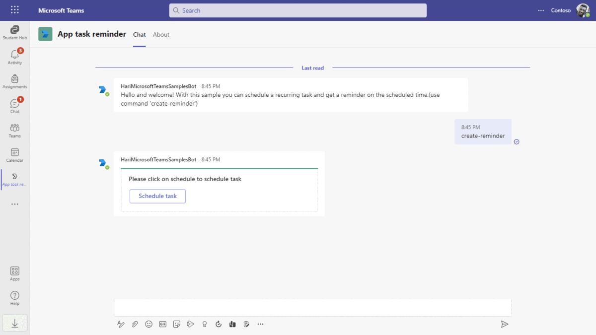
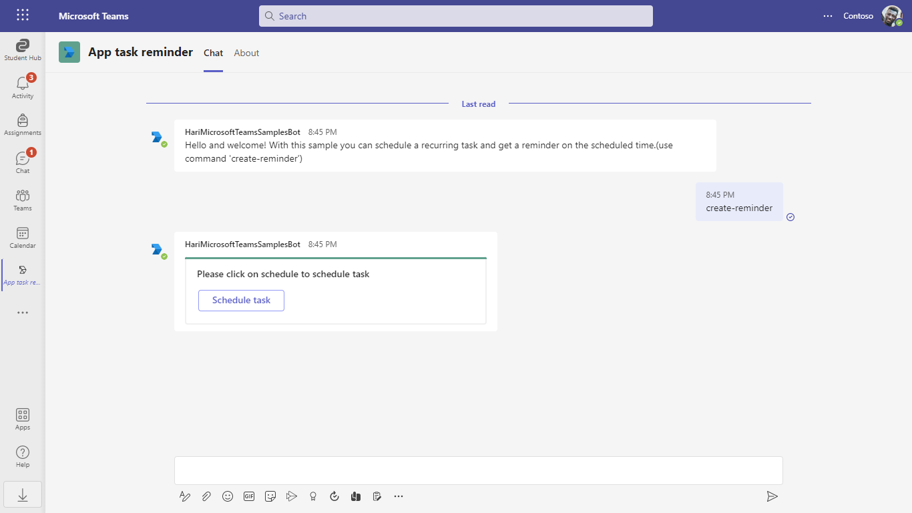
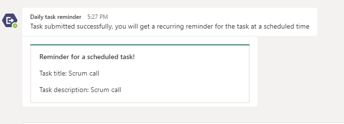
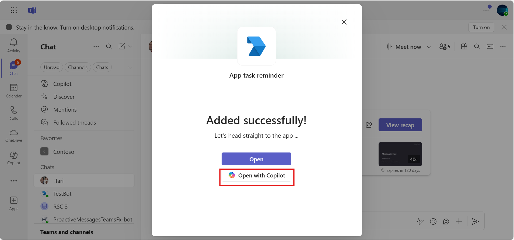
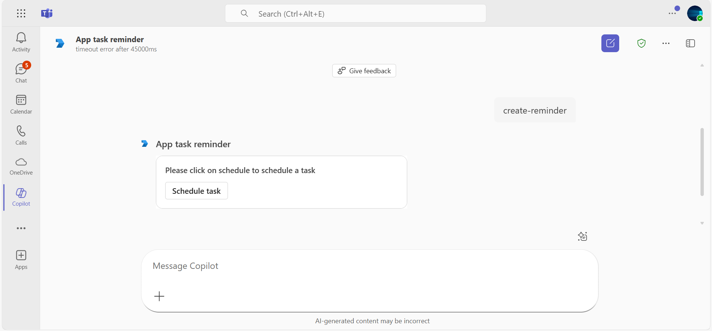
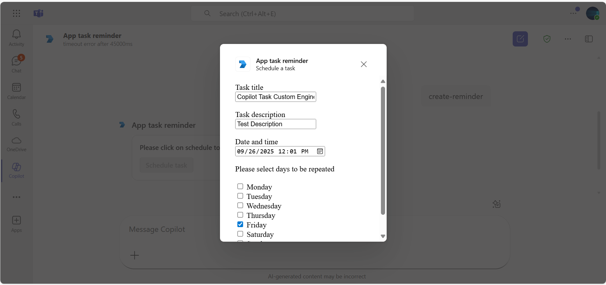
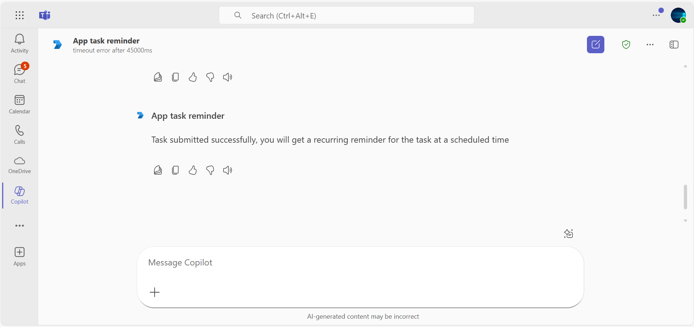
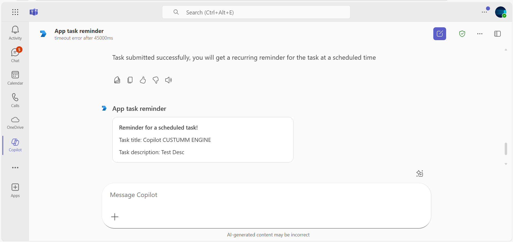

# Bot task reminder

The Daily Task Reminder bot for Microsoft Teams enables users to schedule recurring tasks and receive reminders at designated times. Built with the Bot Framework and leveraging adaptive cards and task modules, this bot provides an efficient way to manage and be reminded of daily tasks directly within Teams. It includes setup instructions for Microsoft Entra ID, Teams integration, and Azure Bot Service, offering seamless scheduling and notification capabilities.

## Included Features
* Bots
* Adaptive Cards
* Task Modules
* Quartz Scheduler (for scheduling)
* Custom Engine Agent - Copilot

## Interaction with app



## Try it yourself - experience the App in your Microsoft Teams client
Please find below demo manifest which is deployed on Microsoft Azure and you can try it yourself by uploading the app package (.zip file link below) to your teams and/or as a personal app. (Uploading must be enabled for your tenant, [see steps here](https://docs.microsoft.com/microsoftteams/platform/concepts/build-and-test/prepare-your-o365-tenant#enable-custom-teams-apps-and-turn-on-custom-app-uploading)).

**Bot daily task reminder:** [Manifest](/samples/bot-daily-task-reminder/csharp/demo-manifest/Bot-Daily-Task-Reminder.zip)

## Prerequisites

-  Microsoft Teams is installed and you have an account (not a guest account)
-  To test locally, [NodeJS](https://nodejs.org/en/download/) must be installed on your development machine (version 16.14.2  or higher).
-  [dev tunnel](https://learn.microsoft.com/en-us/azure/developer/dev-tunnels/get-started?tabs=windows) or [ngrok](https://ngrok.com/download) latest version or equivalent tunneling solution
-  [M365 developer account](https://docs.microsoft.com/microsoftteams/platform/concepts/build-and-test/prepare-your-o365-tenant) or access to a Teams account with the appropriate permissions to install an app.
-  If you use Ngrok to test locally, you'll need [Ngrok](https://ngrok.com/) installed on your development machine.
    Make sure you've downloaded and installed Ngrok on your local machine. ngrok will tunnel requests from the Internet to your local computer and terminate the SSL connection from Teams.
-  [Microsoft 365 Agents Toolkit for VS Code](https://marketplace.visualstudio.com/items?itemName=TeamsDevApp.ms-teams-vscode-extension) or [TeamsFx CLI](https://learn.microsoft.com/microsoftteams/platform/toolkit/teamsfx-cli?pivots=version-one).

## Run the app (Using Microsoft 365 Agents Toolkit for Visual Studio Code)

The simplest way to run this sample in Teams is to use Microsoft 365 Agents Toolkit for Visual Studio Code.

1. Ensure you have downloaded and installed [Visual Studio Code](https://code.visualstudio.com/docs/setup/setup-overview)
1. Install the [Microsoft 365 Agents Toolkit extension](https://marketplace.visualstudio.com/items?itemName=TeamsDevApp.ms-teams-vscode-extension)
1. Select **File > Open Folder** in VS Code and choose this samples directory from the repo
1. Using the extension, sign in with your Microsoft 365 account where you have permissions to upload custom apps
1. Select **Debug > Start Debugging** or **F5** to run the app in a Teams web client.
1. In the browser that launches, select the **Add** button to install the app to Teams.

> If you do not have permission to upload custom apps (uploading), Microsoft 365 Agents Toolkit will recommend creating and using a Microsoft 365 Developer Program account - a free program to get your own dev environment sandbox that includes Teams.


## Setup

> Note these instructions are for running the sample on your local machine, the tunnelling solution is required because
> the Teams service needs to call into the bot.

1) Setup for Bot
- In Azure portal, create Microsoft Entra ID app registraion and it will generate MicrosoftAppId and MicrosoftAppPassword for you.
- In Azure portal, create a [Azure Bot resource](https://docs.microsoft.com/azure/bot-service/bot-builder-authentication?view=azure-bot-service-4.0&tabs=csharp%2Caadv2).

- Ensure that you've [enabled the Teams Channel](https://docs.microsoft.com/azure/bot-service/channel-connect-teams?view=azure-bot-service-4.0)

- While registering the bot, use `https://<your_tunnel_domain>/api/messages` as the messaging endpoint.
    
    > NOTE: When you create your app registration in Azure portal, you will create an App ID and App password - make sure you keep these for later.

2) Run ngrok - point to port 3978

   ```bash
   ngrok http 3978 --host-header="localhost:3978"
   ```  

   Alternatively, you can also use the `dev tunnels`. Please follow [Create and host a dev tunnel](https://learn.microsoft.com/en-us/azure/developer/dev-tunnels/get-started?tabs=windows) and host the tunnel with anonymous user access command as shown below:

   ```bash
   devtunnel host -p 3978 --allow-anonymous
   ```

3) Register a new application in the [Microsoft Entra ID – App Registrations](https://go.microsoft.com/fwlink/?linkid=2083908) portal.
  
  A) Select **New Registration** and on the *register an application page*, set following values:
      * Set **name** to your app name.
      * Choose the **supported account types** (any account type will work)
      * Leave **Redirect URI** empty.
      * Choose **Register**.
  B) On the overview page, copy and save the **Application (client) ID, Directory (tenant) ID**. You'll need those later when updating your Teams application manifest and in the appsettings.json.
  C) Navigate to **API Permissions**, and make sure to add the following permissions:
   Select Add a permission
      * Select Add a permission
      * Select Microsoft Graph -\> Delegated permissions.
      * `User.Read` (enabled by default)
      * Click on Add permissions. Please make sure to grant the admin consent for the required permissions.


4) Setup for code  
- Clone the repository

    ```bash
    git clone https://github.com/OfficeDev/Microsoft-Teams-Samples.git
    ```

- In the folder where repository is cloned navigate to `samples/bot-daily-task-reminder/nodejs`

- Install node modules

   Inside nodejs folder, open your local terminal and run the below command to install node modules. You can do the same in Visual studio code terminal by opening the project in Visual studio code 

    ```bash
    npm install
    ```

- Update the `.env` configuration file in your project folder for the bot to use the `MicrosoftAppId`, `MicrosoftAppPassword` (Note the MicrosoftAppId is the AppId created while doing Microsoft Entra ID app registration in Azure portal, the MicrosoftAppPassword is referred to as the "client secret" generated while creating Secret in Microsoft Entra ID app registration.
 `BaseUrl` with application base url. For e.g., your ngrok url https://xxx.ngrok-free.app and if you are using dev tunnels, your URL will be like: https://12345.devtunnels.ms.

- Run your app

    ```bash
    npm start
    ```

5) Setup Manifest for Teams

    - Edit the `manifest.json` contained in the  `appManifest/` folder to replace with your MicrosoftAppId (that was created in step1.1 and is the same value of MicrosoftAppId in `.env` file) *everywhere* you see the place holder string `{{Microsoft-App-Id}}` (depending on the scenario the Microsoft App Id may occur multiple times in the `manifest.json`)
    - Relace {{domain-name}} with base Url domain. E.g. if you are using ngrok it would be `https://1234.ngrok-free.app` then your domain-name will be `1234.ngrok-free.app` and if you are using dev tunnels then your domain will be like: `12345.devtunnels.ms`.
    - Zip up the contents of the `appManifest/` folder to create a `manifest.zip`
    - Upload the `manifest.zip` to Teams (in the left-bottom *Apps* view, click "Upload a custom app")

**Note**: If you are facing any issue in your app, please uncomment [this](https://github.com/OfficeDev/Microsoft-Teams-Samples/blob/main/samples/bot-daily-task-reminder/nodejs/index.js#L47) line and put your debugger for local debug.

## Running the sample

**Type command create-reminder to get card for scheduling the recurring task:**



**Click on schedule task button to open task module for scheduling a task:**


**Once task is scheduled, you will be notified about the task at scheduled time:**



**Custom Engine Agent Copilot:**  

**Installation screen of Copilot Agent**  
  

**Creating a new reminder in Copilot**  
  

**Task module interface for reminders**  
  

**Response after submitting a task reminder**  
  

**Final reminder displayed in Copilot**  
  
 

## Deploy the bot to Azure

To learn more about deploying a bot to Azure, see [Deploy your bot to Azure](https://aka.ms/azuredeployment) for a complete list of deployment instructions.

## Further reading

- [Bot Framework Documentation](https://docs.botframework.com)
- [Bot Basics](https://docs.microsoft.com/azure/bot-service/bot-builder-basics?view=azure-bot-service-4.0)
- [Activity processing](https://docs.microsoft.com/azure/bot-service/bot-builder-concept-activity-processing?view=azure-bot-service-4.0)
- [Azure Bot Service Introduction](https://docs.microsoft.com/azure/bot-service/bot-service-overview-introduction?view=azure-bot-service-4.0)
- [Azure Bot Service Documentation](https://docs.microsoft.com/azure/bot-service/?view=azure-bot-service-4.0)
- [Custom Engine Agent-Copilot](https://learn.microsoft.com/en-us/microsoft-365-copilot/extensibility/overview-custom-engine-agent?utm_source=chatgpt.com)

