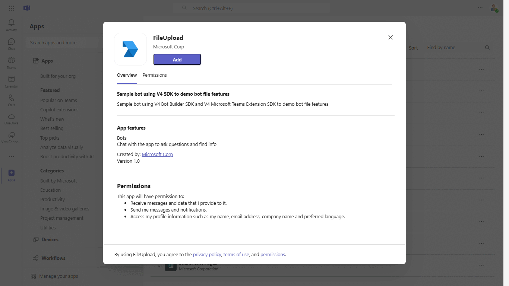
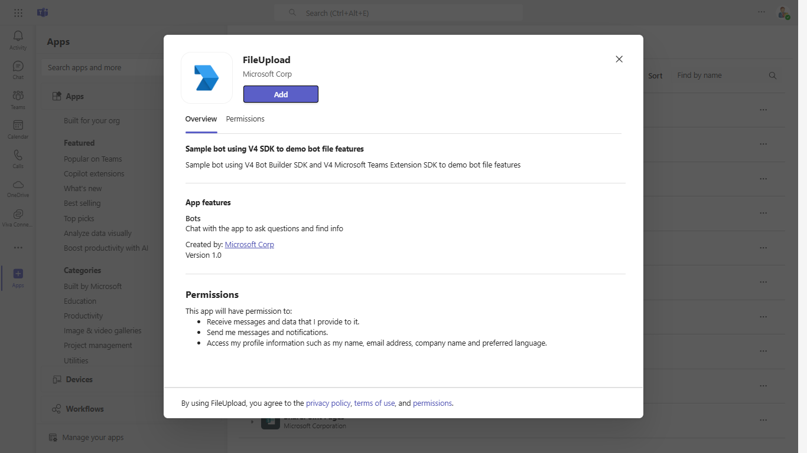
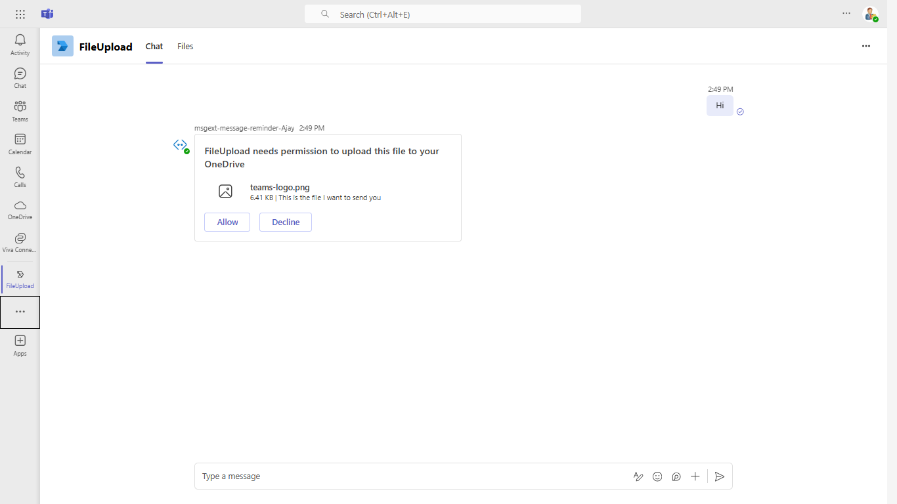
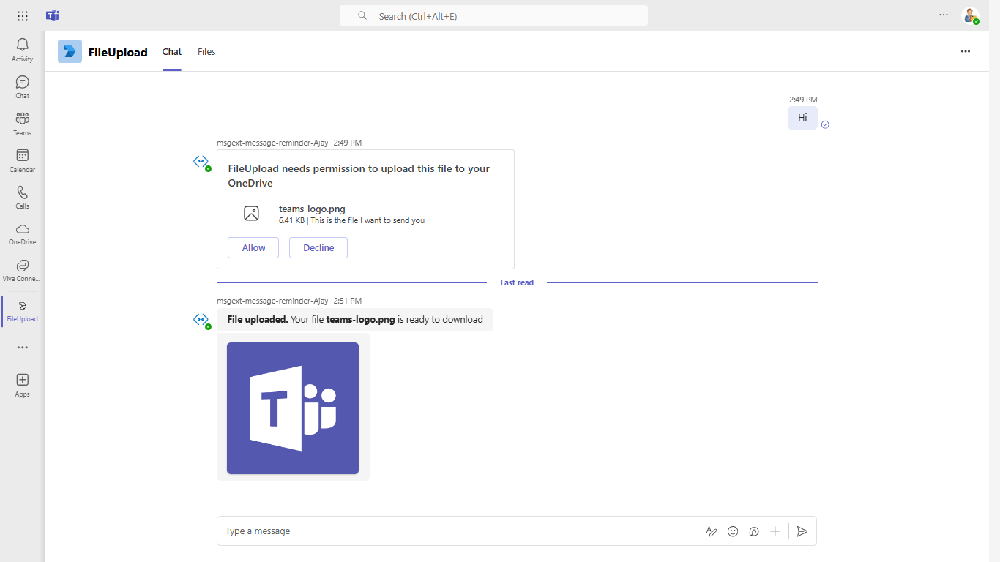
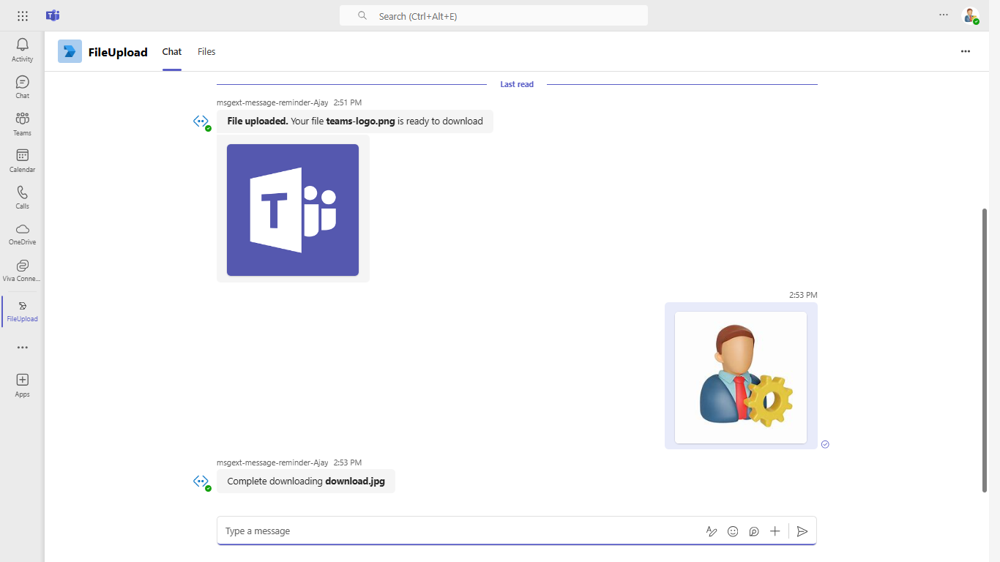

# Teams File Upload Bot

This sample demonstrates how to upload files in Microsoft Teams using a bot built with Bot Framework v4. Users can send files as attachments or inline images directly within a chat, and the bot can handle, retrieve, and process these files effectively. The bot also illustrates interaction with adaptive cards and supports file uploads through various methods, making it versatile for file management in Teams.

## Included Features
* Bots
* Adaptive Cards

## Interaction with bot


 ## Try it yourself - experience the App in your Microsoft Teams client
Please find below demo manifest which is deployed on Microsoft Azure and you can try it yourself by uploading the app manifest (.zip file link below) to your teams and/or as a personal app. (Uploading must be enabled for your tenant, [see steps here](https://docs.microsoft.com/microsoftteams/platform/concepts/build-and-test/prepare-your-o365-tenant#enable-custom-teams-apps-and-turn-on-custom-app-uploading)).

**Teams File Upload Bot:** [Manifest](/samples/bot-file-upload/csharp/demo-manifest/bot-file-upload.zip)

## Prerequisites

- Microsoft Teams is installed and you have an account
- [dev tunnel](https://learn.microsoft.com/en-us/azure/developer/dev-tunnels/get-started?tabs=windows) or [ngrok](https://ngrok.com/) latest version or equivalent tunnelling solution
- [Python SDK](https://www.python.org/downloads/) min version 3.11

## Run the app (Using Microsoft 365 Agents Toolkit for Visual Studio Code)

The simplest way to run this sample in Teams is to use Microsoft 365 Agents Toolkit for Visual Studio Code.

1. Ensure you have downloaded and installed [Visual Studio Code](https://code.visualstudio.com/docs/setup/setup-overview)
1. Install the [Microsoft 365 Agents Toolkit extension](https://marketplace.visualstudio.com/items?itemName=TeamsDevApp.ms-teams-vscode-extension) and [Python Extension](https://marketplace.visualstudio.com/items?itemName=ms-python.python)
1. Select **File > Open Folder** in VS Code and choose this samples directory from the repo
1. Press **CTRL+Shift+P** to open the command box and enter **Python: Create Environment** to create and activate your desired virtual environment. Remember to select `requirements.txt` as dependencies to install when creating the virtual environment.
1. Using the extension, sign in with your Microsoft 365 account where you have permissions to upload custom apps
1. Select **Debug > Start Debugging** or **F5** to run the app in a Teams web client.
1. In the browser that launches, select the **Add** button to install the app to Teams.

> If you do not have permission to upload custom apps (uploading), Microsoft 365 Agents Toolkit will recommend creating and using a Microsoft 365 Developer Program account - a free program to get your own dev environment sandbox that includes Teams.

## Run the app (Manually Uploading to Teams)

> Note these instructions are for running the sample on your local machine, the tunnelling solution is required because
the Teams service needs to call into the bot.

This bot has been created using [Bot Framework](https://dev.botframework.com), it shows how to create a simple bot that accepts input from the user and echoes it back.

1) Clone the repository

    ```bash
    git clone https://github.com/OfficeDev/Microsoft-Teams-Samples.git
    ```

1) Run ngrok - point to port 3978

   ```bash
   ngrok http 3978 --host-header="localhost:3978"
   ```  

   Alternatively, you can also use the `dev tunnels`. Please follow [Create and host a dev tunnel](https://learn.microsoft.com/en-us/azure/developer/dev-tunnels/get-started?tabs=windows) and host the tunnel with anonymous user access command as shown below:

   ```bash
   devtunnel host -p 3978 --allow-anonymous
   ```

1) Register a new application in the [Microsoft Entra ID – App Registrations](https://go.microsoft.com/fwlink/?linkid=2083908) portal.
  
  A) Select **New Registration** and on the *register an application page*, set following values:
      * Set **name** to your app name.
      * Choose the **supported account types** (any account type will work)
      * Leave **Redirect URI** empty.
      * Choose **Register**.
  B) On the overview page, copy and save the **Application (client) ID, Directory (tenant) ID**. You'll need those later when updating your Teams application manifest and in the appsettings.json.
  C) Navigate to **API Permissions**, and make sure to add the following permissions:
   Select Add a permission
      * Select Add a permission
      * Select Microsoft Graph -\> Delegated permissions.
      * `User.Read` (enabled by default)
      * Click on Add permissions. Please make sure to grant the admin consent for the required permissions.


1) Create [Bot Framework registration resource](https://docs.microsoft.com/azure/bot-service/bot-service-quickstart-registration) in Azure
    - Use the current `https` URL you were given by running ngrok. Append with the path `/api/messages` used by this sample
    - Ensure that you've [enabled the Teams Channel](https://docs.microsoft.com/azure/bot-service/channel-connect-teams?view=azure-bot-service-4.0)
    - __*If you don't have an Azure account*__ you can use this [Bot Framework registration](https://docs.microsoft.com/microsoftteams/platform/bots/how-to/create-a-bot-for-teams#register-your-web-service-with-the-bot-framework)

1) Bring up a terminal, navigate to `Microsoft-Teams-Samples\samples\bot-file-upload` folder

1) Activate your desired virtual environment

1) Install dependencies by running ```pip install -r requirements.txt``` in the project folder.

1) Update the `config.py` configuration for the bot to use the Microsoft App Id and App Password from the Bot Framework registration. (Note the App Password is referred to as the "client secret" in the azure portal and you can always create a new client secret anytime.)

1) __*This step is specific to Teams.*__
    - **Edit** the `manifest.json` contained in the `appManifest` folder to replace your Microsoft App Id (that was created when you registered your bot earlier) *everywhere* you see the place holder string `{{AAD_APP_CLIENT_ID}}` (depending on the scenario the Microsoft App Id may occur multiple times in the `manifest.json`)
    - **Zip** up the contents of the `appManifest` folder to create a `manifest.zip`
    - **Upload** the `manifest.zip` to Teams (in the Apps view click "Upload a custom app")

1) Run your bot with `python app.py`

## Interacting with the bot in Teams

> Note this `manifest.json` specified that the bot will be installed in "personal" scope which is why you immediately entered a one on one chat conversation with the bot. Please refer to Teams documentation for more details.

Sending a message to the bot will cause it to respond with a card that will prompt you to upload a file. The file that's being uploaded is the `teams-logo.png` in the `Files` directory in this sample. The `Accept` and `Decline` events illustrated in this sample are specific to Teams. You can message the bot again to receive another prompt.

You can also send a file to the bot as an attachment in the message compose section in Teams. This will be delivered to the bot as a Message Activity and the code in this sample fetches and saves the file.

## Running the sample

> Note this `manifest.json` specified that the bot will be installed in "personal" scope which is why you immediately entered a one on one chat conversation with the bot. Please refer to Teams documentation for more details.

The bot initialization welcome message


The bot will respond to the message when you upload a file


The bot sends message to download file.




## Deploy the bot to Azure

To learn more about deploying a bot to Azure, see [Deploy your bot to Azure](https://aka.ms/azuredeployment) for a complete list of deployment instructions.

# Further reading

- [Upload Files Using Bots](https://learn.microsoft.com/en-us/microsoftteams/platform/bots/how-to/bots-filesv4)
- [Bot Framework Documentation](https://docs.botframework.com)
- [Bot Basics](https://docs.microsoft.com/azure/bot-service/bot-builder-basics?view=azure-bot-service-4.0)
- [Azure Bot Service Introduction](https://docs.microsoft.com/azure/bot-service/bot-service-overview-introduction?view=azure-bot-service-4.0)
- [Azure Bot Service Documentation](https://docs.microsoft.com/azure/bot-service/?view=azure-bot-service-4.0)

