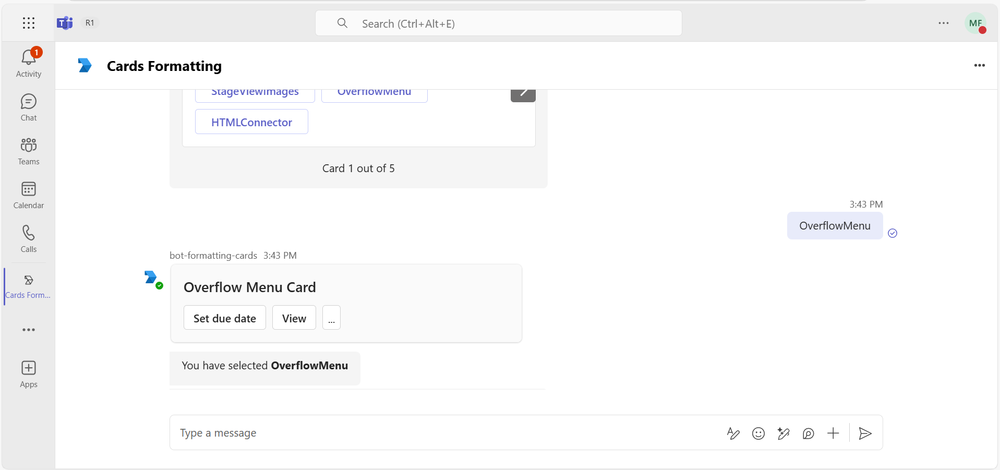
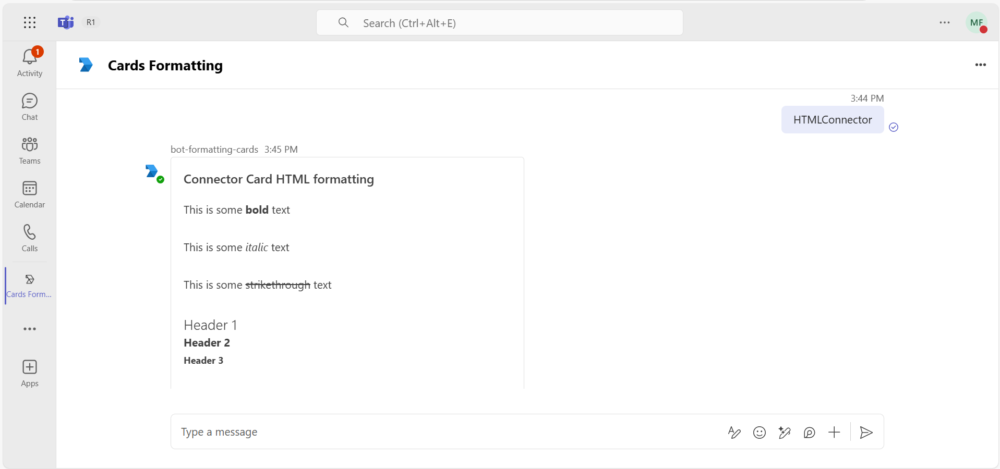
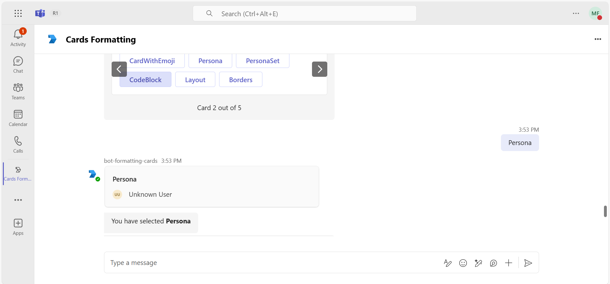

## Different Formatting Cards

This sample shows the feature where user can use different formatting on adaptive cards using bot.

## Included Features
* Bots
* Adaptive Cards

## Interaction with app


## Try it yourself - experience the App in your Microsoft Teams client
Please find below demo manifest which is deployed on Microsoft Azure and you can try it yourself by uploading the app package (.zip file link below) to your teams and/or as a personal app. (Sideloading must be enabled for your tenant, [see steps here](https://docs.microsoft.com/microsoftteams/platform/concepts/build-and-test/prepare-your-o365-tenant#enable-custom-teams-apps-and-turn-on-custom-app-uploading)).

**Send different formatting on cards:** [Manifest](/samples/bot-formatting-cards/nodejs/demo-manifest/bot-formatting-cards.zip)

## Prerequisites

- Microsoft Teams is installed and you have an account
- [Python SDK](https://www.python.org/downloads/) min version 3.8
- [dev tunnel](https://learn.microsoft.com/en-us/azure/developer/dev-tunnels/get-started?tabs=windows) or [ngrok](https://ngrok.com/) latest version or equivalent tunnelling solution
- [Teams Toolkit for VS Code](https://marketplace.visualstudio.com/items?itemName=TeamsDevApp.ms-teams-vscode-extension) or [TeamsFx CLI](https://learn.microsoft.com/microsoftteams/platform/toolkit/teamsfx-cli?pivots=version-one)

## Run the app (Using Teams Toolkit for Visual Studio Code)

The simplest way to run this sample in Teams is to use Teams Toolkit for Visual Studio Code.

1. Ensure you have downloaded and installed [Visual Studio Code](https://code.visualstudio.com/docs/setup/setup-overview)
1. Install the [Teams Toolkit extension](https://marketplace.visualstudio.com/items?itemName=TeamsDevApp.ms-teams-vscode-extension) and [Python Extension](https://marketplace.visualstudio.com/items?itemName=ms-python.python)
1. Select **File > Open Folder** in VS Code and choose this samples directory from the repo
1. Press **CTRL+Shift+P** to open the command box and enter **Python: Create Environment** to create and activate your desired virtual environment. Remember to select `requirements.txt` as dependencies to install when creating the virtual environment.
1. Using the extension, sign in with your Microsoft 365 account where you have permissions to upload custom apps
1. Select **Debug > Start Debugging** or **F5** to run the app in a Teams web client.
1. In the browser that launches, select the **Add** button to install the app to Teams.

> If you do not have permission to upload custom apps (sideloading), Teams Toolkit will recommend creating and using a Microsoft 365 Developer Program account - a free program to get your own dev environment sandbox that includes Teams.

## Setup for bot

> Note these instructions are for running the sample on your local machine, the tunnelling solution is required because
> the Teams service needs to call into the bot.

1) Bot Configuration
- In Azure portal, create Microsoft Entra ID app registration and it will generate MicrosoftAppId and MicrosoftAppPassword for you.
- In Azure portal, create a [Azure Bot resource](https://docs.microsoft.com/azure/bot-service/bot-builder-authentication?view=azure-bot-service-4.0&tabs=csharp%2Caadv2).

- Ensure that you've [enabled the Teams Channel](https://docs.microsoft.com/azure/bot-service/channel-connect-teams?view=azure-bot-service-4.0)
    While registering the bot, use `https://<your_tunnel_domain>/api/messages` as the messaging endpoint.
    
    > NOTE: When you create your app registration in Azure portal, you will create an App ID and App password - make sure you keep these for later.

## Run the app (Manually Uploading to Teams)
## Setup for code

> Note these instructions are for running the sample on your local machine, the tunnelling solution is required because
the Teams service needs to call into the bot.

1) Clone the repository

    ```bash
    git clone https://github.com/OfficeDev/Microsoft-Teams-Samples.git
    ```

2) Run ngrok - point to port 3978

   ```bash
   ngrok http 3978 --host-header="localhost:3978"
   ```  

   Alternatively, you can also use the `dev tunnels`. Please follow [Create and host a dev tunnel](https://learn.microsoft.com/en-us/azure/developer/dev-tunnels/get-started?tabs=windows) and host the tunnel with anonymous user access command as shown below:

   ```bash
   devtunnel host -p 3978 --allow-anonymous
   ```

3) Register a new application in the [Microsoft Entra ID – App Registrations](https://go.microsoft.com/fwlink/?linkid=2083908) portal.
  
  A) Select **New Registration** and on the *register an application page*, set following values:
      * Set **name** to your app name.
      * Choose the **supported account types** (any account type will work)
      * Leave **Redirect URI** empty.
      * Choose **Register**.
  B) On the overview page, copy and save the **Application (client) ID, Directory (tenant) ID**. You'll need those later when updating your Teams application manifest and in the appsettings.json.
  C) Navigate to **API Permissions**, and make sure to add the following permissions:
   Select Add a permission
      * Select Add a permission
      * Select Microsoft Graph -\> Delegated permissions.
      * `User.Read` (enabled by default)
      * Click on Add permissions. Please make sure to grant the admin consent for the required permissions.


4) In a terminal, navigate to `samples/bot-formatting-cards/python`

5) Activate your desired virtual environment

6) Install dependencies by running ```pip install -r requirements.txt``` in the project folder.

7) Update the `config.py` configuration for the bot to use the Microsoft App Id and App Password from the Bot Framework registration. (Note the App Password is referred to as the "client secret" in the azure portal and you can always create a new client secret anytime.)

**Update mentionSupport json**
- Bots support user mention with the Azure AD Object ID and UPN, in addition to the existing IDs. The support for two new IDs is available in bots for text messages, Adaptive Cards body, and message extension response. Bots support the mention IDs in conversation and invoke scenarios. The user gets activity feed notification when being @mentioned with the IDs.

  - Navigate to samples\bot-formatting-cards\python\adaptive_cards\cards.py
  - Go to method `def mentionSupport()` at line number `1203`
      1) On line 1218, replace {{new-Ids}}  
      2) On line 1226, replace {{Email-Id}}
      3) On line 1232, replace {{Microsoft-App-Id}}
         
        - E.g. 
        ```
        "text": "Hi <at>Adele UPN</at>, <at>Adele Azure AD</at>"
            }
        ],
        "msteams": {
            "entities": [
            {
                "type": "mention",
                "text": "<at>Adele UPN</at>",
                "mentioned": {
                "id": "AdeleV@contoso.onmicrosoft.com",
                "name": "Adele Vance"
                }
            },
            {
                "type": "mention",
                "text": "<at>Adele Azure AD</at>",
                "mentioned": {
                "id": "87d349ed-***-****-****-5f2406dee5bd",
                "name": "Adele Vance"
                }
            }
            ]
        ```

  **Note: In adaptive card, what we are defining (User details) should be exist in the same tenant where you are testing the app (teams' login) etc...**
  - Update the user Microsoft Entra object ID in your adaptive card JSON from your tenant's Microsoft Entra ID users available in the Azure portal.
    - Navigate to samples\bot-formatting-cards\python\adaptive_cards
    - Select method `def adaptivePeoplePersonaCardIcon` at line number `1082`
      1) On line 1095, replace {{User-Object-ID}}  
      2) On line 1096, replace {{User-Display-Name}}
      3) On line 1097, replace {{User-Principal-Name}}

        - E.g. 
        ```
        "properties": {
        "id": "87d349ed-xxxx-434a-9e14-xxxx",
        "displayName": "Joe Smith",
        "userPrincipalName": "JoeSmith@xxxx.com"
      }
        ```
    - Navigate to samples\bot-formatting-cards\python\adaptive_cards
    - Select method `def adaptivePeoplePersonaCardSetIcon` at line number `1105`
      1) On line 1120, replace {{User-Object-ID}}  
      2) On line 1121, replace {{User-Display-Name}}
      3) On line 1122, replace {{User-Principal-Name}}
      4) On line 1125, replace {{User-Object-ID}}  
      5) On line 1126, replace {{User-Display-Name}}
      6) On line 1127, replace {{User-Principal-Name}}
      
        - E.g. 
        ```
      "properties": {
        "users": [
          {
            "id": "95d349ed-xxxx-434a-9e14-xxxx",
            "displayName": "Vance Agrawal",
            "userPrincipalName": "VanceAgrawal@xxxx.com"
          },
          {
            "id": "45d349ed-xxxx-434a-9e14-xxxx",
            "displayName": "ku Mao",
            "userPrincipalName": "kuMao@xxxx.com"
          }
        ]
      }
        ```

8) Run your bot with `python app.py`

9) __*This step is specific to Teams.*__
    - **Edit** the `manifest.json` contained in the `appManifest` folder to replace your Microsoft App Id (that was created when you registered your bot earlier) *everywhere* you see the place holder string `${{AAD_APP_CLIENT_ID}}` and `${{TEAMS_APP_ID}}` (depending on the scenario the Microsoft App Id may occur multiple times in the `manifest.json`)
    - **Zip** up the contents of the `appManifest` folder to create a `manifest.zip`
    - **Upload** the `manifest.zip` to Teams (in the Apps view click "Upload a custom app")

- Upload the manifest.zip to Teams (in the Apps view click "Upload a custom app")
   - Go to Microsoft Teams. From the lower left corner, select Apps
   - From the lower left corner, choose Upload a custom App
   - Go to your project directory, the ./appManifest folder, select the zip folder, and choose Open.
   - Select Add in the pop-up dialog box. Your app is uploaded to Teams.


## Running the sample

**Install App:**


**Welcome Message:**


**MentionSupport Card :**


**Info Masking Card :**


**FullWidth Card :**


**StageView Image :**


**Overflow Menu Card:**



**HTML Connector Card :**



**Emoji Card :**


**Persona Card:**



**Persona Set Card :**


**Code Block Card:**


**Layout Card**


**Borders Card**


**Rounded Corners:**


**Fluent Icon Adaptive Card:**


**Media Elements Adaptive Card:**


**Star Ratings Card:**


**Conditional Card:**


**Scrollable Container :**


**Compound Button :**


**Container Layout :**


**Donut Card :**


**Gauge Chart :**


**Horizontal Chart :**


**HorizontalChart Stacked:**


**Line Chart:**


**Pie Chart :**


**VerticalBar Chart:**


**VerticalBar Grouped Chart:**


## Deploy the bot to Azure

To learn more about deploying a bot to Azure, see [Deploy your bot to Azure](https://aka.ms/azuredeployment) for a complete list of deployment instructions.

## Further reading
- [Format cards in Microsoft Teams](https://learn.microsoft.com/en-us/microsoftteams/platform/task-modules-and-cards/cards/cards-format?tabs=adaptive-md%2Cdesktop%2Cconnector-html)
- [Format cards with HTML](https://learn.microsoft.com/en-us/microsoftteams/platform/task-modules-and-cards/cards/cards-format?tabs=adaptive-md%2Cdesktop%2Cconnector-html#format-cards-with-html)
- [People icon in an Adaptive Card](https://learn.microsoft.com/en-us/microsoftteams/platform/task-modules-and-cards/cards/cards-format?tabs=adaptive-md%2Cdesktop%2Cconnector-html#people-icon-in-an-adaptive-card)
- [Fluent icon in an Adaptive Card](https://learn.microsoft.com/en-us/microsoftteams/platform/task-modules-and-cards/cards/cards-format?branch=pr-en-us-11655&tabs=adaptive-md%2Cdesktop%2Cconnector-html)
- [Media elements in Adaptive Card](https://learn.microsoft.com/en-us/microsoftteams/platform/task-modules-and-cards/cards/media-elements-in-adaptive-cards?branch=pr-en-us-11492&tabs=desktop%2Cdeveloper-portal-for-teams)


