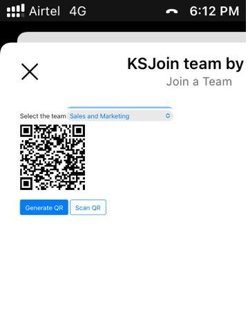

# Join a team using QR code sample

This sample demos a feature where user can join a team using QR code containing the team's id.

User can generate a new QR code (contains team id information) and then scan the QR code to join the team.

`Currently, Microsoft Teams support for QR or barcode scanner capability is only supported for mobile clients`

## Included Features
* Bots
* Adaptive Cards
* Graph API

## Interaction with app

 

 ## Try it yourself - experience the App in your Microsoft Teams client
Please find below demo manifest which is deployed on Microsoft Azure and you can try it yourself by uploading the app package (.zip file link below) to your teams and/or as a personal app. (Sideloading must be enabled for your tenant, [see steps here](https://docs.microsoft.com/microsoftteams/platform/concepts/build-and-test/prepare-your-o365-tenant#enable-custom-teams-apps-and-turn-on-custom-app-uploading)).

**Join a team using QR code:** [Manifest](/samples/bot-join-team-using-qr-code/csharp/demo-manifest/Bot-Join-Team-By-QR.zip)

## Prerequisites

- [.NET Core SDK](https://dotnet.microsoft.com/download) version 6.0

  determine dotnet version
  ```bash
  dotnet --version
  ```
- [Ngrok](https://ngrok.com/download) (For local environment testing) Latest (any other tunneling software can also be used)
  
- [Teams](https://teams.microsoft.com) Microsoft Teams is installed and you have an account

## Setup
1. Register a new application in the [Azure Active Directory – App Registrations](https://go.microsoft.com/fwlink/?linkid=2083908) portal.  
    
  - Navigate to **API Permissions**, and make sure to add the follow permissions:
   - Select Add a permission
   - Select Microsoft Graph -\> Delegated permissions.
       * User.Read (enabled by default)
       * Directory.AccessAsUser.All
       * TeamMember.ReadWrite.All
       * Click on Add permissions.

   

2. Setup for Bot
	
	- Also, register a bot with Azure Bot Service, following the instructions [here](https://docs.microsoft.com/azure/bot-service/bot-service-quickstart-registration?view=azure-bot-service-3.0).
	- Ensure that you've [enabled the Teams Channel](https://docs.microsoft.com/azure/bot-service/channel-connect-teams?view=azure-bot-service-4.0)
	- While registering the bot, use `https://<your_ngrok_url>/api/messages` as the messaging endpoint.

    > NOTE: When you create your app registration, you will create an App ID and App password - make sure you keep these for later.
    
  -In the Azure Portal, navigate back to the Azure Bot resource created (https://learn.microsoft.com/microsoftteams/platform/bots/how-to/authentication/add-authentication?tabs=dotnet%2Cdotnet-sample#azure-ad-v2)
  -Switch to the "Settings" blade and click "Add Setting" under the OAuth Connection Settings section
  - Enter a name for your new Connection setting.  
    - In the Service Provider dropdown, select Azure Active Directory V2
    - Enter in the client id and client secret obtained in step 1 and 1
    - For the Token Exchange URL use the Application ID URL obtained in step 1
    - Specify "common" as the Tenant ID
    - Add all the scopes configured when specifying permissions to downstream APIs in step 1
    - Click "Save"

3. Setup NGROK
      - Run ngrok - point to port 3978

	```bash
	# ngrok http 3978 --host-header="localhost:3978"
	```   
4. Setup for code

  - Clone the repository

    ```bash
    git clone https://github.com/OfficeDev/Microsoft-Teams-Samples.git
    ```
  - Modify the `/appsettings.json` and fill in the following details:
   - `{{ MicrosoftAppId }}` - Generated from Step 1 is the application app id
   - `{{ MicrosoftAppPassword }}` - Generated from Step 1, also referred to as Client secret
   - `{{ ConnectionName }}` - Generated from Step 2, is the name that we provide while adding OAuth connection setting in Azure Bot resource.
    Please follow [Add authentication to bot](https://docs.microsoft.com/microsoftteams/platform/bots/how-to/authentication/add-authentication?tabs=dotnet%2Cdotnet-sample#azure-ad-v2) to configure the connection.
   - `{{ ApplicationBaseUrl }}` - Your application's base url. E.g. https://12345.ngrok-free.app if you are using ngrok.
   
   - In a terminal, navigate to `JoinTeamByQR`

    ```bash
    # change into project folder
    cd # JoinTeamByQR
    ```

- Run the bot from a terminal or from Visual Studio, choose option A or B.

 - From a terminal

   ```bash
   # run the bot
   dotnet run
   ```

 - Or from Visual Studio

  - Launch Visual Studio
  - File -> Open -> Project/Solution
  - Navigate to `samples/bot-join-team-using-qr-code/csharp` folder
  - Select `JoinTeamByQR.csproj` file
  - Press `F5` to run the project
   

5) Setup Manifest for Teams
- __*This step is specific to Teams.*__
    - **Edit** the `manifest.json` contained in the ./AppManifest folder to replace your Microsoft App Id (that was created when you registered your app registration earlier) *everywhere* you see the place holder string `{{Microsoft-App-Id}}` (depending on the scenario the Microsoft App Id may occur multiple times in the `manifest.json`)
    - **Edit** the `manifest.json` for `validDomains` and replace `{{domain-name}}` with base Url of your domain. E.g. if you are using ngrok it would be `https://1234.ngrok-free.app` then your domain-name will be `1234.ngrok-free.app`.
     - **Edit** the `manifest.json` for `webApplicationInfo` resource `"api://botid-{{MicrosoftAppId}}"` with base Url of your domain. E.g. if you are using ngrok it would be `https://1234.ngrok-free.app` then your domain-name will be `"api://botid-{{MicrosoftAppId}}"`.
    - **Zip** up the contents of the `AppManifest` folder to create a `manifest.zip` (Make sure that zip file does not contains any subfolder otherwise you will get error while uploading your .zip package)

- Upload the manifest.zip to Teams (in the Apps view click "Upload a custom app")
   - Go to Microsoft Teams. From the lower left corner, select Apps
   - From the lower left corner, choose Upload a custom App
   - Go to your project directory, the ./AppManifest folder, select the zip folder, and choose Open.
   - Select Add in the pop-up dialog box. Your app is uploaded to Teams.

**Note**: If you are facing any issue in your app, please uncomment [this](https://github.com/OfficeDev/Microsoft-Teams-Samples/blob/main/samples/bot-join-team-using-qr-code/csharp/JoinTeamByQR/AdapterWithErrorHandler.cs#L23) line and put your debugger for local debug.
 
## Running the sample

- Type a message to get a card to generate the QR code.

 

- Select the team from dropdown list for which you want to generate the QR code and then click on 'Generate QR' button.

 

- Scan the generated QR code to join the team.

 

- After Scan the Qr Code Added user in team successfully.

 


## Deploy the bot to Azure

To learn more about deploying a bot to Azure, see [Deploy your bot to Azure](https://aka.ms/azuredeployment) for a complete list of deployment instructions.

## Further reading

- [Bot Framework Documentation](https://docs.botframework.com)
- [Bot Basics](https://docs.microsoft.com/azure/bot-service/bot-builder-basics?view=azure-bot-service-4.0)
- [Azure Bot Service Introduction](https://docs.microsoft.com/azure/bot-service/bot-service-overview-introduction?view=azure-bot-service-4.0)
- [Azure Bot Service Documentation](https://docs.microsoft.com/azure/bot-service/?view=azure-bot-service-4.0)
- [Integrate media Capabilities inside your app](https://learn.microsoft.com/microsoftteams/platform/concepts/device-capabilities/media-capabilities?tabs=mobile)
- [QR Scanner Capability](https://learn.microsoft.com/en-us/microsoftteams/platform/concepts/device-capabilities/qr-barcode-scanner-capability)

