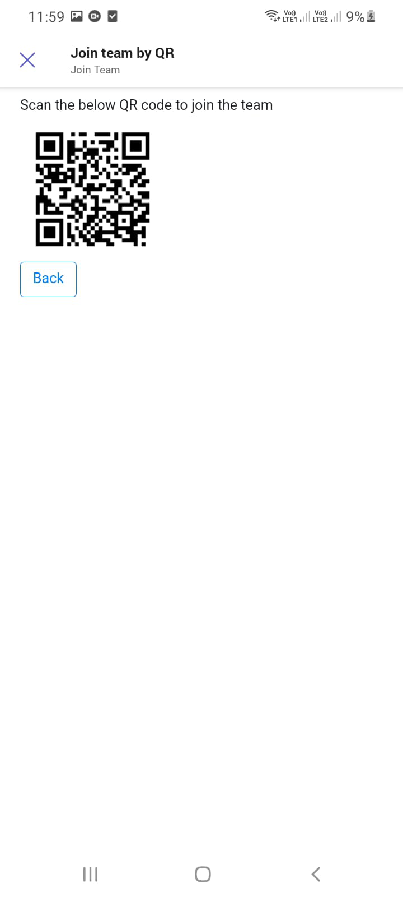

# Join a team using QR code sample

This sample demos a feature where user can join a team using QR code having team id.

User can generate a new QR code (contains team id information) and then scan the QR code to join the team.

`Currently, Microsoft Teams support for QR or barcode scanner capability is only supported for mobile clients`

## Included Features
* Bots
* Adaptive Cards
* Graph API

## Interaction with app

 

## Try it yourself - experience the App in your Microsoft Teams client
Please find below demo manifest which is deployed on Microsoft Azure and you can try it yourself by uploading the app package (.zip file link below) to your teams and/or as a personal app. (Sideloading must be enabled for your tenant, [see steps here](https://docs.microsoft.com/microsoftteams/platform/concepts/build-and-test/prepare-your-o365-tenant#enable-custom-teams-apps-and-turn-on-custom-app-uploading)).

**Join a team using QR code:** [Manifest](/samples/bot-join-team-using-qr-code/csharp/demo-manifest/Bot-Join-Team-By-QR.zip)

## Prerequisites

- Microsoft Teams is installed and you have an account (not a guest account)
-  [NodeJS](https://nodejs.org/en/)
-  [ngrok](https://ngrok.com/) or equivalent tunneling solution
-  [M365 developer account](https://docs.microsoft.com/en-us/microsoftteams/platform/concepts/build-and-test/prepare-your-o365-tenant) or access to a Teams account with the appropriate permissions to install an app.

## Setup

> Note these instructions are for running the sample on your local machine, the tunnelling solution is required because
> the Teams service needs to call into the bot.

**Setup for Bot SSO**

a) In Azure portal, create a [Azure Bot resource.](https://docs.microsoft.com/azure/bot-service/bot-builder-authentication?view=azure-bot-service-4.0&tabs=userassigned%2Caadv2%2Ccsharp).

- Ensure that you've [enabled the Teams Channel](https://docs.microsoft.com/azure/bot-service/channel-connect-teams?view=azure-bot-service-4.0)

b) Navigate to **API Permissions**, and make sure to add the follow permissions:
   - Select Add a permission
   - Select Microsoft Graph -\> Delegated permissions.
       * User.Read (enabled by default)
       * Directory.AccessAsUser.All
       * TeamMember.ReadWrite.All

   - Click on Add permissions.

   

**Code setup**
1) Clone the repository

    ```bash
    git clone https://github.com/OfficeDev/Microsoft-Teams-Samples.git
    ```

2) In a terminal, navigate to `samples/bot-join-team-using-qr-code/nodejs`

3) Install node modules

   Inside node js folder, open your local terminal and run the below command to install node modules. You can do the same in Visual Studio code terminal by opening the project in Visual Studio code.

    ```bash
    npm install
    ```
4) Run ngrok - point to port 3978

    ```bash
    ngrok http 3978 --host-header="localhost:3978"
    ```
5) Open the `.env` configuration file in your project folder (or in Visual Studio Code) and update the following details:
  - `MicrosoftAppId` - It is the AppId created in previous step (Setup for Bot SSO)
  - `MicrosoftAppPassword` - It is referred to as the "client secret" in step 1.a (Setup for Bot SSO) and you can always create a new client secret anytime
  - `ConnectionName` - Generated from Step 1.a, is the name that we provide while adding OAuth connection setting in Azure Bot resource. Please follow [Add authentication to bot](https://docs.microsoft.com/microsoftteams/platform/bots/how-to/authentication/add-authentication?tabs=dotnet%2Cdotnet-sample#azure-ad-v2) to configure the connection.
  - `BaseUrl` with application base url. For example your ngrok url like `https://12123xxxx.ngrok-free.app`. 

6) Run your app

    ```bash
    npm start
    ```

**Manually update the manifest.json**
- Edit the `manifest.json` contained in the  `appPackage/` folder to replace with your MicrosoftAppId (that was created in previous step while doing AAD app registration and is the same value of MicrosoftAppId in `.env` file) *everywhere* you see the place holder string `{{Microsoft-App-Id}}` (depending on the scenario the Microsoft App Id may occur multiple times in the `manifest.json`)

- Also, update {{domain-name}} in your manifest `validDomains` section with your app domain like ngrok domain `1234.ngrok-free.app` excluding http/https.

- Zip up the contents of the `appPackage/` folder to create a `manifest.zip`

- Upload the `manifest.zip` to Teams (in the left-bottom *Apps* view, click "Upload a custom app")

> IMPORTANT: The manifest file in this app adds "token.botframework.com" to the list of `validDomains`. This must be included in any bot that uses the Bot Framework OAuth flow.

**Note**: If you are facing any issue in your app, please uncomment [this](https://github.com/OfficeDev/Microsoft-Teams-Samples/blob/main/samples/bot-join-team-using-qr-code/nodejs/index.js#L50) line and put your debugger for local debug.

## Running the sample

 

- Type a message to get a card to generate the QR code.

 

- Select the team from dropdown list for which you want to generate the QR code and then click on 'Generate QR' button.

 

- Scan the generated QR code to join the team.

 

 ## Deploy the bot to Azure

To learn more about deploying a bot to Azure, see [Deploy your bot to Azure](https://aka.ms/azuredeployment) for a complete list of deployment instructions.

## Further reading

- [Bot Framework Documentation](https://docs.botframework.com)
- [Bot Basics](https://docs.microsoft.com/azure/bot-service/bot-builder-basics?view=azure-bot-service-4.0)
- [Azure Bot Service Introduction](https://docs.microsoft.com/azure/bot-service/bot-service-overview-introduction?view=azure-bot-service-4.0)
- [Azure Bot Service Documentation](https://docs.microsoft.com/azure/bot-service/?view=azure-bot-service-4.0)
- [Integrate media Capabilities inside your app](https://learn.microsoft.com/microsoftteams/platform/concepts/device-capabilities/media-capabilities?tabs=mobile)
- [QR Scanner Capability](https://learn.microsoft.com/en-us/microsoftteams/platform/concepts/device-capabilities/qr-barcode-scanner-capability)


