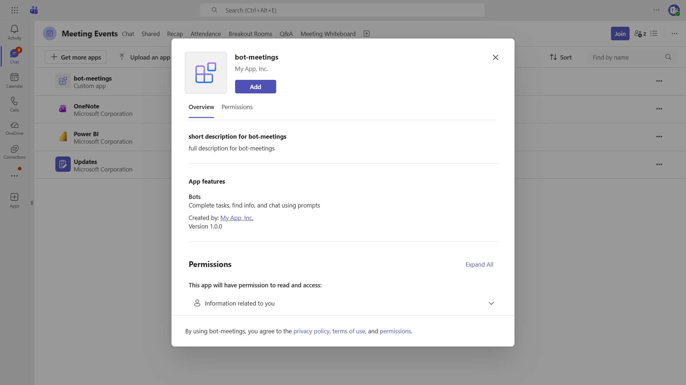
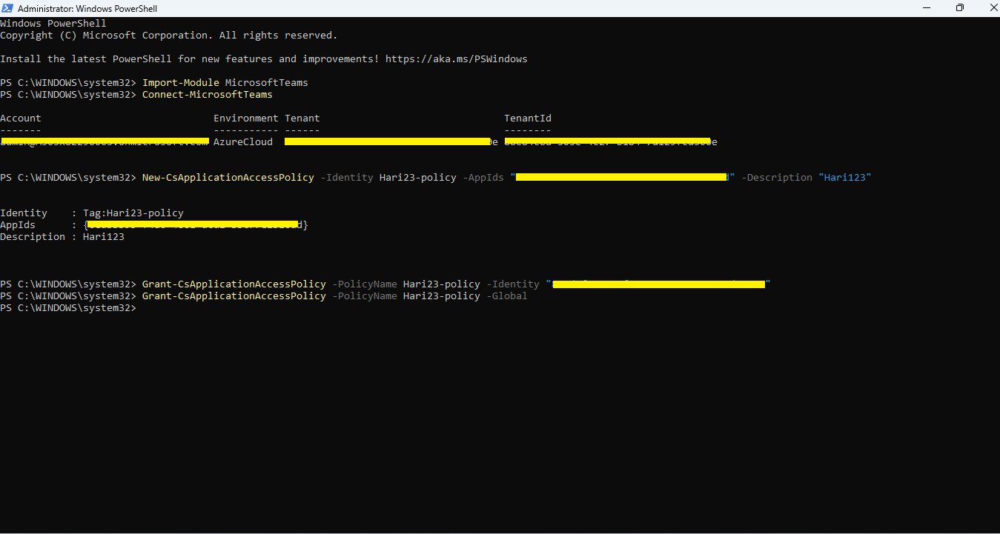
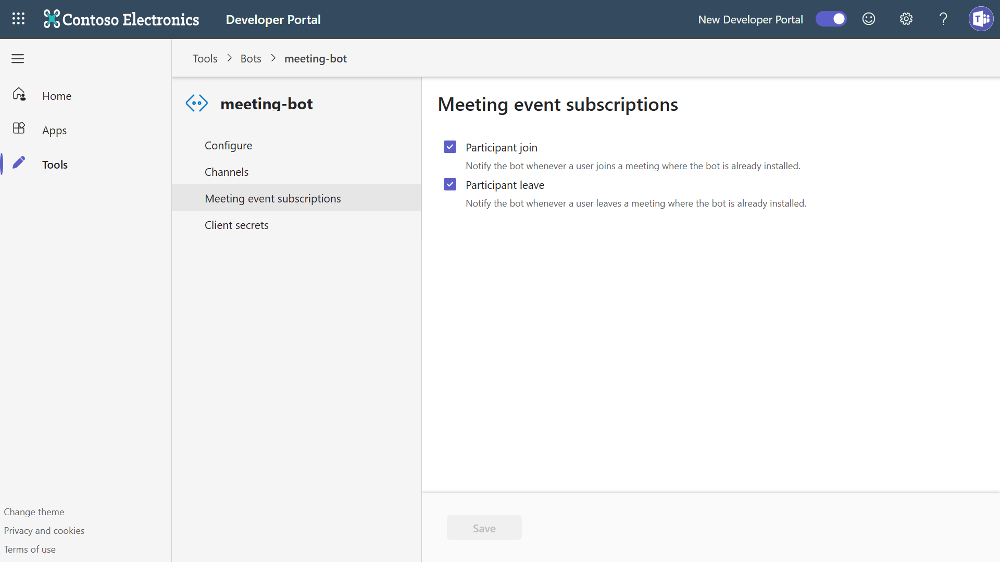

# Bot Meetings

This sample demonstrates how to handle real-time meeting events and retrieve meeting transcripts in Microsoft Teams.

## Table of Contents

- [Interaction with Bot](#interaction-with-bot)
- [Sample Implementations](#sample-implementations)
- [How to run these samples](#how-to-run-these-samples)
  - [Run in the Teams Client](#run-in-the-teams-client)
    - [Configure DevTunnels](#configure-devtunnels)
    - [Provisioning the Teams Application](#provisioning-the-teams-application)
      - [Configure Graph API Permissions](#configure-graph-api-permissions)
      - [Configure RSC Permissions](#configure-rsc-permissions)
- [Configure the new project to use the new Teams Bot Application](#configure-the-new-project-to-use-the-new-teams-bot-application)
  - [Allow applications to access online meetings on behalf of a user](#allow-applications-to-access-online-meetings-on-behalf-of-a-user)
  - [Enable Meeting Participant Events](#enable-meeting-participant-events)
- [Pro Tip: Read the configuration settings using the Azure CLI](#pro-tip-read-the-configuration-settings-using-the-azure-cli)
- [Troubleshooting](#troubleshooting)
- [Further Reading](#further-reading)

## Interaction with Bot



The bot provides the following capabilities:

* **Real-time Meeting Events** - Receives and displays meeting start, end, and participant join/leave events
* **Meeting Transcripts** - Retrieves and displays meeting transcripts via Microsoft Graph API
* **Adaptive Cards** - Interactive cards for viewing transcripts in task modules
* **RSC Permissions** - Resource-specific consent for meeting access

## Sample Implementations

| Language | Framework | Directory |
|----------|-----------|-----------|
| C# | .NET / ASP.NET Core | [dotnet/bot-meetings](dotnet/bot-meetings/README.md) |
| TypeScript | Node.js | [nodejs/bot-meetings](nodejs/bot-meetings/README.md) |
| Python | Python 3.12+ | [python/bot-meetings](python/bot-meetings/README.md) |

# How to run these samples

You can run these samples locally using:

1. In the Teams Client after you have provisioned the Teams Application and configured the application with your local DevTunnels URL.

## Run in the Teams Client

To run these samples in the Teams Client, you need to provision your app in a M365 Tenant, and configure the app to your DevTunnels URL.

1. Install the tool DevTunnels https://learn.microsoft.com/en-us/azure/developer/dev-tunnels/get-started
2. Get Access to a M365 Developer Tenant https://learn.microsoft.com/en-us/office/developer-program/microsoft-365-developer-program-get-started
3. Create a Teams App with the Bot Feature in the Teams Developer Portal (in your tenant) https://dev.teams.microsoft.com

### Configure DevTunnels

Create a persistent tunnel for the port 3978 with anonymous access

```
devtunnel create -a my-tunnel  
devtunnel port create -p 3978  my-tunnel 
devtunnel host  my-tunnel
```

Take note of the URL shown after *Connect via browser:*

### Provisioning the Teams Application

Navigate to the Teams Developer Portal http://dev.teams.microsoft.com

#### Create a new Bot resource

1. Navigate to `Tools->Bot management`, and add a `New bot`
1. In Configure, paste the Endpoint address from devtunnels and append `/api/messages`
1. In Client secrets, create a new secret and save it for later

> Note. If you have access to an Azure Subscription in the same Tenant, you can also create the Azure Bot resource ([learn more](https://learn.microsoft.com/en-us/azure/bot-service/abs-quickstart?view=azure-bot-service-4.0&tabs=singletenant)).

#### Create a new Teams App

1. Navigate to `Apps` and create a `New App`
1. Fill the required values in Basic information (short and long name, short and long description and App URLs)
1. In `App features->Bot` select the bot you created previously
1. Select `Preview in Teams`

> Note. When using an Azure Bot resource, provide the ClientID instead of selecting an existing bot.

#### Configure Graph API Permissions

Navigate to your app registration in the [Microsoft Entra ID – App Registrations](https://portal.azure.com/#blade/Microsoft_AAD_IAM/ActiveDirectoryMenuBlade/RegisteredApps) portal.

1. Under **API Permissions**, select **Add a permission**
2. Select **Microsoft Graph** > **Delegated permissions** and add:
   - `User.Read`
3. Select **Add a permission** again
4. Select **Microsoft Graph** > **Application permissions** and add:
   - `OnlineMeetings.Read.All`
   - `OnlineMeetingTranscript.Read.All`
5. Click **Add permissions**
6. Click **Grant admin consent for [your tenant]** to grant admin consent for these permissions

> **Note**: Admin consent is required for application permissions. If you are not a Global Administrator, contact your tenant admin to grant consent, or use this link: `https://login.microsoftonline.com/common/adminconsent?client_id=<YOUR_APP_ID>`

#### Configure RSC Permissions

Add the following RSC (Resource-Specific Consent) permissions to your Teams app `manifest.json` file in the `webApplicationInfo.authorization.permissions.resourceSpecificPermissions` array:

```json
{
    "name": "OnlineMeeting.ReadBasic.Chat",
    "type": "Application"
},
{
    "name": "OnlineMeetingTranscript.Read.Chat",
    "type": "Application"
},
{
    "name": "ChannelMeeting.ReadBasic.Group",
    "type": "Application"
},
{
    "name": "OnlineMeetingParticipant.Read.Chat",
    "type": "Application"
}
```

These permissions allow the bot to:
- Read basic meeting information
- Access meeting transcripts
- Read channel meeting details
- Monitor meeting participant events

## Configure the new project to use the new Teams Bot Application

For NodeJS and Python you will need a `.env` file with the following fields:

```
TENANT_ID=
CLIENT_ID=
CLIENT_SECRET=
USER_ID=
APP_BASE_URL=
```

For dotnet you need to add these values to `appsettings.json` or `launchSettings.json` using the next syntax.

appSettings.json

```json
"urls" : "http://localhost:3978",
"Teams": {
    "ClientID": "",
    "ClientSecret": "",
    "TenantId": "",
    "AppBaseUrl":""
  },
```

Or to use Env Vars from the profile defined in `launchSettings.json` (using the Environment Configuration Provider)

```json
 "teamsbot": {
      "commandName": "Project",
      "dotnetRunMessages": true,
      "launchBrowser": false,
      "applicationUrl": "http://localhost:3978",
      "environmentVariables": {
        "ASPNETCORE_ENVIRONMENT": "Development",
        "Teams__TenantId": "YOUR_TenantId",
        "Teams__ClientID": "YOUR_ClientId",
        "Teams__ClientSecret": "YOUR_ClientSecret",
        "Teams__AppBaseUrl":"YOUR_AppBaseUrl"
      }
    }
```

### Allow applications to access online meetings on behalf of a user

Follow this link - [Configure application access policy](https://docs.microsoft.com/en-us/graph/cloud-communication-online-meeting-application-access-policy)

**Note**: Copy the User Id you used to granting the policy. You need it while configuring the .env file.



### Enable Meeting Participant Events

To receive real-time participant join and leave events, enable Meeting event subscriptions for `Participant Join` and `Participant Leave` in your bot by following the guidance in the [meeting participant events](https://learn.microsoft.com/microsoftteams/platform/apps-in-teams-meetings/meeting-apps-apis?tabs=dotnet#receive-meeting-participant-events) documentation.



## Pro Tip: Read the configuration settings using the Azure CLI

To obtain the TenantId, ClientId and SecretId you can use the Azure CLI with:

> Note. If you don't have access to an Azure Subscription you can still use the Azure CLI, make sure you login with `az login --allow-no-subscription` 

```
az ad app credential reset --id $appId
```

## Troubleshooting

- If Teams cannot communicate with your bot, verify your DevTunnels URL is reachable.
- Ensure your .env or appsettings file is setup correctly.
- Use the Channels UI in Azure Bot Service in the Azure Portal to see detailed endpoint errors (not available in Teams Developer Portal).

## Further Reading

- [Microsoft Teams SDK Documentation](https://learn.microsoft.com/microsoftteams/platform/)
