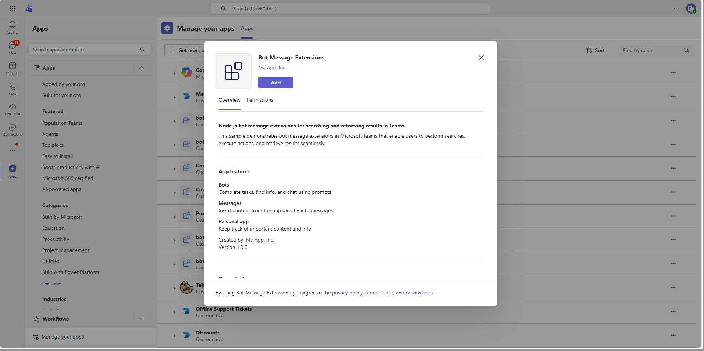

# Bot Message Extensions

This sample demonstrates message extensions for Microsoft Teams, showcasing multiple extension capabilities including:

- **Search Commands** - Wikipedia article search, NuGet package search, and expert finder (by name and skill)
- **Action Commands** - Create custom Adaptive Cards and retrieve message details
- **Link Unfurling** - Generates rich link previews when URLs are shared
- **Result Grid** - Displays search results in a grid layout
- **Adaptive Cards** - Rich interactive cards for displaying search results and expert profiles

## Table of Contents

- [Interaction with Bot](#interaction-with-bot)
- [Sample Implementations](#sample-implementations)
- [Prerequisites](#prerequisites)
- [Setup Instructions](#setup-instructions)
- [Running the Sample](#running-the-sample)
- [Troubleshooting](#troubleshooting)
- [Further Reading](#further-reading)

## Interaction with Bot



## Sample Implementations

| Language | Framework | Directory |
|----------|-----------|-----------|
| C# | .NET / ASP.NET Core | [dotnet/bot-message-extensions](dotnet/bot-message-extensions/README.md) |
| TypeScript | Node.js | [nodejs/bot-message-extensions](nodejs/bot-message-extensions/README.md) |
| Python | Python 3.12+ | [python/bot-message-extensions](python/bot-message-extensions/README.md) |

## Prerequisites

- Microsoft Teams is installed and you have an account (not a guest account)
- [M365 developer account](https://docs.microsoft.com/en-us/microsoftteams/platform/concepts/build-and-test/prepare-your-o365-tenant) or access to a Teams account with the appropriate permissions to install an app
- [dev tunnel](https://learn.microsoft.com/en-us/azure/developer/dev-tunnels/get-started?tabs=windows) or [ngrok](https://ngrok.com/download) latest version or equivalent tunneling solution
- Language-specific prerequisites:
  - **Node.js**: [NodeJS](https://nodejs.org/en/download/) version 16.14.2 or higher
  - **.NET**: [.NET SDK](https://dotnet.microsoft.com/download)
  - **Python**: Python 3.12 or higher

## Setup Instructions

> Note: These instructions are for running the sample on your local machine. The tunnelling solution is required because the Teams service needs to call into the bot.

### 1. Setup Local Tunnel

**Using dev tunnels:**

Please follow [Create and host a dev tunnel](https://learn.microsoft.com/en-us/azure/developer/dev-tunnels/get-started?tabs=windows) and host the tunnel with anonymous user access:

```bash
devtunnel host -p 3978 --allow-anonymous
```

**Using ngrok:**

```bash
ngrok http 3978 --host-header="localhost:3978"
```

### 2. Register Azure AD Application

Register a new application in the [Microsoft Entra ID – App Registrations](https://go.microsoft.com/fwlink/?linkid=2083908) portal.

**A) Create New Registration:**
- Select **New Registration** and on the *register an application page*, set following values:
  - Set **name** to your app name
  - Choose the **supported account types** (any account type will work)
  - Leave **Redirect URI** empty
  - Choose **Register**

**B) Save Application Details:**
- On the overview page, copy and save the **Application (client) ID** and **Directory (tenant) ID**
- You'll need these later when updating your Teams application manifest and configuration files

**C) Create Client Secret:**
- Under **Manage**, navigate to **Certificates & secrets**
- In the **Client secrets** section, click on **+ New client secret**
- Add a description (e.g., "Teams Bot Secret") and select an expiration period
- Click **Add**
- **Important**: Copy the client secret **Value** immediately and save it securely. You won't be able to see it again!

**D) Configure API Permissions:**
- Navigate to **API Permissions**
- Click **Add a permission**
- Select **Microsoft Graph** -> **Application permissions**:
  - `User.Read.All` (for expert search by name via Microsoft Graph)
- Click **Add permissions**
- Click **Grant admin consent** to grant admin consent for the required permissions

> **Note**: The `User.Read.All` application permission is required for the "Search by Name" expert finder feature, which uses the Microsoft Graph API to search for users in your organization. If you don't need this feature, you can skip this step.

### 3. Create Bot Registration

Navigate to the Teams Developer Portal http://dev.teams.microsoft.com

**Create a new Bot resource:**

1. Navigate to `Tools->Bot management`, and add a `New bot`
2. In Configure, paste the Endpoint address from devtunnels and append `/api/messages`
3. In Client secrets, create a new secret and save it for later

> Note. If you have access to an Azure Subscription in the same Tenant, you can also create the Azure Bot resource ([learn more](https://learn.microsoft.com/en-us/azure/bot-service/abs-quickstart?view=azure-bot-service-4.0&tabs=singletenant)).

### 4. Setup Code

**Navigate to your chosen language sample directory:**

```bash
# For Node.js:
cd samples/bot-message-extensions/nodejs/bot-message-extensions

# For .NET:
cd samples/bot-message-extensions/dotnet/bot-message-extensions

# For Python:
cd samples/bot-message-extensions/python/bot-message-extensions
```

**Install dependencies:**

For Node.js:
```bash
npm install
```

For .NET:
```bash
dotnet restore
```

For Python:
```bash
pip install -e .
```

**Configure environment variables:**

Update the configuration file for your selected language (for Node.js/Python, the `.env` file; for .NET, `appsettings.json` or `launchSettings.json`) with the values from step 2 (Azure AD app registration):

For NodeJS and Python you will need a `.env` file with the following fields:

```
TENANT_ID=<Your Directory (tenant) ID>
CLIENT_ID=<Your Application (client) ID>
CLIENT_SECRET=<Your client secret value>
USER_ID=<User ID from application access policy>
APP_BASE_URL=<Your tunnel URL>
```

For .NET you need to add these values to `appsettings.json` or `launchSettings.json` using the next syntax:

appSettings.json:

```json
"urls" : "http://localhost:3978",
"Teams": {
    "ClientID": "<Your Application (client) ID>",
    "ClientSecret": "<Your client secret value>",
    "TenantId": "<Your Directory (tenant) ID>",
    "AppBaseUrl":"<Your tunnel URL>"
  },
```

Or to use Env Vars from the profile defined in `launchSettings.json` (using the Environment Configuration Provider):

```json
 "teamsbot": {
      "commandName": "Project",
      "dotnetRunMessages": true,
      "launchBrowser": false,
      "applicationUrl": "http://localhost:3978",
      "environmentVariables": {
        "ASPNETCORE_ENVIRONMENT": "Development",
        "Teams__TenantId": "YOUR_TenantId",
        "Teams__ClientID": "YOUR_ClientId",
        "Teams__ClientSecret": "YOUR_ClientSecret",
        "Teams__AppBaseUrl":"YOUR_AppBaseUrl"
      }
    }
```

> **Pro Tip**: To obtain the TenantId, ClientId and SecretId you can use the Azure CLI with: `az ad app credential reset --id $appId`
> 
> Note. If you don't have access to an Azure Subscription you can still use the Azure CLI, make sure you login with `az login --allow-no-subscription`

**Start the bot:**

For Node.js:
```bash
npm start
```

For .NET:
```bash
dotnet run
```

For Python:
```bash
python app.py
```

### 5. Setup Teams App Manifest

**Edit the manifest:**

- Navigate to the `appManifest/` or `appPackage/` folder
- Edit `manifest.json` and replace:
  - `{MicrosoftAppId}` or `<<MICROSOFT-APP-ID>>` - Replace with your Application (client) ID from step 2 (appears in multiple places)
  - `<<DOMAIN-NAME>>` - Replace with your tunnel domain:
    - For ngrok: `1234.ngrok-free.app` (from `https://1234.ngrok-free.app`)
    - For dev tunnels: `12345.devtunnels.ms`

- Ensure the `manifest.json` includes the `composeExtensions` section as shown below:

```json
"composeExtensions": [
  {
    "botId": "${BOT_ID}",
    "canUpdateConfiguration": true,
    "commands": [
      {
        "id": "wikipediaSearch",
        "context": [ "compose", "commandBox" ],
        "description": "Search Wikipedia articles",
        "title": "Wikipedia Search",
        "type": "query",
        "parameters": [
          {
            "name": "searchQuery",
            "title": "Search Query",
            "description": "Your search query",
            "inputType": "text"
          }
        ]
      }
    ],
    "messageHandlers": [
      {
        "type": "link",
        "value": {
          "domains": ["*.wikipedia.org"]
        }
      }
    ]
  }
],
```

**Create app package:**

- Zip up the contents of the `appManifest/` or `appPackage/` folder to create a `manifest.zip`

**Upload to Teams:**

- In Microsoft Teams, go to **Apps** (left sidebar)
- Click **Manage your apps** → **Upload an app** → **Upload a custom app**
- Select the `manifest.zip` file

## Running the Sample

Once the bot is running and added to Teams, you can interact with it through the compose message area:

- **Wikipedia Search** - Search for Wikipedia articles directly from the compose box
- **NuGet Search** - Find NuGet packages by name or keyword
- **Expert Finder (by Name)** - Search for people in your organization using Microsoft Graph
- **Expert Finder (by Skill)** - Find experts based on skills, topics, or departments from a local experts directory
- **Create Card** - Use the action command to create custom Adaptive Cards with a title and description
- **Get Message Details** - Right-click a message to retrieve its details via an action command
- **Link Unfurling** - Share a URL in the compose area to get a rich link preview
- **Result Grid** - View image results displayed in a grid layout

## Troubleshooting

- If Teams cannot communicate with your bot, verify your DevTunnels URL is reachable
- Ensure your `.env` file is configured correctly with valid `TENANT_ID`, `CLIENT_ID`, and `CLIENT_SECRET`
- If the "Search by Name" expert finder returns errors, verify that `User.Read.All` application permission has been granted and admin consent is provided
- If NuGet or Wikipedia search fails, check your network connectivity
- Use the Channels UI in Azure Bot Service in the Azure Portal to see detailed endpoint errors (not available in Teams Developer Portal)

## Further Reading

### Teams Development
- [Microsoft Teams SDK Documentation](https://learn.microsoft.com/microsoftteams/platform/) - Official Microsoft Teams platform documentation
- [Microsoft Teams Developer Platform](https://docs.microsoft.com/en-us/microsoftteams/platform/) - Comprehensive guide for Teams app development

### Message Extensions
- [Message extensions overview](https://learn.microsoft.com/en-us/microsoftteams/platform/messaging-extensions/what-are-messaging-extensions) - Introduction to message extensions
- [Search commands](https://learn.microsoft.com/en-us/microsoftteams/platform/messaging-extensions/how-to/search-commands/define-search-command) - Define search commands for message extensions
- [Action commands](https://learn.microsoft.com/en-us/microsoftteams/platform/messaging-extensions/how-to/action-commands/define-action-command) - Define action commands for message extensions
- [Link unfurling](https://learn.microsoft.com/en-us/microsoftteams/platform/messaging-extensions/how-to/link-unfurling) - Implement link unfurling in message extensions

### Tools & Resources
- [Microsoft 365 Agents Toolkit](https://marketplace.visualstudio.com/items?itemName=TeamsDevApp.ms-teams-vscode-extension) - VS Code extension for Teams development
- [Azure Bot Service](https://azure.microsoft.com/services/bot-services/) - Cloud-based bot development service
