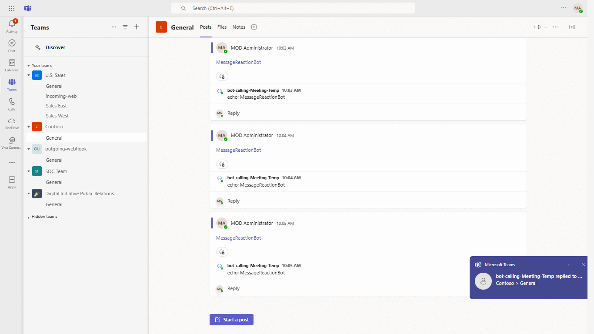

# Teams Message Reactions Bot Java Sample

Bot Framework v4 core bot sample.

Bot Framework [message reactions](https://docs.microsoft.com/en-us/microsoftteams/platform/bots/how-to/conversations/subscribe-to-conversation-events?tabs=dotnet#message-reaction-events) bot sample.

This bot has been created using [Bot Framework](https://dev.botframework.com), it shows how to create a simple bot that responds to Message Reactions.

This sample is a Spring Boot app and uses the Azure CLI and azure-webapp Maven plugin to deploy to Azure.

## Included Features
* Bots
* Adaptive Cards

## Interaction with bot


## Try it yourself - experience the App in your Microsoft Teams client
Please find below demo manifest which is deployed on Microsoft Azure and you can try it yourself by uploading the app package (.zip file link below) to your teams and/or as a personal app. (Sideloading must be enabled for your tenant, [see steps here](https://docs.microsoft.com/microsoftteams/platform/concepts/build-and-test/prepare-your-o365-tenant#enable-custom-teams-apps-and-turn-on-custom-app-uploading)).

**Teams Message Reactions Bot:** [Manifest](/samples/bot-message-reaction/csharp/demo-manifest/bot-message-reaction.zip)

## Prerequisites

- Intall Java 1.8+ [Java](https://www.oracle.com/java/technologies/downloads/#java8-windows)
- Install [Maven](https://maven.apache.org/)
- Setup for Java and Maven [Setup](Setup.md)
- An account on [Azure](https://azure.microsoft.com) if you want to deploy to Azure.
- Microsoft Teams is installed and you have an account
- [ngrok](https://ngrok.com/) or equivalent tunnelling solution

## Setup

> Note these instructions are for running the sample on your local machine, the tunnelling solution is required because
the Teams service needs to call into the bot.

1) Run ngrok - point to port 3978

    ```bash
    ngrok http 3978 --host-header="localhost:3978"
    ```

1) Setup for Bot

   In Azure portal, create a [Azure Bot resource](https://docs.microsoft.com/azure/bot-service/bot-service-quickstart-registration).
    - For bot handle, make up a name.
    - Select "Use existing app registration" (Create the app registration in Azure Active Directory beforehand.)
    - __*If you don't have an Azure account*__ create an [Azure free account here](https://azure.microsoft.com/free/)

   In the new Azure Bot resource in the Portal, 
    - Ensure that you've [enabled the Teams Channel](https://learn.microsoft.com/azure/bot-service/channel-connect-teams?view=azure-bot-service-4.0)
    - In Settings/Configuration/Messaging endpoint, enter the current `https` URL you were given by running ngrok. Append with the path `/api/messages`

1) Clone the repository

    ```bash
    git clone https://github.com/OfficeDev/Microsoft-Teams-Samples.git
    ```

1) Update the `resources/application.properties` file configuration in your project, for the bot to use the Microsoft App Id and App Password from the Bot Framework registration. (Note the App Password is referred to as the "client secret" in the azure portal and you can always create a new client secret anytime.)

1) From the root of this project folder: (`samples/bot-message-reaction/java`)
    - Open a terminal and build the sample using `mvn package` command
    - Install the packages in the local cache by using `mvn install` command in a terminal
    - Run it by using `java -jar .\target\bot-messagereaction-sample.jar` command in a terminal

1) __*This step is specific to Teams.*__
    - **Edit** the `manifest.json` contained in the  `TeamsAppManifest` folder to replace your Microsoft App Id (that was created when you registered your bot earlier) *everywhere* you see the place holder string `<<YOUR-MICROSOFT-APP-ID>>` (depending on the scenario the Microsoft App Id may occur multiple times in the `manifest.json`)
    - **Edit** the `manifest.json` for `validDomains` with base Url domain. E.g. if you are using ngrok it would be `https://1234.ngrok-free.app` then your domain-name will be `1234.ngrok-free.app`.
    - **Zip** up the contents of the `TeamsAppManifest` folder to create a `manifest.zip` (Make sure that zip file does not contains any subfolder otherwise you will get error while uploading your .zip package)
    - **Upload** the `manifest.zip` to Teams (In Teams Apps/Manage your apps click "Upload an app". Browse to and Open the .zip file. At the next dialog, click the Add button.)
    - Add the app in personal/groupchat/team scope (supported scopes)
    
### Connect to the bot using Bot Framework Emulator (Optional Step - Not required, if you have already configured your Azure Bot)

- Launch Bot Framework Emulator
- File -> Open Bot
- Enter a Bot URL of `http://localhost:3978/api/messages`

## Running the sample

Message the bot and it will respond with an 'Echo: [your message]'.  Add a message reaction to the bots response, and the bot will reply accordingly.


## Deploy the bot to Azure

To learn more about deploying a bot to Azure, see [Deploy your bot to Azure](https://aka.ms/azuredeployment) for a complete list of deployment instructions.
## Further reading

- [Spring Boot](https://spring.io/projects/spring-boot)
- [Maven Plugin for Azure App Service](https://github.com/microsoft/azure-maven-plugins/tree/develop/azure-webapp-maven-plugin)
- [Azure for Java cloud developers](https://docs.microsoft.com/en-us/azure/java/?view=azure-java-stable)
- [Bot Framework Documentation](https://docs.botframework.com)
- [Bot Basics](https://docs.microsoft.com/azure/bot-service/bot-builder-basics?view=azure-bot-service-4.0)
- [Azure Bot Service Introduction](https://docs.microsoft.com/azure/bot-service/bot-service-overview-introduction?view=azure-bot-service-4.0)
- [Azure Bot Service Documentation](https://docs.microsoft.com/azure/bot-service/?view=azure-bot-service-4.0)
- [Teams Message Reaction Events](https://docs.microsoft.com/en-us/microsoftteams/platform/bots/how-to/conversations/subscribe-to-conversation-events?tabs=dotnet#message-reaction-events)


