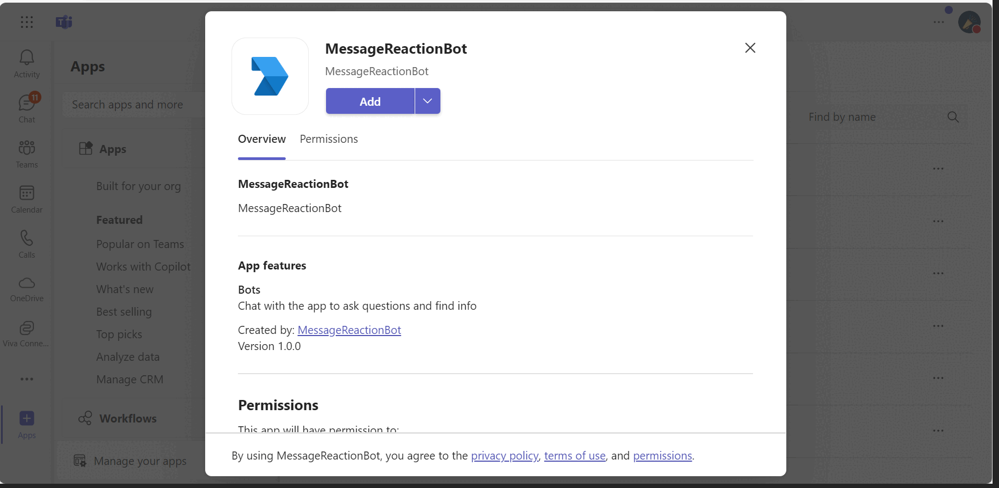

# Message Reaction Bot - Node.js (TypeScript)

This sample demonstrates a Message Reaction Bot for Microsoft Teams using Node.js and TypeScript. The bot echoes back messages and responds to message reactions (likes, emojis, etc.).

## Prerequisites

- [Node.js](https://nodejs.org/) (LTS version recommended)

## Interaction with bot
 

## Run the sample

1. Navigate to this directory:
   ```bash
   cd nodejs/bot-message-reaction
   ```

2. Install dependencies:
   ```bash
   npm install
   ```

3. Run the bot:
   ```bash
   npm start
   ```

The bot will start listening on `http://localhost:3978`.

## Features

- **Echo Messages**: The bot echoes back any message sent to it
- **Reaction Tracking**: When you react to a bot message with an emoji, the bot will acknowledge the reaction
- **Reaction Removal**: When you remove a reaction, the bot will acknowledge the removal

## Configuration

`.env` fill in your credentials:

```
TENANT_ID=your-tenant-id
CLIENT_ID=your-client-id
CLIENT_SECRET=your-client-secret
```

Refer to the main [README.md](../../README.md) to interact with your bot in the agentsplayground or in Teams.
