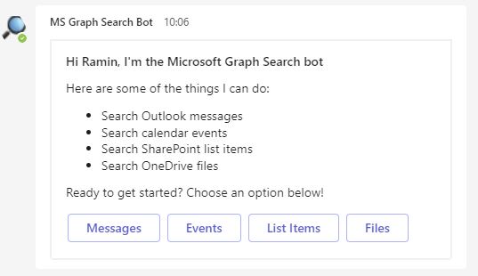
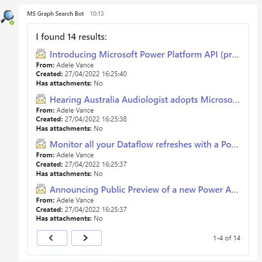
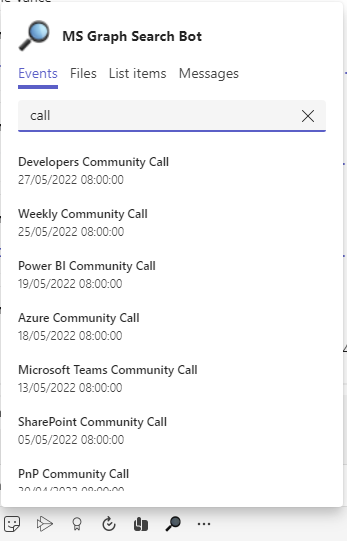
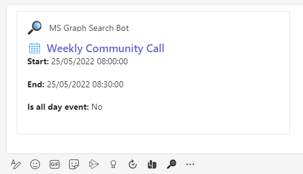

---
page_type: sample
description: This sample shows how to use Microsoft Graph Search to pull different entities across the Office 365 and display the results on Adaptive cards with pagination
products:
- office-teams
- office
- office-365
languages:
- csharp
extensions:
contentType: samples
createdDate: "01-05-2022"
---

# Bot search office 365 entities using Graph Search API

Using this C# sample, a bot can retreive different entities such as messages, events, files, and SharePoint list items using Microsoft Graph Search, and display the resutls in adaptive cards with paginag capability.

# Key features

* Search different office 365 entities



* Split the results into configurable pages (Adaptive Cards with pagination):



* Messaging extension





## Prerequisites

- [.NET Core SDK](https://dotnet.microsoft.com/download) version 3.1

  determine dotnet version
  ```bash
  dotnet --version
  ```
- [Ngrok](https://ngrok.com/download) (For local environment testing) Latest (any other tunneling software can also be used)
  
  run ngrok locally
  ```bash
  ngrok http -host-header=localhost 3978
  ```
- [Teams](https://teams.microsoft.com) Microsoft Teams is installed and you have an account

## To try this sample

1) Setup for Bot In Azure portal, create a [Azure Bot resource](https://docs.microsoft.com/en-us/azure/bot-service/bot-builder-authentication?view=azure-bot-service-4.0&tabs=csharp%2Caadv2).

   - Ensure that you've [enabled the Teams Channel](https://docs.microsoft.com/en-us/azure/bot-service/channel-connect-teams?view=azure-bot-service-4.0)
   - [Setup SSO](https://github.com/OfficeDev/Microsoft-Teams-Samples/blob/main/samples/bot-conversation-sso-quickstart/BotSSOSetup.md).


2) Add required permissions
    * Add following delegated permissions:
        * Calendars.Read
        * Files.Read.All
        * Mail.Read
        * Sites.Read.All
   
2) Clone the repository
   ```bash
   git clone https://github.com/OfficeDev/Microsoft-Teams-Samples.git
   ```
   
3) Launch Visual Studio
   - File -> Open -> Project/Solution
   - Navigate to folder where repository is cloned then `samples/bot-msgraph-search/MSGraphSearchBot/MSGraphSearchSample.sln`
    
4) Run ngrok - point to port 3978

    ```bash
    # ngrok http -host-header=rewrite 3978
    ```
 
5) Setup and run the bot from Visual Studio: 
   Modify the `appsettings.json` and fill in the following details:
   - `{{MicrosoftAppId}}` - Generated from Step 1 is the application app id
   - `{{MicrosoftAppPassword}}` - Generated from Step 1, also referred to as Client secret
   - `{{MicrosoftAppTenantId}}` - Your tenant id
   - `{{ConnectionName}}` - Generated from SSO setup
   - `{{SearchPageSize}}` - Number of items in each page (default is 4)
   - `{{SearchSizeThreshold}}` - Threshold to get next set of results (default is 20)
	 
6) Modify the `manifest.json` in the `/AppPackage` folder and replace the following details:
   - `{{Microsoft-App-Id}}` with Application id generated from Step 1
   - `{{domain-name}}` with base Url domain. E.g. if you are using ngrok it would be `https://1234.ngrok.io` then your domain-name will be `1234.ngrok.io`.

7) Zip the contents of `AppPackage` folder into a `manifest.zip`, and use the `manifest.zip` to deploy in app store or add to Teams using step 8.

8) Upload the manifest.zip to Teams (in the Apps view click "Upload a custom app")
   - Go to Microsoft Teams and then go to side panel, select Apps
   - Choose Upload a custom App
   - Go to your project directory, the ./AppPackage folder, select the zip folder, and choose Open.
   - Select Add in the pop-up dialog box. Your app is uploaded to Teams.

## Deploy the bot to Azure

To learn more about deploying a bot to Azure, see [Deploy your bot to Azure](https://aka.ms/azuredeployment) for a complete list of deployment instructions.

## Further reading

- [Bot Framework Documentation](https://docs.botframework.com)
- [Bot Basics](https://docs.microsoft.com/azure/bot-service/bot-builder-basics?view=azure-bot-service-4.0)
- [Activity processing](https://docs.microsoft.com/en-us/azure/bot-service/bot-builder-concept-activity-processing?view=azure-bot-service-4.0)
- [Azure Bot Service Introduction](https://docs.microsoft.com/azure/bot-service/bot-service-overview-introduction?view=azure-bot-service-4.0)
- [Azure Bot Service Documentation](https://docs.microsoft.com/azure/bot-service/?view=azure-bot-service-4.0)
- [.NET Core CLI tools](https://docs.microsoft.com/en-us/dotnet/core/tools/?tabs=netcore2x)
- [Azure CLI](https://docs.microsoft.com/cli/azure/?view=azure-cli-latest)
- [Azure Portal](https://portal.azure.com)
- [Language Understanding using LUIS](https://docs.microsoft.com/en-us/azure/cognitive-services/luis/)
- [Channels and Bot Connector Service](https://docs.microsoft.com/en-us/azure/bot-service/bot-concepts?view=azure-bot-service-4.0)