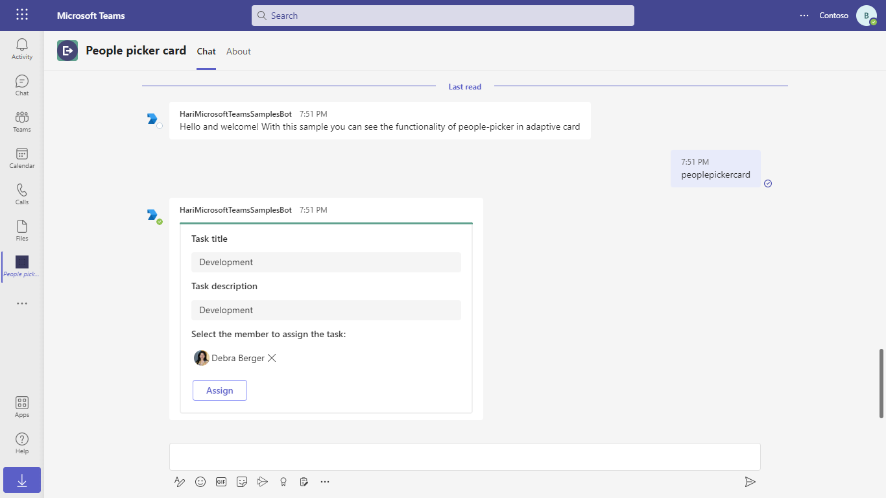
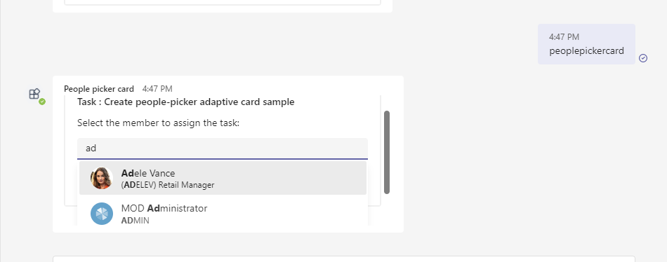
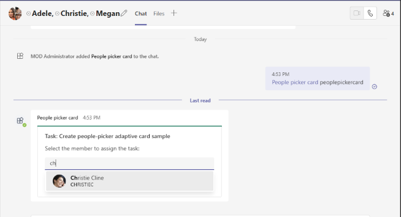
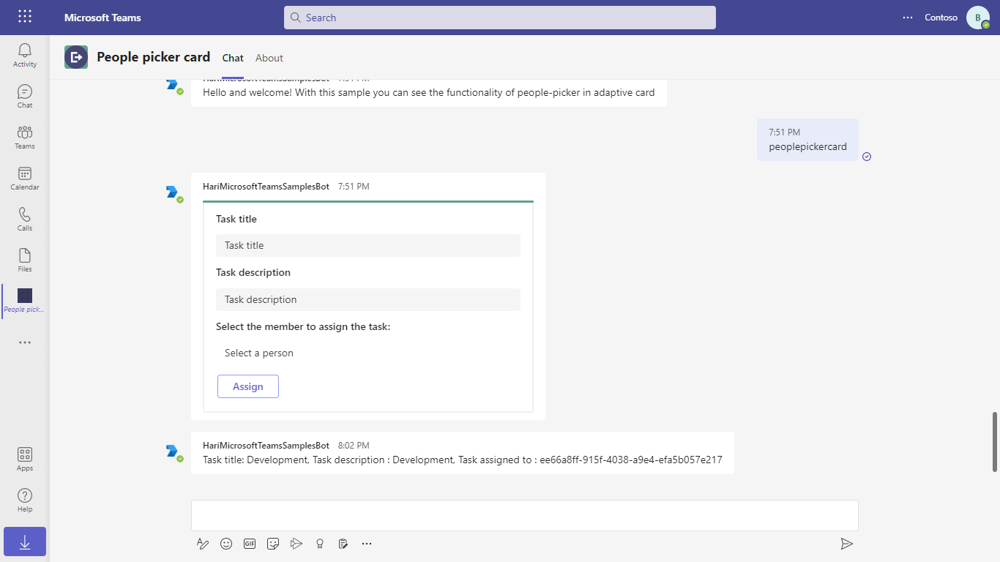

# People picker control in Adaptive Cards

This sample shows the feature of people picker on Adaptive Cards.

 Use the bot command `peoplepickercard` to get the card with people picker control

 ## Included Features
* Bots
* People Picker in Adaptive Card 

## Interaction with app

 

 ## Try it yourself - experience the App in your Microsoft Teams client
Please find below demo manifest which is deployed on Microsoft Azure and you can try it yourself by uploading the app package (.zip file link below) to your teams and/or as a personal app. (Sideloading must be enabled for your tenant, [see steps here](https://docs.microsoft.com/microsoftteams/platform/concepts/build-and-test/prepare-your-o365-tenant#enable-custom-teams-apps-and-turn-on-custom-app-uploading)).

**People picker control in Adaptive Cards:** [Manifest](/samples/bot-people-picker-adaptive-card/csharp/demo-manifest/People-picker-adaptive-card.zip)

## Prerequisites

- To test locally, [NodeJS](https://nodejs.org/en/download/) must be installed on your development machine (version 16.14.2  or higher)

- You'll need [Ngrok](https://ngrok.com/) installed on your development machine.
Make sure you've downloaded and installed Ngrok on your local machine. ngrok will tunnel requests from the Internet to your local computer and terminate the SSL connection from Teams.

## Setup

> Note these instructions are for running the sample on your local machine, the tunnelling solution is required because
> the Teams service needs to call into the bot.

1) Setup for Bot
- In Azure portal, create AAD app registraion and it will generate MicrosoftAppId and MicrosoftAppPassword for you.
- In Azure portal, create a [Azure Bot resource](https://docs.microsoft.com/azure/bot-service/bot-builder-authentication?view=azure-bot-service-4.0&tabs=csharp%2Caadv2).

- Ensure that you've [enabled the Teams Channel](https://docs.microsoft.com/azure/bot-service/channel-connect-teams?view=azure-bot-service-4.0)
    While registering the bot, use `https://<your_ngrok_url>/api/messages` as the messaging endpoint.
    
    > NOTE: When you create your app registration in Azure portal, you will create an App ID and App password - make sure you keep these for later.

2) Setup NGROK  
Run ngrok - point to port 3978

    ```bash
    ngrok http 3978 --host-header="localhost:3978"
    ```

3) Setup for code
- Clone the repository

    ```bash
    git clone https://github.com/OfficeDev/Microsoft-Teams-Samples.git
    ```
- In the folder where repository is cloned navigate to `samples/bot-people-picker-adaptive-card/nodejs`

- Install node modules

   Inside node js folder, open your local terminal and run the below command to install node modules. You can do the same in Visual Studio code terminal by opening the project in Visual Studio code.

    ```bash
    npm install
    ```

- Open the `.env` configuration file in your project folder (or in Visual Studio Code) and update the `MicrosoftAppId` and `MicrosoftAppPassword` with the values generated while doing AAD app registration including Secret creation.(ClientSecret is referred to as the "client secret" generated from your AAD app registrationin.

- Run your app

    ```bash
    npm start
    ```

4) Setup Manifest for Teams

    - Edit the `manifest.json` contained in the  `appPackage/` folder to replace with your MicrosoftAppId (that was created in step 1 and is the same value of MicrosoftAppId in `.env` file) *everywhere* you see the place holder string `{{Microsoft-App-Id}}` (depending on the scenario the Microsoft App Id may occur multiple times in the `manifest.json`).
    - Zip up the contents of the `appPackage/` folder to create a `manifest.zip`
    - Upload the `manifest.zip` to Teams (in the left-bottom *Apps* view, click "Upload a custom app")

**Note**: If you are facing any issue in your app, please uncomment [this](https://github.com/OfficeDev/Microsoft-Teams-Samples/blob/main/samples/bot-people-picker-adaptive-card/nodejs/index.js#L44) line and put your debugger for local debug.

## Running the sample

**Peoplepickercard command interaction:**



**Personal scope get all the users of organisation:**



**Team or groupchat scope get user list to current context:**



**On Assign button click the bot will return the member id that we have selected:**



## Deploy the bot to Azure

To learn more about deploying a bot to Azure, see [Deploy your bot to Azure](https://aka.ms/azuredeployment) for a complete list of deployment instructions.

## Further reading

- [Bot Framework Documentation](https://docs.botframework.com)
- [Bot Basics](https://docs.microsoft.com/azure/bot-service/bot-builder-basics?view=azure-bot-service-4.0)
- [Azure Bot Service Introduction](https://docs.microsoft.com/azure/bot-service/bot-service-overview-introduction?view=azure-bot-service-4.0)
- [Azure Bot Service Documentation](https://docs.microsoft.com/azure/bot-service/?view=azure-bot-service-4.0)
- [People picker in Adaptive Cards](https://docs.microsoft.com/en-us/microsoftteams/platform/task-modules-and-cards/cards/people-picker)

