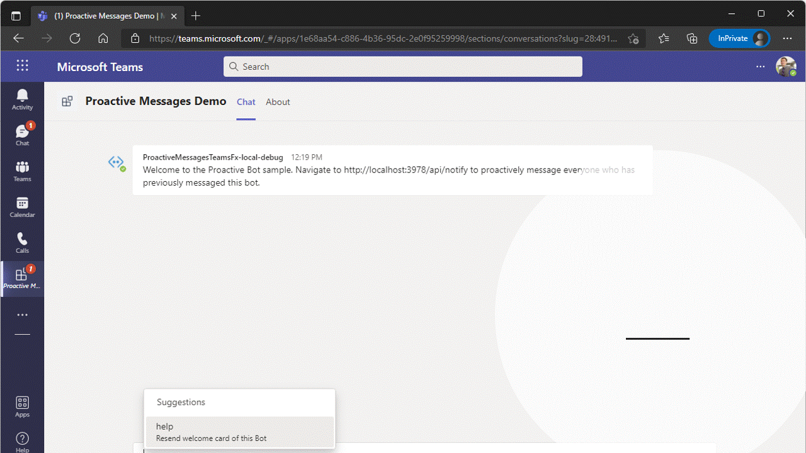

# How to use this Proactive message bots app

A bot, chatbot, or conversational bot is an app that responds to simple commands sent in chat and replies in meaningful ways. Examples of bots in everyday use include: bots that notify about build failures, bots that provide information about the weather or bus schedules, or provide travel information. A bot interaction can be a quick question and answer, or it can be a complex conversation. Being a cloud application, a bot can provide valuable and secure access to cloud services and corporate resources.

This is a sample which shows how to save user's conversation reference information to send proactive reminder message using Bots.

## Prerequisites

- [NodeJS](https://nodejs.org/en/)
- An M365 account. If you do not have M365 account, apply one from [M365 developer program](https://developer.microsoft.com/en-us/microsoft-365/dev-program)
- [Teams Toolkit Visual Studio Code Extension](https://aka.ms/teams-toolkit) version after 1.55 or [Teams Toolkit CLI](https://aka.ms/teams-toolkit-cli)

## Debug

- From Visual Studio Code: Start debugging the project by hitting the `F5` key in Visual Studio Code. 
- Alternatively use the `Run and Debug Activity Panel` in Visual Studio Code and click the `Run and Debug` green arrow button.
- From Teams Toolkit CLI: Start debugging the project by executing the command `teamsapp preview --local` in your project directory.

**Note**: If deploying or provisioning the sample, please replace line 9 of file `bot/teamsBot.js` with .env.dev. (By default its set to `.env.local`)

## Edit the manifest

You can find the Teams app manifest in `templates/appManifest` folder. The folder contains a manifest template file:
* `manifest.template.json`

Both files contain template arguments with `{...}` statements which will be replaced at build time. You can hover the prepoerties to see the actual value or preview the manifest. You may add any extra properties or permissions you require to this file. See the [schema reference](https://docs.microsoft.com/en-us/microsoftteams/platform/resources/schema/manifest-schema) for more information.

**Note**: If you are facing any issue in your app, please uncomment [this](https://github.com/OfficeDev/Microsoft-Teams-Samples/blob/main/samples/bot-proactive-messaging-teamsfx/bot/index.js#L28) line and put your debugger for local debug.

> Important Notes! This sample is under upgrading, please expect errors if you attempted to provision and deploy the app to cloud.
> Once the sample complete upgrading, this notice will be removed. And the sample will be ready to be deployed to cloud by then.
> Before that, please debug and run this sample app locally!
> 
## Deploy to Azure

Deploy your project to Azure by following these steps:

| From Visual Studio Code                                                                                                                                                                                                                                                                                                                                                  | From Teams Toolkit CLI                                                                                                                                                                                                                    |
| :----------------------------------------------------------------------------------------------------------------------------------------------------------------------------------------------------------------------------------------------------------------------------------------------------------------------------------------------------------------------- | :---------------------------------------------------------------------------------------------------------------------------------------------------------------------------------------------------------------------------------- |
| <ul><li>Open Teams Toolkit, and sign into Azure by clicking the `Sign in to Azure` under the `ACCOUNTS` section from sidebar.</li> <li>After you signed in, select a subscription under your account.</li><li>Open the Teams Toolkit and click `Provision in the cloud` from DEVELOPMENT section or open the command palette and select: `Teams: Provision in the cloud`.</li><li>Open the Teams Toolkit and click `Deploy to the cloud` or open the command palette and select: `Teams: Deploy to the cloud`.</li></ul> | <ul> <li>Run command `teamsapp account login azure`.</li> <li>Run command `teamsapp account set --subscription <your-subscription-id>`.</li> <li> Run command `teamsapp provision`.</li> <li>Run command: `teamsapp deploy`. </li></ul> |

> Note: Provisioning and deployment may incur charges to your Azure Subscription.

## Preview

Once the provisioning and deployment steps are finished, you can preview your app:

- From Visual Studio Code

  1. Open the `Run and Debug Activity Panel`.
  1. Select `Launch Remote (Edge)` or `Launch Remote (Chrome)` from the launch configuration drop-down.
  1. Press the Play (green arrow) button to launch your app - now running remotely from Azure.

- From Teams Toolkit CLI: execute `teamsapp preview --remote` in your project directory to launch your application.

## Validate manifest file

To check that your manifest file is valid:

- From Visual Studio Code: open the command palette and select: `Teams: Validate manifest file`.
- From Teams Toolkit CLI: run command `teamsapp validate` in your project directory.

## Package

- From Visual Studio Code: open the Teams Toolkit and click `Zip Teams metadata package` or open the command palette and select `Teams: Zip Teams metadata package`.
- Alternatively, from the command line run `teamsapp package` in the project directory.

## Publish to Teams

Once deployed, you may want to distribute your application to your organization's internal app store in Teams. Your app will be submitted for admin approval.

- From Visual Studio Code: open the Teams Toolkit and click `Publish to Teams` or open the command palette and select: `Teams: Publish to Teams`.
- From Teams Toolkit CLI: run command `teamsapp publish` in your project directory.

## Play with the App

This sample provides following functionality:

- You can send any command to bot to get the same message echoed back.

- You can navigate to http://localhost:3978/api/notify to proactively message everyone who has previously messaged this bot.

  

## Further reading

- [Bot Basics](https://docs.microsoft.com/azure/bot-service/bot-builder-basics?view=azure-bot-service-4.0)
- [Bots in Microsoft Teams](https://docs.microsoft.com/microsoftteams/platform/bots/what-are-bots)
- [Proactive messages](https://docs.microsoft.com/en-us/microsoftteams/platform/bots/how-to/conversations/send-proactive-messages?tabs=dotnet)
- [Step by step guide to send proactive messages](https://docs.microsoft.com/en-us/microsoftteams/platform/sbs-send-proactive)