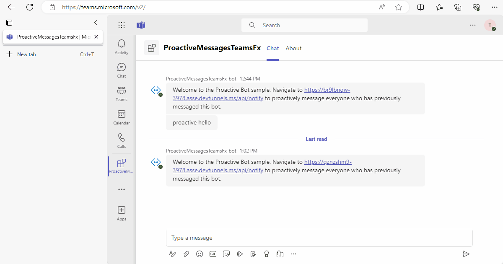

 
# How to use this Proactive message bots app

This sample bot showcases proactive messaging capabilities in Microsoft Teams by storing user conversation references to send scheduled or triggered reminder notifications. The app is designed for local debugging and deployment to Azure, offering full integration with Microsoft 365 Agents Toolkit for streamlined setup and testing.

## Prerequisites
### Register your app with Azure AD.

  1. Register a new application in the [Microsoft Entra ID – App Registrations](https://go.microsoft.com/fwlink/?linkid=2083908) portal.
  2. Select **New Registration** and on the *register an application page*, set following values:
      * Set **name** to your app name.
      * Choose the **supported account types** (any account type will work)
      * Leave **Redirect URI** empty.
      * Choose **Register**.
  3. On the overview page, copy and save the **Application (client) ID, Directory (tenant) ID**. You'll need those later when updating your Teams application manifest and in the appsettings.json.
  4. Navigate to **API Permissions**, and make sure to add the follow permissions:
   Select Add a permission
      * Select Add a permission
      * Select Microsoft Graph -\> Delegated permissions.
      * `User.Read` (enabled by default)
      * Click on Add permissions. Please make sure to grant the admin consent for the required permissions.
- [NodeJS](https://nodejs.org/en/)
- An M365 account. If you do not have M365 account, apply one from [M365 developer program](https://developer.microsoft.com/en-us/microsoft-365/dev-program)
- [Microsoft 365 Agents Toolkit Visual Studio Code Extension](https://aka.ms/teams-toolkit) version after 1.55 or [Microsoft 365 Agents Toolkit CLI](https://aka.ms/teams-toolkit-cli)

## Try it yourself - experience the App in your Microsoft Teams client
Please find below demo manifest which is deployed on Microsoft Azure and you can try it yourself by uploading the app package (.zip file link below) to your teams and/or as a personal app. (Sideloading must be enabled for your tenant, [see steps here](https://docs.microsoft.com/microsoftteams/platform/concepts/build-and-test/prepare-your-o365-tenant#enable-custom-teams-apps-and-turn-on-custom-app-uploading)).

**Proactive message bots app:** [Manifest](/samples/bot-proactive-messaging-teamsfx/nodejs/demo-manifest/bot-proactive-messaging-teamsfx.zip)

## Debug

- From Visual Studio Code: Start debugging the project by hitting the `F5` key in Visual Studio Code. 
- Alternatively use the `Run and Debug Activity Panel` in Visual Studio Code and click the `Run and Debug` green arrow button.
- From Microsoft 365 Agents Toolkit CLI:
  - Install [dev tunnel cli](https://aka.ms/teamsfx-install-dev-tunnel).
  - Login with your M365 Account using the command `devtunnel user login`.
  - Start your local tunnel service by running the command `devtunnel host -p 3978 --protocol http --allow-anonymous`.
  - In the `env/.env.local` file, fill in the values for `PROVISIONOUTPUT_BOTOUTPUT_VALIDDOMAIN` and `PROVISIONOUTPUT_BOTOUTPUT_SITEENDPOINT` with your dev tunnel URL.
    ```
    PROVISIONOUTPUT_BOTOUTPUT_VALIDDOMAIN=sample-id-3978.devtunnels.ms
    PROVISIONOUTPUT_BOTOUTPUT_SITEENDPOINT=https://sample-id-3978.devtunnels.ms
    ```
  - Executing the command `atk provision --env local` in your project directory.
  - Executing the command `atk deploy --env local` in your project directory.
  - Executing the command `atk preview --env local --run-command "cd bot; npm run dev:atk"` in your project directory.

**Note**: If deploying or provisioning the sample, please replace line 9 of file `bot/teamsBot.js` with .env.dev. (By default its set to `.env.local`)

## Edit the manifest

You can find the Teams app manifest in `appPackage` folder. The folder contains a manifest template file:
* `manifest.json`

Both files contain template arguments with `{...}` statements which will be replaced at build time. You can hover the prepoerties to see the actual value or preview the manifest. You may add any extra properties or permissions you require to this file. See the [schema reference](https://docs.microsoft.com/en-us/microsoftteams/platform/resources/schema/manifest-schema) for more information.

**Note**: If you are facing any issue in your app, please uncomment [this](https://github.com/OfficeDev/Microsoft-Teams-Samples/blob/main/samples/bot-proactive-messaging-teamsfx/bot/index.js#L28) line and put your debugger for local debug.

> Important Notes! This sample is under upgrading, please expect errors if you attempted to provision and deploy the app to cloud.
> Once the sample complete upgrading, this notice will be removed. And the sample will be ready to be deployed to cloud by then.
> Before that, please debug and run this sample app locally!
> 
## Deploy to Azure

Deploy your project to Azure by following these steps:

| From Visual Studio Code                                                                                                                                                                                                                                                                                                                                                  | From Microsoft 365 Agents Toolkit CLI                                                                                                                                                                                                                    |
| :----------------------------------------------------------------------------------------------------------------------------------------------------------------------------------------------------------------------------------------------------------------------------------------------------------------------------------------------------------------------- | :---------------------------------------------------------------------------------------------------------------------------------------------------------------------------------------------------------------------------------- |
| <ul><li>Open Microsoft 365 Agents Toolkit, and sign into Azure by clicking the `Sign in to Azure` under the `ACCOUNTS` section from sidebar.</li> <li>After you signed in, select a subscription under your account.</li><li>Open the Microsoft 365 Agents Toolkit and click `Provision` from LIFECYCLE section or open the command palette and select: `Microsoft 365 Agents:Provision`.</li><li>Open the Microsoft 365 Agents Toolkit and click `Deploy` or open the command palette and select: `Microsoft 365 Agents:Deploy`.</li></ul> | <ul> <li>Run command `atk auth login azure`.</li> <li>Run command ` auth set --subscription <your-subscription-id>`.</li> <li> Run command `atk provision`.</li> <li>Run command: `atk deploy`. </li></ul> |

> Note: Provisioning and deployment may incur charges to your Azure Subscription.

## Preview

Once the provisioning and deployment steps are finished, you can preview your app:

- From Visual Studio Code

  1. Open the `Run and Debug Activity Panel`.
  1. Select `Launch Remote (Edge)` or `Launch Remote (Chrome)` from the launch configuration drop-down.
  1. Press the Play (green arrow) button to launch your app - now running remotely from Azure.

- From Microsoft 365 Agents Toolkit CLI: execute `atk preview --env dev` in your project directory to launch your application.

## Validate manifest file

To check that your manifest file is valid:

- From Visual Studio Code: open the command palette and select: `Microsoft 365 Agents:Validate Application`, then select `validate app manifest schema` option.
- From Microsoft 365 Agents Toolkit CLI: run command ` validate` in your project directory.

## Package

- From Visual Studio Code: open the Microsoft 365 Agents Toolkit and click `Zip App Package` or open the command palette and select `Microsoft 365 Agents:Zip App Package`.
- Alternatively, from the command line run ` package` in the project directory.

## Publish to Teams

Once deployed, you may want to distribute your application to your organization's internal app store in Teams. Your app will be submitted for admin approval.

- From Visual Studio Code: open the Microsoft 365 Agents Toolkit and click `Publish to Teams` or open the command palette and select: `Microsoft 365 Agents:Publish to Teams`.
- From Microsoft 365 Agents Toolkit CLI: run command ` publish` in your project directory.

## Play with the App

This sample provides following functionality:

- You can send any command to bot to get the same message echoed back.

- You can navigate to http://localhost:3978/api/notify to proactively message everyone who has previously messaged this bot.

  

**Custom Engine Agent - Copilot**

**Copilot Installation Screen**  


**Copilot Greeting Message**  


**Copilot Welcome Message**  


**Copilot Link Notification**  


**Copilot Message Sent Confirmation**  


**Copilot Proactive Hello Message**  


## Further reading

- [Bot Basics](https://docs.microsoft.com/azure/bot-service/bot-builder-basics?view=azure-bot-service-4.0)
- [Bots in Microsoft Teams](https://docs.microsoft.com/microsoftteams/platform/bots/what-are-bots)
- [Proactive messages](https://docs.microsoft.com/en-us/microsoftteams/platform/bots/how-to/conversations/send-proactive-messages?tabs=dotnet)
- [Step by step guide to send proactive messages](https://docs.microsoft.com/en-us/microsoftteams/platform/sbs-send-proactive)
- [Custom Engine Agents](https://learn.microsoft.com/en-us/microsoft-365-copilot/extensibility/overview-custom-engine-agent)

