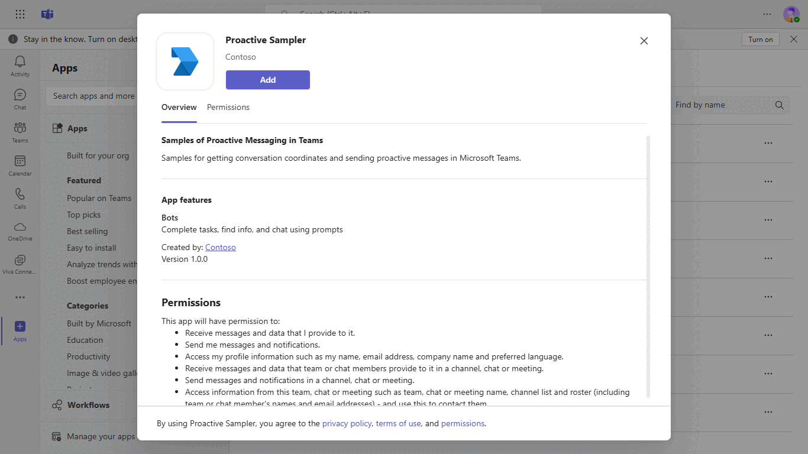
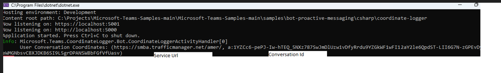
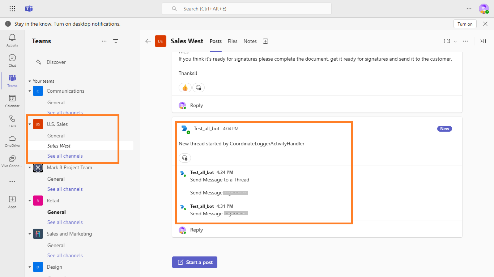

# Teams Proactive Messaging Samples

This sample showcases two approaches for building proactive messaging apps in Microsoft Teams using C#. The Coordinate Logger solution captures user and channel conversation coordinates, while the Proactive CMD solution demonstrates how to send messages with policies that handle throttling, ensuring reliable delivery.

<!-- 
Guidelines on README format: https://review.docs.microsoft.com/help/onboard/admin/samples/concepts/readme-template?branch=master

Guidance on onboarding samples to docs.microsoft.com/samples: https://review.docs.microsoft.com/help/onboard/admin/samples/process/onboarding?branch=master

Taxonomies for products and languages: https://review.docs.microsoft.com/new-hope/information-architecture/metadata/taxonomies?branch=master
-->

Two samples to highlight solutions to two challenges with building proactive messaging apps in Microsoft Teams. 

## Contents

| File/folder          | Description                                                                 |
|----------------------|-----------------------------------------------------------------------------|
| `/coordinate-logger` | Sample of getting conversation coordinates using BotFramework Events & SDK. |
| `/proactive-cmd`     | Sample of sending proactive messages with throttling policies.              |
| `/teamsAppManifest`  | App manifest for the teams app.                                             |
| `.gitignore`         | Define what to ignore at commit time.                                       |
| `CHANGELOG.md`       | List of changes to the sample.                                              |
| `CONTRIBUTING.md`    | Guidelines for contributing to the sample.                                  |
| `README.md`          | This README file.                                                           |
| `LICENSE`            | The license for the sample. 

## Included Features
* Bots

## Interaction with app

 

## Prerequisites
- Microsoft Teams account
- [.NET SDK](https://dotnet.microsoft.com/download) version 6.0
- Publicly addressable https url or tunnel such as [dev tunnel](https://learn.microsoft.com/en-us/azure/developer/dev-tunnels/get-started?tabs=windows) or [ngrok](https://ngrok.com/) latest version or [Tunnel Relay](https://github.com/OfficeDev/microsoft-teams-tunnelrelay) 
- [Microsoft 365 Agents Toolkit for Visual Studio](https://learn.microsoft.com/en-us/microsoftteams/platform/toolkit/toolkit-v4/install-teams-toolkit-vs?pivots=visual-studio-v17-7)

## Run the app (Using Microsoft 365 Agents Toolkit for Visual Studio)

The simplest way to run this sample in Teams is to use Microsoft 365 Agents Toolkit for Visual Studio.
1. Install Visual Studio 2022 **Version 17.14 or higher** [Visual Studio](https://visualstudio.microsoft.com/downloads/)
1. Install Microsoft 365 Agents Toolkit for Visual Studio [Microsoft 365 Agents Toolkit extension](https://learn.microsoft.com/en-us/microsoftteams/platform/toolkit/toolkit-v4/install-teams-toolkit-vs?pivots=visual-studio-v17-7)
1. In the debug dropdown menu of Visual Studio, select Dev Tunnels > Create A Tunnel (set authentication type to Public) or select an existing public dev tunnel.
1. Right-click the 'M365Agent' project in Solution Explorer and select **Microsoft 365 Agents Toolkit > Select Microsoft 365 Account**
1. Sign in to Microsoft 365 Agents Toolkit with a **Microsoft 365 work or school account**
1. Set `Startup Item` as `Microsoft Teams (browser)`.
1. Press F5, or select Debug > Start Debugging menu in Visual Studio to start your app
</br>
1. In the opened web browser, select Add button to install the app in Teams
> If you do not have permission to upload custom apps (uploading), Microsoft 365 Agents Toolkit will recommend creating and using a Microsoft 365 Developer Program account - a free program to get your own dev environment sandbox that includes Teams.

## Setup
1. Configure public url to point to http port 3978

   ```bash
   ngrok http 3978 --host-header="localhost:3978"
   ```  

   Alternatively, you can also use the `dev tunnels`. Please follow [Create and host a dev tunnel](https://learn.microsoft.com/en-us/azure/developer/dev-tunnels/get-started?tabs=windows) and host the tunnel with anonymous user access command as shown below:

   ```bash
   devtunnel host -p 3978 --allow-anonymous
   ```

2. Create a Microsoft Entra ID app registration and Azure Bot in Azure portal: [Azure Bot registration resource](https://docs.microsoft.com/en-us/azure/bot-service/bot-service-quickstart-registration).
    
  A) Select **New Registration** and on the *register an application page*, set following values:
      * Set **name** to your app name.
      * Choose the **supported account types** (any account type will work)
      * Leave **Redirect URI** empty.
      * Choose **Register**.
  B) On the overview page, copy and save the **Application (client) ID, Directory (tenant) ID**. You'll need those later when updating your Teams application manifest and in the appsettings.json.
  C) Navigate to **API Permissions**, and make sure to add the following permissions:
   Select Add a permission
      * Select Add a permission
      * Select Microsoft Graph -\> Delegated permissions.
      * `User.Read` (enabled by default)
      * Click on Add permissions. Please make sure to grant the admin consent for the required permissions.

- Ensure that you've [enabled the Teams Channel](https://docs.microsoft.com/en-us/azure/bot-service/channel-connect-teams?view=azure-bot-service-4.0)
- configure the messaging endpoint in Azure bot with your application domain URL and append `/api/messages` like: `https://111xxx.ngrok-free.app/api/messages`

3. Modify the `manifest.json` in the `/appPackage` folder and replace the `{{BOT-ID}}` with the id received while doing Microsoft Entra ID app registration in previous steps and also update the `<<App Domain>>` with your application domain like ngrok domain: `111xxx.ngrok-free.app` or dev tunnels domain: `12345.devtunnels.ms` excluding http/https.

4. Zip the contents of `appPackage` into a `manifest.zip`.

5. Modify the `/coordinate-logger/appsettings.local.json` file and fill in the `{{ Bot Id }}` and `{{ Bot Password }}` with the id's received while doing Microsoft Entra ID app registration in previous steps.


**Coordinate Logger**

***Note this is a noisy application, it is recommended you not run this in shared teams where you would disturb other users!***

1. Start the application

    ```bash
    # dotnet run
    ```
    It is running when the following output is displayed.
    ```
    Hosting environment: Development
    Content root path: C:\msteams-samples-proactive-messaging\coordinate-logger
    Now listening on: https://localhost:3978
    Now listening on: http://localhost:5000
    Application started. Press Ctrl+C to shut down.
    ```

2. Install the app personally in Teams
    - Go to the `Apps` in the left rail
    - Select `Upload a custom app` and select the manifest.json file
    - Click the `Add` Button on the consent screen

    The coordinates of the user should be log in the console window(refer above image)

3. Install the app to a Team
    - Go to the `Apps` in the left rail
    - Select `Upload a custom app` and select the manifest.json file
    - Select the down arrow next to the `Add` Button on the consent screen
    - Select a Team to install to. 

    The app will send a message to each channel in the Team & log the coordinates
    for each new thread to the console window.(refer above image)

**Proactive CMD**

After running the sample, open Command Prompt, navigate to the `proactive-cmd` folder, and send proactive messages using the commands below.

1. Send a message to a user
    Using the values from the Coordinate Logger for a User's conversation coordinates & Bot registration fill in the parameters to the following command.

    ```bash
    # dotnet run -- sendUserMessage --app-id="{{Bot Id}}" --app-password="{{Bot Password}}" --tenant-id="{{TenantId}}" --service-url="{{ServiceUrl}}" --conversation-id="{{Conversation Id}}" --message="Send Message to a User"
    ```

    This will send a message to the 1-on-1 conversation with the user

2. Send a message to a thread
    Using the values from the Coordinate Logger for a Channel Thread's conversation coordinates & Bot registration fill in the parameters to the following command.

    ```bash
    # dotnet run -- sendChannelThread --app-id="{{Bot Id}}" --app-password="{{Bot Password}}" --tenant-id="{{TenantId}}" --service-url="{{ServiceUrl}}" --conversation-id="{{Conversation Id}}" --message="Send Message to a Thread"
    ```

    This will send a message to the thread
    
## Running the sample.

**User Conversation log info**


**Channel Conversation log info**


**Proactive message in Channel Conversation**


**Proactive message in User Conversation**


## Key concepts

The two samples correspond with two of the most common challenges when building proactive messaging apps in Microsoft Teams, getting the conversation coordinates and sending messages reliably. 

The `CoordinateLoggerActivityHandler.cs` file in the Conversation Logger demonstrates three separate ways to obtain or generate conversation coordinates for users or channel threads using the BotBuilder SDK.

The `SendWithRetries` function and policy from the `CreatePolicy` function demonstrate how to reliably send messages when dealing with throttling from Microsoft Teams. 

## Contributing

This project welcomes contributions and suggestions.  Most contributions require you to agree to a
Contributor License Agreement (CLA) declaring that you have the right to, and actually do, grant us
the rights to use your contribution. For details, visit https://cla.opensource.microsoft.com.

When you submit a pull request, a CLA bot will automatically determine whether you need to provide
a CLA and decorate the PR appropriately (e.g., status check, comment). Simply follow the instructions
provided by the bot. You will only need to do this once across all repos using our CLA.

This project has adopted the [Microsoft Open Source Code of Conduct](https://opensource.microsoft.com/codeofconduct/).
For more information see the [Code of Conduct FAQ](https://opensource.microsoft.com/codeofconduct/faq/) or
contact [opencode@microsoft.com](mailto:opencode@microsoft.com) with any additional questions or comments.


