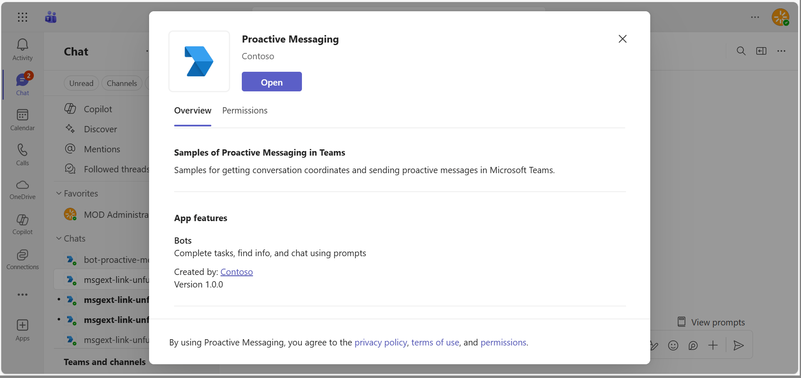
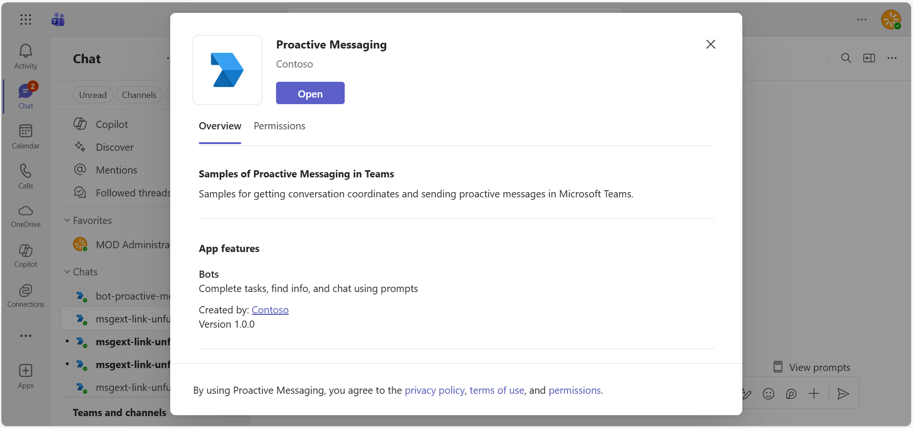
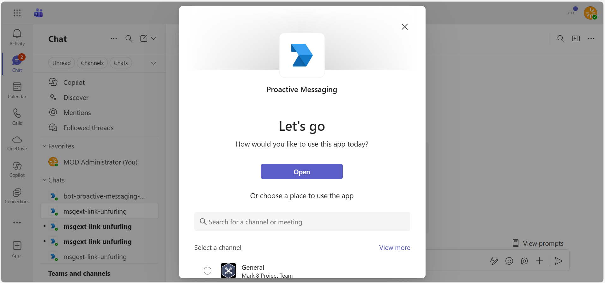
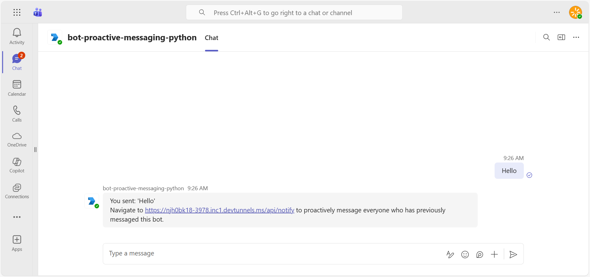
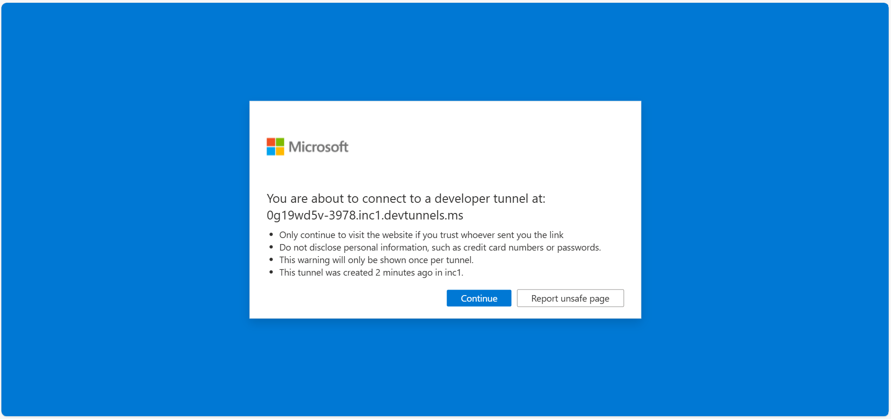
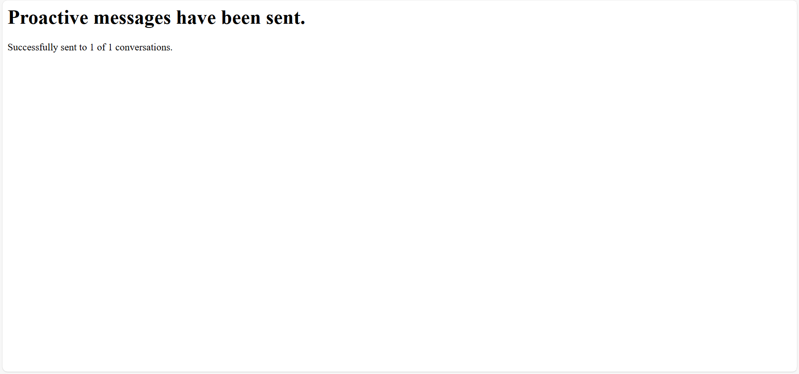
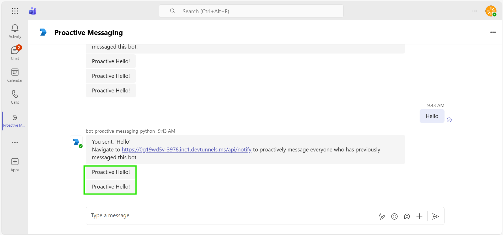
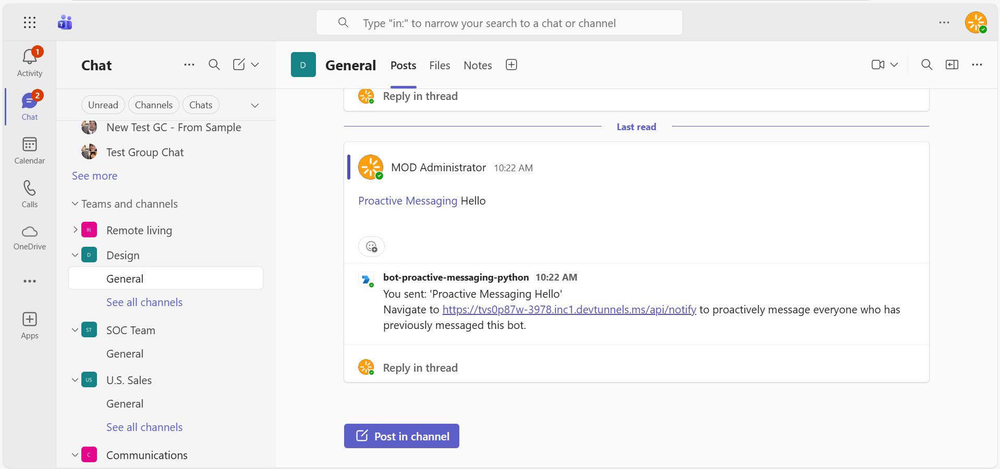
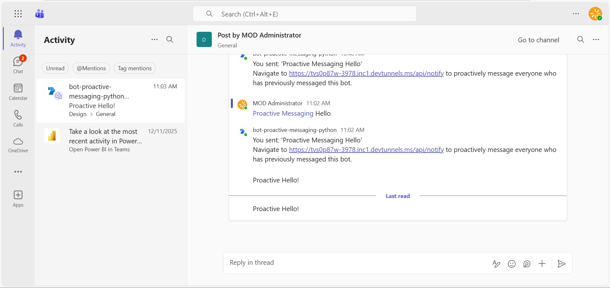

# Microsoft Teams Proactive Messaging Bot (Teams SDK for Python)

This sample bot demonstrates proactive messaging capabilities in Microsoft Teams using the **Microsoft Teams SDK for Python**. The bot stores user conversation references and provides an API endpoint to send proactive messages to all registered users.

## Key Features

- **Microsoft Teams SDK** - Built using the modern `microsoft-teams` SDK for Python
- **Proactive Messaging** - Send messages to users without them initiating conversation
- **Conversation Reference Storage** - Stores references when users interact with the bot
- **Welcome Messages** - Greets users when the bot is installed
- **Notify API Endpoint** - HTTP endpoint to trigger proactive messages

## Included Features
* Bots
* Proactive Messaging

## Interaction with app



## Prerequisites

- Microsoft Teams is installed and you have an account
- [Python SDK](https://www.python.org/downloads/) min version 3.8
- [dev tunnel](https://learn.microsoft.com/en-us/azure/developer/dev-tunnels/get-started?tabs=windows) or [ngrok](https://ngrok.com/) latest version or equivalent tunnelling solution
- [Microsoft 365 Agents Toolkit for VS Code](https://marketplace.visualstudio.com/items?itemName=TeamsDevApp.ms-teams-vscode-extension) or [TeamsFx CLI](https://learn.microsoft.com/microsoftteams/platform/toolkit/teamsfx-cli?pivots=version-one)

## Project Structure

```
├── app.py                          # Main application entry point (Teams SDK App)
├── config.py                       # Configuration settings
├── requirements.txt                # Python dependencies
├── bots/
│   ├── __init__.py                 # Module exports
│   └── bot_Proactive_Message.py    # Conversation reference storage
├── appManifest/
│   └── manifest.json               # Teams app manifest
└── Images/                         # Sample screenshots
```

## Try it yourself - experience the App in your Microsoft Teams client
Please find below demo manifest which is deployed on Microsoft Azure and you can try it yourself by uploading the app package (.zip file link below) to your teams and/or as a personal app. (Sideloading must be enabled for your tenant, [see steps here](https://docs.microsoft.com/microsoftteams/platform/concepts/build-and-test/prepare-your-o365-tenant#enable-custom-teams-apps-and-turn-on-custom-app-uploading)).


## Run the app (Using Microsoft 365 Agents Toolkit for Visual Studio Code)

The simplest way to run this sample in Teams is to use Microsoft 365 Agents Toolkit for Visual Studio Code.

1. Ensure you have downloaded and installed [Visual Studio Code](https://code.visualstudio.com/docs/setup/setup-overview)
1. Install the [Microsoft 365 Agents Toolkit extension](https://marketplace.visualstudio.com/items?itemName=TeamsDevApp.ms-teams-vscode-extension) and [Python Extension](https://marketplace.visualstudio.com/items?itemName=ms-python.python)
1. Select **File > Open Folder** in VS Code and choose this samples directory from the repo
1. Press **CTRL+Shift+P** to open the command box and enter **Python: Create Environment** to create and activate your desired virtual environment. Remember to select `requirements.txt` as dependencies to install when creating the virtual environment.
1. Using the extension, sign in with your Microsoft 365 account where you have permissions to upload custom apps
1. Select **Debug > Start Debugging** or **F5** to run the app in a Teams web client.
1. In the browser that launches, select the **Add** button to install the app to Teams.

> If you do not have permission to upload custom apps (uploading), Microsoft 365 Agents Toolkit will recommend creating and using a Microsoft 365 Developer Program account - a free program to get your own dev environment sandbox that includes Teams.

## Setup for bot

In Azure portal, create a [Azure Bot resource](https://docs.microsoft.com/azure/bot-service/bot-service-quickstart-registration).
    - For bot handle, make up a name.
    - Select "Use existing app registration" (Create the app registration in Microsoft Entra ID beforehand.)
    - __*If you don't have an Azure account*__ create an [Azure free account here](https://azure.microsoft.com/free/)
    
   In the new Azure Bot resource in the Portal, 
    - Ensure that you've [enabled the Teams Channel](https://learn.microsoft.com/azure/bot-service/channel-connect-teams?view=azure-bot-service-4.0)
    - In Settings/Configuration/Messaging endpoint, enter the current `https` URL you were given by running the tunneling application. Append it with the path `/api/messages`

## Run the app (Manually Uploading to Teams)
## Setup for code
> Note these instructions are for running the sample on your local machine, the tunnelling solution is required because
the Teams service needs to call into the bot.

1) Clone the repository

    ```bash
    git clone https://github.com/OfficeDev/Microsoft-Teams-Samples.git
    ```

2) Run ngrok - point to port 3978

   ```bash
   ngrok http 3978 --host-header="localhost:3978"
   ```  

   Alternatively, you can also use the `dev tunnels`. Please follow [Create and host a dev tunnel](https://learn.microsoft.com/en-us/azure/developer/dev-tunnels/get-started?tabs=windows) and host the tunnel with anonymous user access command as shown below:

   ```bash
   devtunnel host -p 3978 --allow-anonymous
   ```

3) Register a new application in the [Microsoft Entra ID – App Registrations](https://go.microsoft.com/fwlink/?linkid=2083908) portal.
  
  A) Select **New Registration** and on the *register an application page*, set following values:
      * Set **name** to your app name.
      * Choose the **supported account types** (any account type will work)
      * Leave **Redirect URI** empty.
      * Choose **Register**.
  B) On the overview page, copy and save the **Application (client) ID, Directory (tenant) ID**. You'll need those later when updating your Teams application manifest and in the appsettings.json.
  C) Navigate to **API Permissions**, and make sure to add the following permissions:
   Select Add a permission
      * Select Add a permission
      * Select Microsoft Graph -\> Delegated permissions.
      * `User.Read` (enabled by default)
      * Click on Add permissions. Please make sure to grant the admin consent for the required permissions.

   > **Note:** The `User.Read` delegated permission is required for the bot to function properly. If this permission is not added or admin consent is not granted, you will receive a **401 Unauthorized** error when the bot tries to authenticate.

4) In a terminal, navigate to `samples/bot-proactive-messaging/python`

5) Activate your desired virtual environment

6) Install dependencies by running ```pip install -r requirements.txt``` in the project folder.

   The following packages will be installed:
   - `microsoft-teams-apps` - Teams App framework (v2.0.0a8)
   - `microsoft-teams-api` - Teams API client (v2.0.0a8)
   - `pydantic-settings` - Configuration management
   - `python-dotenv` - Environment variable management

7) Update the `config.py` configuration or set environment variables:
   - `MicrosoftAppId` - Your Bot/App registration client ID
   - `MicrosoftAppPassword` - Your Bot/App registration client secret
   - `MicrosoftAppTenantId` - Your tenant ID
   - `BaseUrl` - The public URL of your bot (e.g., ngrok URL)

8) __*This step is specific to Teams.*__
    - **Edit** the `manifest.json` contained in the `appManifest` folder to replace your Microsoft App Id (that was created when you registered your bot earlier) *everywhere* you see the place holder string `${{BOT_ID}}` and `${{TEAMS_APP_ID}}` (depending on the scenario the Microsoft App Id may occur multiple times in the `manifest.json`)
    - **Zip** up the contents of the `appManifest` folder to create a `manifest.zip`
    - **Upload** the `manifest.zip` to Teams (in the Apps view click "Upload a custom app")

9) Run your bot with `python app.py`

## Code Highlights

### Proactive Messaging

```python
# Store conversation references for proactive messaging
conversation_references = {}

# Store reference when user interacts with bot
@app.on_message
async def on_message(context: ActivityContext[MessageActivity]):
    activity = context.activity
    conversation_ref = build_conversation_reference(activity)
    conversation_references[conversation_ref.conversation.id] = conversation_ref

# Send proactive messages to all stored conversations
async def send_proactive_notifications():
    sent_count = 0
    for conversation_id in conversation_references:
        try:
            activity = MessageActivityInput(text="Proactive Hello!")
            await app.send(conversation_id=conversation_id, activity=activity)
            sent_count += 1
        except Exception:
            pass
    return sent_count, len(conversation_references)
```

## Running the sample

This sample provides following functionality:

- **Echo Messages**: Send any message to the bot to receive an echo response.

- **Proactive Notifications**: Navigate to `http://localhost:3978/api/notify` to send proactive messages to all users who have previously interacted with the bot.

- **Health Check**: Navigate to `http://localhost:3978/health` to check if the bot is running.

  **Install the App in Teams**
  

  **Open the App in Personal Scope**
  

  **Bot sends welcome message with proactive notification link**
  

  **Click Continue to proceed**
  

  **Proactive message sent notification**
  

  **Proactive Hello message received in chat**
  

  **Add Bot to a Team**
  

  **Proactive message received in Team channel**
  


## Deploy the bot to Azure

To learn more about deploying a bot to Azure, see [Deploy your bot to Azure](https://aka.ms/azuredeployment) for a complete list of deployment instructions.

## Further reading

- [Microsoft Teams SDK for Python](https://github.com/microsoft/teams.py)
- [Bot Basics](https://docs.microsoft.com/azure/bot-service/bot-builder-basics?view=azure-bot-service-4.0)
- [Bots in Microsoft Teams](https://docs.microsoft.com/microsoftteams/platform/bots/what-are-bots)
- [Proactive messages](https://docs.microsoft.com/en-us/microsoftteams/platform/bots/how-to/conversations/send-proactive-messages?tabs=dotnet)
- [Step by step guide to send proactive messages](https://docs.microsoft.com/en-us/microsoftteams/platform/sbs-send-proactive)


