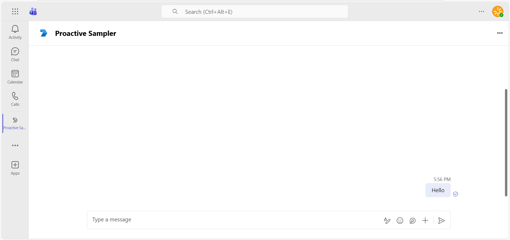
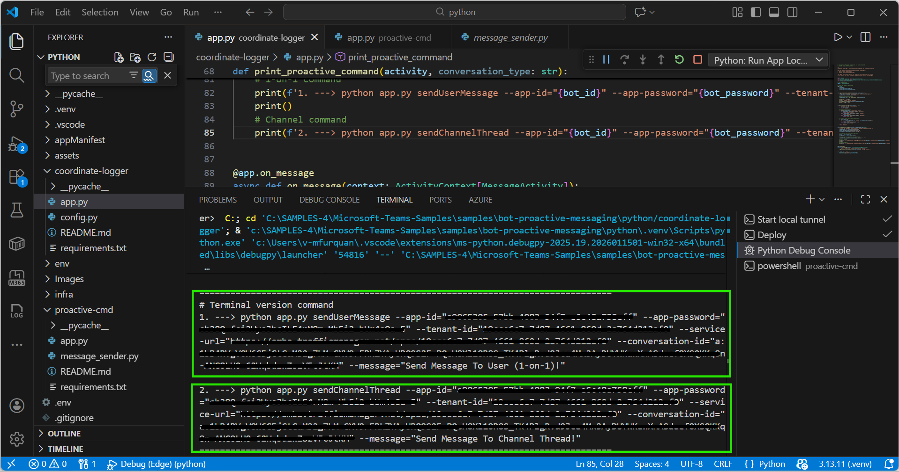
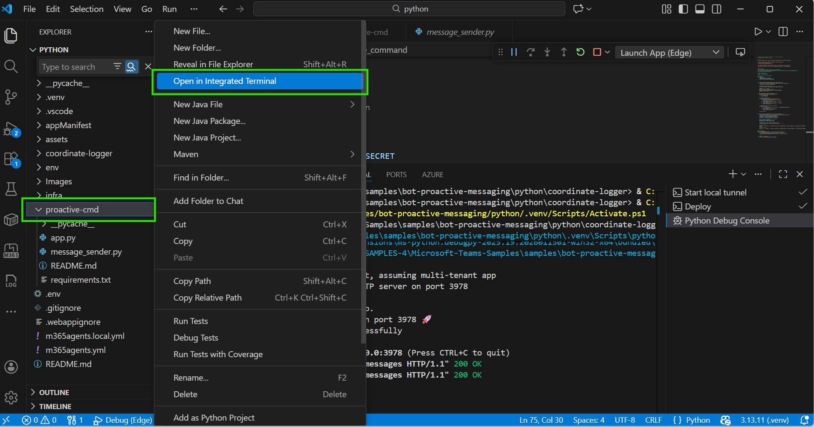
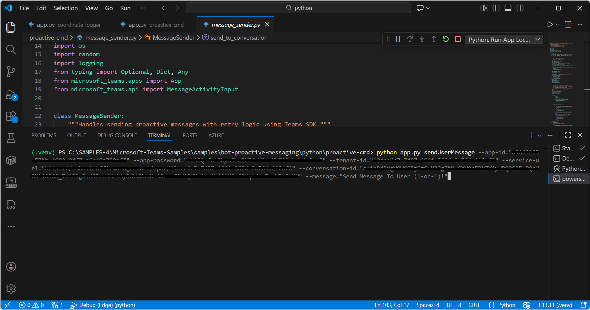
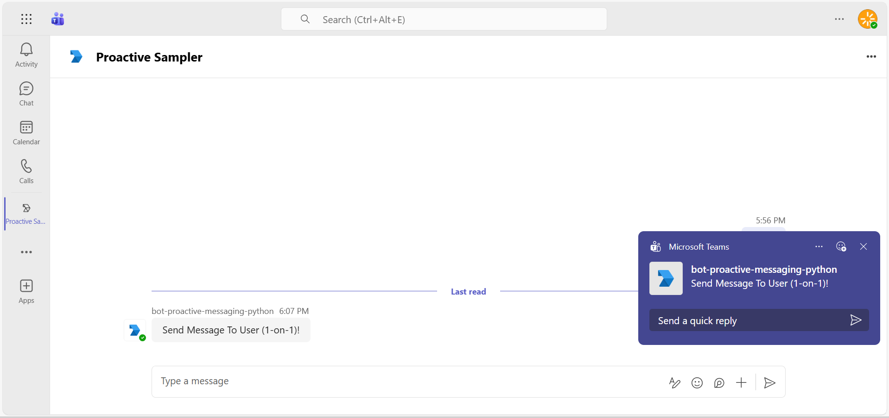
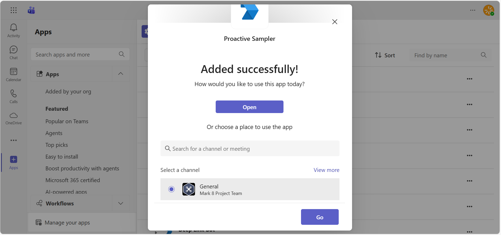
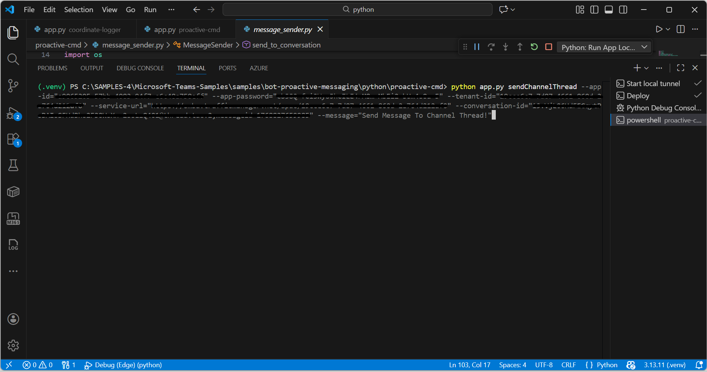
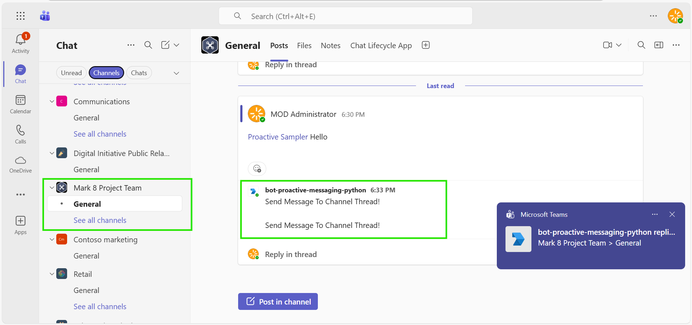

# Teams Proactive Messaging Samples (Python)

This sample showcases two approaches for building proactive messaging apps in Microsoft Teams using Python with the **Microsoft Teams SDK**. The Coordinate Logger solution captures user and channel conversation coordinates, while the Proactive CMD solution demonstrates how to send messages with policies that handle throttling, ensuring reliable delivery.

Two samples to highlight solutions to two challenges with building proactive messaging apps in Microsoft Teams.

## Contents

| Folder | Description |
|--------|-------------|
| [/coordinate-logger](coordinate-logger) | Sample of getting conversation coordinates using Teams SDK Events |
| [/proactive-cmd](proactive-cmd) | Sample of sending proactive messages with throttling policies |
| /appManifest | App manifest for the teams app |
| /Images | Sample screenshots |

## Included Features

* Bots
* Proactive Messaging

- **Microsoft Teams SDK for Python (v2.0)** - Modern SDK for Teams bot development
  - `microsoft-teams-ai` - Teams AI library
  - `microsoft-teams-apps` - Application framework
  - `microsoft-teams-api` - API models and types
- **asyncio** - Asynchronous programming
- **python-dotenv** - Environment variable management

## Interaction with app


## Prerequisites

- Microsoft Teams is installed and you have an account
- [Python SDK](https://www.python.org/downloads/) min version 3.8
- [dev tunnel](https://learn.microsoft.com/en-us/azure/developer/dev-tunnels/get-started?tabs=windows) or [ngrok](https://ngrok.com/) latest version or equivalent tunnelling solution
- [Microsoft 365 Agents Toolkit for VS Code](https://marketplace.visualstudio.com/items?itemName=TeamsDevApp.ms-teams-vscode-extension) or [TeamsFx CLI](https://learn.microsoft.com/microsoftteams/platform/toolkit/teamsfx-cli?pivots=version-one)

## Architecture Overview

```
┌─────────────────────┐
│  Coordinate Logger  │  ← Captures conversation coordinates
│  Bot                │     (Install in Teams)
│                     │
│  Logs to Console:   │
│  • Service URL      │
│  • Tenant ID        │
│  • Conversation ID  │
│  • User/Channel Info│
└─────────────────────┘
          │
          │ Copy coordinates
          ▼
┌─────────────────────┐
│  Proactive CMD      │  ← Sends proactive messages
│  Command Line Tool  │     (Run from terminal)
│                     │
│  Commands:          │
│  • sendUserMessage  │
│  • sendChannelThread│
└─────────────────────┘
          │
          │ HTTP + JWT Auth
          ▼
┌─────────────────────┐
│  Microsoft Teams    │
│  (User/Channel)     │
└─────────────────────┘
```

## Try it yourself - experience the App in your Microsoft Teams client
Please find below demo manifest which is deployed on Microsoft Azure and you can try it yourself by uploading the app package (.zip file link below) to your teams and/or as a personal app. (Sideloading must be enabled for your tenant, [see steps here](https://docs.microsoft.com/microsoftteams/platform/concepts/build-and-test/prepare-your-o365-tenant#enable-custom-teams-apps-and-turn-on-custom-app-uploading)).


## Run the app (Using Microsoft 365 Agents Toolkit for Visual Studio Code)

The simplest way to run this sample in Teams is to use Microsoft 365 Agents Toolkit for Visual Studio Code.

1. Ensure you have downloaded and installed [Visual Studio Code](https://code.visualstudio.com/docs/setup/setup-overview)
1. Install the [Microsoft 365 Agents Toolkit extension](https://marketplace.visualstudio.com/items?itemName=TeamsDevApp.ms-teams-vscode-extension) and [Python Extension](https://marketplace.visualstudio.com/items?itemName=ms-python.python)
1. Select **File > Open Folder** in VS Code and choose this samples directory from the repo
1. Press **CTRL+Shift+P** to open the command box and enter **Python: Create Environment** to create and activate your desired virtual environment. Remember to select `requirements.txt` as dependencies to install when creating the virtual environment.
1. Using the extension, sign in with your Microsoft 365 account where you have permissions to upload custom apps
1. Select **Debug > Start Debugging** or **F5** to run the app in a Teams web client.
1. In the browser that launches, select the **Add** button to install the app to Teams.

> If you do not have permission to upload custom apps (uploading), Microsoft 365 Agents Toolkit will recommend creating and using a Microsoft 365 Developer Program account - a free program to get your own dev environment sandbox that includes Teams.

## Setup Overview

This sample consists of **two separate applications**:

### 1. Coordinate Logger Bot

**Quick Setup:**
```bash
cd coordinate-logger
pip install -r requirements.txt
python app.py
```

### 2. Proactive CMD Tool

**Quick Usage:**
```bash
cd proactive-cmd
pip install -r requirements.txt
python app.py sendUserMessage --app-id="..." --app-password="..." ...
```

## Setup for Azure Bot Registration

In Azure portal, create a [Azure Bot resource](https://docs.microsoft.com/azure/bot-service/bot-service-quickstart-registration).
- For bot handle, make up a name.
- Select "Use existing app registration" (Create the app registration in Microsoft Entra ID beforehand.)
- __*If you don't have an Azure account*__ create an [Azure free account here](https://azure.microsoft.com/free/)

In the new Azure Bot resource in the Portal, 
- Ensure that you've [enabled the Teams Channel](https://learn.microsoft.com/azure/bot-service/channel-connect-teams?view=azure-bot-service-4.0)
- In Settings/Configuration/Messaging endpoint, enter the current `https` URL you were given by running the tunneling application. Append it with the path `/api/messages`

## Detailed Setup Instructions

> Note: These instructions are for running the sample on your local machine. The tunnelling solution is required because the Teams service needs to call into the bot.

1) Clone the repository

    ```bash
    git clone https://github.com/OfficeDev/Microsoft-Teams-Samples.git
    ```

2) Run ngrok or dev tunnel - point to port 3978

   ```bash
   ngrok http 3978 --host-header="localhost:3978"
   ```  

   Alternatively, you can also use the `dev tunnels`. Please follow [Create and host a dev tunnel](https://learn.microsoft.com/en-us/azure/developer/dev-tunnels/get-started?tabs=windows) and host the tunnel with anonymous user access command as shown below:

   ```bash
   devtunnel host -p 3978 --allow-anonymous
   ```

3) Register a new application in the [Microsoft Entra ID – App Registrations](https://go.microsoft.com/fwlink/?linkid=2083908) portal.
  
  A) Select **New Registration** and on the *register an application page*, set following values:
      * Set **name** to your app name.
      * Choose the **supported account types** (any account type will work)
      * Leave **Redirect URI** empty.
      * Choose **Register**.
  B) On the overview page, copy and save the **Application (client) ID, Directory (tenant) ID**. You'll need those later when updating your Teams application manifest and in the configuration files.
  C) Navigate to **API Permissions**, and make sure to add the following permissions:
   Select Add a permission
      * Select Add a permission
      * Select Microsoft Graph -\> Delegated permissions.
      * `User.Read` (enabled by default)
      * Click on Add permissions. Please make sure to grant the admin consent for the required permissions.

   > **Note:** The `User.Read` delegated permission is required for the bot to function properly. If this permission is not added or admin consent is not granted, you will receive a **401 Unauthorized** error when the bot tries to authenticate.

4) Navigate to `samples/bot-proactive-messaging/python`

5) **Setup Coordinate Logger Bot:**

   a) Navigate to the coordinate-logger directory:
   ```bash
   cd coordinate-logger
   ```

   b) Create a virtual environment and install dependencies:
   ```bash
   python -m venv venv
   # On Windows
   venv\Scripts\activate
   # On macOS/Linux
   source venv/bin/activate
   
   pip install -r requirements.txt
   ```

   c) Configure environment variables in `../env/.env.local`:
   ```
   CLIENT_ID=<your-bot-app-id>
   CLIENT_SECRET=<your-bot-app-password>
   TENANT_ID=<your-tenant-id>
   PORT=3978
   ```

   d) Run the coordinate logger bot:
   ```bash
   python app.py
   ```

6) **Setup Proactive CMD Tool:**

   a) Navigate to the proactive-cmd directory (in a new terminal):
   ```bash
   cd proactive-cmd
   ```

   b) Create a virtual environment and install dependencies:
   ```bash
   python -m venv venv
   # On Windows
   venv\Scripts\activate
   # On macOS/Linux
   source venv/bin/activate
   
   pip install -r requirements.txt
   ```

7) __*This step is specific to Teams.*__
    - **Edit** the `manifest.json` contained in the `appManifest` folder to replace your Microsoft App Id (that was created when you registered your bot earlier) *everywhere* you see the place holder string `${{BOT_ID}}` and `${{TEAMS_APP_ID}}` (depending on the scenario the Microsoft App Id may occur multiple times in the `manifest.json`)
    - **Zip** up the contents of the `appManifest` folder to create a `manifest.zip`
    - **Upload** the `manifest.zip` to Teams (in the Apps view click "Upload a custom app")

## Usage Workflow

### Step 1: Run Coordinate Logger Bot

1. Start the coordinate logger bot:
   ```bash
   cd coordinate-logger
   python app.py
   ```

2. Install the bot in Teams (upload manifest.zip)

3. The bot will log conversation coordinates to the console when:
   - Bot is installed (to user or team)
   - Users send messages (optional)
   - Team/channel events occur

### Step 3: Send Proactive Messages

Navigate to the proactive-cmd folder and run commands:

**Send to User (1-on-1):**
```bash
cd proactive-cmd
python app.py sendUserMessage \
  --app-id="<<Client-ID>>" \
  --app-password="<<Client-Secret>>" \
  --tenant-id="<<Tenant-ID>>" \
  --service-url="https://smba.trafficmanager.net/amer/" \
  --conversation-id="a:1AbCdEf....." \
  --message="Hello! This is a proactive message."
```

**Send to Channel:**
```bash
python app.py sendChannelThread \
  --app-id="<<Client-ID>>" \
  --app-password="<<Client-Secret>>" \
  --tenant-id="<<Tenant-ID>>" \
  --service-url="https://smba.trafficmanager.net/amer/" \
  --conversation-id="19:abc123...@thread.tacv2" \
  --message="Teams channel Proactive message!"
```

## Key Concepts

The two samples correspond with two of the most common challenges when building proactive messaging apps in Microsoft Teams: getting the conversation coordinates and sending messages reliably.

### Coordinate Logger

The coordinate logger bot demonstrates how to obtain or generate conversation coordinates for users or channel threads using the **Microsoft Teams SDK for Python**. It captures:

- **User Conversations (1-on-1)** - Personal chat coordinates
- **Channel Conversations** - Team channel coordinates

## Running the sample

**Install the app in Teams**


**Open the app in personal scope**


**Send hello message to bot**


**Terminal shows two commands for 1-on-1 and channel messaging**


**Open terminal to send proactive message**


**Paste command in terminal and press enter**


**Proactive message received in 1-on-1 chat**


**Install bot to Teams channel**


**Paste channel command in terminal**


**Proactive message received in Teams channel**



## Deploy the bot to Azure

To learn more about deploying a bot to Azure, see [Deploy your bot to Azure](https://aka.ms/azuredeployment) for a complete list of deployment instructions.

## Further reading

- [Microsoft Teams SDK for Python](https://github.com/microsoft/teams.py)
- [Bot Basics](https://docs.microsoft.com/azure/bot-service/bot-builder-basics?view=azure-bot-service-4.0)
- [Bots in Microsoft Teams](https://docs.microsoft.com/microsoftteams/platform/bots/what-are-bots)
- [Proactive messages](https://docs.microsoft.com/en-us/microsoftteams/platform/bots/how-to/conversations/send-proactive-messages?tabs=dotnet)
- [Step by step guide to send proactive messages](https://docs.microsoft.com/en-us/microsoftteams/platform/sbs-send-proactive)


