# Receive Channel messages with RSC permissions

This sample app illustrates how a bot can capture all channel messages in Microsoft Teams by utilizing RSC (resource-specific consent) permissions, eliminating the need for @mentions. The bot supports adaptive card responses, easy local testing with tools like ngrok or dev tunnels, and deployment to Azure, allowing it to function effectively across different channels and group chats in Teams.

This feature shown in this sample is currently available in Public Developer Preview only.

## Included Features
* Bots
* Adaptive Cards
* RSC Permissions
* Custom Engine Agents

## Interaction with app

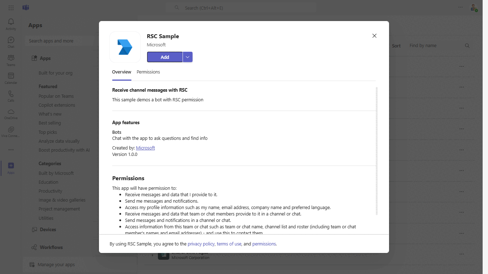

## Try it yourself - experience the App in your Microsoft Teams client
Please find below demo manifest which is deployed on Microsoft Azure and you can try it yourself by uploading the app manifest (.zip file link below) to your teams and/or as a personal app. (Uploading must be enabled for your tenant, [see steps here](https://docs.microsoft.com/microsoftteams/platform/concepts/build-and-test/prepare-your-o365-tenant#enable-custom-teams-apps-and-turn-on-custom-app-uploading)).

**Receive Channel messages with RSC permissions:** [Manifest](/samples/bot-receive-channel-messages-withRSC/csharp/demo-manifest/Bot-RSC.zip)

## Prerequisites

- [.NET Core SDK](https://dotnet.microsoft.com/download) version 6.0

  determine dotnet version
  ```bash
  dotnet --version
  ```
- [dev tunnel](https://learn.microsoft.com/en-us/azure/developer/dev-tunnels/get-started?tabs=windows) or [Ngrok](https://ngrok.com/download) (For local environment testing) latest version (any other tunneling software can also be used)
  
- [Teams](https://teams.microsoft.com) Microsoft Teams is installed and you have an account

## Run the app (Using Microsoft 365 Agents Toolkit for Visual Studio)

The simplest way to run this sample in Teams is to use Microsoft 365 Agents Toolkit for Visual Studio.
1. Install Visual Studio 2022 **Version 17.14 or higher** [Visual Studio](https://visualstudio.microsoft.com/downloads/)
1. Install Microsoft 365 Agents Toolkit for Visual Studio [Microsoft 365 Agents Toolkit extension](https://learn.microsoft.com/en-us/microsoftteams/platform/toolkit/toolkit-v4/install-teams-toolkit-vs?pivots=visual-studio-v17-7)
1. In the debug dropdown menu of Visual Studio, select Dev Tunnels > Create A Tunnel (set authentication type to Public) or select an existing public dev tunnel.
1. Right-click the 'M365Agent' project in Solution Explorer and select **Microsoft 365 Agents Toolkit > Select Microsoft 365 Account**
1. Sign in to Microsoft 365 Agents Toolkit with a **Microsoft 365 work or school account**
1. Set `Startup Item` as `Microsoft Teams (browser)`.
1. Press F5, or select Debug > Start Debugging menu in Visual Studio to start your app
</br>
1. In the opened web browser, select Add button to install the app in Teams
> If you do not have permission to upload custom apps (uploading), Microsoft 365 Agents Toolkit will recommend creating and using a Microsoft 365 Developer Program account - a free program to get your own dev environment sandbox that includes Teams.

## Setup

1. Register a new application in the [Microsoft Entra ID – App Registrations](https://go.microsoft.com/fwlink/?linkid=2083908) portal.

2. Setup for Bot
- Register a Microsoft Entra ID aap registration in Azure portal.
- Also, register a bot with Azure Bot Service, following the instructions [here](https://docs.microsoft.com/azure/bot-service/bot-service-quickstart-registration?view=azure-bot-service-3.0).
- Ensure that you've [enabled the Teams Channel](https://docs.microsoft.com/azure/bot-service/channel-connect-teams?view=azure-bot-service-4.0)
- While registering the bot, use `https://<your_tunnel_domain>/api/messages` as the messaging endpoint.

3. Setup Ngrok
-  Run ngrok - point to port 3978

   ```bash
   ngrok http 3978 --host-header="localhost:3978"
   ```  

   Alternatively, you can also use the `dev tunnels`. Please follow [Create and host a dev tunnel](https://learn.microsoft.com/en-us/azure/developer/dev-tunnels/get-started?tabs=windows) and host the tunnel with anonymous user access command as shown below:

   ```bash
   devtunnel host -p 3978 --allow-anonymous
   ```

4. Register a new application in the [Microsoft Entra ID – App Registrations](https://go.microsoft.com/fwlink/?linkid=2083908) portal.
  
  A) Select **New Registration** and on the *register an application page*, set following values:
      * Set **name** to your app name.
      * Choose the **supported account types** (any account type will work)
      * Leave **Redirect URI** empty.
      * Choose **Register**.
  B) On the overview page, copy and save the **Application (client) ID, Directory (tenant) ID**. You'll need those later when updating your Teams application manifest and in the appsettings.json.
  C) Navigate to **API Permissions**, and make sure to add the following permissions:
   Select Add a permission
      * Select Add a permission
      * Select Microsoft Graph -\> Delegated permissions.
      * `User.Read` (enabled by default)
      * Click on Add permissions. Please make sure to grant the admin consent for the required permissions.


5. Setup for code

- Clone the repository

    ```bash
    git clone https://github.com/OfficeDev/Microsoft-Teams-Samples.git
    ```

- Modify the `/appsettings.json` and fill in the following details:
  - `{{BOT-ID}}` - Generated from Step 1 while doing Microsoft Entra ID app registration in Azure portal.
  - `{{BOT-PASSWORD}}` -Generated from Step 1, also referred to as Client secret 


- Run in Visual Studio

  - Launch Visual Studio
  - File -> Open -> Project/Solution
  - Navigate to `ReceiveMessagesWithRSC` folder
  - Select `ReceiveMessagesWithRSC.csproj` file
  - Press `F5` to run the project


6. This step is specific to Teams.
    - **Edit** the `manifest.json` contained in the  `appPackage` folder to replace your Microsoft App Id (that was created when you registered your bot earlier) *everywhere* you see the place holder string `<<YOUR-MICROSOFT-APP-ID>>` (depending on the scenario the Microsoft App Id may occur multiple times in the `manifest.json`) also update the `<<DOMAIN-NAME>>` with the tunnel URL`
    - **Edit** the `manifest.json` for `<<MANIFEST-ID>>` replace it with any `GUID` using guid generator.
    - **Edit** the `manifest.json` for `webApplicationInfo` resource `"api://botid-{{MicrosoftAppId}}"` with MicrosoftAppId. E.g. `"api://botid-{{MicrosoftAppId}}"`.
    
    - **Zip** up the contents of the `appPackage` folder to create a `manifest.zip`
    - **Upload** in a team to test
         - Select or create a team
         - Select the ellipses **...** from the left pane. The drop-down menu appears.
         - Select **Manage Team**, then select **Apps** 
         - Then select **Upload a custom app** from the lower right corner.
         - Then select the `manifest.zip` file from `appPackage`, and then select **Add** to add the bot to your selected team.

**Note**: If you are facing any issue in your app, please uncomment [this](https://github.com/OfficeDev/Microsoft-Teams-Samples/blob/main/samples/bot-receive-channel-messages-withRSC/csharp/ReceiveMessagesWithRSC/AdapterWithErrorHandler.cs#L24) line and put your debugger for local debug.

## Interacting with the bot in Teams

Select a channel and enter a message in the channel for your bot.

The bot receives the message without being @mentioned.

## Running the sample


- Showing Welcome message 

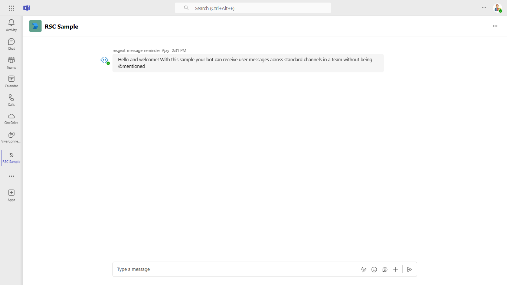

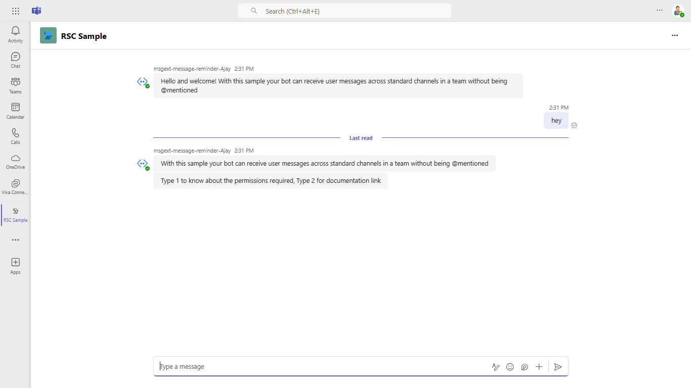

- Showing messages based on option selected

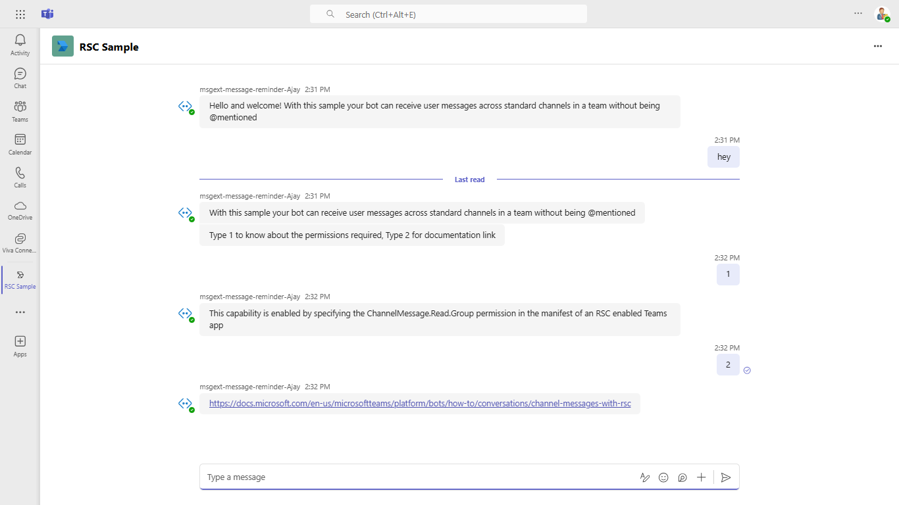

- Adding to group chat

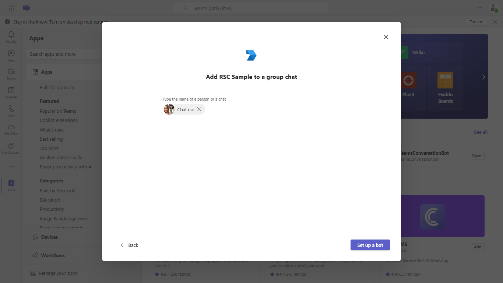

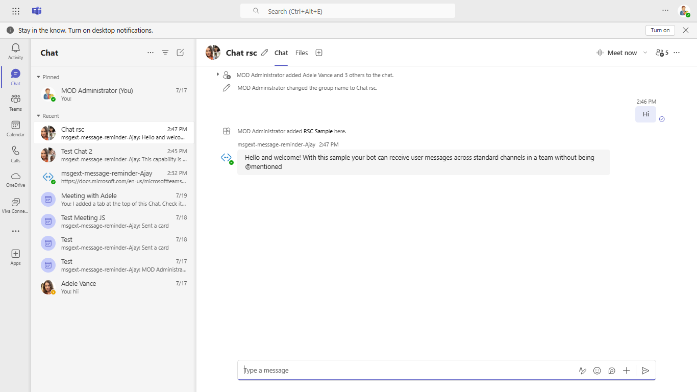

- Receives messages in group chat without being @mentioned.

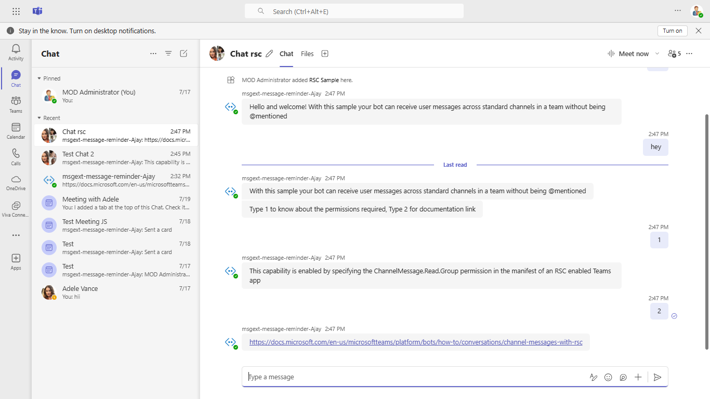

**Copilot Custom Engine Agents**

**Copilot Installation Screen**  
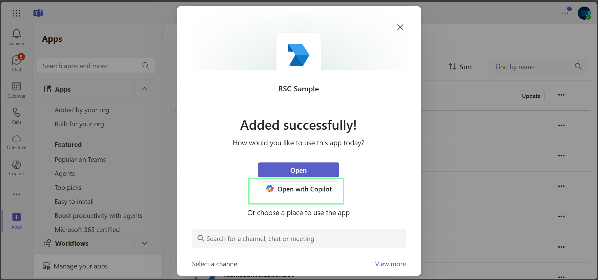 

**Copilot Welcome Screen**  
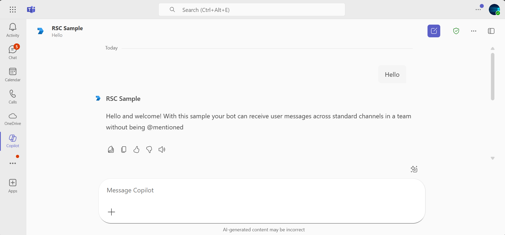 

**Copilot Workflow Example – Step 1**  
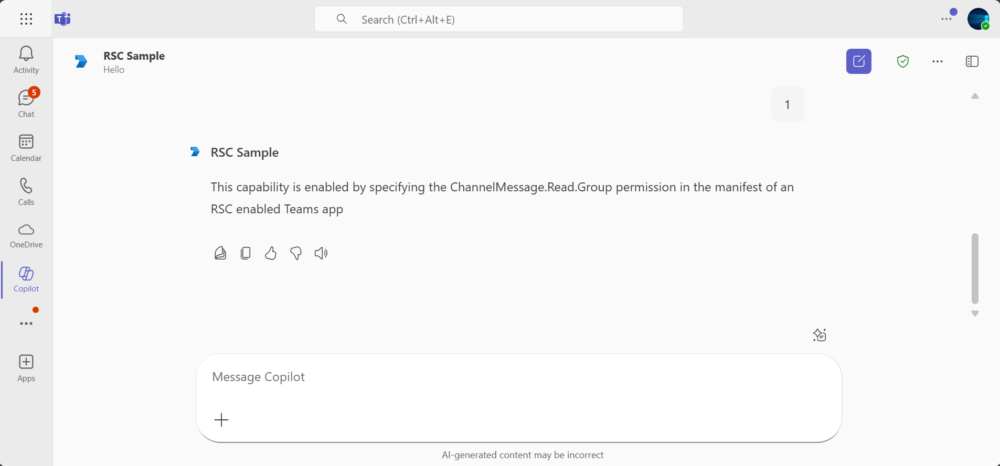 

**Copilot Workflow Example – Step 2**  
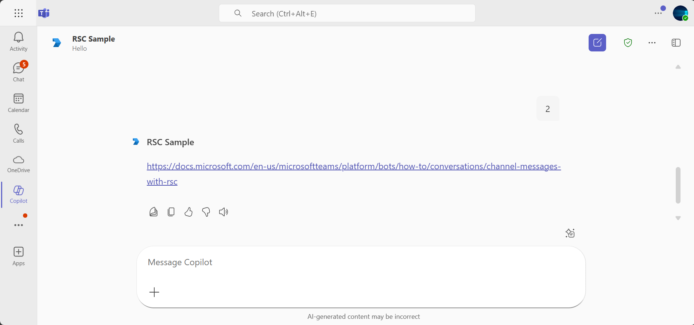 


## Deploy the bot to Azure

To learn more about deploying a bot to Azure, see [Deploy your bot to Azure](https://aka.ms/azuredeployment) for a complete list of deployment instructions.

## Further reading

- [Bot Framework Documentation](https://docs.botframework.com)
- [Bot Basics](https://docs.microsoft.com/azure/bot-service/bot-builder-basics?view=azure-bot-service-4.0)
- [Azure Bot Service Introduction](https://docs.microsoft.com/azure/bot-service/bot-service-overview-introduction?view=azure-bot-service-4.0)
- [Azure Bot Service Documentation](https://docs.microsoft.com/azure/bot-service/?view=azure-bot-service-4.0)
- [Receive Channel messages with RSC](https://docs.microsoft.com/microsoftteams/platform/bots/how-to/conversations/channel-messages-with-rsc)
- [Custom Engine Agents](https://learn.microsoft.com/en-us/microsoft-365-copilot/extensibility/overview-custom-engine-agent)


