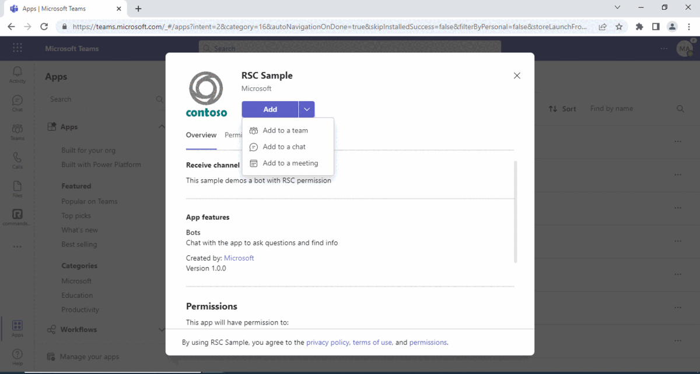
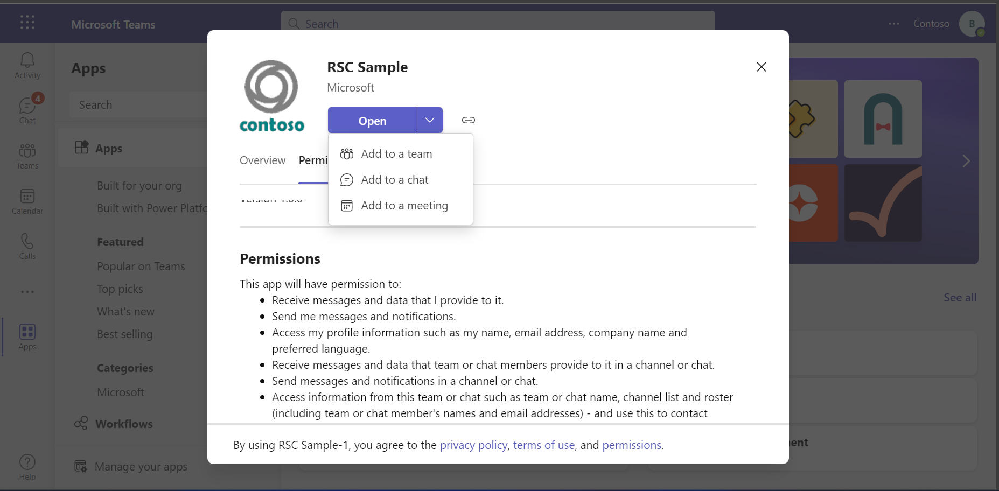
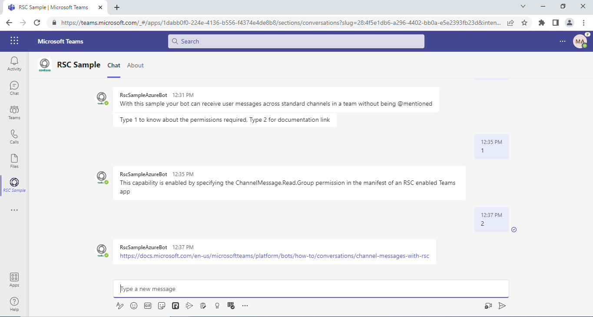
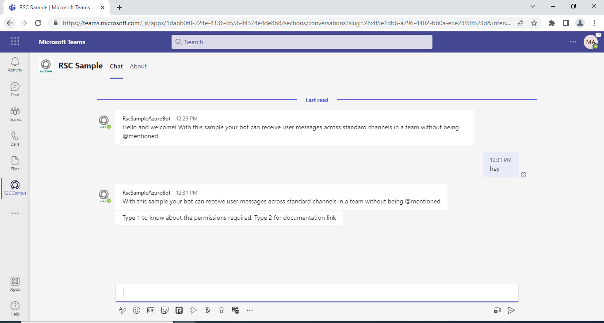

# Receive Channel messages with RSC permissions

Using this C# sample, a bot can receive all channel messages with RSC without @mention.

This feature shown in this sample is currently available in Public Developer Preview only.

## Interaction with app



## Prerequisites

- [.NET Core SDK](https://dotnet.microsoft.com/download) version 6.0

  determine dotnet version
  ```bash
  dotnet --version
  ```
- [Ngrok](https://ngrok.com/download) (For local environment testing) Latest (any other tunneling software can also be used)
  
- [Teams](https://teams.microsoft.com) Microsoft Teams is installed and you have an account

## Setup

1. Register a new application in the [Azure Active Directory – App Registrations](https://go.microsoft.com/fwlink/?linkid=2083908) portal.

2. Setup for Bot
- Register a AAD aap registration in Azure portal.
- Also, register a bot with Azure Bot Service, following the instructions [here](https://docs.microsoft.com/en-us/azure/bot-service/bot-service-quickstart-registration?view=azure-bot-service-3.0).
- Ensure that you've [enabled the Teams Channel](https://docs.microsoft.com/en-us/azure/bot-service/channel-connect-teams?view=azure-bot-service-4.0)
- While registering the bot, use `https://<your_ngrok_url>/api/messages` as the messaging endpoint.

3. Setup Ngrok
- Run ngrok - point to port 3978

```bash
 ngrok http -host-header=rewrite 3978
```

4. Setup for code

- Clone the repository

    ```bash
    git clone https://github.com/OfficeDev/Microsoft-Teams-Samples.git
    ```

- Modify the `/appsettings.json` and fill in the following details:
  - `{{BOT-ID}}` - Generated from Step 1 while doing AAd app registration in Azure portal.
  - `{{BOT-PASSWORD}}` -Generated from Step 1, also referred to as Client secret 


- Run in Visual Studio

  - Launch Visual Studio
  - File -> Open -> Project/Solution
  - Navigate to `ReceiveMessagesWithRSC` folder
  - Select `ReceiveMessagesWithRSC.csproj` file
  - Press `F5` to run the project


5. This step is specific to Teams.
    - **Edit** the `manifest.json` contained in the  `AppManifest` folder to replace your Microsoft App Id (that was created when you registered your bot earlier) *everywhere* you see the place holder string `<<YOUR-MICROSOFT-APP-ID>>` (depending on the scenario the Microsoft App Id may occur multiple times in the `manifest.json`) also update the `<<DOMAIN-NAME>>` with the ngrok URL`
    - **Edit** the `manifest.json` for `<<MANIFEST-ID>>` replace it with any `GUID` using guid generator.
    - **Edit** the `manifest.json` for `webApplicationInfo` resource `"api://botid-{{MicrosoftAppId}}"` with MicrosoftAppId. E.g. `"api://botid-{{MicrosoftAppId}}"`.
    
    - **Zip** up the contents of the `AppManifest` folder to create a `manifest.zip`
    - **Sideload** in a team to test
         - Select or create a team
         - Select the ellipses **...** from the left pane. The drop-down menu appears.
         - Select **Manage Team**, then select **Apps** 
         - Then select **Upload a custom app** from the lower right corner.
         - Then select the `manifest.zip` file from `AppManifest`, and then select **Add** to add the bot to your selected team.

**Note**: If you are facing any issue in your app, please uncomment [this](https://github.com/OfficeDev/Microsoft-Teams-Samples/blob/main/samples/bot-receive-channel-messages-withRSC/csharp/ReceiveMessagesWithRSC/AdapterWithErrorHandler.cs#L24) line and put your debugger for local debug.

## Interacting with the bot in Teams

Select a channel and enter a message in the channel for your bot.

The bot receives the message without being @mentioned.

## Running the sample



- Showing Welcome message 



- Showing messages based on option selected



- Adding to group chat


- Receives messages in group chat without being @mentioned.


## Deploy the bot to Azure

To learn more about deploying a bot to Azure, see [Deploy your bot to Azure](https://aka.ms/azuredeployment) for a complete list of deployment instructions.

## Further reading

- [Receive Channel messages with RSC](https://docs.microsoft.com/en-us/microsoftteams/platform/bots/how-to/conversations/channel-messages-with-rsc)
- [Bot Basics](https://docs.microsoft.com/azure/bot-service/bot-builder-basics?view=azure-bot-service-4.0)
- [Activity processing](https://docs.microsoft.com/en-us/azure/bot-service/bot-builder-concept-activity-processing?view=azure-bot-service-4.0)
- [Azure Bot Service Introduction](https://docs.microsoft.com/azure/bot-service/bot-service-overview-introduction?view=azure-bot-service-4.0)
- [Azure Bot Service Documentation](https://docs.microsoft.com/azure/bot-service/?view=azure-bot-service-4.0)
- [.NET Core CLI tools](https://docs.microsoft.com/en-us/dotnet/core/tools/?tabs=netcore2x)
- [Azure CLI](https://docs.microsoft.com/cli/azure/?view=azure-cli-latest)
- [Azure Portal](https://portal.azure.com)
- [Language Understanding using LUIS](https://docs.microsoft.com/en-us/azure/cognitive-services/luis/)
- [Channels and Bot Connector Service](https://docs.microsoft.com/en-us/azure/bot-service/bot-concepts?view=azure-bot-service-4.0)

