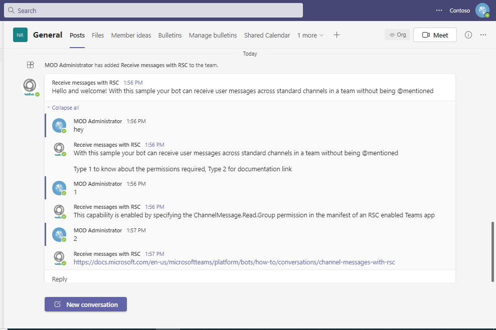
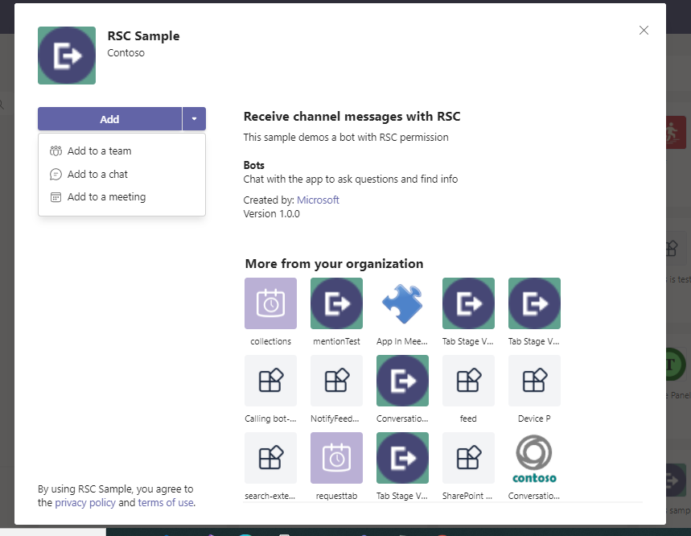

Using this C# sample, a bot can receive all channel messages with RSC without @mention.
For reference please check [Receive Channel messages with RSC](https://docs.microsoft.com/en-us/microsoftteams/platform/bots/how-to/conversations/channel-messages-with-rsc)

This feature shown in this sample is currently available in Public Developer Preview only.

## Key features

- Showing messages based on option selected



## Prerequisites

- [.NET Core SDK](https://dotnet.microsoft.com/download) version 6.0

  ```bash
  # determine dotnet version
  dotnet --version
  ```
- Publicly addressable https url or tunnel such as [ngrok](https://ngrok.com/) or [Tunnel Relay](https://github.com/OfficeDev/microsoft-teams-tunnelrelay) 
- [Teams Toolkit for Visual Studio](https://learn.microsoft.com/en-us/microsoftteams/platform/toolkit/toolkit-v4/install-teams-toolkit-vs?pivots=visual-studio-v17-7)

## Run the app (Using Teams Toolkit for Visual Studio)

The simplest way to run this sample in Teams is to use Teams Toolkit for Visual Studio.
1. Install Visual Studio 2022 **Version 17.9 or higher** [Visual Studio](https://visualstudio.microsoft.com/downloads/)
1. Install Teams Toolkit for Visual Studio [Teams Toolkit extension](https://learn.microsoft.com/en-us/microsoftteams/platform/toolkit/toolkit-v4/install-teams-toolkit-vs?pivots=visual-studio-v17-7)
1. In the debug dropdown menu of Visual Studio, select Dev Tunnels > Create A Tunnel (set authentication type to Public) or select an existing public dev tunnel.
1. In Visual Studio, right-click your project and **Select Teams Toolkit > Prepare Teams App Dependencies**
1. Using the extension, sign in with your Microsoft 365 account where you have permissions to upload custom apps.
1. Select **Debug > Start Debugging** or **F5** to run the menu in Visual Studio.
1. In the browser that launches, select the **Add** button to install the app to Teams.
> If you do not have permission to upload custom apps (sideloading), Teams Toolkit will recommend creating and using a Microsoft 365 Developer Program account - a free program to get your own dev environment sandbox that includes Teams.

## Setup

1. Run ngrok - point to port 3978

```bash
# ngrok http 3978 --host-header="localhost:3978"
```

2. Create a Bot Registration
   In Azure portal, create a [Bot Framework registration resource](https://docs.microsoft.com/en-us/azure/bot-service/bot-builder-authentication?view=azure-bot-service-4.0&tabs=csharp%2Caadv2#create-the-resource).

3. Modify the `manifest.json` in the `/AppManifest` folder and replace the `{{BOT-ID}}` with the id from step 2.

4. Zip the contents of `AppManifest` folder into a `manifest.zip`, and use the `manifest.zip` to deploy in app store or add to Teams as in step 7.

5. Modify the `/appsettings.json` and fill in the `{{ Bot Id }}`,`{{ Bot Password }}` with the id from step 2.

- __*This step is specific to Teams.*__
    - **Edit** the `manifest.json` contained in the  `AppManifest` folder to replace your Microsoft App Id (that was created when you registered your bot earlier) *everywhere* you see the place holder string `<<YOUR-MICROSOFT-APP-ID>>` (depending on the scenario the Microsoft App Id may occur multiple times in the `manifest.json`) also update the `<<DOMAIN-NAME>>` with the ngrok URL`
    
    - **Zip** up the contents of the `AppManifest` folder to create a `manifest.zip`
    - **Sideload** in a team to test
         - Select or create a team
         - Select the ellipses **...** from the left pane. The drop-down menu appears.
         - Select **Manage Team**, then select **Apps** 
         - Then select **Upload a custom app** from the lower right corner.
         - Then select the `manifest.zip` file from `AppManifest`, and then select **Add** to add the bot to your selected team.
    



## To try this sample

- In a terminal, navigate to `ReceiveMessagesWithRSC`

    ```bash
    # change into project folder
    cd # ReceiveMessagesWithRSC
    ```

- Run the bot from a terminal or from Visual Studio, choose option A or B.

  A) From a terminal

  ```bash
  # run the bot
  dotnet run
  ```

  B) Or from Visual Studio

  - Launch Visual Studio
  - File -> Open -> Project/Solution
  - Navigate to `ReceiveMessagesWithRSC` folder
  - Select `ReceiveMessagesWithRSC.csproj` file
  - Press `F5` to run the project

## Interacting with the bot in Teams

Select a channel and enter a message in the channel for your bot.

The bot receives the message without being @mentioned.

## Deploy the bot to Azure

To learn more about deploying a bot to Azure, see [Deploy your bot to Azure](https://aka.ms/azuredeployment) for a complete list of deployment instructions.

## Further reading

- [Bot Framework Documentation](https://docs.botframework.com)
- [Bot Basics](https://docs.microsoft.com/azure/bot-service/bot-builder-basics?view=azure-bot-service-4.0)
- [Activity processing](https://docs.microsoft.com/en-us/azure/bot-service/bot-builder-concept-activity-processing?view=azure-bot-service-4.0)
- [Azure Bot Service Introduction](https://docs.microsoft.com/azure/bot-service/bot-service-overview-introduction?view=azure-bot-service-4.0)
- [Azure Bot Service Documentation](https://docs.microsoft.com/azure/bot-service/?view=azure-bot-service-4.0)
- [.NET Core CLI tools](https://docs.microsoft.com/en-us/dotnet/core/tools/?tabs=netcore2x)
- [Azure CLI](https://docs.microsoft.com/cli/azure/?view=azure-cli-latest)
- [Azure Portal](https://portal.azure.com)
- [Language Understanding using LUIS](https://docs.microsoft.com/en-us/azure/cognitive-services/luis/)
- [Channels and Bot Connector Service](https://docs.microsoft.com/en-us/azure/bot-service/bot-concepts?view=azure-bot-service-4.0)
