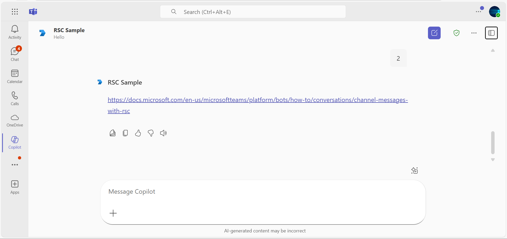

# Receive Channel messages with RSC permissions

This sample app illustrates how a bot can capture all channel messages in Microsoft Teams by utilizing RSC (resource-specific consent) permissions, eliminating the need for @mentions. The bot supports adaptive card responses, easy local testing with tools like ngrok or dev tunnels, and deployment to Azure, allowing it to function effectively across different channels and group chats in Teams.

This feature shown in this sample is currently available in Public Developer Preview only.

## Included Features
* Bots
* Adaptive Cards
* RSC Permissions
* Copilot Custom Engine Agents

## Interaction with app


## Try it yourself - experience the App in your Microsoft Teams client
Please find below demo manifest which is deployed on Microsoft Azure and you can try it yourself by uploading the app package (.zip file link below) to your teams and/or as a personal app. (Uploading must be enabled for your tenant, [see steps here](https://docs.microsoft.com/microsoftteams/platform/concepts/build-and-test/prepare-your-o365-tenant#enable-custom-teams-apps-and-turn-on-custom-app-uploading)).

**Receive Channel messages with RSC permissions:** [Manifest](/samples/bot-receive-channel-messages-withRSC/csharp/demo-manifest/Bot-RSC.zip)

## Prerequisites

1. Office 365 tenant. You can get a free tenant for development use by signing up for the [Office 365 Developer Program](https://developer.microsoft.com/en-us/microsoft-365/dev-program).

2. To test locally, [NodeJS](https://nodejs.org/en/download/) must be installed on your development machine (version 16.14.2  or higher).

    ```bash
    # determine node version
    node --version
    ```
3. [dev tunnel](https://learn.microsoft.com/en-us/azure/developer/dev-tunnels/get-started?tabs=windows) or [Ngrok](https://ngrok.com/download) (For local environment testing) latest version (any other tunneling software can also be used)

   If you are using Ngrok to test locally, you'll need [Ngrok](https://ngrok.com/) installed on your development machine.
   Make sure you've downloaded and installed Ngrok on your local machine. ngrok will tunnel requests from the Internet to your local computer and terminate the SSL connection from Teams.

4. [Microsoft 365 Agents Toolkit for VS Code](https://marketplace.visualstudio.com/items?itemName=TeamsDevApp.ms-teams-vscode-extension) or [TeamsFx CLI](https://learn.microsoft.com/microsoftteams/platform/toolkit/teamsfx-cli?pivots=version-one)

## Run the app (Using Microsoft 365 Agents Toolkit for Visual Studio Code)

The simplest way to run this sample in Teams is to use Microsoft 365 Agents Toolkit for Visual Studio Code.

1. Ensure you have downloaded and installed [Visual Studio Code](https://code.visualstudio.com/docs/setup/setup-overview)
1. Install the [Microsoft 365 Agents Toolkit extension](https://marketplace.visualstudio.com/items?itemName=TeamsDevApp.ms-teams-vscode-extension)
1. Select **File > Open Folder** in VS Code and choose this samples directory from the repo
1. Using the extension, sign in with your Microsoft 365 account where you have permissions to upload custom apps
1. Select **Debug > Start Debugging** or **F5** to run the app in a Teams web client.
1. In the browser that launches, select the **Add** button to install the app to Teams.

> If you do not have permission to upload custom apps (uploading), Microsoft 365 Agents Toolkit will recommend creating and using a Microsoft 365 Developer Program account - a free program to get your own dev environment sandbox that includes Teams.

## Setup

> NOTE: The free ngrok plan will generate a new URL every time you run it, which requires you to update your Azure AD registration, the Teams app manifest, and the project configuration. A paid account with a permanent ngrok URL is recommended.

1) Setup for Bot
- Register Azure AD application
- Register a bot with Azure Bot Service, following the instructions [here](https://docs.microsoft.com/azure/bot-service/bot-service-quickstart-registration?view=azure-bot-service-3.0).

- Ensure that you've [enabled the Teams Channel](https://docs.microsoft.com/azure/bot-service/channel-connect-teams?view=azure-bot-service-4.0)
- While registering the bot, use `https://<your_tunnel_domain>/api/messages` as the messaging endpoint.
    
    > NOTE: When you create your app registration in Azure portal, you will create an App ID and App password - make sure you keep these for later.

2) Setup NGROK
 - Run ngrok - point to port 3978

   ```bash
   ngrok http 3978 --host-header="localhost:3978"
   ```  

   Alternatively, you can also use the `dev tunnels`. Please follow [Create and host a dev tunnel](https://learn.microsoft.com/en-us/azure/developer/dev-tunnels/get-started?tabs=windows) and host the tunnel with anonymous user access command as shown below:

   ```bash
   devtunnel host -p 3978 --allow-anonymous
   ```

3) Register a new application in the [Microsoft Entra ID – App Registrations](https://go.microsoft.com/fwlink/?linkid=2083908) portal.
  
  A) Select **New Registration** and on the *register an application page*, set following values:
      * Set **name** to your app name.
      * Choose the **supported account types** (any account type will work)
      * Leave **Redirect URI** empty.
      * Choose **Register**.
  B) On the overview page, copy and save the **Application (client) ID, Directory (tenant) ID**. You'll need those later when updating your Teams application manifest and in the appsettings.json.
  C) Navigate to **API Permissions**, and make sure to add the following permissions:
   Select Add a permission
      * Select Add a permission
      * Select Microsoft Graph -\> Delegated permissions.
      * `User.Read` (enabled by default)
      * Click on Add permissions. Please make sure to grant the admin consent for the required permissions.


4) Setup for code
- Clone the repository

    ```bash
    git clone https://github.com/OfficeDev/Microsoft-Teams-Samples.git
    ```

- In the folder where repository is cloned navigate to `samples/bot-receive-channel-messages-withRSC/nodejs`

- Install node modules

   Inside node js folder, open your local terminal and run the below command to install node modules. You can do the same in Visual Studio code terminal by opening the project in Visual Studio code.

    ```bash
    npm install
    ```
- Update the `.env` configuration for the bot to use the `MicrosoftAppId` (Microsoft App Id) and `MicrosoftAppPassword` (App Password) from the Microsoft Entra ID app registration in Azure portal or from Bot Framework registration. 
> NOTE: the App Password is referred to as the `client secret` in the azure portal app registration service and you can always create a new client secret anytime.

- Run your app
    ```bash
    npm start
    ```
- Install modules & Run the NodeJS Server
  - Server will run on PORT: 3978
  - Open a terminal and navigate to project root directory
  
  ```bash
    npm run server
  ```
> NOTE:This command is equivalent to: npm install > npm start

5) Run your app

    ```bash
    npm start
    ```
6) Setup Manifest for Teams

    - **Edit** the `manifest.json` contained in the `appManifest` folder to replace your Microsoft App Id (that was created when you registered your bot earlier) *everywhere* you see the place holder string `<<YOUR-MICROSOFT-APP-ID>>` (depending on the scenario the Microsoft App Id may occur multiple times in the `manifest.json`) 
        `<<DOMAIN-NAME>>` with base Url domain. E.g. if you are using ngrok it would be `https://1234.ngrok-free.app` then your domain-name will be `1234.ngrok-free.app` and if you are using dev tunnels then your domain will be like: `12345.devtunnels.ms`.
         Replace <<MANIFEST-ID>> with any GUID or with your MicrosoftAppId/app id

    - **Zip** up the contents of the `appManifest` folder to create a `manifest.zip`
    - **Upload** in a team to test
         - Select or create a team
         - Select the ellipses **...** from the left pane. The drop-down menu appears.
         - Select **Manage Team**, then select **Apps** 
         - Then select **Upload a custom app** from the lower right corner.
         - Then select the `manifest.zip` file from `appManifest`, and then select **Add** to add the bot to your selected team.

**Note**: If you are facing any issue in your app, please uncomment [this](https://github.com/OfficeDev/Microsoft-Teams-Samples/blob/main/samples/bot-receive-channel-messages-withRSC/nodejs/server/api/botController.js#L24) line and put your debugger for local debug.

## Running the sample

**Adding bot UI:**


**Hey command interaction:**


**1 or 2 command interaction:**

 

**Adding App to group chat:**

 

**Group chat interaction with bot without being @mentioned:**

 

**Copilot Custom Engine Agents**

**Copilot Installation Screen**  
 

**Copilot Welcome Screen**  
 

**Copilot Workflow Example – Step 1**  
 

**Copilot Workflow Example – Step 2**  
 


**Interacting with the bot in Teams**

Select a channel and enter a message in the channel for your bot.

The bot receives the message without being @mentioned.

## Deploy the bot to Azure

To learn more about deploying a bot to Azure, see [Deploy your bot to Azure](https://aka.ms/azuredeployment) for a complete list of deployment instructions.

## Further reading

- [Bot Framework Documentation](https://docs.botframework.com)
- [Bot Basics](https://docs.microsoft.com/azure/bot-service/bot-builder-basics?view=azure-bot-service-4.0)
- [Azure Bot Service Introduction](https://docs.microsoft.com/azure/bot-service/bot-service-overview-introduction?view=azure-bot-service-4.0)
- [Azure Bot Service Documentation](https://docs.microsoft.com/azure/bot-service/?view=azure-bot-service-4.0)
- [Receive Channel messages with RSC](https://docs.microsoft.com/microsoftteams/platform/bots/how-to/conversations/channel-messages-with-rsc)
- [Custom Engine Agents](https://learn.microsoft.com/en-us/microsoft-365-copilot/extensibility/overview-custom-engine-agent)


