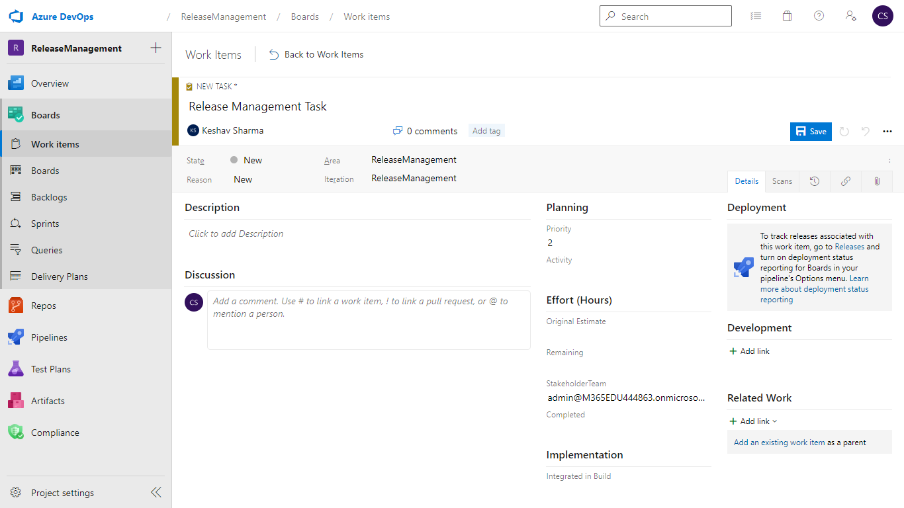
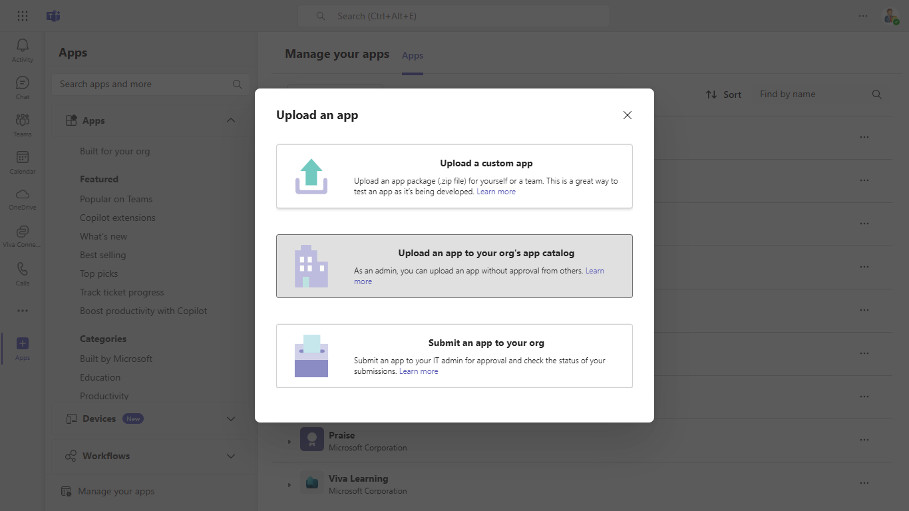
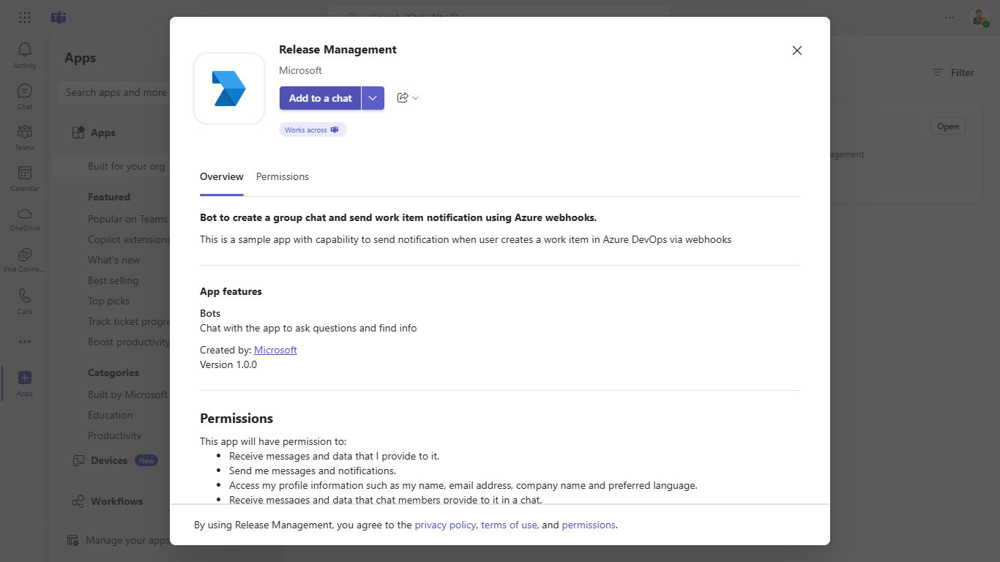
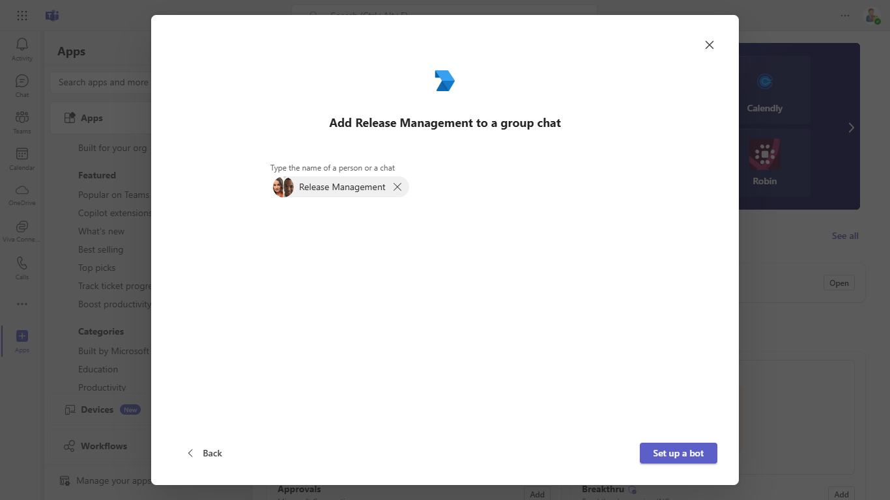

# Bot to create the group chat and send task notification using Azure service hook

This sample app integrates Azure DevOps with Teams using a bot to send notifications on work item creation. It leverages service hooks to create group chats and deliver work item details via adaptive cards, providing a streamlined way to keep teams informed in real time.

## Included Features
* Bots
* Adaptive Cards

## Interaction with app


## Prerequisites
 [.NET Core SDK](https://dotnet.microsoft.com/en-us/download) version 6.0

  ```bash
  # determine dotnet version
  dotnet --version
  ```
- Publicly addressable https url or tunnel such as [dev tunnel](https://learn.microsoft.com/en-us/azure/developer/dev-tunnels/get-started?tabs=windows) or [ngrok](https://ngrok.com/) latest version or [Tunnel Relay](https://github.com/OfficeDev/microsoft-teams-tunnelrelay) 

- [Azure DevOps](https://dev.azure.com) access to set up service hooks and add custom field in workitem.

- [Teams Toolkit for Visual Studio](https://learn.microsoft.com/en-us/microsoftteams/platform/toolkit/toolkit-v4/install-teams-toolkit-vs?pivots=visual-studio-v17-7)

## Run the app (Using Teams Toolkit for Visual Studio)

The simplest way to run this sample in Teams is to use Teams Toolkit for Visual Studio.
1. Install Visual Studio 2022 **Version 17.10 Preview 4 or higher** [Visual Studio](https://visualstudio.microsoft.com/downloads/)
1. Install Teams Toolkit for Visual Studio [Teams Toolkit extension](https://learn.microsoft.com/en-us/microsoftteams/platform/toolkit/toolkit-v4/install-teams-toolkit-vs?pivots=visual-studio-v17-7)
1. In the debug dropdown menu of Visual Studio, select Dev Tunnels > Create A Tunnel (set authentication type to Public) or select an existing public dev tunnel.
1. In the debug dropdown menu of Visual Studio, select default startup project > **Microsoft Teams (browser)**
1. In Visual Studio, right-click your **TeamsApp** project and **Select Teams Toolkit > Prepare Teams App Dependencies**
1. Using the extension, sign in with your Microsoft 365 account where you have permissions to upload custom apps.
1. Select **Debug > Start Debugging** or **F5** to run the menu in Visual Studio.
1. In the browser that launches, select the **Add** button to install the app to Teams.
> If you do not have permission to upload custom apps (uploading), Teams Toolkit will recommend creating and using a Microsoft 365 Developer Program account - a free program to get your own dev environment sandbox that includes Teams.

## Setup

**Setup NGROK**
1) Run ngrok - point to port 3978

   ```bash
   ngrok http 3978 --host-header="localhost:3978"
   ```  

   Alternatively, you can also use the `dev tunnels`. Please follow [Create and host a dev tunnel](https://learn.microsoft.com/en-us/azure/developer/dev-tunnels/get-started?tabs=windows) and host the tunnel with anonymous user access command as shown below:

   ```bash
   devtunnel host -p 3978 --allow-anonymous
   ```

2) Once started you should see ngrok URL like `https://xxxxx-xxx-e125.ngrok-free.app`. Copy it, this is your baseUrl that will used as endpoint for Azure bot and webhook.

**Register Azure AD application**

Register one Azure AD application in your tenant's directory: for the bot and tab app authentication.

-  Log in to the Azure portal from your subscription, and go to the "App registrations" blade  [here](https://portal.azure.com/#blade/Microsoft_AAD_IAM/ActiveDirectoryMenuBlade/RegisteredApps). Ensure that you use a tenant where admin consent for API permissions can be provided.

-  Click on "New registration", and create an Azure AD application.

-  **Name:**  The name of your Teams app - if you are following the template for a default deployment, we recommend "Bot release management".

-  **Supported account types:**  Select "Accounts in any organizational directory"

-  Leave the "Redirect URL" field blank.   

- Click on the "Register" button.

- When the app is registered, you'll be taken to the app's "Overview" page. Copy the  **Application (client) ID**; we will need it later. Verify that the "Supported account types" is set to  **Multiple organizations**.

-  On the side rail in the Manage section, navigate to the "Certificates & secrets" section. In the Client secrets section, click on "+ New client secret". Add a description for the secret and select Expires as "Never". Click "Add".

-  Once the client secret is created, copy its  **Value**, please take a note of the secret as it will be required later.


- At this point you have 3 unique values:
    -   Application (client) ID which will be later used during Azure bot creation
    -   Client secret for the bot which will be later used during Azure bot creation
    -   Directory (tenant) ID
We recommend that you copy these values into a text file, using an application like Notepad. We will need these values later.

-  Under left menu, navigate to  **API Permissions**, and make sure to add the following permissions of Microsoft Graph API > Application permissions:
    -  Chat.Create
    -  TeamsAppInstallation.ReadWriteForChat.All
    -  AppCatalog.Read.All
    -  User.Read.All

Click on Add Permissions to commit your changes.

- If you are logged in as the Global Administrator, click on the Grant admin consent for %tenant-name% button to grant admin consent else, inform your admin to do the same through the portal or follow the steps provided here to create a link and send it to your admin for consent.

- Global Administrator can grant consent using following link:  [https://login.microsoftonline.com/common/adminconsent?client_id=](https://login.microsoftonline.com/common/adminconsent?client_id=)<%appId%> 

**Setup for Bot**

- Register a bot with Azure Bot Service, following the instructions [here](https://docs.microsoft.com/en-us/azure/bot-service/bot-service-quickstart-registration?view=azure-bot-service-3.0).

- Ensure that you've [enabled the Teams Channel](https://docs.microsoft.com/en-us/azure/bot-service/channel-connect-teams?view=azure-bot-service-4.0)

- While registering the bot, use `https://<your_tunnel_domain>/api/messages` as the messaging endpoint.
    > NOTE: When you create your bot you will create an App ID and App password - make sure you keep these for later.

**Setup Azure DevOps service hook**

- Follow this document- [Create Webhooks](https://docs.microsoft.com/en-us/azure/devops/service-hooks/services/webhooks?view=azure-devops) to service hook. 

- Make sure to select trigger as *Work item created*

- Make sure to add URL as https://{baseUrl}/api/workItem. It will look somethihng as https://41ed-abcd-e125.ngrok-free.app/api/workItem. *Here baseUrl is referred to URL we get in step 2*.

**NOTE: If you are not getting incoming request from Azure DevOps make sure that service webhook is in *Enabled* state.**

**Setup custom work item type**

- Follow the doc to [Add a custom field to an inherited process - Azure DevOps Services](https://docs.microsoft.com/en-us/azure/devops/organizations/settings/work/add-custom-field?view=azure-devops). 

- Make sure to give name as *StakeholderTeam* and Type *Text (Single line)*


- Make sure to [Apply the customized process to your project](https://docs.microsoft.com/en-us/azure/devops/organizations/settings/work/add-custom-field?view=azure-devops#apply-the-customized-process-to-your-project)

- Go to *Options* and check *Required* and Add.

**NOTE: Make sure you create a new task, click save and verify the stakeholderTeam value**


**Setup for code**
- Clone the repository

    ```bash
    git clone https://github.com/OfficeDev/Microsoft-Teams-Samples.git
    ```

- Run the bot from a terminal or from Visual Studio:

  A) From a terminal, navigate to `ReleaseManagement`

  ```bash
  # run the bot
  dotnet run
  ```

  B) Or from Visual Studio

  - Launch Visual Studio
  - File -> Open -> Project/Solution
  - Navigate to `samples/release-management/csharp` folder
  - Select `ReleaseManagement.csproj` file
  - Press `F5` to run the project

- Update the `appsettings.json` configuration for the bot to use the `MicrosoftAppId`, `MicrosoftAppPassword` and `MicrosoftAppTenantId` generated in previous steps 1 (Setup for Microsoft Entra ID app registration). (Note the App Password is referred to as the "client secret" in the azure portal and you can always create a new client secret anytime.)

**Setup Manifest for Teams**

- **This step is specific to Teams.**
    - **Edit** the `manifest.json` contained in the  `AppManifest` folder to replace your Microsoft App Id (that was created when you registered your bot earlier) *everywhere* you see the place holder string `<<Your Microsoft App Id>>` (depending on the scenario the Microsoft App Id may occur multiple times in the `manifest.json`)
    - **Edit** the `manifest.json` for `validDomains` with base Url domain. E.g. if you are using ngrok it would be `https://1234.ngrok-free.app` then your domain-name will be `1234.ngrok-free.app` and if you are using dev tunnels then your domain will be like: `12345.devtunnels.ms`.
    - **Zip** up the contents of the `AppManifest` folder to create a `manifest.zip` (Make sure that zip file does not contains any subfolder otherwise you will get error while uploading your .zip package)
    - **Upload** the `manifest.zip` to Teams (In Teams Apps/Manage your apps click "Upload an app to your org's app catalog". Browse to and Open the .zip file. At the next dialog, click the Add button.)
    - Add the app to personal/team/groupChat scope (Supported scopes)

**Note**: If you are facing any issue in your app, please uncomment [this](https://github.com/OfficeDev/Microsoft-Teams-Samples/blob/main/samples/bot-release-management/csharp/ReleaseManagement/AdapterWithErrorHandler.cs#L22) line and put your debugger for local debug.

## Running the sample

**Upload an app to your org's app catalog:**



**Install App:**



**Add Release Management:**



**WorkItem Card UI:**


**View UI:**


**Interacting with the bot**
- Login into [Azure DevOps](https://dev.azure.com) and open the project where custom process was applied.
- Create a new workitem -> Tasks, provide comma seprated email ids in *StakeHolderTeam* 
(NOTE: The email should belong to tenant where we register Application in step 1
- Save
- Bot will create the group chat with members you added and send the Task details.

## Deploy the bot to Azure

To learn more about deploying a bot to Azure, see [Deploy your bot to Azure](https://aka.ms/azuredeployment) for a complete list of deployment instructions.

## Further reading
- [Integrate with service hooks](https://learn.microsoft.com/en-us/azure/devops/service-hooks/overview?source=recommendations&view=azure-devops)
- [Bot Framework Documentation](https://docs.botframework.com)
- [Bot Basics](https://docs.microsoft.com/azure/bot-service/bot-builder-basics?view=azure-bot-service-4.0)
- [Azure Portal](https://portal.azure.com)
- [Add Authentication to Your Bot Via Azure Bot Service](https://docs.microsoft.com/en-us/azure/bot-service/bot-builder-authentication?view=azure-bot-service-4.0&tabs=csharp)
- [Azure Bot Service Introduction](https://docs.microsoft.com/azure/bot-service/bot-service-overview-introduction?view=azure-bot-service-4.0)
- [Azure Bot Service Documentation](https://docs.microsoft.com/azure/bot-service/?view=azure-bot-service-4.0)
- [.NET Core CLI tools](https://docs.microsoft.com/en-us/dotnet/core/tools/?tabs=netcore2x)
- [Microsoft Teams Developer Platform](https://docs.microsoft.com/en-us/microsoftteams/platform/)


