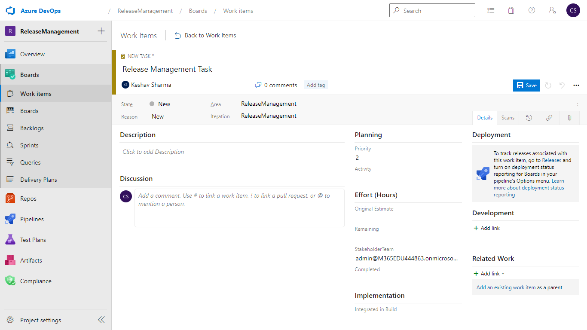
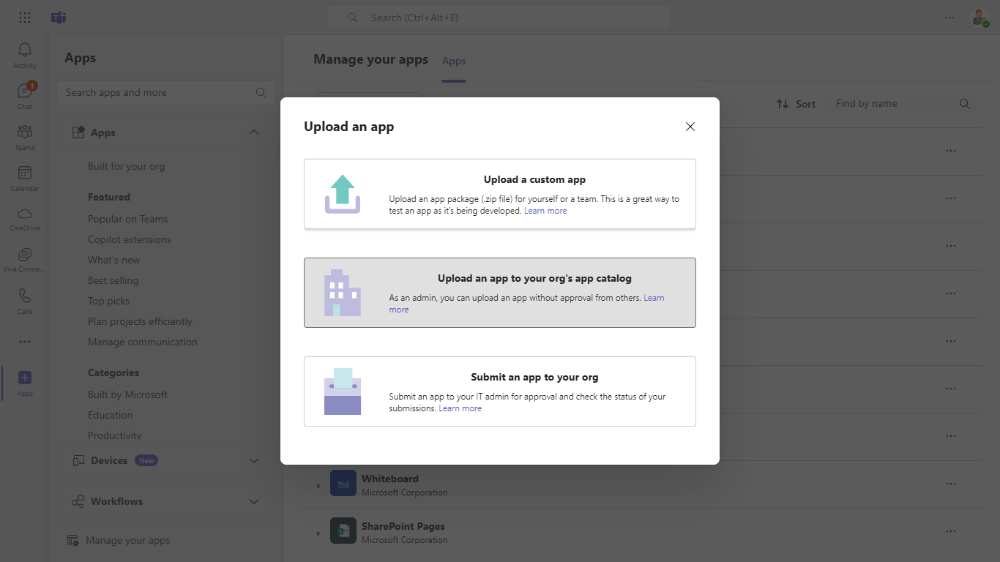
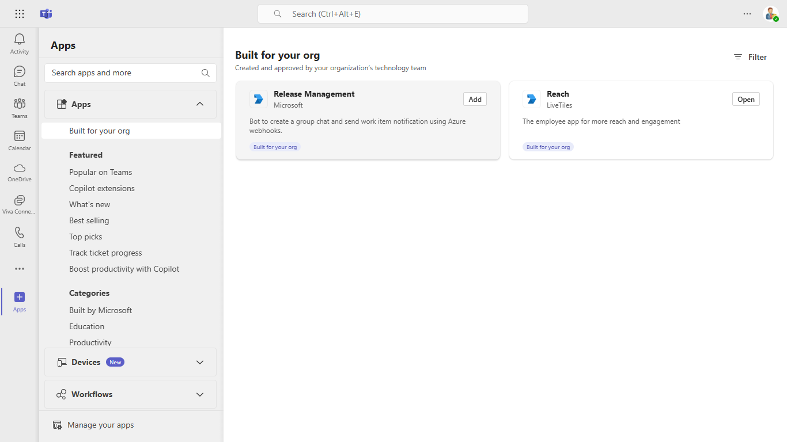
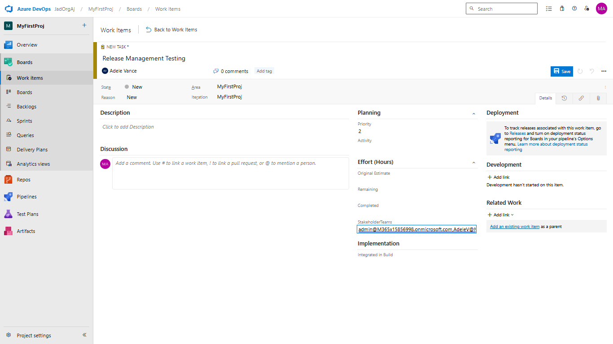

# Bot to create a group chat and send a task notification using Azure service hook

This is a sample application which demonstrates how to create a service hook on Azure DevOps and connect with Teams bot that creates a group chat and send workitems details.

## Included Features
* Bots
* Adaptive Cards

## Interaction with app


## Prerequisites

-  Microsoft Teams is installed and you have an account (not a guest account)
-  To test locally, [NodeJS](https://nodejs.org/en/download/) must be installed on your development machine (version 16.14.2  or higher).
-  [ngrok](https://ngrok.com/) or equivalent tunneling solution
-  [M365 developer account](https://docs.microsoft.com/en-us/microsoftteams/platform/concepts/build-and-test/prepare-your-o365-tenant) or access to a Teams account with the appropriate permissions to install an app.
-  [Azure DevOps](https://dev.azure.com) access to set up service hooks and add custom field in workitem.

## Setup

> Note these instructions are for running the sample on your local machine, the tunnelling solution is required because
> the Teams service needs to call into the bot.

**Setup NGROK**
1) Run ngrok - point to port 3978

    ```bash
    ngrok http 3978 --host-header="localhost:3978"
    ```
2) Once started you should see URL  `https://41ed-abcd-e125.ngrok-free.app`. Copy it, this is your baseUrl that will used as endpoint for Azure bot and webhook.


**Register Azure AD application**

Register one Azure AD application in your tenant's directory: for the bot and tab app authentication.

-  Log in to the Azure portal from your subscription, and go to the "App registrations" blade  [here](https://portal.azure.com/#blade/Microsoft_AAD_IAM/ActiveDirectoryMenuBlade/RegisteredApps). Ensure that you use a tenant where admin consent for API permissions can be provided.

-  Click on "New registration", and create an Azure AD application.

-  **Name:**  The name of your Teams app - if you are following the template for a default deployment, we recommend "App catalog lifecycle".

-  **Supported account types:**  Select "Accounts in any organizational directory"

-  Leave the "Redirect URL" field blank.   

- Click on the "Register" button.

- When the app is registered, you'll be taken to the app's "Overview" page. Copy the  **Application (client) ID**; we will need it later. Verify that the "Supported account types" is set to  **Multiple organizations**.

-  On the side rail in the Manage section, navigate to the "Certificates & secrets" section. In the Client secrets section, click on "+ New client secret". Add a description for the secret and select Expires as "Never". Click "Add".

-  Once the client secret is created, copy its  **Value**, please take a note of the secret as it will be required later.


- At this point you have 3 unique values:
    -   Application (client) ID which will be later used during Azure bot creation
    -   Client secret for the bot which will be later used during Azure bot creation
    -   Directory (tenant) ID
We recommend that you copy these values into a text file, using an application like Notepad. We will need these values later.

-  Under left menu, navigate to  **API Permissions**, and make sure to add the following permissions of Microsoft Graph API > Application permissions:
    -  Chat.Create
    -  TeamsAppInstallation.ReadWriteForChat.All
    -  AppCatalog.Read.All
    -  User.Read.All

Click on Add Permissions to commit your changes.

- If you are logged in as the Global Administrator, click on the Grant admin consent for %tenant-name% button to grant admin consent else, inform your admin to do the same through the portal or follow the steps provided here to create a link and send it to your admin for consent.

- Global Administrator can grant consent using following link:  [https://login.microsoftonline.com/common/adminconsent?client_id=](https://login.microsoftonline.com/common/adminconsent?client_id=)<%appId%> 

**Setup for Bot**

- In Azure portal, create a [Azure Bot resource](https://docs.microsoft.com/en-us/azure/bot-service/bot-builder-authentication?view=azure-bot-service-4.0&tabs=csharp%2Caadv2).

- Ensure that you've [enabled the Teams Channel](https://docs.microsoft.com/en-us/azure/bot-service/channel-connect-teams?view=azure-bot-service-4.0)

- To test locally, you'll need [Ngrok](https://ngrok.com/) installed on your development machine.
Make sure you've downloaded and installed Ngrok on your local machine. ngrok will tunnel requests from the Internet to your local computer and terminate the SSL connection from Teams.

**Setup Azure DevOps service hook**
- Follow this document- [Create Webhooks](https://docs.microsoft.com/en-us/azure/devops/service-hooks/services/webhooks?view=azure-devops) to service hook. 

- Make sure to select trigger as *Work item created*

- Make sure to add URL as https://{baseUrl}/api/workItem. It will look somethihng as https://41ed-abcd-e125.ngrok-free.app/api/workItem. *Here baseUrl is referred to URL we get in step 1*.
**NOTE: If you are not getting incoming request from Azure DevOps make sure that service webhook is in *Enabled* state.**

**Setup custom work item type**

- Follow the doc to [Add a custom field to an inherited process - Azure DevOps Services](https://docs.microsoft.com/en-us/azure/devops/organizations/settings/work/add-custom-field?view=azure-devops)

- Make sure to give name as *StakeholderTeam* and Type *Text (Single line)*


- Make sure to [Apply the customized process to your project](https://docs.microsoft.com/en-us/azure/devops/organizations/settings/work/add-custom-field?view=azure-devops#apply-the-customized-process-to-your-project)

- Go to *Options* and check *Required* and Add.

**NOTE:Make sure you create a new task, click save and verify the stakeholderTeam value**


**Setup for code**

1) Clone the repository

    ```bash
    git clone https://github.com/OfficeDev/Microsoft-Teams-Samples.git
    ```

2) In the folder where repository is cloned navigate to `samples/release-management/nodejs`

3) Install node modules

   Inside node js folder, open your local terminal and run the below command to install node modules. You can do the same in Visual studio code terminal by opening the project in Visual studio code 

    ```bash
    npm install
    ```
4) Update the `.env` configuration for the bot to use the `MicrosoftAppId` and `MicrosoftAppPassword` and `MicrosoftAppTenantId` (Note that the MicrosoftAppId is the AppId created in step 4 , the MicrosoftAppPassword is referred to as the "client secret" in previous steps and you can always create a new client secret anytime., MicrosoftAppTenantId is reffered to as Directory tenant Id in previous steps).

5) Run your bot at the command line:
    ```bash
   npm start
    ```
**Setup Manifest for Teams**

- **This step is specific to Teams.**
- Edit the `manifest.json` contained in the  `/appPackage` folder to and fill in MicrosoftAppId (that was created in step 1 and it is the same value of MicrosoftAppId as in `.env` file) *everywhere* you see the place holder string `<<Microsoft-App-Id>>` (depending on the scenario it may occur multiple times in the `manifest.json`)
- **Edit** the `manifest.json` for `validDomains` with base Url domain. E.g. if you are using ngrok it would be `https://1234.ngrok-free.app` then your domain-name will be `1234.ngrok-free.app`.
- Zip up the contents of the `/appPackage` folder to create a `manifest.zip`
- Upload the manifest.zip to Teams (in the Apps view click "Upload an app to your org's app catalog")

**Note**: If you are facing any issue in your app, please uncomment [this](https://github.com/OfficeDev/Microsoft-Teams-Samples/blob/main/samples/bot-release-management/nodejs/index.js#L52) line and put your debugger for local debug.

## Running the sample

**Upload an app to your org's app catalog:**



**Install App:**



**WorkItem Card UI:**


**View UI:**



**Interacting with the bot**
- Login into [Azure DevOps](https://dev.azure.com) and open the project where custom process was applied.
- Create a new workitem -> Tasks, provide comma seprated email ids in *StakeHolderTeam* (NOTE: The email should belong to tenant where we register Application in step 4)
- Save
- Bot will create the group chat with members you added and send the Task details.

## Deploy the bot to Azure

To learn more about deploying a bot to Azure, see [Deploy your bot to Azure](https://aka.ms/azuredeployment) for a complete list of deployment instructions.

## Further reading
- [Integrate with service hooks](https://learn.microsoft.com/en-us/azure/devops/service-hooks/overview?source=recommendations&view=azure-devops)
- [Bot Framework Documentation](https://docs.botframework.com)
- [Bot Basics](https://docs.microsoft.com/azure/bot-service/bot-builder-basics?view=azure-bot-service-4.0)
- [Azure Portal](https://portal.azure.com)
- [Add Authentication to Your Bot Via Azure Bot Service](https://docs.microsoft.com/en-us/azure/bot-service/bot-builder-authentication?view=azure-bot-service-4.0&tabs=csharp)
- [Azure Bot Service Introduction](https://docs.microsoft.com/azure/bot-service/bot-service-overview-introduction?view=azure-bot-service-4.0)
- [Azure Bot Service Documentation](https://docs.microsoft.com/azure/bot-service/?view=azure-bot-service-4.0)
- [.NET Core CLI tools](https://docs.microsoft.com/en-us/dotnet/core/tools/?tabs=netcore2x)
- [Microsoft Teams Developer Platform](https://docs.microsoft.com/en-us/microsoftteams/platform/)


